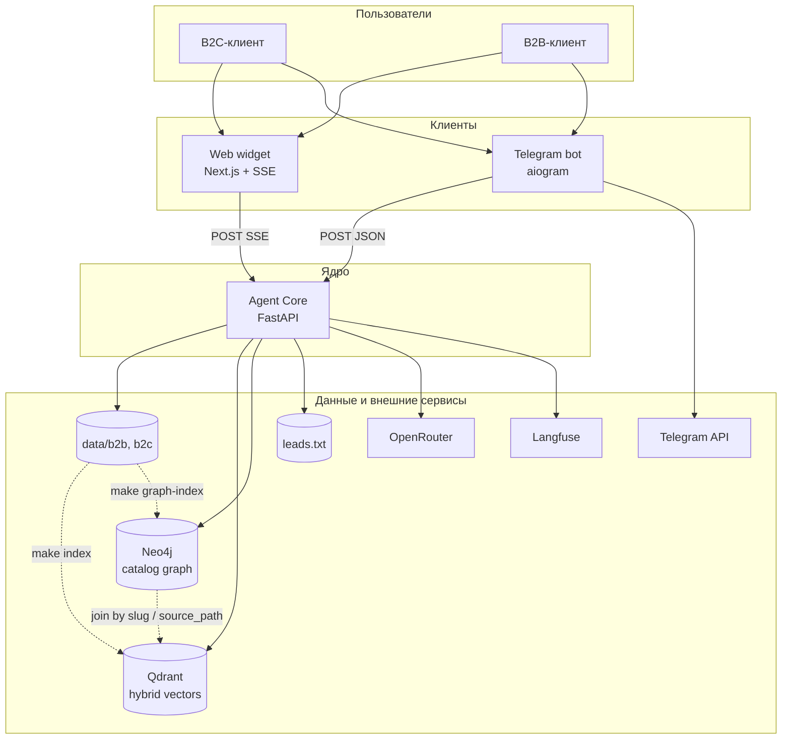
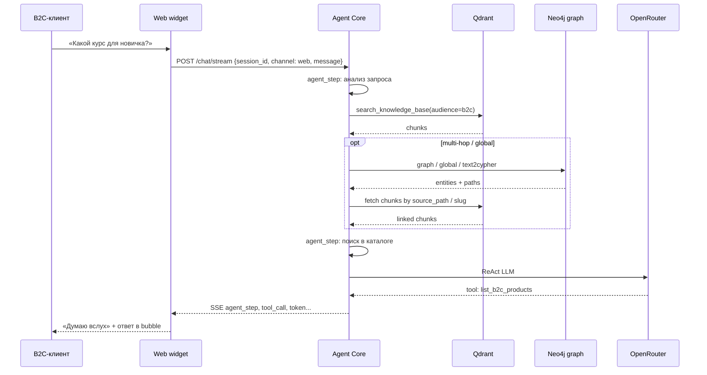
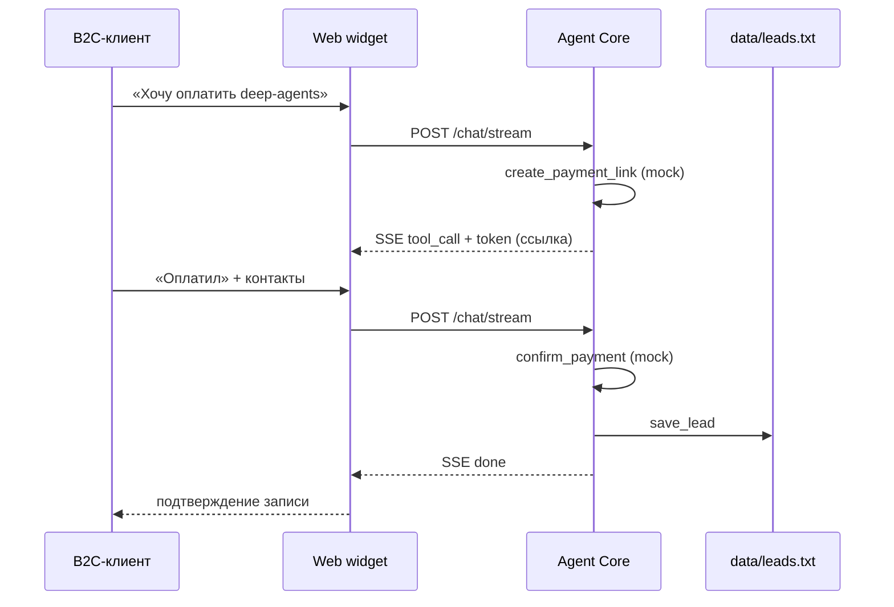
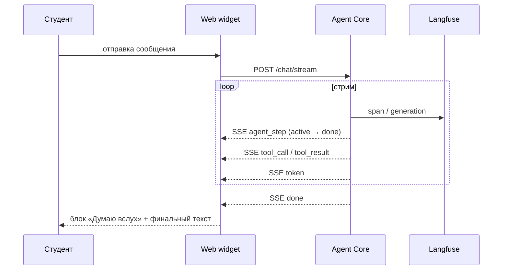
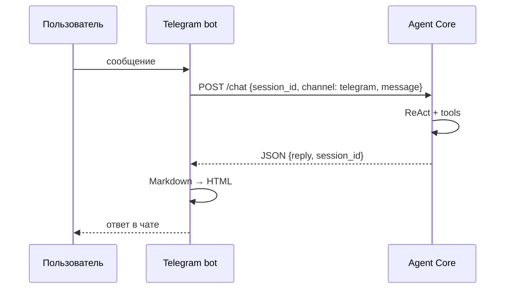
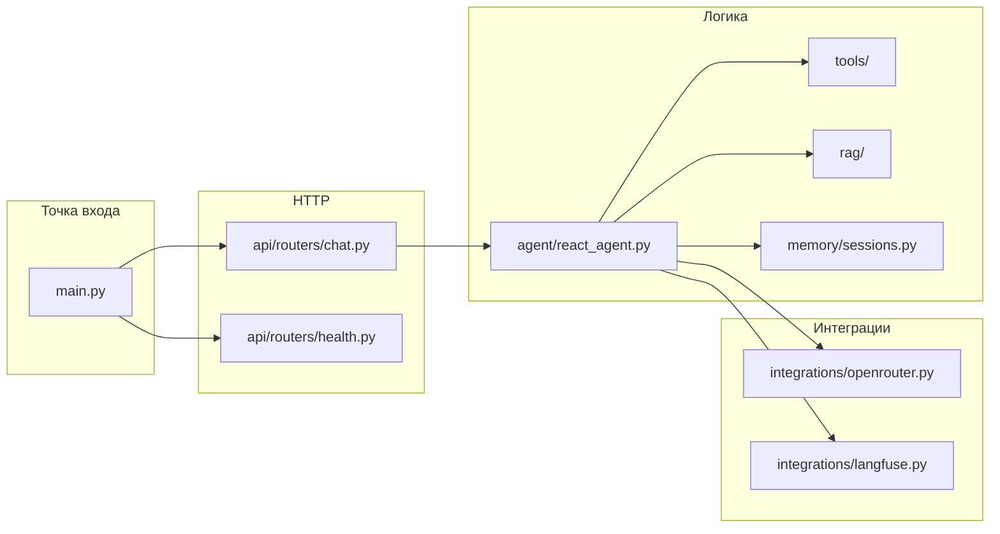
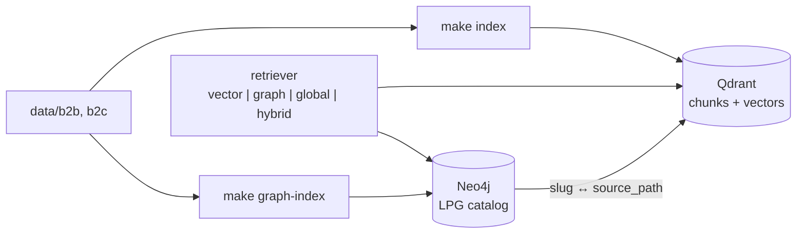
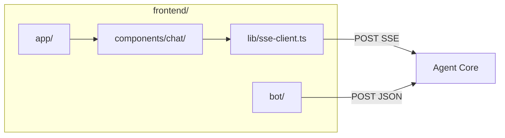

# Архитектура системы Deep-Agents-Live

> Высокоуровневое описание компонентов, потоков данных и ссылок на детали.
> Продуктовое видение и роли — в [vision.md](vision.md). Персистентная БД в MVP не используется — [data-model.md](data-model.md) пропущен.

---

## Контекст системы

Пользователи (B2C/B2B-клиенты) общаются с агентом **Айра** через веб-виджет (SSE) или Telegram. Вся бизнес-логика — в **Agent Core** (FastAPI); клиенты передают `channel` и `session_id`, форматируют ответ под канал. Данные — файлы в `data/`; LLM — OpenRouter; traces — Langfuse.



---

## Контейнеры и ответственность

| Компонент | Назначение | Технологии | Документация |
|-----------|-----------|-----------|-------------|
| **Agent Core** (`backend/`) | ReAct, RAG, tools, in-memory sessions, REST/SSE API | Python 3.11, FastAPI, LangChain, uv | [ADR-0001](../decisions/0001-single-agent-core.md) |
| **Web widget** (`frontend/`) | Чат-виджет «Айра», SSE-клиент, UI reasoning/tools | Next.js 16, React 19, Tailwind 4, shadcn | [design-reference-blue-green.png](../../design-reference-blue-green.png) |
| **Telegram bot** (`frontend/bot/`) | Long polling, вызов Core, HTML-форматирование | aiogram 3.x | [ADR-0001](../decisions/0001-single-agent-core.md) |
| **Knowledge base** (`data/`) | RAG-источники, мок CRM | PDF, MD, plain text | — |
| **Qdrant** | Vector store: dense + BM25 sparse, filter `audience` | Docker, [ADR-0005](../decisions/0005-vector-db.md) | [ADR-0006](../decisions/0006-hybrid-rag-search.md) |
| **Neo4j** | LPG каталога B2C: ступени, темы, prerequisite | Docker + APOC, [ADR-0007](../decisions/0007-neo4j-graphrag.md) | [schema.md](../sprints/sprint-06-graphrag/schema.md) |
| **Langfuse** | Observability, traces | Self-hosted Docker | [integrations.md](integrations.md) |

---

## API-граница Core

Единый контракт с полем `channel` в теле запроса. Детали схем — в [api-contracts.md](api-contracts.md).

| Endpoint | Канал | Транспорт | Ответ |
|----------|-------|-----------|-------|
| `POST /api/v1/chat/stream` | `web` | SSE | Поток событий (токены, шаги, tools) |
| `POST /api/v1/chat` | `telegram` | JSON | Синхронный ответ после завершения агента |
| `GET /health` | — | JSON | Статус сервиса |

**Идентификация диалога:** клиент генерирует `session_id` (UUID) и передаёт в каждом запросе. Core хранит историю in-memory по ключу `session_id`. На MVP диалоги виджета и Telegram **независимы** (сквозной `session_id` при переходе в Telegram — в roadmap).

### SSE-события (web)

События маппятся на UI блока **«Думаю вслух»** (см. [дизайн-референс](../../design-reference-blue-green.png)):

| Тип события | Назначение | UI |
|-------------|------------|-----|
| `agent_step` | Шаг reasoning: `id`, `label`, `status` (`pending` / `active` / `done`) | Список в «Думаю вслух» |
| `tool_call` | Вызов tool: `name`, `args` | Доп. деталь шага / tooltip |
| `tool_result` | Результат tool | Завершение связанного шага |
| `token` | Фрагмент текста ответа | Стрим в bubble бота + курсор |
| `done` | Завершение обработки | Финализация UI |
| `error` | Ошибка | Toast / сообщение в чате |

---

## Взаимодействие клиентов с ядром

Контракты путей и схем — в [api-contracts.md](api-contracts.md).

### С-1: RAG + подбор курса



### С-3: Мок-оплата end-to-end



### С-9: SSE + reasoning в виджете



### Telegram (кратко)



---

## Agent Core — внутренняя структура



```
backend/
├── app/
│   ├── main.py
│   ├── config.py
│   ├── api/
│   │   └── routers/          # chat (JSON + SSE), health
│   ├── agent/                # ReAct graph, prompts, step labels
│   ├── tools/                # search_knowledge_base, list_b2c_products, ...
│   ├── rag/                  # Qdrant hybrid, graph retriever (sprint-06)
│   ├── memory/               # in-memory sessions по session_id
│   └── integrations/         # OpenRouter, Langfuse
└── tests/
```

- **Роутеры** — валидация запроса, выбор SSE vs JSON, маппинг событий агента в SSE.
- **agent/** — оркестрация ReAct, генерация `agent_step` для UI.
- **rag/** — Qdrant hybrid + (sprint-06) graph/global/hybrid retriever; см. раздел ниже.
- **memory/** — словарь `session_id → messages[]`; сброс при рестарте.

### RAG — dual store: Qdrant + Neo4j

Два персистентных хранилища знаний; embeddings **только** в Qdrant ([ADR-0005](../decisions/0005-vector-db.md), [ADR-0006](../decisions/0006-hybrid-rag-search.md)). Структура каталога B2C — в Neo4j ([ADR-0007](../decisions/0007-neo4j-graphrag.md), [schema](../sprints/sprint-06-graphrag/schema.md)).



#### Связь по id (boundary rule)

| Neo4j | Qdrant payload | Join |
|-------|----------------|------|
| `Course.slug`, `Combo.slug` | `source_path`, `doc_id` | `source_path` содержит `{slug}.md` |
| `Theme.canonicalName` | упоминания в `text` чанков | graph — структура; vector — формулировки |
| `sourcePaths[]` на узле | все чанки документа | filter Qdrant по path после graph-hop |

**В графе:** порядок ступеней, COVERS/REQUIRES, цены, slug, аудитории, форматы.  
**В Qdrant:** описания, FAQ, программы bullet-list, B2B PDF, embeddings.

#### Qdrant — индексация

Offline `make index` / `.\make.ps1 index`. Named volume — индекс переживает рестарт.

| Правило | Реализация |
|---------|------------|
| Идентичность документа | `doc_id` = путь + hash + `audience` |
| Upsert | чанки одного `doc_id` заменяют предыдущие |
| Манифест | `data/.rag-manifest.json` |
| Hybrid | dense + sparse BM25, RRF; `HYBRID_SEARCH_ENABLED` |

#### Neo4j — граф каталога

Offline `make graph-index` (sprint-06): seed.cypher + schema-guided extraction по [`schema.md`](../sprints/sprint-06-graphrag/schema.md).

| Класс вопроса | Backend | Graph |
|---------------|---------|-------|
| single-hop | `vector` | нет |
| multi-hop | `graph` + vector anchor | да |
| global | `global` / `text2cypher` | да |

```
backend/app/rag/
├── indexer.py, qdrant_store.py, search.py
├── sparse_embed.py
└── retriever/                    # sprint-06

backend/app/graph/                # Neo4j client, index CLI (sprint-06)
```

При ошибке индексации отдельного файла Core логирует предупреждение и продолжает старт.
- **tools/** — файловые операции (`leads.txt`), моки оплаты.

---

## Web widget — внутренняя структура и UI

Референс: [`design-reference-blue-green.png`](../../design-reference-blue-green.png) — палитра blue-green, glassmorphism, имя агента **«Айра»**.



```
frontend/
├── app/
│   ├── page.tsx              # standalone /chat (dev)
│   └── embed/page.tsx        # вариант для iframe на llmstart.ru
├── components/chat/
│   ├── chat-widget.tsx       # корневой контейнер виджета
│   ├── chat-header.tsx       # аватар, «Айра», online, close
│   ├── message-bubble.tsx    # user / bot, timestamp, read marks
│   ├── thinking-panel.tsx    # «Думаю вслух» — шаги из agent_step
│   ├── quick-chips.tsx       # «Курсы для новичков», «Сравнить цены», «Как купить?»
│   └── chat-input.tsx        # placeholder «Задайте вопрос...», send
├── lib/
│   ├── sse-client.ts         # парсинг SSE → state
│   └── api.ts
└── bot/
    ├── main.py
    └── core_client.py
```

### Соответствие дизайна и SSE

| Элемент UI | Источник данных |
|------------|-----------------|
| Header «Айра» + online | Статика + состояние подключения SSE |
| Bubble пользователя / бота | История + `token` events |
| Блок «Думаю вслух» | `agent_step` (pending → active → done) |
| Спиннер на активном шаге | `agent_step.status === active` |
| Quick chips | Пресеты сообщений → тот же `POST /chat/stream` |
| Курсор в bubble бота | Стрим `token` до `done` |
| Градиент blue-green | Tailwind-токены из референса |

Виджет на MVP: **standalone** (`/chat`) для разработки + **embed-режим** (iframe) для встраивания на llmstart.ru. Развилка «перейти в Telegram» — ссылка на бота с опциональным `?start=`.

---

## Telegram bot — внутренняя структура

```
frontend/bot/
├── main.py           # aiogram dispatcher, long polling
├── core_client.py    # HTTP → POST /api/v1/chat
├── formatters.py     # ответ Core → Telegram HTML
└── config.py
```

Бот не открывает публичный HTTP-порт; healthcheck — внутренняя проверка связи с Core (`GET /health`).

---

## Деплой — локально

### Основная схема (по умолчанию)

Нативный запуск приложений на Windows; **Langfuse, Qdrant, Neo4j** в Docker Compose через WSL2.

| Команда | Действие |
|---------|----------|
| `make up` / `make.ps1 up` | `docker compose up -d` — Langfuse + Qdrant + Neo4j (WSL) |
| `make down` / `make.ps1 down` | остановить compose |
| `make ps` / `make.ps1 ps` | статус контейнеров |
| `make logs` / `make.ps1 logs` | логи compose |
| `make compose ARGS="..."` | произвольная `docker compose` команда |
| `make docker ARGS="..."` | произвольная `docker` команда |
| `make down` / `make.ps1 down` | остановить compose |
| `make ps` / `make.ps1 ps` | статус контейнеров |
| `make logs` / `make.ps1 logs` | логи compose |
| `make compose ARGS="..."` | произвольная `docker compose` команда |
| `make docker ARGS="..."` | произвольная `docker` команда |
| `make dev` / `make.ps1 dev` | backend :8000 + frontend :3000 + bot (нативно) |
| `make dev-backend` | только Core |
| `make dev-frontend` | только Next.js |
| `make dev-bot` | только Telegram |

Путь к репозиторию в WSL: `/mnt/c/FISENKO/AI/Deep-Agents-Live` (или эквивалент). Код редактируется на Windows; контейнеры — в WSL.

### Опционально: полный стек в Compose

| Команда | Действие |
|---------|----------|
| `make compose-dev` / `make.ps1 compose-dev` | backend + frontend + bot + langfuse в `docker compose` (WSL) |

Используется для проверки prod-like окружения; не заменяет основной нативный `make dev`.

### Порты и volumes

| Сервис | Порт | Health |
|--------|------|--------|
| qdrant | 6333 | REST/gRPC health |
| neo4j | 7474 / 7687 | Browser / Bolt; [ADR-0007](../decisions/0007-neo4j-graphrag.md) |
| langfuse | 3001 | UI / health endpoint |
| backend | 8000 | `GET /health` |
| frontend | 3000 | `GET /api/health` (Next route) |
| bot | — | ping Core `/health` |

Volume: `data/` монтируется в backend (RAG + `leads.txt`).

### Переменные окружения

См. `.env.example`: `OPENROUTER_API_KEY`, `TELEGRAM_BOT_TOKEN`, `LANGFUSE_*`, `QDRANT_*`, `NEO4J_*`, `HYBRID_SEARCH_ENABLED`, `GRAPH_RETRIEVAL_*`, `BACKEND_URL`, `CORS_ORIGINS`. Langfuse: [integrations.md](integrations.md).

---

## Деплой — production

**MVP:** production-деплой **не планируется**. Система — локальный учебный стенд.

Целевой production (roadmap): VPS / PaaS, отдельные контейнеры backend / frontend / bot, managed Langfuse или Cloud, Postgres для сессий и лидов.

---

## Health checks

Все сервисы expose health для compose и `make ci`:

| Сервис | Проверка | Критерий готовности |
|--------|----------|---------------------|
| backend | `GET :8000/health` | 200, версия, uptime |
| frontend | `GET :3000/api/health` | 200 |
| bot | script / compose healthcheck | Core `/health` доступен, polling активен |
| qdrant | HTTP `:6333/healthz` | ready |
| neo4j | HTTP `:7474` или bolt ping | ready (sprint-06) |
| langfuse | HTTP health образа | UI отвечает |

В `docker-compose.yml` — `healthcheck` для каждого сервиса при `make compose-dev`.

---

## Связанные документы

- [vision.md](vision.md) — сценарии и принципы
- [api-contracts.md](api-contracts.md) — REST/SSE контракты
- [integrations.md](integrations.md) — внешние сервисы
- [decisions/](../decisions/) — ADR ([0007 Neo4j GraphRAG](../decisions/0007-neo4j-graphrag.md))
- [sprint-06 schema](../sprints/sprint-06-graphrag/schema.md) — LPG-схема каталога
- [design-reference-blue-green.png](../../design-reference-blue-green.png) — UI виджета
