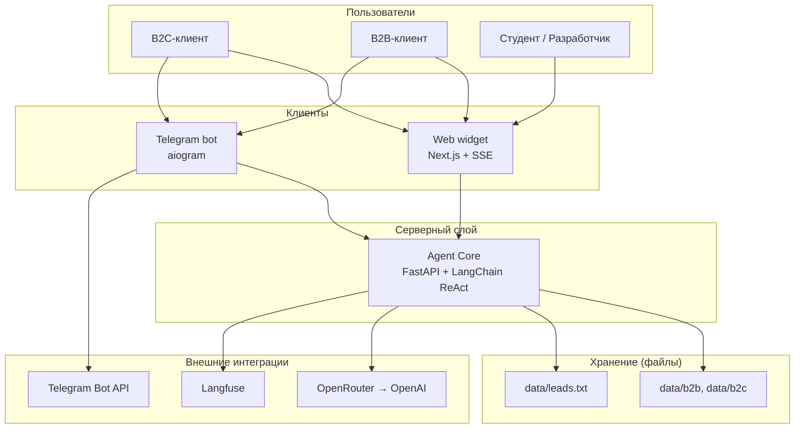

# Техническое видение проекта Deep-Agents-Live

---

## 1. Система в целом

**Deep-Agents-Live** — мультиканальная система AI-продаж и консультаций для llmstart.ru. Ядро — **Agent Core** (FastAPI): ReAct-агент, RAG, бизнес-инструменты и in-memory история диалогов.

Два канала доставки — **веб-виджет** (Next.js, SSE) и **Telegram-бот** (aiogram) — не содержат бизнес-логики: только адаптация формата, маршрутизация запросов к Core и передача `channel` (`web` / `telegram`). Код бота живёт внутри `frontend/`, в runtime — отдельный процесс/контейнер.

---

## 2. Роли

| Роль | Описание |
|------|----------|
| **Потенциальный клиент B2C** | Выбирает курс, уточняет программу и расписание, проходит мок-оплату, оставляет контакты |
| **Потенциальный клиент B2B** | Запрашивает корпоративное обучение или разработку под заказ; получает ответы из B2B-базы знаний |
| **Студент курса** | Запускает стенд локально, изучает архитектуру агента, tools, RAG, каналы и traces в Langfuse |
| **Разработчик** | Развивает и отлаживает систему: backend, frontend, bot, Docker Compose, observability; основная среда — Windows с PowerShell-обёртками и Docker через WSL |

---

## 3. Пользовательские сценарии

### Потенциальный клиент B2C

- **С-1: Консультация по курсу** — задаёт вопрос о программе; агент ищет в RAG (`data/b2c/`), предлагает продукт из каталога
- **С-2: Расписание и программа** — уточняет даты, модули, формат занятий по выбранному курсу
- **С-3: Выбор продукта и мок-оплата** — выбирает курс, получает мок-ссылку, подтверждает «оплатил», контакты сохраняются в `data/leads.txt`
- **С-4: Переход виджет → Telegram** — начинает диалог на сайте, продолжает в Telegram через тот же Core
- **С-5: Консультация по реализации продукта** — интересуется услугой `consultation` (экспертная консультация по темам программы / внедрению); агент поясняет формат и ведёт к записи лида

### Потенциальный клиент B2B

- **С-6: Запрос на корп. обучение / разработку** — описывает задачу; агент определяет B2B-сегмент, ищет в `data/b2b/`, формулирует ответ
- **С-7: Сохранение контактов** — оставляет контакты; tool `save_lead` фиксирует лид в файле

### Студент курса

- **С-8: Локальный запуск стека** — `make dev` (или `make.ps1` на Windows), просмотр диалога и traces в Langfuse
- **С-9: Наблюдение за работой агента** — в виджете видит SSE-стрим, reasoning, вызовы tools и статусы шагов

### Разработчик

- **С-10: Разработка на Windows** — backend/frontend/bot нативно; Docker Compose (Langfuse + сервисы) через WSL2
- **С-11: Отладка каналов** — проверяет единое поведение Core из виджета и Telegram с разным форматированием ответа

---

## 4. Архитектура (high-level)

> Детальные диаграммы и контракты — в [`architecture.md`](architecture.md).



---

## 5. Компоненты системы

### Agent Core (`backend/`)

- ReAct-агент, RAG, tools (`search_knowledge_base`, `list_b2c_products`, `save_lead`, `create_payment_link`, `confirm_payment`)
- In-memory история диалогов; REST/SSE API для каналов
- **Не делает:** форматирование под Telegram/HTML, UI виджета, прямую работу с Telegram API
- **Статус:** MVP

### Web widget (`frontend/` — приложение Next.js)

- Чат-виджет в стиле llmstart.ru, SSE-стриминг, отображение reasoning и tools
- Развилка «остаться в виджете / перейти в Telegram»
- **Не делает:** бизнес-логику агента, RAG, сохранение лидов
- **Статус:** MVP

### Telegram bot (`frontend/bot/`)

- Long polling, HTTP-клиент к Agent Core, HTML-форматирование ответов
- **Не делает:** ReAct, tools, RAG — только адаптер канала
- **Статус:** MVP

### Knowledge base (`data/`)

- `data/b2b/`, `data/b2c/` — PDF, MD для RAG
- `data/leads.txt` — мок CRM
- **Статус:** MVP

### Langfuse

- Трейсинг LLM-вызовов и шагов агента (self-hosted в Docker)
- **Статус:** MVP

### Docker Compose

- Сервисы: `backend`, `frontend`, `bot`, `langfuse` (+ зависимости Langfuse)
- **Статус:** MVP

---

## 6. Структура проекта

```
Deep-Agents-Live/
├── backend/              # Agent Core (FastAPI)
├── frontend/             # Next.js виджет
│   └── bot/              # Telegram-адаптер (aiogram)
├── data/
│   ├── b2b/              # B2B knowledge base
│   ├── b2c/              # B2C knowledge base
│   └── leads.txt         # Мок CRM
├── docs/
│   ├── concept/
│   ├── decisions/        # ADR
│   ├── roadmap.md
│   └── sprints/
├── Makefile              # Единая точка входа (Unix / WSL)
├── make.ps1              # Зеркало make-целей для Windows
├── docker-compose.yml
└── .env.example
```

---

## 7. Доменные сущности

> Персистентная схема БД не используется в MVP — [`data-model.md`](data-model.md) пропущен.

| Сущность | Смысл |
|----------|-------|
| **Conversation** | Диалог пользователя с агентом; история сообщений in-memory в Core |
| **Lead** | Зафиксированный контакт и контекст обращения; запись в `leads.txt` |
| **Product** | Позиция B2C-каталога (6 продуктов, включая `consultation`) |
| **KnowledgeChunk** | Фрагмент материала из b2b/b2c для RAG с меткой аудитории |
| **Channel** | Канал доставки: `web` или `telegram`; влияет на форматирование на стороне адаптера |

---

## 8. Внешние связи

> Детализация — в [`integrations.md`](integrations.md).

| Интеграция | Назначение |
|------------|------------|
| **OpenRouter → OpenAI** | LLM (ReAct) и embeddings для RAG |
| **Telegram Bot API** | Приём и отправка сообщений в канале Telegram |
| **Langfuse** | Observability: traces, spans, отладка агента |
| **Платёжный шлюз** | Мок: `create_payment_link`, `confirm_payment` |
| **CRM** | Мок: запись лидов в `data/leads.txt` |

---

## 9. Принципы разработки

- **KISS** — простые решения; один Core, тонкие адаптеры
- **YAGNI** — без Postgres, guardrails и production-платежей в MVP
- **DRY** — общая логика только в Core; дублирование между каналами запрещено
- **Fail fast** — конфиг и обязательные env-переменные валидируются на старте
- **Make как единая точка входа** — все команды через `make`; на Windows те же цели в `make.ps1`
- **Docker через WSL2** — `docker compose` для Langfuse и сервисов стека выполняется в WSL; код backend/frontend/bot разрабатывается нативно на Windows
- **Один мозг — много каналов** — вся бизнес-логика в Agent Core

---

## 10. Технологии

| Область | Решение |
|---------|---------|
| Runtime (backend, bot) | Python 3.11 |
| Package manager (backend) | uv |
| Web framework | FastAPI + uvicorn |
| Agent framework | LangChain ReAct |
| LLM / embeddings | OpenAI-модели через OpenRouter API |
| Frontend | Next.js 16 (App Router), React 19, TypeScript strict |
| UI | Tailwind CSS 4, shadcn/ui |
| Frontend PM | pnpm |
| Telegram | aiogram 3.x, long polling |
| Observability | Langfuse (self-hosted, Docker) |
| Streaming (web) | SSE |
| Локальная оркестрация | Makefile + make.ps1, Docker Compose (WSL2) |

---

## 11. Архитектурные и прочие принятые решения

> Полный текст ADR — в [`docs/decisions/`](../decisions/).

| № | Решение | Дата | Статус |
|---|---------|------|--------|
| [ADR-0001](../decisions/0001-single-agent-core.md) | Один Agent Core, тонкие канальные адаптеры | 2026-06-06 | Принято |
| [ADR-0002](../decisions/0002-in-memory-no-postgres.md) | In-memory диалоги, без Postgres в MVP | 2026-06-06 | Принято |
| [ADR-0003](../decisions/0003-mock-payment-crm.md) | Моки для оплаты и CRM | 2026-06-06 | Принято |
| [ADR-0004](../decisions/0004-windows-make-docker-wsl.md) | Make + PowerShell на Windows, Docker через WSL | 2026-06-06 | Принято |
