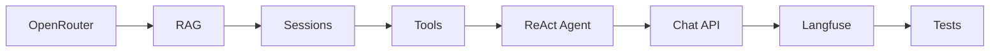

# Sprint 02: agent-rag

> **Версия roadmap:** v0.1
> **Roadmap:** [../../roadmap.md](../../roadmap.md)
> **Статус:** ✅ Done
> **Открыт:** 2026-06-07
> **Закрыт:** 2026-06-07

---

## Цель спринта

Рабочий Agent Core с ReAct-агентом, RAG (b2b/b2c + manifest), пятью business-tools, in-memory сессиями и API `POST /api/v1/chat` + `POST /api/v1/chat/stream` (SSE).

---

## DoD спринта

Sprint считается завершённым, когда:

| # | Критерий | Результат |
|---|----------|-----------|
| 1 | RAG индексирует `data/b2b/`, `data/b2c/` при старте без дубликатов | ✅ |
| 2 | `POST /admin/reindex` (ENV=dev) переиндексирует инкрементально | ✅ |
| 3 | ReAct-агент отвечает через OpenRouter с 5 tools | ✅ |
| 4 | `POST /api/v1/chat/stream` стримит SSE-события по контракту | ✅ |
| 5 | `POST /api/v1/chat` (channel=telegram) возвращает JSON `{reply, session_id}` | ✅ |
| 6 | In-memory сессии сохраняют историю в рамках `session_id` | ✅ |
| 7 | Воронка мок-оплаты: `create_payment_link` → `confirm_payment` → `save_lead` | ✅ |
| 8 | Langfuse traces отправляются (при `LANGFUSE_ENABLED=true`) | ✅ |
| 9 | Ошибки OpenRouter маппятся на 503/400 по api-contracts | ✅ |
| 10 | Backend-тесты: chat, RAG manifest, tools (smoke + ключевые unit) | ✅ (18 tests) |
| 11 | `GET /health` отражает реальные `rag_indexed_docs`, `sessions_active` | ✅ |

---

## Scope

### В scope

| Область | Что делаем |
|---------|------------|
| **RAG** | `rag/indexer.py`, `store.py`, `manifest.py`, `search.py`; upsert по `doc_id`; manifest |
| **Agent** | ReAct graph (LangChain), system prompt «Айра», генерация `agent_step` labels |
| **Tools (5)** | `search_knowledge_base`, `list_b2c_products`, `create_payment_link`, `confirm_payment`, `save_lead` |
| **Memory** | `memory/sessions.py` — dict `session_id → messages[]` |
| **Integrations** | `integrations/openrouter.py` (chat + embeddings), `integrations/langfuse.py` (callback) |
| **API** | `api/routers/chat.py` — JSON + SSE; `api/routers/admin.py` — reindex; схемы запросов/ответов |
| **Data** | Примеры документов в `data/b2c/`, `data/b2b/` для демо RAG |
| **Tests** | pytest: RAG manifest idempotency, chat endpoints, tool unit smoke |

### Вне scope (следующие спринты)

- Web-виджет Next.js, SSE-клиент (sprint-03)
- Telegram-бот aiogram (sprint-04)
- Полный docker-compose backend+frontend+bot (sprint-04)
- Postgres, сквозные сессии виджет↔Telegram (v0.2)
- Guardrails, эскалация на эксперта (v0.2)

---

## Шаги реализации

### 1. OpenRouter integration

- `integrations/openrouter.py`: фабрики `ChatOpenAI` / `OpenAIEmbeddings` с `base_url=OPENROUTER_BASE_URL`
- Retry 1× при provider_unavailable; fallback на `LLM_FALLBACK_MODEL` при model_error (chat)
- Timeout из `LLM_TIMEOUT_SEC`, `EMBEDDING_TIMEOUT_SEC`
- Кастомные исключения: `ProviderUnavailableError`, `ModelError` → маппинг в HTTP handler

**Skills:** `modern-python`, `sharp-edges`

### 2. RAG subsystem

- `manifest.py`: чтение/запись `data/.rag-manifest.json`
- `indexer.py`: обход `data/b2b/`, `data/b2c/`; `doc_id` = path + sha256 + audience; upsert чанков
- `store.py`: in-memory vector store (singleton)
- `search.py`: `search_knowledge_base(query, audience)` с фильтром b2b/b2c
- Lifespan в `main.py`: `RagIndexer.build()` при старте
- `POST /admin/reindex` — только `ENV=dev`, иначе 404

**Skills:** LangChain MCP (`langchain-docs`) для embeddings/vector store patterns

### 3. In-memory sessions

- `memory/sessions.py`: `get_history`, `append_message`, `clear_session`
- Подключение в chat router перед вызовом агента

### 4. Business tools

| Tool | Поведение |
|------|-----------|
| `search_knowledge_base` | RAG search с `audience` |
| `list_b2c_products` | Статический/файловый каталог курсов B2C |
| `create_payment_link` | UUID order_id + URL `{MOCK_PAYMENT_BASE_URL}/{order_id}` |
| `confirm_payment` | Keyword match из `MOCK_PAYMENT_CONFIRM_KEYWORDS` |
| `save_lead` | Append JSON Line в `LEADS_FILE_PATH` |

Файл `data/b2c/products.json` (или MD) — источник каталога.

### 5. ReAct agent

- `agent/react_agent.py`: LangChain ReAct agent / graph
- `agent/prompts.py`: system prompt Айра (консультант llmstart.ru)
- `agent/step_labels.py`: человекочитаемые labels для `agent_step` SSE
- Streaming callbacks → события `agent_step`, `tool_call`, `tool_result`, `token`
- Langfuse `CallbackHandler` в цепочке (не блокирует ответ)

**Skills:** LangChain MCP, `python-design-patterns`

### 6. Chat API

- `api/schemas/chat.py`: `ChatRequest`, `ChatResponse`, SSE event models
- `api/routers/chat.py`:
  - `POST /api/v1/chat/stream` — `channel=web`, SSE generator
  - `POST /api/v1/chat` — `channel=telegram`, синхронный JSON
- Валидация: 422 при неверном channel/message
- Ошибки до стрима — JSON; во время стрима — `event: error` + close
- Обновить `health.py`: реальные счётчики из RAG store и session manager

**Skills:** `fastapi-templates`, `api-design-principles`

### 7. Тестовые данные и документация

- Добавить 2–3 sample-файла в `data/b2c/`, `data/b2b/`
- Swagger `/docs` отражает chat endpoints

### 8. Тесты

- `test_rag_manifest.py`: повторный build не дублирует чанки
- `test_chat_stream.py`: SSE smoke (httpx stream)
- `test_chat_json.py`: telegram channel smoke
- `test_tools.py`: save_lead append, create_payment_link URL
- `test_openrouter_errors.py`: мок httpx → 503/400

**Skills:** `python-testing-patterns`

---

## Порядок выполнения (рекомендуемый)



1. OpenRouter → 2. RAG + manifest → 3. Sessions → 4. Tools → 5. Agent → 6. Chat routers → 7. Langfuse wiring → 8. Tests + sample data

---

## Зависимости

- **Sprint-01** полностью закрыт (backend scaffold, health, make, Langfuse compose)
- `.env` с `OPENROUTER_API_KEY`
- Langfuse опционально (`LANGFUSE_ENABLED=false` для dev без traces)

---

## Риски

| Риск | Митигация |
|------|-----------|
| Стоимость/лимиты OpenRouter | mini-модель по умолчанию, `LLM_MAX_TOKENS` |
| Медленный первый старт (индексация) | Инкрементальный manifest; лог прогресса |
| Сложность SSE + ReAct streaming | Сначала синхронный `/chat`, затем stream; общий runner |
| Langfuse недоступен | Graceful degrade, `LANGFUSE_ENABLED=false` |

---

## Артефакты (ожидаемые)

```
backend/app/
├── agent/
│   ├── react_agent.py
│   ├── prompts.py
│   └── step_labels.py
├── tools/
│   ├── search_knowledge_base.py
│   ├── list_b2c_products.py
│   ├── create_payment_link.py
│   ├── confirm_payment.py
│   └── save_lead.py
├── rag/
│   ├── indexer.py
│   ├── store.py
│   ├── manifest.py
│   └── search.py
├── memory/
│   └── sessions.py
├── integrations/
│   ├── openrouter.py
│   └── langfuse.py
└── api/
    ├── routers/
    │   ├── chat.py
    │   └── admin.py
    └── schemas/
        └── chat.py

data/
├── b2b/          # sample docs
├── b2c/          # sample docs + products
├── .rag-manifest.json
└── leads.txt

backend/tests/
├── test_rag_manifest.py
├── test_chat_stream.py
├── test_chat_json.py
├── test_tools.py
└── test_openrouter_errors.py
```

---

## Итог

**Реализовано:** ReAct-агент (LangGraph), RAG с manifest, 5 tools, in-memory сессии, chat API (JSON + SSE), admin reindex, OpenRouter + Langfuse интеграции, 18 backend-тестов, make-цели `check-*` и `chat-*`.

**Отклонения:** embedding fallback; per-file skip при ошибках индексации.

**Summary:** [summary.md](./summary.md)

**Следующий спринт:** [sprint-03-web-widget](../sprint-03-web-widget/README.md)
