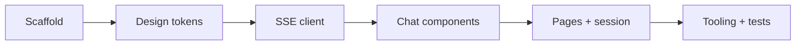

# Sprint 03: web-widget

> **Версия roadmap:** v0.1
> **Roadmap:** [../../roadmap.md](../../roadmap.md)
> **Статус:** ✅ Done
> **Открыт:** 2026-06-07
> **Закрыт:** 2026-06-07

---

## Цель спринта

Чат-виджет «Айра» на Next.js: UI по [design-reference-blue-green.png](../../../design-reference-blue-green.png), SSE-клиент к `POST /api/v1/chat/stream`, блок «Думаю вслух», standalone-страница и embed-режим.

---

## DoD спринта

Sprint считается завершённым, когда:

| # | Критерий | Результат |
|---|----------|-----------|
| 1 | Next.js :3000, `GET /api/health` → 200 | ✅ |
| 2 | UI design-reference (blue-green, glass) | ✅ |
| 3 | SSE: `agent_step`, `tool_call`, `token`, `done` | ✅ |
| 4 | «Думаю вслух» | ✅ |
| 5 | Streaming tokens + cursor | ✅ |
| 6 | Quick chips | ✅ |
| 7 | `session_id` в localStorage | ✅ |
| 8 | `/embed` | ✅ |
| 9 | Telegram deep-link | ✅ |
| 10 | Ошибки SSE / 503 в UI | ✅ |
| 11 | Frontend smoke-тесты | ✅ (9 tests) |
| 12 | Lint + typecheck frontend | ✅ |

---

## Задачи

| # | Задача | Статус | Plan | Summary |
|---|--------|--------|------|---------|
| 01 | Frontend scaffold (Next.js, pnpm, Tailwind, shadcn) | ✅ | [plan](tasks/01-frontend-scaffold/plan.md) | [summary](./summary.md) |
| 02 | Design tokens и layout shell | ✅ | [plan](tasks/02-design-tokens/plan.md) | [summary](./summary.md) |
| 03 | SSE client library | ✅ | [plan](tasks/03-sse-client/plan.md) | [summary](./summary.md) |
| 04 | Chat UI components | ✅ | [plan](tasks/04-chat-components/plan.md) | [summary](./summary.md) |
| 05 | Chat pages и session management | ✅ | [plan](tasks/05-chat-pages/plan.md) | [summary](./summary.md) |
| 06 | Frontend health, make targets и smoke-тесты | ✅ | [plan](tasks/06-frontend-tooling-tests/plan.md) | [summary](./summary.md) |

---

## Scope

### В scope

| Область | Что делаем |
|---------|------------|
| **Scaffold** | `frontend/` — Next.js 16 App Router, React 19, TypeScript strict, pnpm |
| **UI** | Компоненты чата по architecture.md и design-reference |
| **SSE** | `lib/sse-client.ts`, `lib/api.ts` — парсинг событий по api-contracts |
| **Pages** | `/` или `/chat` (dev), `/embed` (iframe) |
| **Session** | Генерация/хранение `session_id` (localStorage) |
| **Tooling** | `make dev-frontend`, `make test-frontend`, `GET /api/health` |
| **Tests** | Vitest smoke: health route, sse-client parser |

### Вне scope (следующие спринты)

- Telegram-бот aiogram (sprint-04)
- Полный `make dev` (backend + frontend + bot) — sprint-04
- Docker-compose frontend (sprint-04, `compose-dev`)
- Postgres, сквозные сессии виджет↔Telegram (v0.2)
- Production embed на llmstart.ru (v1.0)

---

## Порядок выполнения (рекомендуемый)



1. Scaffold → 2. Design tokens → 3. SSE client → 4. Chat components → 5. Pages → 6. Tooling + tests

---

## Зависимости

- **Sprint-02** закрыт: `POST /api/v1/chat/stream` работает, backend на `:8000`
- `.env`: `NEXT_PUBLIC_AGENT_API_URL=http://localhost:8000`, `CORS_ORIGINS=http://localhost:3000`
- Backend запущен для ручной проверки SSE

---

## Риски

| Риск | Митигация |
|------|-----------|
| CORS блокирует SSE из браузера | `CORS_ORIGINS` включает `http://localhost:3000` |
| Расхождение портов в `.env.example` | Задача 06: frontend `:3000`, Langfuse `:3001` |
| Сложность парсинга SSE в браузере | Отдельный модуль + unit-тесты на парсер |
| Design-reference vs shadcn defaults | Задача 02: кастомные CSS-переменные поверх shadcn |

---

## Артефакты (ожидаемые)

```
frontend/
├── app/
│   ├── layout.tsx
│   ├── page.tsx              # или app/chat/page.tsx
│   ├── embed/page.tsx
│   ├── globals.css
│   └── api/health/route.ts
├── components/chat/
│   ├── chat-widget.tsx
│   ├── chat-header.tsx
│   ├── message-bubble.tsx
│   ├── thinking-panel.tsx
│   ├── quick-chips.tsx
│   └── chat-input.tsx
├── lib/
│   ├── sse-client.ts
│   └── api.ts
├── __tests__/
│   ├── sse-client.test.ts
│   └── health.test.ts
├── package.json
└── tailwind.config.ts        # или @theme в globals.css (Tailwind 4)

Makefile / make.ps1           # dev-frontend, test-frontend (задача 06)
```

---

## Задача 01: Frontend scaffold 📋

### Цель

Инициализировать `frontend/` — Next.js 16, pnpm, Tailwind CSS 4, shadcn/ui, TypeScript strict.

> 💡 **Скиллы:** `nextjs-app-router-patterns`, `shadcn`, `vercel-react-best-practices`

### Состав работ

- [ ] `pnpm create next-app` (App Router, TS, Tailwind, ESLint)
- [ ] Инициализировать shadcn/ui (базовые компоненты: Button, Input, ScrollArea)
- [ ] Настроить strict TypeScript (`noImplicitAny`, без `@ts-ignore`)
- [ ] Создать каталоги `components/chat/`, `lib/`
- [ ] Самопроверка по критериям DoD

### Критерии готовности (DoD)

| # | Критерий | Способ проверки |
|---|----------|-----------------|
| 1 | Зависимости устанавливаются | `cd frontend && pnpm install` |
| 2 | Dev-сервер стартует | `pnpm dev` → `:3000` |
| 3 | Lint проходит | `pnpm lint` |
| 4 | Typecheck проходит | `pnpm exec tsc --noEmit` |

### Артефакты

- `frontend/package.json`, `frontend/tsconfig.json`, `frontend/next.config.ts`
- `frontend/components/ui/` — shadcn primitives

### Документы

- 📋 [План задачи](tasks/01-frontend-scaffold/plan.md)

---

## Задача 02: Design tokens и layout shell 📋

### Цель

Палитра blue-green, glassmorphism и типографика по design-reference; базовый layout для виджета.

> 💡 **Скиллы:** `frontend-design`, `web-design-guidelines`

### Состав работ

- [ ] CSS-переменные / Tailwind `@theme`: градиенты, glass, тени
- [ ] `app/layout.tsx` — шрифты, фон страницы
- [ ] Оболочка виджета (rounded container, backdrop-blur)
- [ ] Самопроверка по критериям DoD

### Критерии готовности (DoD)

| # | Критерий | Способ проверки |
|---|----------|-----------------|
| 1 | Градиент blue-green на фоне/акцентах | Визуальное сравнение с design-reference |
| 2 | Glassmorphism на контейнере чата | backdrop-blur + полупрозрачный фон |
| 3 | Responsive: виджет ~400px ширины на desktop | DevTools |

### Артефакты

- `frontend/app/globals.css` — design tokens
- `frontend/app/layout.tsx` — root layout

### Документы

- 📋 [План задачи](tasks/02-design-tokens/plan.md)

---

## Задача 03: SSE client library 📋

### Цель

Клиент для `POST /api/v1/chat/stream`: парсинг SSE-событий по контракту api-contracts, типизированные callbacks.

> 💡 **Скиллы:** `nextjs-app-router-patterns`, `api-design-principles`

### Состав работ

- [ ] `lib/api.ts` — `BACKEND_URL` из `NEXT_PUBLIC_AGENT_API_URL`
- [ ] `lib/sse-client.ts` — fetch + ReadableStream, парсинг `event:` / `data:`
- [ ] TypeScript-типы для всех SSE-событий
- [ ] Обработка pre-stream ошибок (JSON 4xx/503) и in-stream `error`
- [ ] Unit-тесты парсера
- [ ] Самопроверка по критериям DoD

### Критерии готовности (DoD)

| # | Критерий | Способ проверки |
|---|----------|-----------------|
| 1 | Парсер корректно разбирает mock SSE payload | `pnpm test sse-client` |
| 2 | `streamChat()` вызывает backend с `channel: web` | Интеграционный smoke (mock fetch) |
| 3 | AbortController отменяет стрим | Unit-тест |

### Артефакты

- `frontend/lib/sse-client.ts`
- `frontend/lib/api.ts`
- `frontend/lib/types/sse.ts` (опционально)
- `frontend/__tests__/sse-client.test.ts`

### Документы

- 📋 [План задачи](tasks/03-sse-client/plan.md)

---

## Задача 04: Chat UI components 📋

### Цель

Компоненты чата: header, bubbles, «Думаю вслух», quick chips, input — wired к SSE state (props/callbacks).

> 💡 **Скиллы:** `shadcn`, `frontend-design`, `vercel-react-best-practices`

### Состав работ

- [ ] `chat-header.tsx` — аватар, «Айра», online indicator, close (опционально)
- [ ] `message-bubble.tsx` — user/bot, timestamp, streaming cursor
- [ ] `thinking-panel.tsx` — список шагов из `agent_step`, спиннер на `active`
- [ ] `quick-chips.tsx` — пресеты: «Курсы для новичков», «Сравнить цены», «Как купить?»
- [ ] `chat-input.tsx` — placeholder «Задайте вопрос...», send, disabled while streaming
- [ ] `chat-widget.tsx` — композиция компонентов + state machine
- [ ] Самопроверка по критериям DoD

### Критерии готовности (DoD)

| # | Критерий | Способ проверки |
|---|----------|-----------------|
| 1 | Все 6 компонентов рендерятся без ошибок | Story/page с mock data |
| 2 | `thinking-panel` показывает 3 статуса шага | Mock `agent_step` events |
| 3 | Bot bubble показывает мигающий курсор при `isStreaming` | Visual |
| 4 | Quick chip вызывает `onSendMessage(preset)` | Click handler test |

### Артефакты

- `frontend/components/chat/*.tsx` (6 файлов)

### Документы

- 📋 [План задачи](tasks/04-chat-components/plan.md)

---

## Задача 05: Chat pages и session management 📋

### Цель

Standalone-страница для dev и embed-режим; генерация и persistence `session_id`; ссылка на Telegram.

> 💡 **Скиллы:** `nextjs-app-router-patterns`

### Состав работ

- [ ] `app/page.tsx` (или `app/chat/page.tsx`) — полноэкранный dev-чат
- [ ] `app/embed/page.tsx` — компактный виджет для iframe
- [ ] `session_id`: `crypto.randomUUID()`, localStorage key `aira_session_id`
- [ ] Интеграция `ChatWidget` + `streamChat` из sse-client
- [ ] Ссылка «Перейти в Telegram» → `https://t.me/{TELEGRAM_BOT_USERNAME}`
- [ ] Самопроверка по критериям DoD

### Критерии готовности (DoD)

| # | Критерий | Способ проверки |
|---|----------|-----------------|
| 1 | Диалог end-to-end с backend | «Какой курс для новичка?» → ответ + «Думаю вслух» |
| 2 | `session_id` стабилен при reload той же вкладки | localStorage inspect |
| 3 | `/embed` рендерит виджет без лишнего chrome | Browser |
| 4 | Telegram link открывается | Клик по ссылке |

### Артефакты

- `frontend/app/page.tsx`
- `frontend/app/embed/page.tsx`
- `frontend/lib/session.ts`

### Документы

- 📋 [План задачи](tasks/05-chat-pages/plan.md)

---

## Задача 06: Frontend health, make targets и smoke-тесты 📋

### Цель

`GET /api/health` для compose/CI; цели `make dev-frontend`, `make test-frontend`; выравнивание портов в `.env.example`.

> 💡 **Скиллы:** `github-actions-templates` (подготовка к sprint-04 CI)

### Состав работ

- [ ] `app/api/health/route.ts` → `{status, version}`
- [ ] Vitest + Testing Library setup
- [ ] Smoke-тест health route
- [ ] Обновить `Makefile` / `make.ps1`: `dev-frontend`, `test-frontend`, `lint`/`typecheck` frontend
- [ ] Исправить `.env.example`: frontend `:3000`, Langfuse `:3001`, `CORS_ORIGINS`, `NEXT_PUBLIC_AGENT_API_URL`
- [ ] Самопроверка по критериям DoD

### Критерии готовности (DoD)

| # | Критерий | Способ проверки |
|---|----------|-----------------|
| 1 | `GET /api/health` → 200 | curl localhost:3000/api/health |
| 2 | `make dev-frontend` / `make.ps1 dev-frontend` | PowerShell + make |
| 3 | `make test-frontend` exit 0 | CI-ready |
| 4 | `.env.example` порты согласованы с architecture.md | Code review |

### Артефакты

- `frontend/app/api/health/route.ts`
- `frontend/__tests__/health.test.ts`
- `frontend/vitest.config.ts`
- `Makefile`, `make.ps1`, `.env.example` (частично)

### Документы

- 📋 [План задачи](tasks/06-frontend-tooling-tests/plan.md)

---

## Итог

**Реализовано:** Next.js виджет «Айра», SSE-клиент, UI по design-reference, `/` + `/embed`, make-цели frontend, 9 vitest-тестов.

**Summary:** [summary.md](./summary.md)

**Следующий спринт:** [sprint-04-telegram-e2e](../sprint-04-telegram-e2e/README.md)
