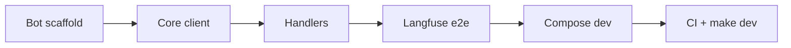

# Sprint 04: telegram-e2e

> **Версия roadmap:** v0.1
> **Roadmap:** [../../roadmap.md](../../roadmap.md)
> **Статус:** ✅ Done
> **Открыт:** 2026-06-07
> **Закрыт:** 2026-06-07

---

## Цель спринта

Telegram-бот в `frontend/bot/`, полный локальный стек (`make dev`), end-to-end воронка (консультация → мок-оплата → лид), traces в Langfuse, CI smoke.

---

## DoD спринта

Sprint считается завершённым, когда:

| # | Критерий | Способ проверки |
|---|----------|-----------------|
| 1 | Telegram-бот отвечает на текстовое сообщение через Core | Сообщение боту → ответ в Telegram |
| 2 | Бот использует `POST /api/v1/chat` с `channel: telegram` | Лог backend / Langfuse trace |
| 3 | `session_id` стабилен в рамках Telegram chat (per `chat_id`) | Два сообщения подряд → контекст |
| 4 | Markdown от Core конвертируется в Telegram HTML | Ссылки, bold в ответе |
| 5 | Воронка в Telegram: оплата → подтверждение → лид в `data/leads.txt` | Сценарий С-3 в боте |
| 6 | Воронка в Web: тот же сценарий через виджет | Сценарий С-3 в `/chat` |
| 7 | Langfuse показывает traces после запросов web + telegram | UI `:3001`, span на диалог |
| 8 | `make dev` поднимает backend + frontend + bot (нативно) | PowerShell / make |
| 9 | `make compose-dev` поднимает полный стек в Docker (WSL) | `docker compose ps` — healthy |
| 10 | `make ci` = lint + typecheck + test-backend + test-frontend | exit 0 |
| 11 | GitHub Actions workflow проходит на push/PR | CI green |
| 12 | Bot fail-fast при отсутствии `TELEGRAM_BOT_TOKEN` | Запуск без токена |

---

## Задачи

| # | Задача | Статус | Plan | Summary |
|---|--------|--------|------|---------|
| 01 | Telegram bot scaffold | ✅ | [plan](tasks/01-bot-scaffold/plan.md) | [summary](./summary.md) |
| 02 | Core HTTP client | ✅ | [plan](tasks/02-core-client/plan.md) | [summary](./summary.md) |
| 03 | Formatters и message handlers | ✅ | [plan](tasks/03-formatters-handlers/plan.md) | [summary](./summary.md) |
| 04 | Langfuse traces e2e | ✅ | [plan](tasks/04-langfuse-e2e/plan.md) | [summary](./summary.md) |
| 05 | Full stack compose (`compose-dev`) | ✅ | [plan](tasks/05-compose-dev/plan.md) | [summary](./summary.md) |
| 06 | Make dev + CI smoke pipeline | ✅ | [plan](tasks/06-ci-e2e-smoke/plan.md) | [summary](./summary.md) |

---

## Scope

### В scope

| Область | Что делаем |
|---------|------------|
| **Bot** | `frontend/bot/` — aiogram 3, long polling, config fail-fast |
| **Adapter** | HTTP-клиент к Core, Markdown→HTML, session per chat |
| **Orchestration** | `make dev`, `make dev-bot`, `make compose-dev` |
| **Compose** | backend + frontend + bot + langfuse с healthchecks |
| **Observability** | Проверка Langfuse traces для обоих каналов |
| **CI** | GitHub Actions: lint, typecheck, tests |
| **E2E** | Чеклист воронки web + telegram (ручной + script smoke) |

### Вне scope (v0.2+)

- Сквозной `session_id` виджет ↔ Telegram
- Postgres, guardrails, эскалация
- Webhook вместо long polling
- Production deploy (v1.0)

---

## Порядок выполнения (рекомендуемый)



1. Bot scaffold → 2. Core client → 3. Handlers → 4. Langfuse e2e → 5. Compose → 6. CI

---

## Зависимости

- **Sprint-01..03** закрыты: backend API, виджет SSE, Langfuse compose
- `.env`: `TELEGRAM_BOT_TOKEN`, `OPENROUTER_API_KEY`, Langfuse keys
- BotFather: создан бот, username для deep-link

---

## E2E-сценарий воронки (ручная проверка)

Чеклист для закрытия спринта (web **или** telegram, оба канала — для DoD #5–6):

1. «Какой курс deep-agents подойдёт новичку?» → RAG + каталог
2. «Хочу записаться на deep-agents» → `create_payment_link`
3. «Оплатил, email: test@example.com» → `confirm_payment` + `save_lead`
4. Проверить новую строку JSON в `data/leads.txt`
5. Langfuse: trace с tool spans

---

## Риски

| Риск | Митигация |
|------|-----------|
| Конфликт long polling (2 инстанса) | Документировать один процесс; fail on conflict |
| Bot не достучится до Core из Docker | `BACKEND_URL` / service name в compose |
| CI без секретов (OpenRouter, Telegram) | Моки в тестах; optional secrets в CI |
| Windows: 3 процесса в `make dev` | make.ps1 с Start-Process или documented manual |

---

## Артефакты (ожидаемые)

```
frontend/bot/
├── pyproject.toml
├── main.py
├── config.py
├── core_client.py
├── formatters.py
├── session_store.py
└── tests/
    ├── test_formatters.py
    └── test_core_client.py

docker-compose.yml              # расширен: backend, frontend, bot
docker-compose.dev.yml          # опционально — overlay для compose-dev

.github/workflows/ci.yml

Makefile / make.ps1             # dev, dev-bot, compose-dev, ci

docs/sprints/sprint-04-telegram-e2e/
└── e2e-funnel-checklist.md     # опционально в задаче 06
```

---

## Задача 01: Telegram bot scaffold 📋

### Цель

Каркас `frontend/bot/`: uv-проект, aiogram 3, config с fail-fast, точка входа long polling.

> 💡 **Скиллы:** `modern-python`, `uv-package-manager`

### Состав работ

- [ ] `uv init` в `frontend/bot/`
- [ ] Зависимости: aiogram 3.x, httpx, pydantic-settings
- [ ] `config.py`: `TELEGRAM_BOT_TOKEN`, `BACKEND_URL`, `TELEGRAM_POLLING_TIMEOUT`
- [ ] `main.py`: Bot + Dispatcher, stub handler `/start`
- [ ] Самопроверка по критериям DoD

### Критерии готовности (DoD)

| # | Критерий | Способ проверки |
|---|----------|-----------------|
| 1 | Fail-fast без `TELEGRAM_BOT_TOKEN` | Запуск без env |
| 2 | Бот стартует polling с валидным токеном | `uv run python main.py` |
| 3 | `/start` отвечает приветствием | Telegram client |
| 4 | Lint проходит | `uv run ruff check frontend/bot/` |

### Артефакты

- `frontend/bot/pyproject.toml`
- `frontend/bot/main.py`
- `frontend/bot/config.py`

### Документы

- 📋 [План задачи](tasks/01-bot-scaffold/plan.md)

---

## Задача 02: Core HTTP client 📋

### Цель

HTTP-клиент к Agent Core: `POST /api/v1/chat`, ping `GET /health`, обработка ошибок 503/400.

> 💡 **Скиллы:** `python-design-patterns`, `sharp-edges`

### Состав работ

- [ ] `core_client.py`: `send_message(session_id, message) -> ChatResponse`
- [ ] Timeout из config; маппинг HTTP-ошибок на понятные сообщения для пользователя
- [ ] `ping_health() -> bool` для startup check
- [ ] Unit-тесты с httpx mock
- [ ] Самопроверка по критериям DoD

### Критерии готовности (DoD)

| # | Критерий | Способ проверки |
|---|----------|-----------------|
| 1 | Успешный mock-ответ парсится | pytest |
| 2 | 503 → user-friendly exception/message | pytest |
| 3 | `ping_health` false при недоступном Core | pytest |

### Артефакты

- `frontend/bot/core_client.py`
- `frontend/bot/tests/test_core_client.py`

### Документы

- 📋 [План задачи](tasks/02-core-client/plan.md)

---

## Задача 03: Formatters и message handlers 📋

### Цель

Обработка текстовых сообщений, Markdown→HTML, session_id per Telegram chat_id.

> 💡 **Скиллы:** `python-testing-patterns`

### Состав работ

- [ ] `formatters.py`: markdown → Telegram HTML (links, bold, code)
- [ ] `session_store.py`: in-memory `chat_id → session_id` (UUID)
- [ ] Handler: любое текстовое сообщение → Core → ответ HTML
- [ ] Typing indicator (`send_chat_action`) пока ждём Core
- [ ] Тесты formatters
- [ ] Самопроверка по критериям DoD

### Критерии готовности (DoD)

| # | Критерий | Способ проверки |
|---|----------|-----------------|
| 1 | Диалог с backend end-to-end | Telegram + running Core |
| 2 | Один chat_id → один session_id | Лог / unit test store |
| 3 | Markdown link рендерится в Telegram | Сообщение со ссылкой оплаты |
| 4 | 503 от Core → сообщение пользователю | Stop backend test |

### Артефакты

- `frontend/bot/formatters.py`
- `frontend/bot/session_store.py`
- `frontend/bot/tests/test_formatters.py`

### Документы

- 📋 [План задачи](tasks/03-formatters-handlers/plan.md)

---

## Задача 04: Langfuse traces e2e 📋

### Цель

Подтвердить end-to-end observability: traces web + telegram видны в Langfuse UI после `make up`.

> 💡 **Скиллы:** Langfuse MCP (`langfuse-docs`) при отладке SDK

### Состав работ

- [ ] Документировать шаги: `make up` → keys в `.env` → `LANGFUSE_ENABLED=true`
- [ ] Smoke: один запрос web (виджет) + один telegram → traces в UI
- [ ] Проверить metadata: session_id, channel, tool spans
- [ ] При необходимости — минимальные правки `integrations/langfuse.py` (tags `channel`)
- [ ] Самопроверка по критериям DoD

### Критерии готовности (DoD)

| # | Критерий | Способ проверки |
|---|----------|-----------------|
| 1 | Trace после web SSE-диалога | Langfuse UI |
| 2 | Trace после telegram-диалога | Langfuse UI |
| 3 | Tool calls видны как spans/generations | UI drill-down |
| 4 | При `LANGFUSE_ENABLED=false` диалог работает | curl / bot message |

### Артефакты

- Возможные правки `backend/app/integrations/langfuse.py`
- `docs/sprints/sprint-04-telegram-e2e/tasks/04-langfuse-e2e/demo-steps.md` (опционально)

### Документы

- 📋 [План задачи](tasks/04-langfuse-e2e/plan.md)

---

## Задача 05: Full stack compose (`compose-dev`) 📋

### Цель

Расширить `docker-compose.yml`: backend, frontend, bot + Langfuse; healthchecks; `make compose-dev`.

> 💡 **Скиллы:** `docker-expert`, ADR-0004

### Состав работ

- [ ] Сервисы: `backend`, `frontend`, `bot`, `langfuse` (+ deps)
- [ ] Volume `data/` → backend
- [ ] Env из `.env`; `BACKEND_URL` для bot внутри сети compose
- [ ] Healthchecks по architecture.md
- [ ] `make compose-dev` / `make.ps1 compose-dev` (WSL)
- [ ] Самопроверка по критериям DoD

### Критерии готовности (DoD)

| # | Критерий | Способ проверки |
|---|----------|-----------------|
| 1 | `docker compose ps` — all healthy | WSL |
| 2 | Web `:3000`, backend `:8000`, Langfuse `:3001` | curl health endpoints |
| 3 | Bot container logs — polling active | `docker compose logs bot` |
| 4 | `make down` останавливает всё | compose ps empty |

### Артефакты

- `docker-compose.yml` (или `docker-compose.dev.yml`)
- `backend/Dockerfile`, `frontend/Dockerfile`, `frontend/bot/Dockerfile`
- `Makefile`, `make.ps1` — `compose-dev`

### Документы

- 📋 [План задачи](tasks/05-compose-dev/plan.md)

---

## Задача 06: Make dev + CI smoke pipeline 📋

### Цель

`make dev` для нативного стека на Windows; GitHub Actions CI; e2e чеклист воронки.

> 💡 **Скиллы:** `github-actions-templates`, `python-testing-patterns`

### Состав работ

- [ ] `make dev`: backend + frontend + bot (parallel processes)
- [ ] `make dev-bot`, обновить `make.ps1` зеркала
- [ ] `make ci`: lint + typecheck + test-backend + test-frontend
- [ ] `.github/workflows/ci.yml` из methodology template
- [ ] E2E funnel checklist (web + telegram) в plan или отдельный md
- [ ] Самопроверка по критериям DoD

### Критерии готовности (DoD)

| # | Критерий | Способ проверки |
|---|----------|-----------------|
| 1 | `make dev` / `make.ps1 dev` запускает 3 сервиса | Processes on :8000, :3000 |
| 2 | `make ci` exit 0 локально | PowerShell |
| 3 | CI workflow валиден (lint + tests) | `gh workflow run` или push |
| 4 | E2E воронка web: лид в leads.txt | Чеклист |
| 5 | E2E воронка telegram: лид в leads.txt | Чеклист |

### Артефакты

- `Makefile`, `make.ps1`
- `.github/workflows/ci.yml`
- `docs/sprints/sprint-04-telegram-e2e/e2e-funnel-checklist.md`

### Документы

- 📋 [План задачи](tasks/06-ci-e2e-smoke/plan.md)

---

## Итог (заполняется после закрытия)

Sprint 04 закрыт 2026-06-07. Telegram-бот в `frontend/bot/`, полный стек `make dev`, CI smoke, прокси Windows/VPN.

**Summary:** [summary.md](./summary.md)

**Ключевые артефакты:** `frontend/bot/`, `docker-compose.yml` (profile `full`), `make check-telegram`, `.github/workflows/ci.yml`
