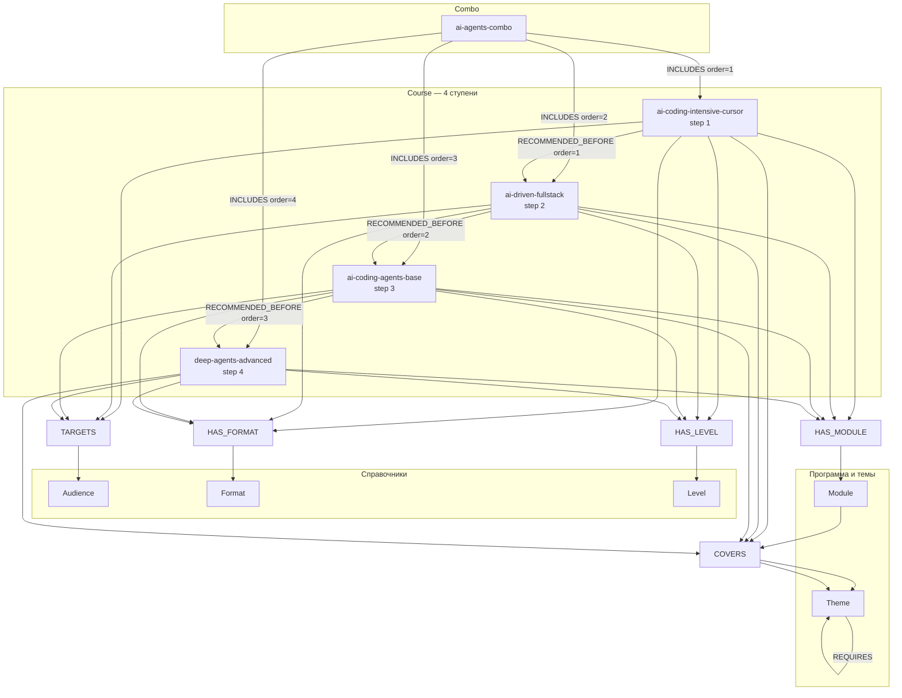
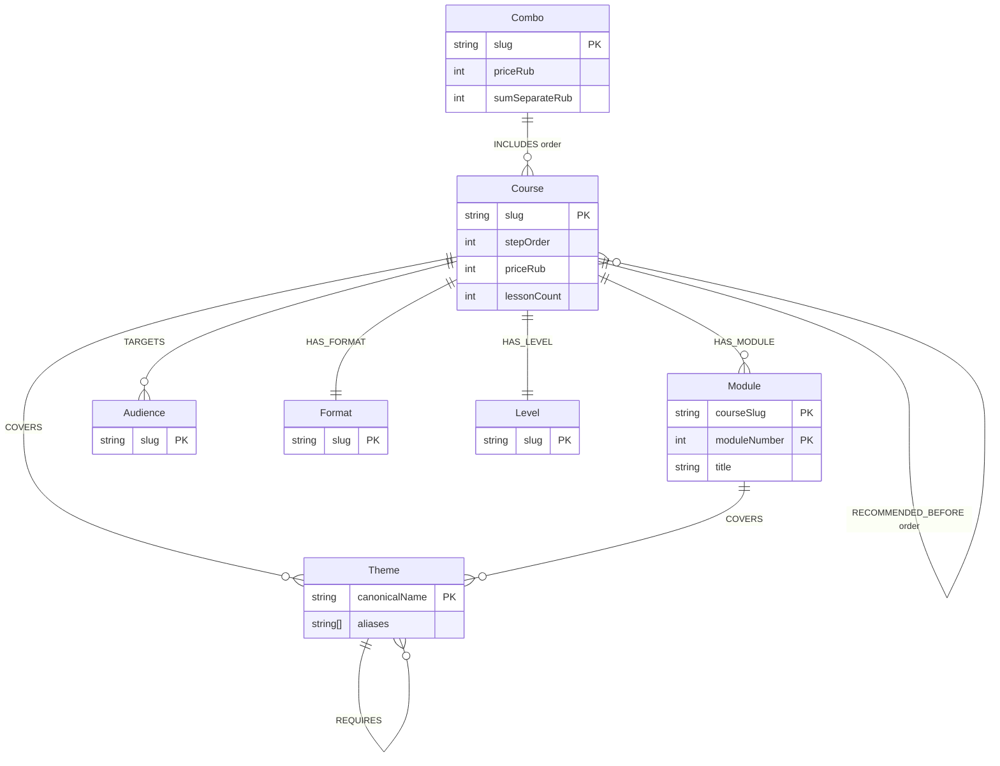
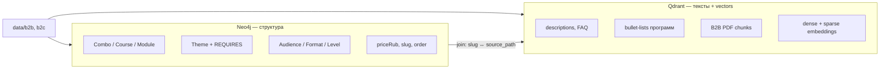
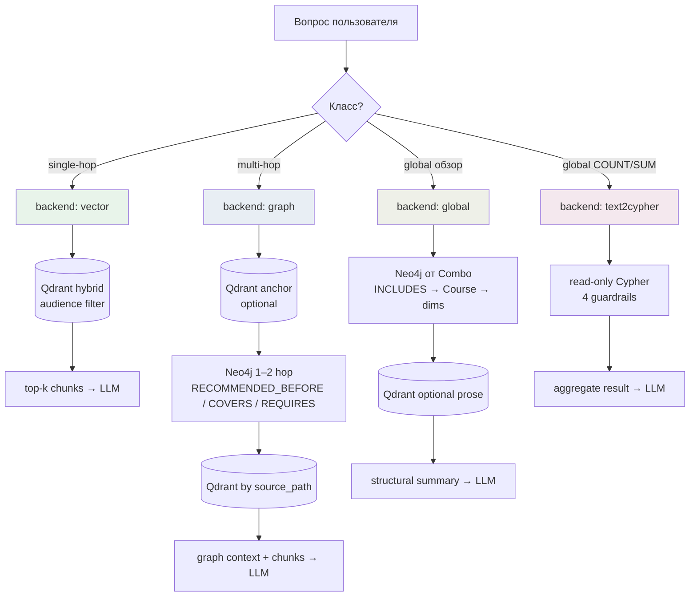
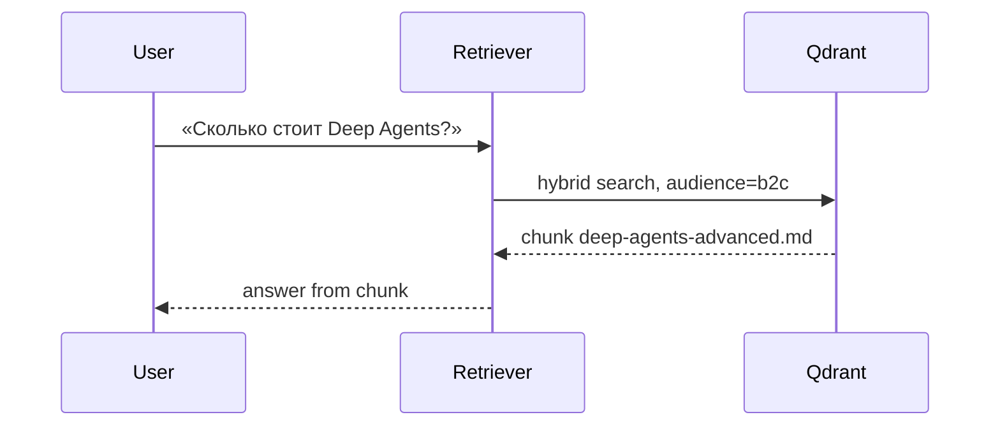
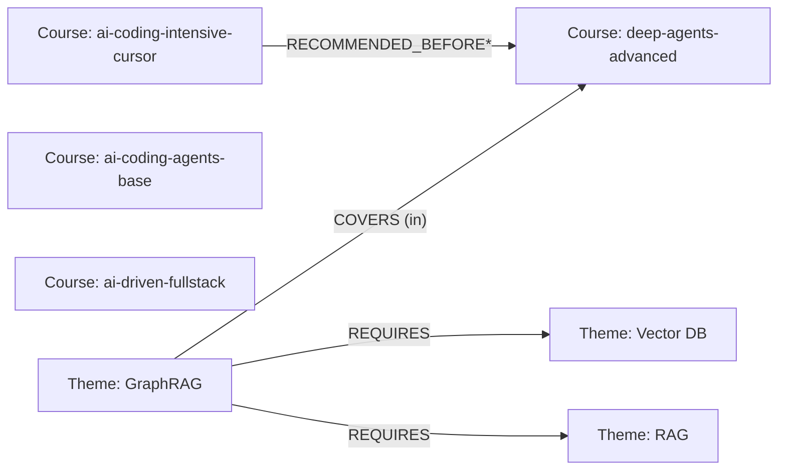
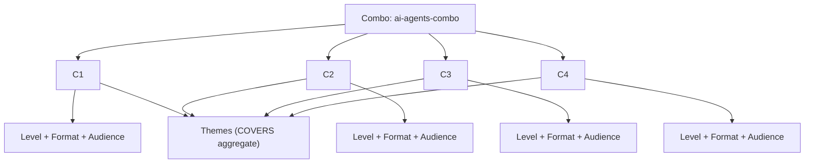

# LPG-схема каталога курсов — GraphRAG (задача 03)

> **Спринт:** [sprint-06-graphrag](README.md)  
> **Источник:** [analysis.md](analysis.md) §4–5  
> **ADR:** [0007-neo4j-graphrag.md](../../decisions/0007-neo4j-graphrag.md)

---

## 1. Mermaid-диаграмма схемы

### 1.1 Топология графа (LPG)

Направления рёбер **фиксированы**. Обратные связи не создаются.



### 1.2 ER-модель (labels, keys, rel types)



### Allowed nodes

| Label | Ключ нормализации | Свойства (основные) |
|-------|-------------------|---------------------|
| **Combo** | `slug` | `name`, `priceRub`, `sumSeparateRub`, `discountPct`, `sourcePaths[]` |
| **Course** | `slug` | `stepOrder`, `priceRub`, `lessonCount`, `duration`, `legacy`, `sourcePaths[]` |
| **Module** | `courseSlug` + `moduleNumber` | `title`, `theoryPracticeRatio` |
| **Theme** | `canonicalName` | `name`, `aliases[]`, `context` |
| **Audience** | `slug` | `name`, `description` |
| **Format** | `slug` | `name` |
| **Level** | `slug` | `name` |

### Allowed relationships

| Type | Direction | Props |
|------|-----------|-------|
| `INCLUDES` | `(Combo)→(Course)` | `order` |
| `RECOMMENDED_BEFORE` | `(Course_early)→(Course_late)` | `order` |
| `HAS_MODULE` | `(Course)→(Module)` | — |
| `COVERS` | `(Course\|Module)→(Theme)` | — |
| `REQUIRES` | `(Theme)→(Theme)` | `strength` |
| `TARGETS` | `(Course)→(Audience)` | — |
| `HAS_FORMAT` | `(Course)→(Format)` | — |
| `HAS_LEVEL` | `(Course)→(Level)` | — |

**Запрещено:** `:Entity`, `:RELATED_TO`, `:HAS`.

---

## 2. Boundary rule: граф vs Qdrant



| Слой | Что хранит | Примеры |
|------|------------|---------|
| **Neo4j — связи и структура** | Порядок ступеней, COVERS/REQUIRES, состав комбо | `RECOMMENDED_BEFORE*`, «GraphRAG в Deep Agents» |
| **Neo4j — свойства узла** | Скаляры для routing и text2cypher | `priceRub`, `lessonCount`, `stepOrder` |
| **Qdrant — контент** | Длинные тексты, FAQ, отзывы, детали занятий | «14 дней возврата», программа по bullet-list |
| **Qdrant — vectors** | Embeddings (dense + BM25 sparse) | **не переносятся в Neo4j** |
| **Вне графа (MVP)** | Legacy SKU, B2B-услуги как узлы | `products.json`, B2B PDF — только Qdrant |

### Связь по id

| Neo4j | Qdrant payload | Join |
|-------|----------------|------|
| `Course.slug` / `Combo.slug` | `source_path`, `doc_id` | `source_path` содержит `{slug}.md` |
| `sourcePaths[]` на узле | все чанки документа | filter `source_path IN …` после graph-hop |
| `Theme.canonicalName` | `text` чанков | graph — где тема; vector — как описана |

**Hybrid retrieval:** graph → список slug/path → Qdrant fetch → RRF/reranker.

### Канон данных (indexing)

| Поле | Значение |
|------|----------|
| Сумма ступеней | 139 960 ₽ |
| Цена комбо | 59 990 ₽ |
| Fullstack | один узел `ai-driven-fullstack`; `aidd-program.md` → `sourcePaths[]` |
| Deep Agents | `deep-agents-advanced`, 44 990 ₽ |

---

## 3. Маршруты обхода по классам вопросов



| Класс | Backend | Graph? | Типичный паттерн обхода |
|-------|---------|--------|-------------------------|
| **single-hop** | `vector` | **нет** | `Qdrant` only |
| **multi-hop** | `graph` | да | anchor → `COVERS` / `RECOMMENDED_BEFORE*` / `REQUIRES*` → Qdrant |
| **global** | `global` | да | `Combo`-[:INCLUDES]->`Course` → dims + COVERS + TARGETS |
| **global (числа)** | `text2cypher` | да | SUM/COUNT по свойствам Combo/Course |

**Guard:** single-hop **не** вызывает graph (регрессия baseline).

---

### 3.1 Single-hop → `vector`

**Обход:** только Qdrant. Граф не читается.



**Eval:** `graphrag-sh-01` — цена 44 990 ₽ из одного документа.

---

### 3.2 Multi-hop → `graph`

**Обход (2–4 hop):** Theme → Course → RECOMMENDED_BEFORE* → REQUIRES* → Qdrant по slug.

**Eval M2:** «В каком курсе GraphRAG и что пройти до него?»

```cypher
MATCH (t:Theme {canonicalName: 'GraphRAG'})
MATCH (c:Course)-[:COVERS]->(t)
WHERE c.slug = 'deep-agents-advanced'
MATCH path = (start:Course)-[:RECOMMENDED_BEFORE*]->(c)
WHERE start.slug = 'ai-coding-intensive-cursor'
OPTIONAL MATCH (t)-[:REQUIRES*1..2]->(pre:Theme)
RETURN c.slug, [n IN nodes(path) | n.slug] AS stepChain,
       collect(DISTINCT pre.canonicalName) AS themePrereqs
```



**Eval M1:** следующая ступень + diff тем после Fullstack

```cypher
MATCH (fs:Course {slug: 'ai-driven-fullstack'})
MATCH (fs)-[:RECOMMENDED_BEFORE]->(next:Course)
OPTIONAL MATCH (fs)-[:COVERS]->(tFs:Theme)
OPTIONAL MATCH (next)-[:COVERS]->(tNext:Theme)
RETURN next.slug,
       [x IN collect(DISTINCT tNext.canonicalName)
        WHERE NOT x IN collect(DISTINCT tFs.canonicalName)] AS newThemes
```

**Паттерны multi-hop:**

| Паттерн | Cypher-фрагмент |
|---------|-----------------|
| Следующая ступень | `(c)-[:RECOMMENDED_BEFORE]->(next)` |
| Prerequisite-цепочка | `(start)-[:RECOMMENDED_BEFORE*]->(target)` |
| Где тема | `(c:Course)-[:COVERS]->(t:Theme)` или через `(m:Module)-[:COVERS]->(t)` |
| Зависимости темы | `(t)-[:REQUIRES*1..2]->(pre:Theme)` |
| Diff тем между ступенями | COVERS на `fs` vs `next`, set minus |

---

### 3.3 Global → `global`

**Обход:** от `Combo` — fan-out по всем ступеням, сбор dims и COVERS. Без Leiden/community.

**Eval G1:** обзор траектории комбо

```cypher
MATCH (combo:Combo {slug: 'ai-agents-combo'})
MATCH (combo)-[inc:INCLUDES]->(c:Course)
OPTIONAL MATCH (c)-[:HAS_LEVEL]->(lvl:Level)
OPTIONAL MATCH (c)-[:HAS_FORMAT]->(fmt:Format)
OPTIONAL MATCH (c)-[:COVERS]->(t:Theme)
WITH combo, c, inc.order AS ord, lvl, fmt, collect(DISTINCT t.canonicalName) AS themes
ORDER BY ord
RETURN combo.name, combo.priceRub,
       collect({slug: c.slug, stepOrder: c.stepOrder, priceRub: c.priceRub,
                level: lvl.name, format: fmt.name, themes: themes}) AS trajectory
```



**Eval G2:** сквозные темы (4/4 ступени)

```cypher
MATCH (:Combo {slug: 'ai-agents-combo'})-[:INCLUDES]->(c:Course)
MATCH (c)-[:COVERS]->(t:Theme)
WITH t.canonicalName AS theme, count(DISTINCT c) AS n
WHERE n = 4
RETURN theme ORDER BY theme
```

**Eval G3:** аудитории всех курсов

```cypher
MATCH (:Combo {slug: 'ai-agents-combo'})-[:INCLUDES]->(c:Course)
MATCH (c)-[:TARGETS]->(a:Audience)
RETURN c.slug, collect(a.name) AS audiences
ORDER BY c.stepOrder
```

---

### 3.4 Global (агрегат) → `text2cypher`

**Обход:** NL → read-only Cypher по свойствам графа (guardrails: ro-role, no write, LIMIT, timeout).

**Eval G4:** цена комбо и скидка

```cypher
MATCH (combo:Combo {slug: 'ai-agents-combo'})
MATCH (combo)-[:INCLUDES]->(c:Course)
WITH combo, sum(c.priceRub) AS sumParts
RETURN combo.priceRub AS comboPrice, sumParts,
       round(100.0 * (1 - toFloat(combo.priceRub) / sumParts), 1) AS discountPct
LIMIT 1
```

---

## 4. Constraints (DDL, задача 05)

```cypher
CREATE CONSTRAINT combo_slug IF NOT EXISTS FOR (n:Combo) REQUIRE n.slug IS UNIQUE;
CREATE CONSTRAINT course_slug IF NOT EXISTS FOR (n:Course) REQUIRE n.slug IS UNIQUE;
CREATE CONSTRAINT module_key IF NOT EXISTS FOR (n:Module) REQUIRE (n.courseSlug, n.moduleNumber) IS UNIQUE;
CREATE CONSTRAINT theme_canonical IF NOT EXISTS FOR (n:Theme) REQUIRE n.canonicalName IS UNIQUE;
CREATE CONSTRAINT audience_slug IF NOT EXISTS FOR (n:Audience) REQUIRE n.slug IS UNIQUE;
CREATE CONSTRAINT format_slug IF NOT EXISTS FOR (n:Format) REQUIRE n.slug IS UNIQUE;
CREATE CONSTRAINT level_slug IF NOT EXISTS FOR (n:Level) REQUIRE n.slug IS UNIQUE;
```

---

## 5. Ссылки

- [analysis.md](analysis.md) — таксономия вопросов, нестыковки
- [0007-neo4j-graphrag.md](../../decisions/0007-neo4j-graphrag.md) — ADR, версии
- [dataset-map.md](../../eval/dataset-map.md) — graphrag/*
