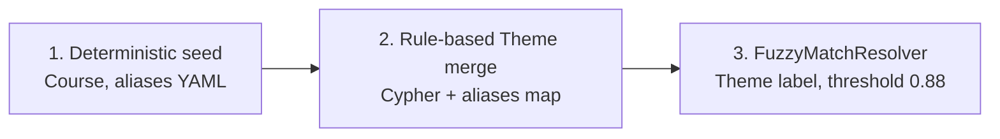

# Task 05: Индексация графа — части (б), (в), (г)

> **Sprint:** [../../README.md](../../README.md)  
> **Тип:** feat  
> **Ветка:** `feat/graph-05-index-extract-resolve-qa`  
> **Spec:** [schema.md](../../schema.md), [analysis.md](../../analysis.md) §5, [ADR-0007](../../../../decisions/0007-neo4j-graphrag.md)  
> **Статус планирования:** ⛔ ждём «ок» перед реализацией частей (б)–(г)

---

## Цель (полная задача 05)

Наполнить Neo4j каталогом B2C: **(а)** ручной seed *(готов)* → **(б)** schema-guided извлечение Theme/COVERS/REQUIRES → **(в)** entity resolution → **(г)** контрольные graph-qa запросы и `make graph-index` / `make graph-qa`.

**Части (б)–(г) этой итерации:** спроектировать библиотеку извлечения, параметры схемы, стратегию entity resolution и состав `graph-qa.cypher`.

---

## Контекст: что уже есть (часть а)

| Артефакт | Статус |
|----------|--------|
| `data/graph/seed.cypher` | ✅ Combo, 4 Course, dims, 37 Module, prerequisite, цены |
| `backend/app/graph/index_cli.py` | ✅ `--seed-only` / `--full` / `--resolve-only` (extract/resolve — stubs) |
| `backend/app/graph/qa_cli.py` | ✅ 9 automated gates + `--verbose` diagnostics |
| `data/graph/graph-qa.cypher` | 🟡 черновик (11 блоков), дополняется в (г) |

**Seed не создаёт:** `Theme`, `COVERS`, `REQUIRES` — зона части (б).

---

## (б) Авто-извлечение тем — библиотека и параметры схемы

### Выбор библиотеки

| Критерий | SimpleKGPipeline (neo4j-graphrag) | LlamaIndex SchemaLLMPathExtractor |
|----------|-----------------------------------|-----------------------------------|
| ADR-0007 | ✅ pin `neo4j-graphrag==1.17.0` | optional, отдельная зависимость |
| Schema-guided | `GraphSchema` (Option B) | `allowed_nodes` / `allowed_rels` |
| Skills router | `neo4j-document-import-skill` | нет dedicated skill |
| Embeddings в Neo4j | по умолчанию пишет в Chunk | зависит от store |
| Boundary sprint-06 | нужен post-process / отключение lexical layer | аналогично |

**Решение:** **`SimpleKGPipeline`** (`neo4j-graphrag==1.17.0` + `[fuzzy-matching]` для части в).

**Отвергнуто:**
- `LLMGraphTransformer` (langchain-experimental) — запрет sprint-06 / ADR.
- LlamaIndex `SchemaLLMPathExtractor` — дублирует стек без выигрыша; ADR уже pin neo4j-graphrag для задач 06–07.

**Ограничение boundary:** embeddings **не** храним в Neo4j. Pipeline использует LLM-only extraction; после promote — удаляем временный lexical layer (`Document` / `Chunk` / `__Entity__`).

### LLM-провайдер

- **OpenRouter** через OpenAI-compatible API (`OpenAILLM` + `base_url=OPENROUTER_BASE_URL`, `api_key=OPENROUTER_API_KEY`).
- Модель: env `GRAPH_EXTRACT_MODEL` (default: тот же `CHAT_MODEL` или лёгкая structured-output модель, напр. `openai/gpt-4o-mini`).
- `temperature=0`, structured output — управляется pipeline (не задавать `response_format` вручную).

### Источники extraction (5 файлов)

| Файл | courseSlug | Module в seed | Примечание |
|------|------------|---------------|------------|
| `data/b2c/programs/ai-coding-intensive-cursor.md` | `ai-coding-intensive-cursor` | 4 | |
| `data/b2c/programs/ai-driven-fullstack.md` | `ai-driven-fullstack` | 10 | канон Fullstack |
| `data/b2c/programs/ai-coding-agents-base.md` | `ai-coding-agents-base` | 11 | |
| `data/b2c/programs/deep-agents-advanced.md` | `deep-agents-advanced` | 12 | GraphRAG, Vector DB |
| `data/b2c/programs/aidd-program.md` | `ai-driven-fullstack` | — | **только темы**, без нового Course; `document_metadata.legacy=true` |

**Вне extraction:** `products.json`, `courses-intro.md`, `b2b/**` (analysis §5, boundary).

### GraphSchema — allowed nodes (только для LLM)

Извлекаем **только** то, чего нет в seed:

| Label | Ключ | Свойства | Описание для LLM |
|-------|------|----------|------------------|
| **Theme** | `canonicalName` | `name`, `aliases[]`, `context` | Сквозной технологический/методологический концепт каталога (RAG, GraphRAG, MCP, Observability…). Не название занятия «Тема 5». |
| **Module** | `courseSlug` + `moduleNumber` | `title` | **Reference-only** — уже в seed; LLM использует для привязки COVERS, новые Module **не создавать**. |

Combo, Course, Audience, Format, Level — **не извлекать** (seed).

### GraphSchema — allowed relationships

| Type | Pattern | Props | Правило |
|------|---------|-------|---------|
| `COVERS` | `(Module)-[:COVERS]->(Theme)` | — | **Primary:** тема занятия N курса → концепт. `moduleNumber` из заголовка md. |
| `COVERS` | `(Course)-[:COVERS]->(Theme)` | — | **Derived (optional):** агрегат после extraction — `MERGE (c)-[:COVERS]->(t)` если `(c)-[:HAS_MODULE]->(m)-[:COVERS]->(t)`. |
| `REQUIRES` | `(Theme)-[:REQUIRES]->(Theme)` | `strength` optional | Концептуальные prerequisite между темами (analysis §2). |

**Запрещено в промпте/schema:** `:Entity`, `:RELATED_TO`, `:HAS`, `PREPARES_FOR`, `SAME_AS`, `DOCUMENTED_IN`.

### Patterns для SimpleKGPipeline

```python
patterns = [
    ("Module", "COVERS", "Theme"),
    ("Theme", "REQUIRES", "Theme"),
]
# Course→Theme — derived Cypher post-step, не LLM pattern (меньше шума)
```

### Chunking

| Параметр | Значение | Обоснование |
|----------|----------|-------------|
| Splitter | **SectionSplitter** по regex `^## (Тема\|Модуль) \d+` | 1 chunk ≈ 1 занятие; совпадает с Module в seed |
| `chunk_size` / overlap | не используется (section-based) | Фиксированная граница по программе |
| `document_metadata` | `{courseSlug, sourcePath, legacy?}` | Привязка COVERS к Module |

### Параметры pipeline

```python
SimpleKGPipeline(
    llm=openrouter_llm,
    driver=driver,
    embedder=None,                    # или MinimalNoOp — см. реализацию; embeddings не пишем
    schema=graph_schema,              # GraphSchema Option B
    from_file=True,
    text_splitter=ProgramSectionSplitter(),
    perform_entity_resolution=False,  # resolution — отдельный шаг (в)
    on_error="RAISE",
    neo4j_database=settings.neo4j_database,
)
```

> Если `embedder=None` недоступен в 1.17.0 — stub-embedder без записи в Neo4j или `lexical_graph_config` с отключением embedding property.

### Post-processing: promote → catalog schema

Модуль `backend/app/graph/theme_promoter.py` (или шаг в `index_cli`):

1. **Map** временные entity-узлы pipeline → `:Theme {canonicalName, name, aliases, context}`.
2. **MERGE** `(m:Module {courseSlug, moduleNumber})-[:COVERS]->(t:Theme)` по metadata chunk.
3. **MERGE** derived `(c:Course)-[:COVERS]->(t)` для всех тем модулей курса.
4. **MERGE** `(t1)-[:REQUIRES {strength}]->(t2)` — только между `:Theme`.
5. **DELETE** lexical layer: `Document`, `Chunk`, `__Entity__` / `__KGBuilder__` и их rels.
6. **Idempotency:** повторный `--full` — `MERGE` Theme/COVERS/REQUIRES, без дублей по constraint `theme_canonical`.

### Seed REQUIRES (baseline)

Часть REQUIRES зафиксировать **в seed или `theme_requires.cypher`** до/после LLM — по analysis §2 (must-have для eval M2, M6):

| from (canonicalName) | to (canonicalName) |
|----------------------|-------------------|
| Advanced RAG | RAG |
| GraphRAG | Vector DB |
| GraphRAG | RAG |
| Hybrid Search | Vector DB |
| LangGraph agents | Tool calling |
| Multi-agent systems | LangGraph agents |
| Multimodal RAG | RAG |
| MCP integration | Tool calling |

LLM дополняет REQUIRES; seed-файл гарантирует eval-critical edges.

### Артефакты части (б)

| Путь | Назначение |
|------|------------|
| `backend/pyproject.toml` | `neo4j-graphrag==1.17.0`, `[fuzzy-matching]` |
| `backend/app/graph/extraction_schema.py` | `GraphSchema`, patterns, descriptions |
| `backend/app/graph/section_splitter.py` | `ProgramSectionSplitter` |
| `backend/app/graph/theme_extractor.py` | `run_extraction()` — pipeline + promote |
| `backend/app/graph/theme_promoter.py` | Cypher promote/cleanup |
| `data/graph/theme_requires.cypher` | baseline REQUIRES (optional merge в seed) |
| `backend/app/graph/index_cli.py` | заменить `run_extraction_stub` |

### DoD части (б)

| # | Критерий | Проверка |
|---|----------|----------|
| 1 | Theme `GraphRAG` существует | `MATCH (:Theme {canonicalName:'GraphRAG'}) RETURN count(*)` → 1 |
| 2 | COVERS deep-agents-advanced → GraphRAG | `(c:Course {slug:'deep-agents-advanced'})-[:COVERS]->(:Theme {canonicalName:'GraphRAG'})` |
| 3 | Нет `:Document`/`:Chunk` после index | `MATCH (n) WHERE n:Document OR n:Chunk RETURN count(n)` → 0 |
| 4 | Extraction только 5 program files | log + grep sourcePath |
| 5 | Повторный `--full` идемпотентен | 2× run, counts stable |

---

## (в) Entity resolution — стратегия

### Принцип: три слоя



Inline `perform_entity_resolution=True` в pipeline **не используем** — seed и promote должны завершиться до merge.

### Кандидаты из analysis §5

#### Course level (deterministic — в seed, verify в QA)

| Кандидаты | Проблема | Канон | Действие |
|-----------|----------|-------|----------|
| AI-driven Fullstack | 2 файла | `ai-driven-fullstack` | ✅ seed: 1 Course; `aidd-program.md` → `sourcePaths[]` only |
| Deep Agents | курс vs products.json | `deep-agents-advanced` | exclude `llm-start`, `deep-agents` из графа |
| LLM Start | legacy JSON | — | **не индексировать** |

**Guard Cypher (post-extraction):** если pipeline создал лишний `:Course` — `DETACH DELETE` where `slug IN ['aidd-program', 'llm-start', 'deep-agents']` или merge slug → canonical.

#### Theme level (rule-based + fuzzy)

| Кандидаты | Канон `canonicalName` | aliases (merge в `aliases[]`) |
|-----------|----------------------|-------------------------------|
| LangSmith / LangFuse / Langfuse | `Observability` | LangSmith, LangFuse, Langfuse, tracing |
| AI-driven / AIDD / Fullstack AI-driven | `AI-driven методология` | AIDD, AI-driven подход, AI-driven разработка |
| MCP (браузер) vs MCP (интеграции) | `MCP` | Model Context Protocol; prop `context` при необходимости |
| Vector DB / ChromaDB / Qdrant | `Vector DB` | ChromaDB, Qdrant, векторные базы |
| RAG / Naive RAG / Advanced RAG | `RAG` / `Advanced RAG` | отдельные узлы; Advanced RAG не merge в RAG |
| GraphRAG / Graph DB / Knowledge Graph | `GraphRAG` | Graph DB, Knowledge Graph |

Файл **`data/graph/theme_aliases.yaml`** (или `backend/app/graph/theme_aliases.py`):

```yaml
Observability:
  - LangSmith
  - LangFuse
  - Langfuse
AI-driven методология:
  - AIDD
  - AI-driven подход
Vector DB:
  - ChromaDB
  - Qdrant
GraphRAG:
  - Graph DB
  - Knowledge Graph
MCP:
  - Model Context Protocol
```

### Алгоритм `run_entity_resolution()`

1. **Course guard** — Cypher: count Fullstack courses = 1; delete orphan legacy courses.
2. **Alias merge** — для каждой пары `(canonical, alias)`:
   - `MATCH (dup:Theme)` WHERE dup.canonicalName = alias OR alias IN coalesce(dup.aliases,[])
   - `MATCH (canon:Theme {canonicalName: $canonical})`
   - redirect: `COVERS`, `REQUIRES` in/out → `canon`; `SET canon.aliases = apoc.coll.toSet(canon.aliases + alias + dup.aliases)`
   - `DETACH DELETE dup`
3. **FuzzyMatchResolver** — `label=Theme`, `threshold=0.88`, `filter_query="WHERE n:Theme"`, rapidfuzz.
4. **Manual review list** — пары из graph-qa «similar themes» → log WARNING, не auto-merge если canonicalName короткие (< 4 символов).
5. **Документирование нестыковок** — в summary задачи 05:
   - combo sum 134 960 vs **139 960** (канон в seed)
   - Deep Agents 99 000 vs 44 990 (legacy)
   - Agents 11 vs 12 занятий

### CLI

| Mode | Действие |
|------|----------|
| `make graph-index` | seed-only (default) |
| `make graph-index ARGS="--full"` | seed → extract → resolve |
| `make graph-index ARGS="--resolve-only"` | только шаги 1–4 resolution |

### DoD части (в)

| # | Критерий | Проверка |
|---|----------|----------|
| 1 | Fullstack — 1 Course | qa_cli `fullstack_single_course` |
| 2 | Нет duplicate Theme по aliases | graph-qa similar-themes → 0 critical pairs |
| 3 | `Observability` единый узел | `MATCH (t:Theme) WHERE t.canonicalName CONTAINS 'Lang' RETURN count(t)` → 0 (после merge) |
| 4 | Legacy courses absent | qa_cli `legacy_products_excluded` |
| 5 | Нестыковки в summary | analysis cross-ref |

### Артефакты части (в)

| Путь | Назначение |
|------|------------|
| `data/graph/theme_aliases.yaml` | canonical → aliases |
| `backend/app/graph/entity_resolver.py` | `run_entity_resolution()` |
| `backend/app/graph/index_cli.py` | wire `--resolve-only` / `--full` |

---

## (г) graph-qa.cypher — состав и automated gates

### Назначение

Read-only диагностика для Neo4j Browser и `make graph-qa`. **Critical gates** дублируются в `qa_cli.py` (fail → exit 1).

### Блоки `data/graph/graph-qa.cypher`

| # | Блок | Тип | Critical | Ожидание (после full index) |
|---|------|-----|----------|----------------------------|
| 1 | Node counts by label | info | — | Combo=1, Course=4, Module=37, Theme>0 |
| 2 | Combo INCLUDES order | sanity | ✅ | orders [1,2,3,4] |
| 3 | Prerequisite chain | sanity | ✅ | chain 4 slugs, hops=3 |
| 4 | Orphan modules | **critical** | ✅ | 0 rows |
| 5 | Orphan courses (outside combo) | **critical** | ✅ | 0 rows |
| 6 | Orphan themes (no COVERS) | **critical** | ✅ | 0 rows |
| 7 | Duplicate Fullstack courses | **critical** | ✅ | 1 row, slug=`ai-driven-fullstack` |
| 8 | Legacy products.json slugs | **critical** | ✅ | 0 rows |
| 9 | Out-degree Course | info | — | distribution |
| 10 | Theme coverage per course | info | — | themeCount > 0 per course |
| 11 | Similar theme names (substring) | warning | — | review list, не fail |
| 12 | **Modules without COVERS** | **critical** | ✅ new | 0 when themes indexed |
| 13 | **REQUIRES dangling** | **critical** | ✅ new | Theme→Theme exists on both ends |
| 14 | **Cross-course themes (4/4)** | info | — | eval G2 smoke: Cursor, LLM, AI-driven… |
| 15 | **GraphRAG eval path** | sanity | ✅ new | Theme GraphRAG ← deep-agents-advanced COVERS |
| 16 | **Combo price sanity** | info | — | priceRub=59990, sumSeparateRub=139960 |
| 17 | **REQUIRES sample (M2)** | sanity | — | GraphRAG→Vector DB, GraphRAG→RAG |

### Расширение `qa_cli.py` CHECKS

Добавить после full index:

| name | query gist | expected |
|------|------------|----------|
| `modules_without_covers` | Module без incoming COVERS от Module path | 0 *(или: Module без COVERS когда Theme>0)* |
| `requires_dangling` | REQUIRES to missing Theme | 0 |
| `graphrag_covers` | deep-agents-advanced COVERS GraphRAG | ≥1 |
| `theme_count_min` | `count(Theme)` | ≥ 20 (нижняя граница каталога) |

Существующие 9 checks — без изменений логики.

### Команды проверки

```bash
# WSL / Linux
make graph-index ARGS="--full"
make graph-qa
make graph-qa ARGS="--verbose"

# Windows
.\make.ps1 graph-index -Args "--full"
.\make.ps1 graph-qa -Args "--verbose"
```

Neo4j Browser: скопировать блоки из `graph-qa.cypher` по одному.

---

## Состав работ (реализация после «ок»)

- [x] **(а)** `seed.cypher` — готов
- [ ] **(б)** Зависимости neo4j-graphrag; `extraction_schema.py`, splitter, extractor, promoter
- [ ] **(б)** `theme_requires.cypher` baseline; wire `run_extraction()` в index_cli
- [ ] **(в)** `theme_aliases.yaml`, `entity_resolver.py`; wire `--resolve-only`
- [ ] **(г)** Дополнить `graph-qa.cypher` блоки 12–17; расширить `qa_cli.py`
- [ ] `make graph-index` / `make.ps1` — `--full` end-to-end exit 0
- [ ] Unit-тесты: schema parse, alias merge logic, cypher_file (smoke)
- [ ] Самопроверка DoD задачи 05
- [ ] *(после «ок» DoD)* `summary.md`, обновить sprint README

---

## Критерии готовности (DoD задачи 05 — полные)

**Агент проверяет:**

| # | Критерий | Способ проверки |
|---|----------|-----------------|
| 1 | `make graph-index ARGS="--full"` exit 0 | local / CI |
| 2 | `.\make.ps1 graph-index -Args "--full"` — тот же результат | Windows |
| 3 | graph-qa: нет critical orphan Theme/Course/Module | `make graph-qa` |
| 4 | Fullstack — один Course | gate `fullstack_single_course` |
| 5 | Prerequisite 4 ступени | gate `prerequisite_chain` |
| 6 | GraphRAG theme + COVERS | gate `graphrag_covers` |
| 7 | Нет Document/Chunk в Neo4j | Cypher count = 0 |
| 8 | `make test-backend` green | pytest |

**Пользователь проверяет:**

- Neo4j Browser: граф читаем, комбо и ступени на месте, темы покрытия осмысленны
- Rich CLI / `--verbose` snapshot в summary
- Нестыковки цен задокументированы

---

## Артефакты (части б–г)

| Путь | Назначение |
|------|------------|
| `backend/pyproject.toml` | neo4j-graphrag + fuzzy-matching |
| `backend/app/graph/extraction_schema.py` | GraphSchema для Theme/COVERS/REQUIRES |
| `backend/app/graph/section_splitter.py` | Section splitter по «Тема N» |
| `backend/app/graph/theme_extractor.py` | SimpleKGPipeline runner |
| `backend/app/graph/theme_promoter.py` | Promote + cleanup lexical layer |
| `backend/app/graph/entity_resolver.py` | Alias merge + FuzzyMatch |
| `data/graph/theme_aliases.yaml` | Canonical theme aliases |
| `data/graph/theme_requires.cypher` | Baseline REQUIRES edges |
| `data/graph/graph-qa.cypher` | Диагностика (блоки 1–17) |
| `backend/app/graph/index_cli.py` | Full pipeline |
| `backend/app/graph/qa_cli.py` | +4 gates |
| `backend/tests/test_graph_extraction*.py` | Smoke unit tests |

---

## Scope

**Трогаем:** файлы из таблицы артефактов; `Makefile` / `make.ps1` только если нужны правки help/targets.

**НЕ трогаем:**
- `backend/app/rag/` (retrieval — задача 06)
- agent tools / text2cypher (задача 07)
- Qdrant indexer
- `products.json`, B2B corpus

---

## Риски и митигации

| Риск | Митигация |
|------|-----------|
| SimpleKGPipeline пишет Document/Chunk | promote + DELETE; qa gate «no lexical nodes» |
| LLM выдумывает лишние labels | жёсткий GraphSchema; `on_error=RAISE`; graph-qa orphan checks |
| Embedder обязателен в API | stub/no-op или минимальный embedder без persist |
| Fuzzy merge склеит RAG и GraphRAG | threshold 0.88; exclude list; substring QA block 11 |
| `aidd-program` создаст 12-й «курс» | metadata `courseSlug=ai-driven-fullstack`; Course guard |
| OpenRouter rate limits | sequential file processing; retry 1× |
| Стоимость 5× LLM extraction | section chunks (~37); кэш optional out-of-scope |

---

## Открытые вопросы

- [ ] Подтвердить default `GRAPH_EXTRACT_MODEL` (gpt-4o-mini vs текущий CHAT_MODEL)
- [ ] `theme_requires.cypher` — отдельный файл или секция в `seed.cypher`?
- [ ] Gate `modules_without_covers`: strict 0 или допуск для module-only titles без концепта?
- [ ] Course-level derived COVERS — всегда пересчитывать post-step или только при `--full`?

---

## Ссылки

- [schema.md](../../schema.md) — allowed nodes/rels, boundary, eval Cypher
- [analysis.md](../../analysis.md) §5 — entity resolution candidates
- [ADR-0007](../../../../decisions/0007-neo4j-graphrag.md) — neo4j-graphrag pin, no embeddings in Neo4j
- Skill: [`neo4j-document-import-skill`](../../../../../.agents/skills/neo4j-document-import-skill/SKILL.md)
