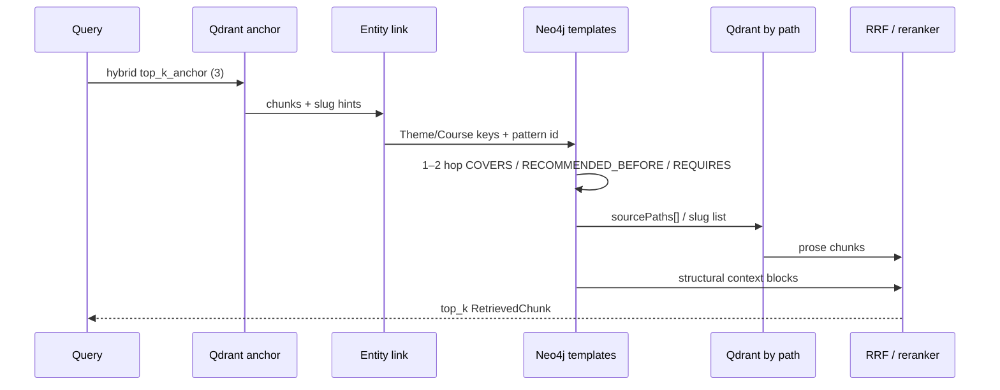
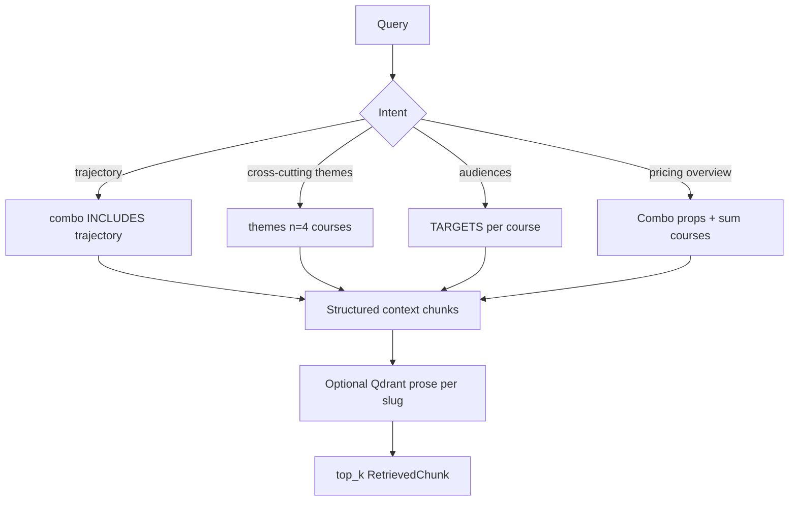

# Task 06: Графовый retrieval и гибрид с реранкером

> **Sprint:** [../../README.md](../../README.md)  
> **Тип:** feat  
> **Ветка:** `feat/graph-06-retrieval-hybrid-rerank`  
> **Spec:** [schema.md](../../schema.md) §2–3, [ADR-0007](../../../../decisions/0007-neo4j-graphrag.md), [analysis.md](../../analysis.md)  
> **Baseline:** [evals/reports/graphrag-baseline.md](../../../../../evals/reports/graphrag-baseline.md)  
> **Статус планирования:** ⛔ ждём «ок» перед реализацией

---

## Цель

Реализовать **graph** и **global** ветки retrieval через абстрактный интерфейс, слить их с Qdrant-hybrid (RRF) и добавить **мультиязычный reranker**; прогнать eval по сегментам и показать рост multi-hop / global относительно baseline **без регрессии single-hop**.

---

## Контекст: текущая реализация

### Что есть сейчас

| Слой | Файл | Поведение |
|------|------|-----------|
| Vector store | `backend/app/rag/vector_store.py` | `VectorIndexStore` Protocol: `qdrant` / `in-memory`; только upsert/search |
| Qdrant hybrid | `backend/app/rag/qdrant_store.py` | dense+sparse prefetch → **внутренний RRF** (Fusion.RRF); `top_k=5`, filter `audience` |
| Search entry | `backend/app/rag/search.py` | `search_knowledge_base()` — embed + hybrid Qdrant; **нет графа, нет reranker** |
| Agent tool | `backend/app/tools/registry.py` | `search_knowledge_base_tool` → единственная точка retrieval |
| Eval config | `backend/app/agent/run_config.py` | `retrieval.backend`: `in-memory` \| `chroma-embedded` \| `qdrant` — **только vector store**, не graph mode |
| Neo4j | `backend/app/graph/client.py` | driver + connectivity; граф проиндексирован (задача 05) |
| Contexts для eval | `evals/scripts/run_experiment.py` | `contexts[]` из результата `search_knowledge_base_tool` → `required_entity_recall_at_5` |

### Пробелы относительно sprint-06

- Нет абстракции «ветка retrieval» (`vector` / `graph` / `global` / `hybrid`).
- `RunConfig.retrieval.backend` не управляет graph/global — только выбор vector store.
- RRF есть **внутри** Qdrant (dense+sparse), но **нет** слияния vector ↔ graph/global.
- Cross-encoder reranker отложен в [ADR-0006](../../../../decisions/0006-hybrid-rag-search.md); sprint-06 добавляет его для русского контента.
- `text2cypher` и agent routing — **задачи 07–08**; в 06 только retrieval-слой + eval-config.

### Baseline: где провалы (flat RAG)

Источник: [graphrag-baseline.md](../../../../../evals/reports/graphrag-baseline.md).

| Сегмент | correctness | entity@5 | faith | Диагноз |
|---------|------------:|---------:|------:|---------|
| single-hop | 0.532 | **0.833** | 0.867 | факты в одном файле — OK |
| multi-hop | **0.458** | **0.552** | 0.581 | ~70% провалов `kb_gap`: цепочки в разных `source_path` |
| global | 0.572 | **0.383** | 0.788 | top-5 не покрывает агрегат каталога; judge может «маскировать» неполный retrieval |

**Репрезентативные провалы (целевые для graph/global):**

| Item | Тип | Суть промаха | Что должна дать ветка |
|------|-----|--------------|------------------------|
| `graphrag-mh-10` | multi-hop | evals RAG (Agents) + evals агентов (Deep) в разных файлах | COVERS + `RECOMMENDED_BEFORE*` → оба slug + темы |
| `graphrag-mh-08` | multi-hop | ReAct (интенсив) + LangGraph (Agents) — неполный 2-hop | `(Course)-[:COVERS]->(Theme)` на двух ступенях |
| `graphrag-gl-04` | global | цена комбо / сумма / скидка — данные в графе, не в одном чанке | `Combo.priceRub`, `sum(c.priceRub)` из Neo4j *(частично пересекается с text2cypher в 07)* |
| `graphrag-gl-01` | global | обзор траектории 4 ступеней | `Combo-[:INCLUDES]->Course` + dims + COVERS aggregate |

**North-star метрика задачи:** `required_entity_recall_at_5` и `answer_correctness` **per segment** (не среднее по всем items). Пороги: [metrics-map.md](../../../../eval/metrics-map.md) §GraphRAG.

---

## Архитектура: абстрактный retriever

### Принципы

1. **Один tool, несколько backend-ов** — `search_knowledge_base_tool` не плодим; режим задаётся config/env, не хардкод в `agent/`.
2. **Dual store boundary** — embeddings только в Qdrant; Neo4j — структура; join по `slug` ↔ `source_path` ([schema.md](../../schema.md) §2).
3. **Template Cypher, не NL→Cypher** в задаче 06 — graph/global используют **фиксированные шаблоны** из schema §3; Text2CypherRetriever — задача 07.
4. **Не использовать** `QdrantNeo4jRetriever` из neo4j-graphrag как black box — нет vector index в Neo4j, mapping chunk→node не 1:1; проще и прозрачнее: anchor (Qdrant) → template Cypher → fetch chunks.

### Модели данных

```python
@dataclass(frozen=True)
class RetrievedChunk:
    text: str
    source_path: str          # Qdrant payload или synthetic "graph://..."
    audience: str
    score: float              # rank score до/после RRF
    backend: str              # vector | graph | global
    metadata: dict[str, Any]  # slug, theme, hop_pattern, graph_row (optional)
```

Расширить или заменить `SearchHit` — только в vector-адаптере; наружу (tool, eval) — `RetrievedChunk`.

### Protocol

```python
class KnowledgeRetriever(Protocol):
    def retrieve(
        self,
        query: str,
        audience: str,
        *,
        top_k: int = 5,
    ) -> list[RetrievedChunk]: ...
```

### Factory

```python
def get_knowledge_retriever(
    settings: Settings,
    *,
    mode: str | None = None,  # override из RunConfig
) -> KnowledgeRetriever: ...
```

**Режимы (`RETRIEVAL_MODE` / `retrieval.mode` в YAML):**

| mode | Реализация | Graph? | Когда |
|------|------------|--------|-------|
| `vector` | `VectorBranchRetriever` | нет | single-hop guard, baseline parity |
| `graph` | `GraphBranchRetriever` | да | multi-hop eval / forced backend |
| `global` | `GlobalBranchRetriever` | да | global eval |
| `hybrid` | `HybridRetriever` | да | RRF(vector, graph∪global) + reranker |

`text2cypher` — **не в factory задачи 06** (заглушка ValueError или omit из Literal).

### Разделение `retrieval.backend` vs `retrieval.mode`

| Поле | Смысл | Значения |
|------|-------|----------|
| `retrieval.backend` (существующее) | **Vector store engine** | `qdrant`, `in-memory` |
| `retrieval.mode` (новое) | **Retrieval strategy** | `vector`, `graph`, `global`, `hybrid` |

Eval YAML и `.env` задают оба; vector store остаётся Qdrant в production.

### Структура пакета

```
backend/app/rag/retriever/
├── __init__.py
├── protocol.py          # RetrievedChunk, KnowledgeRetriever
├── factory.py           # get_knowledge_retriever
├── vector.py            # VectorBranchRetriever (wrap search.py logic)
├── graph.py             # GraphBranchRetriever
├── global_.py           # GlobalBranchRetriever
├── hybrid.py            # HybridRetriever
├── rrf.py               # reciprocal_rank_fusion()
├── reranker.py          # CrossEncoderReranker (optional)
├── entity_link.py       # anchor → Theme/Course slug (rapidfuzz + graph lookup)
└── cypher_templates.py  # parameterized queries from schema §3
```

`search.py` становится thin facade: `get_knowledge_retriever(...).retrieve(...)`.

---

## Graph-ветка

### Pipeline (schema §3.2)



### Шаг 1 — Vector anchor

- `top_k_anchor = 3` (env `GRAPH_RETRIEVAL_ANCHOR_K`) — меньше финального `top_k`, чтобы не забить graph-контекст.
- Тот же Qdrant hybrid + `audience` filter.

### Шаг 2 — Entity linking

- Из anchor-chunks: regex/slug из `source_path` (`programs/{slug}.md`).
- Дополнительно: fuzzy match query → `Theme.canonicalName` / `Course.slug` через `rapidfuzz` (уже в deps) + lookup в Neo4j.
- Fallback: если linking не нашёл узел — **degrade to vector-only** (log WARNING, span metadata).

### Шаг 3 — Template router (heuristic, не LLM)

Паттерны из [schema.md](../../schema.md) §3.2 — **не** полный NLU; keyword/heuristic + metadata item (для eval можно force pattern через env `GRAPH_RETRIEVAL_PATTERN`):

| pattern_id | Триггеры (примеры) | Cypher-шаблон |
|------------|-------------------|---------------|
| `theme_location` | «где изучается», GraphRAG, MCP, hybrid search | `(c)-[:COVERS]->(t)` + optional `REQUIRES*1..2` |
| `next_step` | «следующая ступень», «после Fullstack» | `(fs)-[:RECOMMENDED_BEFORE]->(next)` + theme diff |
| `prerequisite_chain` | «цепочка», «prerequisite», «4 ступени» | `(start)-[:RECOMMENDED_BEFORE*]->(target)` |
| `cross_course_theme` | «в каких курсах», LangGraph + ReAct | multi `(c)-[:COVERS]->(t)` для нескольких Theme |
| `legacy_sku` | aidd-program, legacy | Course `sourcePaths[]` |

Шаблоны — функции в `cypher_templates.py`, параметры `$slug`, `$themeName`, `$comboSlug`.

### Шаг 4 — Graph → Qdrant join

- Собрать `sourcePaths[]` / `{slug}.md` paths с узлов Course/Combo.
- Qdrant: `scroll` или `query` с filter `source_path` MatchAny (batch, limit per path).
- Добавить **synthetic context** — JSON/markdown summary обхода (slug chain, themes) как отдельный `RetrievedChunk` с `source_path="graph://traversal"` — попадает в `entity@5`.

### Лимиты и guardrails

- `GRAPH_RETRIEVAL_MAX_HOPS = 2` (REQUIRES `*1..2`, RECOMMENDED_BEFORE `*..4` для chain-only queries).
- Neo4j: `@observe(name="graph-retrieval")`, timeout 5s, `execute_read`.
- Fail-open: Neo4j down → vector-only + ERROR span (не падать agent run).

### Ожидаемый эффект на провалах

| Item | Механизм |
|------|----------|
| mh-10 | `cross_course_theme` + COVERS evals на Agents + Deep |
| mh-08 | два Theme nodes → два Course slug → chunks обоих program files |
| mh-02 | `theme_location` GraphRAG + REQUIRES → RAG, Vector DB |

---

## Global-ветка

### Pipeline (schema §3.3)

Без Leiden / community summaries — **структурный агрегат** от `Combo`:



### Template intents

| intent | Cypher (schema §3.3) | Eval items |
|--------|----------------------|------------|
| `combo_trajectory` | G1 — INCLUDES + dims + COVERS | gl-01 |
| `cross_cutting_themes` | G2 — themes on all 4 courses | gl-02 |
| `audience_matrix` | G3 — TARGETS | gl-03 |
| `combo_pricing` | Combo props + `sum(c.priceRub)` | gl-04 *(числа из графа; text2cypher — 07)* |
| `production_topics` | ad-hoc COVERS filter | gl-05, gl-06 |

**Combo slug default:** `ai-agents-combo` (`GRAPH_RETRIEVAL_COMBO_SLUG`).

### Формат контекста

Каждый aggregate row → `RetrievedChunk`:

```text
[graph:combo_trajectory] Ступень 3: ai-coding-agents-base | 11 занятий | themes: RAG, LangGraph, ...
```

`required_entities` (`ai-coding-agents-base`, `59 990`, …) должны попадать в top-5 **буквально** в text.

### Optional prose enrichment

- После aggregate: fetch по 1–2 Qdrant chunks на slug (intro sections) — **низкий rank**, не dilute aggregate.
- В `global` mode prose optional; в `hybrid` — участвует в RRF.

---

## Hybrid: схема RRF

### Два уровня RRF

| Уровень | Где | Что сливает |
|---------|-----|-------------|
| L1 | Qdrant `Fusion.RRF` | dense + sparse (уже есть) |
| L2 | Python `rrf.py` | lists: **vector**, **graph**, **global** |

### Алгоритм L2

```python
def reciprocal_rank_fusion(
    ranked_lists: dict[str, list[RetrievedChunk]],
    *,
    k: int = 60,
    weights: dict[str, float] | None = None,
) -> list[RetrievedChunk]:
    # score(d) = sum_w weight * 1/(k + rank_w(d))
    # dedupe key: (source_path, text[:200])
```

**Default weights (hybrid mode):**

| List | weight | Обоснование |
|------|--------|-------------|
| `vector` | 1.0 | baseline recall |
| `graph` | 1.2 | boost multi-hop entities |
| `global` | 1.2 | boost aggregate |

Weights — env `RRF_WEIGHT_VECTOR`, `RRF_WEIGHT_GRAPH`, `RRF_WEIGHT_GLOBAL` или YAML.

### Candidate pool → reranker

1. RRF → top `RERANKER_CANDIDATE_K` (default **15**).
2. Reranker → final `top_k` (**5**).
3. Если `RERANKER_ENABLED=false` — вернуть top_k после RRF (eval ablation).

### Dedup правила

- Одинаковый `chunk_id` / `source_path+offset` — оставить max RRF score.
- Synthetic graph rows (`graph://…`) **не** dedupe с Qdrant chunks.

---

## Reranker (мультиязычный)

### Выбор модели

| Вариант | Плюсы | Минусы | Вердикт |
|---------|-------|--------|---------|
| **A. `BAAI/bge-reranker-v2-m3`** (sentence-transformers) | multilingual, local, русский OK | +latency ~100–300ms на 15 pairs CPU | ✅ **default** |
| B. Cohere Rerank API | quality | external API, cost | fallback env |
| C. OpenRouter cross-encoder | единый ключ | нет стандартного rerank endpoint | ❌ |

**Решение:** локальный cross-encoder **`BAAI/bge-reranker-v2-m3`** через `sentence-transformers` CrossEncoder; lazy load на первый вызов.

### Env / Settings

```dotenv
RERANKER_ENABLED=true
RERANKER_MODEL=BAAI/bge-reranker-v2-m3
RERANKER_CANDIDATE_K=15
RERANKER_TOP_K=5          # финальный top_k для tool
RRF_K=60
```

### Langfuse

- Span `reranker`: input `{candidate_count, model}`, output `{top_sources[], scores[]}`.

### Риск latency

- Кэш reranker model singleton; batch predict; на ~300 chunks corpus — acceptable для eval.
- `make test-backend` — mock CrossEncoder, без download weights.

---

## Интеграция с eval и backend

### Расширение RunConfig

```yaml
retrieval:
  backend: qdrant          # vector store (как сейчас)
  mode: hybrid             # NEW: vector | graph | global | hybrid
  top_k: 5
  graph:
    anchor_k: 3
    max_hops: 2
    combo_slug: ai-agents-combo
  hybrid:
    rrf_k: 60
    weights: { vector: 1.0, graph: 1.2, global: 1.2 }
  reranker:
    enabled: true
    model: BAAI/bge-reranker-v2-m3
    candidate_k: 15
```

Pydantic: `RetrievalSection` + nested `GraphRetrievalSection`, `HybridSection`, `RerankerSection`.

### Прокидывание config в runtime

1. `ReactAgentRunner` / `get_settings()` читает `RunConfig` по `config_id`.
2. Новое поле `Settings.retrieval_mode` — из env default; **override** из RunConfig при eval run (thread-local или runner field).
3. `search_knowledge_base()` использует mode из runner context.

**DoD sprint §4:** смена `retrieval.mode` в YAML **без** правок `tools/registry.py` и `agent/`.

### Eval configs (новые файлы)

| Config | `retrieval.mode` | Назначение |
|--------|------------------|------------|
| `evals/configs/graphrag-baseline.yaml` | `vector` | уже есть (контроль) |
| `evals/configs/graphrag-graph.yaml` | `graph` | multi-hop segment run |
| `evals/configs/graphrag-global.yaml` | `global` | global segment run |
| `evals/configs/graphrag-hybrid.yaml` | `hybrid` | **основной** compare vs baseline (all segments) |

Общие блоки: тот же `agent`, `judge`, `prompt`, `datasets`; diff только `retrieval` + comment.

### Прогоны и отчёт

```bash
# per-segment (WSL)
make eval-experiment CONFIG=evals/configs/graphrag-hybrid.yaml DATASET=all
uv run python evals/scripts/build_graphrag_baseline_report.py \
  --configs graphrag-baseline,graphrag-hybrid \
  --output evals/reports/graphrag-hybrid.md
```

Расширить `build_graphrag_baseline_report.py`: строка **`graph_hybrid`** в таблице [graphrag-baseline.md](../../../../../evals/reports/graphrag-baseline.md).

### Критерии приёмки eval (из metrics-map)

| Сегмент | vs baseline |
|---------|-------------|
| multi-hop | `answer_correctness` ↑, `required_entity_recall_at_5` ↑ |
| global | `required_entity_recall_at_5` ↑ (priority), correctness ↑ |
| single-hop | correctness ≥ **0.532 − 0.02 = 0.512**; entity@5 ≥ 0.833 − 0.02 |

### Contexts для метрик

Tool response JSON — массив chunks с полем `text` (как сейчас); eval `extract_contexts_from_tool_result` без изменений, если сохранить формат.

Добавить в span/tool metadata: `retrieval_mode`, `graph_pattern`, `rrf_sources`.

---

## Состав работ

- [ ] **Protocol + factory:** `RetrievedChunk`, `KnowledgeRetriever`, `get_knowledge_retriever`, расширить `RunConfig` / `Settings`
- [ ] **Vector branch:** вынести текущий Qdrant path в `VectorBranchRetriever` (parity с baseline)
- [ ] **Graph branch:** entity_link + cypher_templates + Qdrant join + Langfuse span
- [ ] **Global branch:** combo aggregate templates + structured chunks
- [ ] **RRF L2:** `rrf.py`, `HybridRetriever`
- [ ] **Reranker:** `reranker.py`, env, lazy model load, mock in tests
- [ ] **Wire:** `search.py` → retriever factory; runner config override
- [ ] **Eval:** `graphrag-graph.yaml`, `graphrag-global.yaml`, `graphrag-hybrid.yaml`; update report script
- [ ] **Tests:** unit (RRF, dedupe, template params), integration (Neo4j mock / testcontainers optional), graph item smoke
- [ ] **`.env.example`:** `RETRIEVAL_MODE`, `GRAPH_RETRIEVAL_*`, `RERANKER_*`, `RRF_*`
- [ ] **Make:** `eval-graphrag-hybrid` target (+ `make.ps1`)
- [ ] Прогон hybrid eval + заполнить строку `graph_hybrid` в baseline report
- [ ] Самопроверка по DoD
- [ ] (после «ок») `summary.md`, обновить sprint README (ссылка plan)

---

## Критерии готовности (DoD)

**Агент проверяет:**

| # | Критерий | Способ проверки |
|---|----------|-----------------|
| 1 | `retrieval.mode` переключается YAML/env без правок agent/tools | Diff review + swap config run |
| 2 | Graph mode: multi-hop item возвращает связанные slug/тhemes в contexts | pytest `test_graph_retriever_mh02` + manual mh-08 |
| 3 | Global mode: aggregate combo в contexts без vector-only | pytest global template + gl-01 smoke |
| 4 | Hybrid: RRF L2 + reranker в config | `graphrag-hybrid.yaml` review + span metadata |
| 5 | Eval: multi/global метрики ≥ baseline | `graphrag-hybrid.md` segment table |
| 6 | Single-hop: нет регрессии > 0.02 | segment `graphrag/single-hop` in hybrid run |
| 7 | `make test-backend` green | CI |
| 8 | Neo4j fail-open → vector fallback | unit test mock driver error |

**Пользователь проверяет:**

- 2–3 ручных multi-hop: в contexts видны нужные курсы/цепочки
- 1 global: структура комбо согласована с Neo4j Browser
- Langfuse traces: spans `graph-retrieval` / `global-retrieval` / `reranker`

---

## Артефакты

| Путь | Назначение |
|------|------------|
| `backend/app/rag/retriever/*.py` | Protocol, branches, RRF, reranker |
| `backend/app/rag/search.py` | Facade через factory |
| `backend/app/agent/run_config.py` | `retrieval.mode`, nested sections |
| `backend/app/config.py` | Env defaults |
| `backend/tests/test_retriever_*.py` | Unit/integration |
| `evals/configs/graphrag-hybrid.yaml` | Основной eval config |
| `evals/configs/graphrag-graph.yaml` | Graph-only ablation |
| `evals/configs/graphrag-global.yaml` | Global-only ablation |
| `evals/reports/graphrag-hybrid.md` | Segment compare vs baseline |
| `.env.example` | Новые переменные |
| `Makefile` / `make.ps1` | `eval-graphrag-hybrid` |

---

## Scope

**Трогаем:** файлы из таблицы «Артефакты», `evals/scripts/build_graphrag_baseline_report.py` (minimal).

**НЕ трогаем:**

- Agent routing / system prompt rules (задача 08)
- `text2cypher` tool и guardrails (задача 07)
- Graph indexing pipeline (задача 05 — только read)
- Embeddings / Qdrant schema
- Community detection / Leiden
- `langchain-experimental` LLMGraphTransformer

---

## Риски и допущения

| Риск | Митигация |
|------|-----------|
| Heuristic template router промахивается по intent | env force pattern для eval; лог pattern_id; hybrid weight boost graph |
| Reranker latency | candidate_k=15; optional disable; CPU batch |
| Регрессия single-hop в hybrid | weight vector=1.0; eval guard segment; routing в 08 не вызывает graph на single |
| gl-04 частично text2cypher domain | global template `combo_pricing` отдаёт числа из Neo4j props; полный COUNT — задача 07 |
| `bge-reranker-v2-m3` download в CI | mock in unit tests; opt-in integration |
| Windows Neo4j Bolt | reuse `resolve_neo4j_uri` WSL fallback из `graph/client.py` |

**Допущения:**

- Граф задачи 05 актуален (`make graph-index --full`, `graph-qa` 12/12).
- Eval прогон с поднятыми Qdrant + Neo4j + indexed RAG.
- Agent routing **не** нужен для замера задачи 06 — достаточно forced `retrieval.mode` per config.

---

## Открытые вопросы

- [ ] **Путь задачи:** README ссылается `tasks/06-graph-retrieval-hybrid/`; план сохранён в `tasks/06-graph-retrieval/` — унифицировать при апруве?
- [ ] **Reranker model:** подтвердить `BAAI/bge-reranker-v2-m3` vs lighter `ms-marco-MiniLM` (хуже для русского)?
- [ ] **Hybrid eval:** один config `graphrag-hybrid` на all segments vs отдельные graph/global configs для ablation — нужны оба?
- [ ] **gl-04 в scope global template:** достаточно свойств Combo из seed или обязательно ждать text2cypher (07)?

---

## Skills

- [neo4j-graphrag-skill](../../../../.agents/skills/neo4j-graphrag-skill/SKILL.md) — retriever selection, **не** VectorCypherRetriever (no Neo4j vectors); external Qdrant pattern
- [neo4j-cypher-skill](../../../../.agents/skills/neo4j-cypher-skill/SKILL.md) — шаблоны Cypher 25, EXPLAIN для отладки
- [neo4j-driver-python-skill](../../../../.agents/skills/neo4j-driver-python-skill/SKILL.md) — `execute_read`, timeouts
- [python-testing-patterns](../../../../.agents/skills/python-testing-patterns/SKILL.md) — mock driver, protocol tests
- [eval-methodology](../../../../.methodology/eval/eval-methodology.md) — segment compare
