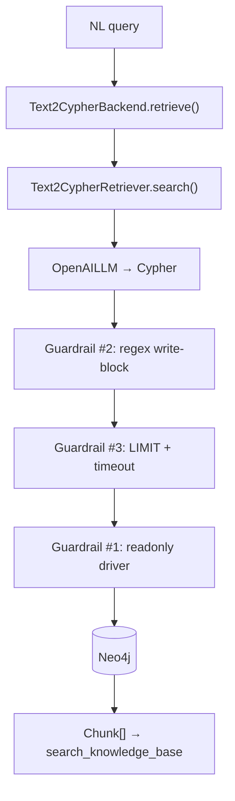

# Task 07: Text2Cypher с guardrails

> **Sprint:** [../../README.md](../../README.md)  
> **Тип:** feat  
> **Ветка:** `feat/graph-07-text2cypher-guardrails`  
> **Spec:** [schema.md](../../schema.md) §1–3.4, [ADR-0007](../../../../decisions/0007-neo4j-graphrag.md), [ADR-0008](../../../../decisions/0008-neo4j-docker-infra.md)  
> **Зависимости:** задачи 04 (Neo4j infra + readonly user), 05 (seed), 06 (`Text2CypherBackend` stub)  
> **Статус:** ✅ Done (summary: [summary.md](./summary.md))

---

## Цель

Реализовать **NL→Cypher** retrieval через `Text2CypherRetriever` (neo4j-graphrag) с **четырьмя guardrails**, enhanced schema и few-shot примерами из [schema.md](../../schema.md); заменить stub `Text2CypherBackend` — чтобы агрегатные вопросы (цены комбо, COUNT/SUM) возвращали точные данные из графа, а write-запросы блокировались **до** выполнения.

---

## Контекст: что есть и что не работает

### Текущее состояние

| Компонент | Файл | Поведение |
|-----------|------|-----------|
| Retriever stub | `backend/app/rag/retriever/text2cypher_backend.py` | **fallback на vector** — pricing (`gl-04`) не закрывается |
| Global backend | `backend/app/rag/retriever/global_backend.py` | pricing keywords → vector fallback с log «deferred to task 07» |
| Factory | `backend/app/rag/retriever/factory.py` | `text2cypher` → `Text2CypherBackend` |
| Neo4j driver | `backend/app/graph/client.py` | admin credentials (`NEO4J_USER`); readonly env есть, но не используется |
| Readonly user | `devops/neo4j/create-readonly-user.sh` | user `text2cypher` создан; Community = credential isolation, RBAC — Enterprise |
| Agent tools | `backend/app/tools/registry.py` | **нет** text2cypher tool (маршрутизация — задача 08) |
| SDK | `neo4j-graphrag==1.17.0` | `Text2CypherRetriever` + built-in EXPLAIN guard (v1.16+) |

### Целевой eval-item

| Item | Вопрос | Почему text2cypher |
|------|--------|-------------------|
| `graphrag-gl-04` | цена комбо, сумма по отдельности, % скидки | данные в `Combo.priceRub` + `sum(Course.priceRub)` — не в одном Qdrant-чанке; baseline correctness **0.077**, entity@5 **0.000** |

Эталонный Cypher — [schema.md](../../schema.md) §3.4 (Eval G4).

### Выбор реализации

| Вариант | Решение |
|---------|---------|
| `Text2CypherRetriever` (neo4j-graphrag) | ✅ **основной** — уже в deps, ADR-0007, паттерн OpenAILLM из `theme_extractor.py` |
| `GraphCypherQAChain` (langchain-neo4j) | ❌ не добавляем вторую зависимость без необходимости |

**Не в scope задачи 07:** agent routing (задача 08), регистрация tool в `get_agent_tools()`, финальный e2e eval — только backend + guardrails + smoke.

---

## Архитектура



### Структура пакета

```
backend/app/rag/text2cypher/
├── __init__.py
├── guardrails.py          # validate_cypher(), enforce_limit(), CypherGuardError
├── schema_enhanced.json   # trimmed LPG schema для промпта
├── examples.py            # few-shot Q/A строки (источник: schema.md §3.3–3.4)
└── executor.py            # guarded execute + driver lifecycle

backend/app/rag/retriever/
└── text2cypher_backend.py # Text2CypherBackend — оркестрация

backend/app/graph/
└── client.py              # + get_text2cypher_driver()

backend/scripts/
└── text2cypher_smoke.py   # ручной/smoke прогон gl-04 и соседних кейсов
```

`Text2CypherBackend` реализует `RetrieverBackend.retrieve()` — совместимость с eval (`RETRIEVER_BACKEND=text2cypher`) без изменений в `search.py`.

---

## Guardrail 1: Read-only роль БД

### Назначение

Runtime text2cypher **никогда** не использует admin-пароль seed (`NEO4J_USER` / `NEO4J_PASSWORD`).

### Реализация

| Шаг | Деталь |
|-----|--------|
| Отдельный driver | `get_text2cypher_driver(settings)` в `client.py` — кэш по `(uri, readonly_user, readonly_password)` |
| Credentials | `NEO4J_READONLY_USER`, `NEO4J_READONLY_PASSWORD` из [`.env.example`](../../../../../.env.example) |
| Fail fast | при `RETRIEVER_BACKEND=text2cypher` и пустом `NEO4J_READONLY_PASSWORD` — `ValueError` на старте backend (не в момент первого запроса агента) |
| Routing | `driver.execute_query(..., routing_=RoutingControl.READ)` |
| Community vs Enterprise | Community: изоляция credentials ([devops/README.md](../../../../../devops/README.md)); Enterprise/Aura: дополнительно RBAC из `init-readonly-enterprise.cypher` блокирует write на уровне БД |

### Проверка (DoD)

| Уровень | Способ |
|---------|--------|
| Unit | mock driver создаётся с readonly user/password, не admin |
| Manual (Enterprise) | `CREATE (n:Test)` под `text2cypher` → ошибка доступа |
| Manual (Community) | документировать: guardrail #1 = отдельный user; write блокирует #2 |

---

## Guardrail 2: Regex-фильтр write-операций

### Назначение

Блокировать деструктивный/мутирующий Cypher **до** отправки в Neo4j — defense in depth поверх EXPLAIN-guard neo4j-graphrag.

### Реализация

**Модуль:** `guardrails.validate_cypher(query: str) -> str` — возвращает sanitized query или raises `CypherGuardError`.

**Блокируемые паттерны** (case-insensitive, word boundary, после strip комментариев `//` и `/* */`):

| Категория | Ключевые слова / паттерны |
|-----------|---------------------------|
| DDL | `CREATE`, `DROP`, `ALTER` |
| DML write | `MERGE`, `DELETE`, `DETACH DELETE`, `SET`, `REMOVE` |
| Admin | `LOAD CSV`, `CALL dbms.`, `CALL apoc.periodic.iterate`, `FOREACH` с мутацией |
| Procedure writes | `CALL { ... CREATE/MERGE/SET ... }` (subquery writes) |

**Разрешено:** `MATCH`, `OPTIONAL MATCH`, `WITH`, `UNWIND`, `RETURN`, `ORDER BY`, `LIMIT`, `SKIP`, `CALL` read-only (`db.schema`, `apoc.meta`), агрегаты `count()`, `sum()`, `collect()`, `round()`.

**Порядок проверок:**

1. LLM генерирует Cypher (`Text2CypherRetriever` — встроенный EXPLAIN guard).
2. **Наш** `validate_cypher()` — regex + denylist.
3. Только read-only driver выполняет запрос.

**Логирование:** при блокировке — `WARNING` с `reason=write_blocked`, **без** полного текста провокационного запроса в INFO (только hash/prefix для debug).

### Тест-кейсы (обязательные)

```python
# BLOCK
"CREATE (n:Test) RETURN n"
"MERGE (c:Course {slug:'x'}) SET c.priceRub = 0 RETURN c"
"MATCH (n) DELETE n"
"MATCH (n) DETACH DELETE n"
"DROP INDEX combo_slug IF EXISTS"
"// comment\nCREATE (n:Test) RETURN n"

# ALLOW
"MATCH (combo:Combo {slug: 'ai-agents-combo'}) RETURN combo.priceRub LIMIT 1"
"MATCH (c:Course) RETURN count(c) AS n LIMIT 1"
```

---

## Guardrail 3: Таймауты и обязательный LIMIT

### Назначение

Ограничить blast radius: долгие full-scan и unbounded result sets не допускаются.

### Реализация

| Параметр | Env | Default | Поведение |
|----------|-----|---------|-----------|
| Query timeout | `TEXT2CYPHER_QUERY_TIMEOUT_SEC` | `10` | `driver.execute_query` + session `transaction_timeout` (ms) |
| Max LIMIT | `TEXT2CYPHER_MAX_LIMIT` | `50` | если LIMIT > max → reject; если LIMIT отсутствует → append `LIMIT {default_limit}` |
| Default LIMIT | `TEXT2CYPHER_DEFAULT_LIMIT` | `20` | inject при отсутствии |
| LLM timeout | reuse `LLM_TIMEOUT_SEC` | `60` | OpenAILLM / retriever wrapper |

**LIMIT injection:** парсинг последнего top-level `RETURN` (regex достаточно для MVP; не поддерживаем nested UNION в inject — такие запросы reject с понятной ошибкой).

**Агрегаты без LIMIT:** для `RETURN count()` / `RETURN sum()` без LIMIT — inject `LIMIT 1` (одна строка результата).

### Проверка

| Тест | Ожидание |
|------|----------|
| `MATCH (n) RETURN n` без LIMIT | после guard → `... LIMIT 20` |
| `... LIMIT 500` | `CypherGuardError` |
| Mock slow query | timeout → `ProviderUnavailableError` / graceful empty + log |

---

## Guardrail 4: Узкое описание инструмента

### Назначение

LLM и агент не должны воспринимать text2cypher как «произвольный Cypher» или замену vector/graph retrieval.

### Реализация (два слоя)

#### A. Custom prompt / schema для Text2CypherRetriever

**Enhanced schema** (`schema_enhanced.json`) — компактное описание LPG из [schema.md](../../schema.md) §1.2:

```json
{
  "nodes": {
    "Combo": {"key": "slug", "props": ["name", "priceRub", "sumSeparateRub", "discountPct"]},
    "Course": {"key": "slug", "props": ["stepOrder", "priceRub", "lessonCount"]},
    "Theme": {"key": "canonicalName", "props": ["name", "aliases"]},
    "Module": {"key": ["courseSlug", "moduleNumber"], "props": ["title"]},
    "Audience": {"key": "slug", "props": ["name"]},
    "Format": {"key": "slug", "props": ["name"]},
    "Level": {"key": "slug", "props": ["name"]}
  },
  "relationships": [
    {"type": "INCLUDES", "from": "Combo", "to": "Course", "props": ["order"]},
    {"type": "RECOMMENDED_BEFORE", "from": "Course", "to": "Course", "props": ["order"]},
    {"type": "HAS_MODULE", "from": "Course", "to": "Module"},
    {"type": "COVERS", "from": ["Course", "Module"], "to": "Theme"},
    {"type": "REQUIRES", "from": "Theme", "to": "Theme", "props": ["strength"]},
    {"type": "TARGETS", "from": "Course", "to": "Audience"},
    {"type": "HAS_FORMAT", "from": "Course", "to": "Format"},
    {"type": "HAS_LEVEL", "from": "Course", "to": "Level"}
  ],
  "forbidden": ["Entity", "RELATED_TO", "HAS"],
  "canonical": {
    "comboSlug": "ai-agents-combo",
    "courses": ["ai-coding-intensive-cursor", "ai-driven-fullstack", "ai-coding-agents-base", "deep-agents-advanced"]
  },
  "rules": [
    "READ-ONLY: only MATCH/RETURN aggregates",
    "Directions fixed: RECOMMENDED_BEFORE from early to late course",
    "Prices in priceRub (integer, RUB)"
  ]
}
```

Передаётся в `Text2CypherRetriever(neo4j_schema=...)` как **строка** (JSON compact или rendered text) — не auto-fetch полной DB schema (меньше токенов, меньше hallucination labels).

#### B. Few-shot примеры (`examples.py`)

Формат neo4j-graphrag: `"Q: {ru question} A: {cypher}"`.

| # | Источник | Вопрос (RU) | Паттерн |
|---|----------|-------------|---------|
| 1 | schema §3.4 G4 | Сколько стоит комбо «ИИ-агенты», сумма по отдельности и процент скидки? | Combo + INCLUDES + sum + discount |
| 2 | schema §3.3 G2 | Какие темы проходят во всех 4 ступенях комбо? | COUNT DISTINCT courses per Theme, `WHERE n = 4` |
| 3 | schema §3.3 G3 | Какие аудитории у каждого курса комбо? | Combo→Course→TARGETS→Audience |
| 4 | synthetic | Сколько курсов входит в комбо ai-agents-combo? | `count(c)` |
| 5 | synthetic | Какова сумма lessonCount по всем курсам комбо? | `sum(c.lessonCount)` |

Пример #1 — эталон для `gl-04`:

```cypher
MATCH (combo:Combo {slug: 'ai-agents-combo'})
MATCH (combo)-[:INCLUDES]->(c:Course)
WITH combo, sum(c.priceRub) AS sumParts
RETURN combo.priceRub AS comboPrice, sumParts,
       round(100.0 * (1 - toFloat(combo.priceRub) / sumParts), 1) AS discountPct
LIMIT 1
```

#### C. Tool description (заготовка для задачи 08)

Файл `backend/app/tools/text2cypher_tool.py` — **создать**, но **не регистрировать** в `get_agent_tools()` (задача 08).

```python
@tool
def query_catalog_aggregate(question: str) -> str:
    """Query course catalog STRUCTURAL NUMBERS only: prices, counts, sums, discounts.
    Use ONLY for aggregate questions (how much, how many, total, discount percent).
    Do NOT use for: course content, prerequisites paths, theme descriptions, FAQ.
    Returns JSON rows from Neo4j read-only query."""
```

Guardrail #4 проверяется code review: description ≤ 3 предложения, явный negative scope.

---

## Text2CypherBackend: поведение retrieve()

```python
def retrieve(self, query: str, segment: str, *, top_k: int = 5) -> list[Chunk]:
```

| Шаг | Действие |
|-----|----------|
| 1 | `Text2CypherRetriever.search(query_text=query)` |
| 2 | Guardrails на сгенерированном Cypher |
| 3 | Execute через readonly driver |
| 4 | Сериализация rows → `Chunk(text=json.dumps(rows), source="graph://text2cypher", backend="text2cypher", metadata={"cypher": sanitized, "row_count": n})` |
| 5 | Ошибка guard / timeout → **пустой список** + WARNING (не fallback на vector — иначе маскируем блокировку) |
| 6 | LLM/Cypher generation failure → empty + log |

**Формат Chunk:** один chunk с JSON-массивом записей (как global backend) — eval `required_entity_recall` матчит slug/числа в `text`.

**Langfuse:** `@observe(name="text2cypher-retrieval")` — span с sanitized cypher (без secrets).

---

## Enhanced schema + few-shot: связь со schema.md

| schema.md | Использование в задаче 07 |
|-----------|---------------------------|
| §1.2 Allowed nodes/rels | `schema_enhanced.json` |
| §2 Boundary rule | prompt rule: «не искать descriptions/FAQ — только props графа» |
| §3.3 Global queries G2, G3 | few-shot #2, #3 |
| §3.4 Text2cypher G4 | few-shot #1, smoke gl-04 |
| §4 Constraints | не в prompt (DDL irrelevant для read queries) |

---

## Стратегия тестирования

### 1. Unit — guardrails (обязательно, без Neo4j)

**Файл:** `backend/tests/test_text2cypher_guardrails.py`

| Группа | Cases | Mock |
|--------|-------|------|
| Write block | ≥12 провокаций (CREATE, MERGE, DELETE, SET, DROP, comment-trick) | driver **не вызывается** |
| Read allow | ≥5 valid MATCH/RETURN | pass validate |
| LIMIT inject | no LIMIT → default; LIMIT 500 → error | — |
| Sanitize | strip comments before regex | — |

Запуск: `make test-backend` / `pytest backend/tests/test_text2cypher_guardrails.py -v`

### 2. Unit — backend (mock retriever)

**Файл:** `backend/tests/test_text2cypher_backend.py`

- Mock `Text2CypherRetriever.search` → проверка mapping в `Chunk`
- Mock guard raise → empty list, no vector fallback
- Factory: `RETRIEVER_BACKEND=text2cypher` → не `VectorBackend`

### 3. Integration — Neo4j (optional marker `@pytest.mark.neo4j`)

**Условие:** `make graph-up` + `make graph-index --full`

| Test | Query | Assert |
|------|-------|--------|
| gl-04 NL | «Сколько стоит комбо…» | rows contain `comboPrice=59990`, `sumParts=139960` (± discount) |
| COUNT combo | «Сколько курсов в комбо ai-agents-combo?» | count = 4 |
| Write block e2e | force malicious Cypher through executor | `CypherGuardError` |

Skip если `NEO4J_READONLY_PASSWORD` не задан.

### 4. Smoke script

**Файл:** `backend/scripts/text2cypher_smoke.py`

```bash
make text2cypher-smoke   # новая make-цель
# или
uv run python backend/scripts/text2cypher_smoke.py
```

Вывод: таблица question → cypher (sanitized) → row_count → PASS/FAIL для 4 кейсов из few-shot.

### 5. Eval subset (ручной / опциональный)

Не блокирует DoD задачи 07, но рекомендуется перед задачей 08:

```yaml
# evals/configs/graphrag-text2cypher-smoke.yaml (опционально)
retriever:
  backend: text2cypher
dataset: graphrag-gl-04  # single item или global subset
```

Ожидание: `required_entity_recall@5` > 0 для `59 990`, `139 960`, `ai-agents-combo`.

### 6. Manual checklist (пользователь)

| # | Действие | Ожидание |
|---|----------|----------|
| 1 | `RETRIEVER_BACKEND=text2cypher` + gl-04 question через API/search | chunk с pricing JSON |
| 2 | Провокация «DELETE all courses» | отказ, пустой/ error result |
| 3 | Langfuse trace | span `text2cypher-retrieval`, cypher без пароля |

---

## Состав работ

- [ ] `schema_enhanced.json` + `examples.py` из schema.md §3.3–3.4
- [ ] `guardrails.py`: validate_cypher, enforce_limit, CypherGuardError
- [ ] `get_text2cypher_driver()` + config `TEXT2CYPHER_*`
- [ ] `executor.py`: guarded pipeline (retriever → validate → execute)
- [ ] Заменить stub в `text2cypher_backend.py`
- [ ] `text2cypher_tool.py` (thin wrapper, **без** registry — задача 08)
- [ ] `test_text2cypher_guardrails.py` (+ optional backend/neo4j tests)
- [ ] `text2cypher_smoke.py` + make-цель (+ `make.ps1` mirror)
- [ ] `.env.example`: `TEXT2CYPHER_QUERY_TIMEOUT_SEC`, `TEXT2CYPHER_MAX_LIMIT`, `TEXT2CYPHER_DEFAULT_LIMIT`
- [ ] Убрать pricing vector-fallback deferral в `global_backend.py` **не делаем** — routing pricing→text2cypher в задаче 08
- [ ] Самопроверка по DoD
- [ ] (после «ок» пользователя) `summary.md`, обновить sprint README.md

---

## Критерии готовности (DoD)

| # | Критерий | Способ проверки |
|---|----------|-----------------|
| 1 | Write Cypher блокируется **до** execute | `pytest backend/tests/test_text2cypher_guardrails.py` |
| 2 | Readonly credentials: text2cypher driver ≠ admin | unit test + code review `client.py` |
| 3 | Valid COUNT/pricing query возвращает rows | `make text2cypher-smoke` (Neo4j up) |
| 4 | Tool description — узкий scope (aggregates only) | review `text2cypher_tool.py` docstring |
| 5 | `make test-backend` green | CI / local |
| 6 | Enhanced schema + ≥5 few-shot в retriever config | review `schema_enhanced.json`, `examples.py` |

> Sprint DoD #5 (write-block test green) закрывается критерием #1.

---

## Артефакты

| Путь | Назначение |
|------|------------|
| `backend/app/rag/text2cypher/guardrails.py` | Guardrails #2, #3 |
| `backend/app/rag/text2cypher/schema_enhanced.json` | Enhanced schema для промпта |
| `backend/app/rag/text2cypher/examples.py` | Few-shot Q/A |
| `backend/app/rag/text2cypher/executor.py` | Guarded Text2Cypher execution |
| `backend/app/rag/retriever/text2cypher_backend.py` | RetrieverBackend impl |
| `backend/app/graph/client.py` | `get_text2cypher_driver()` |
| `backend/app/config.py` | `TEXT2CYPHER_*` settings |
| `backend/app/tools/text2cypher_tool.py` | Tool stub для задачи 08 |
| `backend/tests/test_text2cypher_guardrails.py` | Write-block + LIMIT tests |
| `backend/tests/test_text2cypher_backend.py` | Backend unit tests |
| `backend/scripts/text2cypher_smoke.py` | Smoke gl-04 + counts |
| `Makefile` / `make.ps1` | `text2cypher-smoke` |
| `.env.example` | новые env vars |

---

## Scope

**Трогаем:** файлы из таблицы «Артефакты».

**НЕ трогаем:**
- `backend/app/tools/registry.py` — регистрация tool (задача 08)
- system prompt / routing rules (задача 08)
- `hybrid_backend.py` — не смешиваем text2cypher в RRF в этой задаче
- eval-config `graphrag-final.yaml` (задача 08)
- Qdrant / vector index / graph indexing pipeline

---

## Риски и допущения

| Риск | Митигация |
|------|-----------|
| LLM генерирует невалидный Cypher | few-shot + enhanced schema; smoke на gl-04 |
| Community Neo4j — write не блокируется на DB | guardrails #2+#3 обязательны; readonly user = credential isolation |
| Regex bypass (unicode, nested quotes) | denylist + neo4j-graphrag EXPLAIN guard; integration test write block |
| LIMIT injection ломает сложный Cypher | MVP: reject UNION/subquery без простого LIMIT; few-shot только простые паттерны |
| Расхождение цен 134960 vs 139960 в корпусе | graph seed канон 139960 ([schema.md](../../schema.md) §2); prompt note: `sum(c.priceRub)` = факт SKU |
| gl-04 correctness зависит от generation LLM | задача 07 — retrieval layer; полный agent eval — задача 08 |

---

## Открытые вопросы

- [ ] **Модель для text2cypher:** reuse `GRAPH_EXTRACT_MODEL` или отдельный `TEXT2CYPHER_MODEL`? *Рекомендация:* отдельный env с default `openai/gpt-4o-mini`, temperature=0.
- [ ] **Integration tests в CI:** включать `@pytest.mark.neo4j` в `make test-backend` или только smoke manual? *Рекомендация:* unit always; neo4j marker skip by default.
- [ ] **Путь задачи:** README ссылается на `tasks/07-text2cypher-tool/`; план в `tasks/07-text2cypher/` — при реализации синхронизировать ссылку в README.

---

## Примеры для ручной проверки (demo)

| # | Вопрос (RU) | Ожидаемый паттерн |
|---|-------------|-------------------|
| 1 | Сколько стоит комбо «ИИ-агенты» и какая скидка? | Combo priceRub + sum Course |
| 2 | Сколько курсов входит в комбо ai-agents-combo? | count = 4 |
| 3 | Какая сумма lessonCount всех ступеней? | sum(lessonCount) |
| 4 | DELETE все курсы | **blocked** |
| 5 | CREATE (n:Hack) RETURN n | **blocked** |
