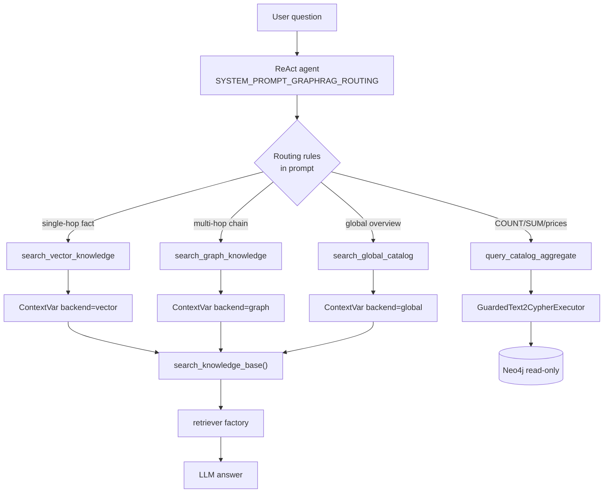

# Task 08: Агентная маршрутизация и сегментный замер

> **Sprint:** [../../README.md](../../README.md)  
> **Тип:** feat  
> **Ветка:** `feat/graph-08-agent-routing`  
> **Spec:** [schema.md](../../schema.md) §3, [analysis.md](../../analysis.md), [ADR-0007](../../../../decisions/0007-neo4j-graphrag.md)  
> **Baseline:** [evals/reports/graphrag-baseline.md](../../../../../evals/reports/graphrag-baseline.md)  
> **Промежуточный eval:** [evals/reports/graphrag-v001-20260703-itog.md](../../../../../evals/reports/graphrag-v001-20260703-itog.md)  
> **Зависимости:** задачи 06 (retriever-ветки), 07 (`query_catalog_aggregate` + guardrails)  
> **Статус планирования:** ⛔ ждём «ок» перед реализацией

---

## Цель

Зарегистрировать у ReAct-агента **четыре retrieval-инструмента** (vector / graph / global / text2cypher), добавить **правила маршрутизации** в system prompt, прогнать **финальный e2e eval** по сегментам и опубликовать **decision log** + **сегментный отчёт** — чтобы multi/global выросли относительно baseline, single-hop **не регрессировал**, а выбор ветки был виден в Langfuse traces.

---

## Контекст: что есть и что не работает

### Текущая реализация агента

| Компонент | Файл | Поведение |
|-----------|------|-----------|
| Tool registry | `backend/app/tools/registry.py` | 5 tools: `search_knowledge_base_tool` + CRM/payment; **нет** graph/global/text2cypher |
| Text2Cypher tool | `backend/app/tools/text2cypher_tool.py` | `query_catalog_aggregate` реализован, **не** в registry |
| Search entry | `backend/app/rag/search.py` | `search_knowledge_base()` → `get_retriever_backend()` по ContextVar |
| Runtime config | `backend/app/rag/retriever/context.py` | `RetrieverRuntimeConfig.backend` задаётся **один раз** на весь agent run из YAML |
| Agent runner | `backend/app/agent/react_agent.py` | `set_retriever_runtime_config(runtime_from_run_config(...))` — все tool calls видят **один** backend |
| System prompt | `backend/app/agent/prompts/SYSTEM_PROMPT_SEARCH_FALLBACK.txt` | «всегда `search_knowledge_base`» — без маршрутизации |
| Eval contexts | `evals/scripts/run_experiment.py` | `SEARCH_TOOL_NAMES = {search_knowledge_base_tool}` — новые tools не попадут в faithfulness/entity@5 |

### Проблема v001 (задача 06)

[`graphrag-v001`](../../../../../evals/configs/graphrag-v001.yaml) задаёт `retriever.backend: hybrid` **глобально** → каждый запрос смешивает vector+graph+global (RRF), в т.ч. single-hop.

| Сегмент | baseline | v001 hybrid | Δ correctness | Δ entity@5 |
|---------|----------|-------------|---------------|------------|
| single-hop | 0.532 | 0.351 | **−0.181** | −0.111 |
| multi-hop | 0.458 | 0.416 | −0.042 | **+0.255** |
| global | 0.572 | 0.414 | −0.158 | **+0.320** |

**Диагноз:** retrieval-ветки работают, но **нет agent routing** — graph/global «загрязняют» single-hop. Задача 08 закрывает sprint DoD #2, #3, #6.

### Целевое поведение (schema.md §3)

| Класс вопроса | Tool | Backend | Guard |
|---------------|------|---------|-------|
| single-hop (факт в одном документе) | `search_vector_knowledge` | `vector` | **graph/global/hybrid не вызывать** |
| multi-hop (цепочка, prerequisite, 2+ ступени) | `search_graph_knowledge` | `graph` | |
| global (обзор траектории, dims, портфолио) | `search_global_catalog` | `global` | |
| global (COUNT/SUM/цены/списки) | `query_catalog_aggregate` | text2cypher | только агрегаты; guardrails #1–#4 |

> **Уточнение терминологии:** «full stack» в sprint README = **полный набор веток через routing**, не `retriever.backend: hybrid` на каждый запрос.

---

## Архитектура

### Принципы

1. **Один backend на tool call** — агент выбирает tool; tool временно переопределяет `RetrieverRuntimeConfig.backend` (ContextVar), вызывает `search_knowledge_base()`, восстанавливает контекст.
2. **Config-driven registry** — e2e/baseline configs без routing; `graphrag-final` включает 4 retrieval tools. Бизнес-tools (`list_b2c_products`, payment, lead) **не меняются**.
3. **Без хардкода БД** — tools делегируют в существующий retriever factory; Neo4j/Qdrant только через backends.
4. **Backward compat** — `search_knowledge_base_tool` остаётся для legacy eval-configs; default backend = `vector`.



### Структура файлов (новые / изменённые)

```
backend/app/tools/
├── registry.py                 # get_agent_tools(run_config) — routing-aware
├── retrieval_tools.py          # NEW: 3 search tools + backend override helper
└── text2cypher_tool.py         # без изменений логики; регистрация в registry

backend/app/rag/retriever/
└── context.py                  # + with_retriever_backend(backend) context manager

backend/app/agent/
├── run_config.py               # + AgentSection.routing_enabled: bool
├── react_agent.py              # get_agent_tools(self._run_config)
├── step_labels.py              # labels для 4 retrieval tools
└── prompts/
    └── SYSTEM_PROMPT_GRAPHRAG_ROUTING.txt   # NEW

evals/configs/
└── graphrag-final.yaml         # NEW

evals/scripts/
├── run_experiment.py           # SEARCH_TOOL_NAMES + text2cypher context extract
└── build_graphrag_final_report.py   # NEW (или расширение baseline builder)

evals/reports/
├── graphrag-final.md           # итоговая сегментная таблица
├── graphrag-decision-log.md    # decision log
└── graphrag-final--*.txt       # raw Langfuse runs
```

---

## 1. Регистрация инструментов

### 1.1 Три search-tools (`retrieval_tools.py`)

Общий helper:

```python
@contextmanager
def with_retriever_backend(backend: str):
    runtime = get_retriever_runtime_config() or runtime_from_settings(get_settings())
    override = replace(runtime, backend=backend)
    token = set_retriever_runtime_config(override)
    try:
        yield
    finally:
        reset_retriever_runtime_config(token)
```

| Tool name (LangChain) | Параметры | Docstring scope | Backend |
|----------------------|-----------|-----------------|---------|
| `search_vector_knowledge` | `query`, `audience` | Факты из одного program-файла: цена, формат, длительность, FAQ | `vector` |
| `search_graph_knowledge` | `query`, `audience` | Цепочки ступеней, prerequisite, темы в 2+ курсах, «где X и что до него» | `graph` |
| `search_global_catalog` | `query`, `audience` | Обзор комбо, сквозные темы, аудитории, портфолио траектории | `global` |

Docstrings — **узкие** (по аналогии с `query_catalog_aggregate`): явные «Use when / Do NOT use when», примеры из [analysis.md](../../analysis.md) §3.

### 1.2 Text2Cypher tool

- `query_catalog_aggregate` из [`text2cypher_tool.py`](../../../../../backend/app/tools/text2cypher_tool.py) — добавить в registry при `routing_enabled`.
- Не дублировать executor; tool уже вызывает `GuardedText2CypherExecutor`.

### 1.3 Registry API

```python
def get_agent_tools(*, routing_enabled: bool = False) -> list[Any]:
    business = [list_b2c_products, create_payment_link, confirm_payment, save_lead]
    if routing_enabled:
        retrieval = [
            search_vector_knowledge,
            search_graph_knowledge,
            search_global_catalog,
            query_catalog_aggregate,
        ]
    else:
        retrieval = [search_knowledge_base_tool]
    return retrieval + business
```

`ReactAgentRunner.__init__`: `get_agent_tools(routing_enabled=run_config.agent.routing_enabled)`.

### 1.4 RunConfig

Расширить `AgentSection`:

```yaml
agent:
  impl: langchain-react
  api_url: ${BACKEND_URL}/api/v1/chat
  routing_enabled: true   # NEW — только graphrag-final
```

Default `routing_enabled: false` — backward compat для всех существующих YAML.

### 1.5 Langfuse / SSE observability

- `step_labels.py`: человекочитаемые labels («Векторный поиск», «Графовый поиск», …).
- Trace metadata: сохранить `retriever_backend` из RunConfig + фактический tool name в `tool_call` SSE (уже есть).
- Tag `graphrag-routing` в eval run (через `config_id: graphrag-final`).

---

## 2. Правила маршрутизации (system prompt)

### 2.1 Новый prompt

**Файл:** `backend/app/agent/prompts/SYSTEM_PROMPT_GRAPHRAG_ROUTING.txt`

База: текущий `SYSTEM_PROMPT_SEARCH_FALLBACK.txt` (Айра, B2C/B2B, CRM-tools), **заменить** блок «Порядок работы с данными»:

```
Порядок выбора инструмента поиска (ОБЯЗАТЕЛЬНО один primary retrieval tool на вопрос):

1. search_vector_knowledge — простой факт из одного курса/документа:
   цена одного SKU, формат, длительность, «что входит в модуль X», FAQ.
   НЕ использовать для цепочек ступеней и обзора всего комбо.

2. search_graph_knowledge — multi-hop:
   prerequisite, «где тема X и что пройти до неё», темы в 2+ ступенях,
   LangGraph/ReAct/evals в разных курсах траектории.

3. search_global_catalog — обзор каталога:
   все 4 ступени комбо, сквозные технологии, сравнение аудиторий,
   компоненты портфолио, B2B vs B2C (структурный обзор).

4. query_catalog_aggregate — ТОЛЬКО точные числа и списки из графа:
   «сколько стоит комбо», сумма по отдельности, % скидки, COUNT курсов/тем.
   НЕ использовать для описаний программ и FAQ.

Guard (критично для качества):
- На single-hop вопросах ЗАПРЕЩЕНО вызывать search_graph_knowledge и search_global_catalog.
- Если сомневаешься между vector и graph — для одного факта из одного курса → vector.
- audience: b2c для каталога курсов, b2b для corporate-training.
- После retrieval — ответ только по результатам tool; list_b2c_products — fallback если search пуст.
```

### 2.2 Таблица routing → eval items (для ручной проверки traces)

| Item | Сегмент | Ожидаемый primary tool |
|------|---------|------------------------|
| `graphrag-sh-01` | single-hop | `search_vector_knowledge` |
| `graphrag-mh-10` | multi-hop | `search_graph_knowledge` |
| `graphrag-gl-01` | global | `search_global_catalog` |
| `graphrag-gl-04` | global (числа) | `query_catalog_aggregate` |

DoD sprint #6: Langfuse traces на этих 4 items показывают ожидаемый tool.

### 2.3 Fallback policy

- Пустой результат graph → **разрешён** один retry через `search_vector_knowledge` (зафиксировать в prompt одной строкой; не loop).
- `list_b2c_products` — только если все retrieval tools вернули пусто/ошибку (как в SEARCH_FALLBACK).

---

## 3. Eval-config финального прогона

### 3.1 `evals/configs/graphrag-final.yaml`

```yaml
config_id: graphrag-final
comment: "Sprint-06 task 08: agent routing vector/graph/global/text2cypher + reranker"

benchmark_only: false

agent:
  impl: langchain-react
  api_url: ${BACKEND_URL}/api/v1/chat
  routing_enabled: true

retrieval:
  backend: qdrant

retriever:
  backend: vector          # safe default; agent overrides per tool call
  top_k: 5
  rrf_k: 60
  combo_slug: ai-agents-combo
  anchor_k: 8
  hybrid_weights:
    vector: 1.0
    graph: 1.2
    global: 1.2
  reranker_enabled: true   # см. §3.2 — fallback false при OOM
  reranker_model: jinaai/jina-reranker-v2-base-multilingual
  reranker_candidate_k: 15
  reranker_timeout_sec: 8.0

vector_db:
  engine: qdrant
  # ... как в graphrag-v001

model:
  provider: openrouter
  name: ${LLM_MODEL}
  temperature: ${LLM_TEMPERATURE}

judge:
  provider: openrouter
  name: ${EVAL_JUDGE_MODEL}
  temperature: ${EVAL_JUDGE_TEMPERATURE}

prompt:
  source: file
  path: backend/app/agent/prompts/SYSTEM_PROMPT_GRAPHRAG_ROUTING.txt
  name: SYSTEM_PROMPT_GRAPHRAG_ROUTING

datasets:
  multi-hop: v001
  global: v001
  single-hop: v001

extra_evaluators:
  - executed_tools_count
```

### 3.2 Reranker: решение при прогоне

| Условие | Действие |
|---------|----------|
| Прогон без OOM | `reranker_enabled: true` — north-star «full stack» |
| OOM / timeout (как v001) | `reranker_enabled: false`, **обязательная** запись в decision log §4 |

Reranker применяется внутри vector/graph/global backends (не для text2cypher).

### 3.3 Изменения eval runner

[`run_experiment.py`](../../../../../evals/scripts/run_experiment.py):

1. Расширить `SEARCH_TOOL_NAMES`:

```python
SEARCH_TOOL_NAMES = frozenset({
    "search_knowledge_base_tool",
    "search_knowledge_base",
    "search_vector_knowledge",
    "search_graph_knowledge",
    "search_global_catalog",
})
```

2. `extract_contexts_from_tool_result` для `query_catalog_aggregate`:
   - парсить JSON `{"rows": [...]}` → contexts как `json.dumps(rows, ensure_ascii=False)` (для faithfulness / entity judge).

3. `reset_agent_runner()` после смены config (если runner кэшируется между items — проверить в dev-backend hot reload).

### 3.4 Команды прогона

```powershell
.\make.ps1 up
.\make.ps1 graph-index
.\make.ps1 dev-backend
$env:CONFIG='evals/configs/graphrag-final.yaml'
$env:DATASET='all'
.\make.ps1 eval-experiment
uv run python evals/scripts/build_graphrag_final_report.py
```

```bash
make up && make graph-index && make dev-backend
make eval-experiment CONFIG=evals/configs/graphrag-final.yaml DATASET=all
uv run python evals/scripts/build_graphrag_final_report.py
```

### 3.5 Критерии успеха eval (north-star)

Источник порогов: [metrics-map.md](../../../../eval/metrics-map.md) §GraphRAG.

| Сегмент | vs baseline | vs v001 hybrid | Guard |
|---------|-------------|----------------|-------|
| single-hop · correctness | **≥ 0.512** (baseline − 0.02) | ↑ от 0.351 | faith ≥ baseline − 0.05 |
| multi-hop · entity@5 | **≥ 0.552** (ideally ~0.807) | не ниже v001 | |
| multi-hop · correctness | ≥ 0.458 | | |
| global · entity@5 | **≥ 0.383** (ideally ~0.703) | не ниже v001 | |
| global · correctness | ≥ 0.572 (stretch; gl-04 via t2c) | ↑ от 0.414 | |

Если single-hop correctness между baseline−0.02 и baseline−0.05 — **допустимо** только с обоснованием в decision log (sprint DoD #3).

---

## 4. Структура decision log

**Файл:** `evals/reports/graphrag-decision-log.md`

### 4.1 Шаблон документа

```markdown
# GraphRAG — Decision Log (sprint-06 task 08)

> **Config:** graphrag-final · **Baseline:** graphrag-baseline · **Intermediate:** graphrag-v001
> **Дата:** YYYY-MM-DD · **Runs:** [links to .txt reports]

## 1. Резюме решения

- **Закрытие sprint-06:** accept / accept-with-debt / reject
- Одна строка: что routing дал по сегментам vs baseline и vs v001 hybrid.

## 2. Сравнительная таблица (сегменты)

| Retriever mode | sh·corr | sh·ent@5 | sh·faith | mh·corr | mh·ent@5 | mh·faith | gl·corr | gl·ent@5 | gl·faith |
|----------------|--------:|----------:|---------:|--------:|---------:|---------:|--------:|---------:|---------:|
| qdrant_hybrid (baseline) | … | … | … | … | … | … | … | … | … |
| graph_hybrid (v001) | … | … | … | … | … | … | … | … | … |
| **agent_router (final)** | … | … | … | … | … | … | … | … | … |
| Δ final − baseline | … | … | … | … | … | … | … | … | … |

## 3. По сегментам: что помогло и ценой чего

### 3.1 Single-hop
- **Routing:** [tool distribution: N× vector, M× graph errors]
- **Что помогло:** …
- **Цена:** latency p50, faithfulness delta, reranker on/off
- **Регрессии:** item_id + trace link + гипотеза

### 3.2 Multi-hop
- …

### 3.3 Global
- …
- **gl-04 / text2cypher:** отдельный подпункт (correctness до/после task 07+08)

## 4. Routing observability

| Item | Expected tool | Actual tool (trace) | Match |
|------|---------------|---------------------|-------|
| graphrag-sh-01 | search_vector_knowledge | … | ✅/❌ |
| graphrag-mh-10 | search_graph_knowledge | … | |
| graphrag-gl-01 | search_global_catalog | … | |
| graphrag-gl-04 | query_catalog_aggregate | … | |

**Routing accuracy:** X/4 representative, Y/20 all items (если разметим post-hoc).

## 5. Инфраструктурные решения

| Решение | Выбор | Альтернатива | Почему |
|---------|-------|--------------|--------|
| Reranker в eval | on/off | — | RAM/OOM |
| Default retriever.backend | vector | hybrid | safe fallback |
| Legacy search_knowledge_base_tool | kept for e2e | remove | backward compat |

## 6. Sprint DoD checklist (8 критериев)

| # | Критерий | Статус | Evidence |
|---|----------|--------|----------|
| 1 | Граф проиндексирован | ✅/❌ | make graph-qa |
| 2 | multi/global метрика ↑ vs baseline | | §2 таблица |
| 3 | single-hop не регрессировал | | §3.1 |
| 4 | Ветки через config | | graphrag-final.yaml |
| 5 | text2cypher guardrails | | pytest |
| 6 | Routing в traces | | §4 |
| 7 | Entity resolution | | analysis.md |
| 8 | ADR версии | | ADR-0007 |

## 7. Отложено / tech debt

- …
```

### 4.2 Обновление `graphrag-baseline.md`

Заполнить строку `agent_router` в таблице метрик (сейчас пустая) значениями из final run.

---

## 5. Структура финального отчёта

**Файл:** `evals/reports/graphrag-final.md` (аналог [`graphrag-v001-20260703-itog.md`](../../../../../evals/reports/graphrag-v001-20260703-itog.md))

### 5.1 Секции

1. **Header** — config_id, дата, ссылки на Langfuse dataset runs (3 сегмента).
2. **Прогоны** — таблица run name / items / Langfuse URL.
3. **Сравнение по сегментам** — baseline vs v001 vs final (та же 9-column таблица).
4. **Routing highlights** — 4 representative traces (§2.2).
5. **Провальные items** — top-3 per segment с trace links (формат как baseline.md §«Провальные примеры»).
6. **Выводы** — bullet per segment + sprint close recommendation.
7. **DoD task 08** — checklist из README задачи 08.
8. **Воспроизведение** — команды §3.4.

### 5.2 Raw reports

`evals/reports/graphrag-final--graphrag-{segment}--{hash}--{timestamp}Z.txt` — стандартный вывод `run_experiment.py`.

### 5.3 Script `build_graphrag_final_report.py`

- Парсит 3 `.txt` runs с prefix `graphrag-final--`.
- Генерирует `graphrag-final.md` + обновляет строку `agent_router` в `graphrag-baseline.md`.
- Добавляет строку в [`experiments-log.md`](../../../../../evals/reports/experiments-log.md).

---

## Состав работ

- [ ] `with_retriever_backend()` + 3 search tools в `retrieval_tools.py`
- [ ] `AgentSection.routing_enabled` + wiring в `ReactAgentRunner` / `get_agent_tools()`
- [ ] Регистрация `query_catalog_aggregate` при routing mode
- [ ] `SYSTEM_PROMPT_GRAPHRAG_ROUTING.txt` + labels в `step_labels.py`
- [ ] Unit-тесты: registry (4 tools), backend override per tool
- [ ] `evals/configs/graphrag-final.yaml`
- [ ] Patch `run_experiment.py`: SEARCH_TOOL_NAMES + text2cypher contexts
- [ ] `build_graphrag_final_report.py`
- [ ] E2e eval `DATASET=all` → `.txt` reports
- [ ] `graphrag-final.md` + `graphrag-decision-log.md`
- [ ] Обновить `graphrag-baseline.md`, `experiments-log.md`
- [ ] Самопроверка DoD task 08 + sprint DoD (8 критериев)
- [ ] (после «ок») `summary.md`, обновить sprint README (статус task 08, ссылка на plan path)

---

## Критерии готовности (DoD)

**Агент проверяет:**

| # | Критерий | Способ проверки |
|---|----------|-----------------|
| 1 | 4 retrieval tool types в registry при `routing_enabled: true` | `pytest tests/test_agent_tools_registry.py` |
| 2 | Routing rules в system prompt | diff `SYSTEM_PROMPT_GRAPHRAG_ROUTING.txt`; grep guard single-hop |
| 3 | Final eval run complete | `evals/reports/graphrag-final--*.txt` × 3 segments |
| 4 | Decision log опубликован | `evals/reports/graphrag-decision-log.md` §1–6 заполнены |
| 5 | single-hop correctness ≥ baseline − 0.02 | таблица в `graphrag-final.md` |
| 6 | multi/global entity@5 ≥ baseline | таблица §2 decision log |
| 7 | Langfuse: 4 representative items → expected tool | §4 decision log |
| 8 | `make test-backend` green | pytest |
| 9 | `make eval-validate CONFIG=evals/configs/graphrag-final.yaml` | validate |

**Пользователь проверяет:**

- Langfuse traces на 4 репрезентативных вопросах (§2.2)
- Финальная таблица: multi/global ↑, single не просел
- Утвердить закрытие спринта (⛔ СТОП) → summary, roadmap

---

## Артефакты

| Путь | Назначение |
|------|------------|
| `backend/app/tools/retrieval_tools.py` | vector/graph/global tools + backend override |
| `backend/app/tools/registry.py` | routing-aware `get_agent_tools()` |
| `backend/app/rag/retriever/context.py` | `with_retriever_backend` |
| `backend/app/agent/run_config.py` | `routing_enabled` |
| `backend/app/agent/prompts/SYSTEM_PROMPT_GRAPHRAG_ROUTING.txt` | routing rules |
| `backend/app/agent/step_labels.py` | UI labels |
| `backend/tests/test_agent_tools_registry.py` | registry DoD |
| `backend/tests/test_retrieval_tools_backend.py` | backend override |
| `evals/configs/graphrag-final.yaml` | финальный eval config |
| `evals/scripts/build_graphrag_final_report.py` | report builder |
| `evals/scripts/run_experiment.py` | context extraction для новых tools |
| `evals/reports/graphrag-final.md` | итоговый сегментный отчёт |
| `evals/reports/graphrag-decision-log.md` | decision log |
| `evals/reports/graphrag-final--*.txt` | raw runs |

---

## Scope

**Трогаем:** файлы из таблицы «Артефакты» + `react_agent.py` + `experiments-log.md` + `graphrag-baseline.md` + sprint README (статус/ссылка).

**НЕ трогаем:**

- Retriever backends (`graph_backend.py`, `hybrid_backend.py`, …) — логика веток готова в task 06
- Guardrails text2cypher — task 07
- Graph indexing / schema / ADR
- Community summaries (Leiden)
- e2e/e2e-qa configs и legacy prompts (кроме backward compat `search_knowledge_base_tool`)
- `Docs/roadmap.md` — только после апрува закрытия спринта (в summary, не в этой задаче до «ок»)

---

## Риски и митигации

| Риск | Митигация |
|------|-----------|
| LLM выбирает неверный tool | Узкие docstrings + prompt guards + fallback vector; routing table в decision log |
| Single-hop всё ещё вызывает graph | Explicit ZAPRET в prompt; post-hoc routing accuracy metric |
| Reranker OOM на Windows | `reranker_enabled: false` + decision log; vector/graph без reranker приемлемо для sprint close |
| Eval не извлекает contexts из новых tools | Patch `SEARCH_TOOL_NAMES` + test в `test_run_experiment.py` |
| Runner cache без новых tools | `reset_agent_runner()` при config load / document restart dev-backend |
| Faithfulness падает при большем контексте | Ожидаемо vs v001; фиксируем в decision log, не блокер если correctness/entity OK |

---

## Skills (при реализации)

| Skill | Когда |
|-------|-------|
| [langfuse](../../../../../.cursor/skills/langfuse/SKILL.md) | traces, dataset runs, routing verification |
| [eval-methodology](../../../../../.methodology/eval/eval-methodology.md) | сегментные метрики, E-18/E-19 |
| [neo4j-graphrag-skill](../../../../../.agents/skills/neo4j-graphrag-skill/SKILL.md) | ToolsRetriever pattern (reference only) |
| [python-testing-patterns](../../../../../.agents/skills/python-testing-patterns/SKILL.md) | unit tests registry / context override |

---

## Открытые вопросы

- [ ] **Reranker в eval:** пробовать `true` первым прогоном; при OOM — зафиксировать `false` в decision log (решение не блокирует старт реализации).
- [ ] **README path:** sprint README ссылается на `tasks/08-agent-routing-segment-eval/` — при реализации синхронизировать с `tasks/08-agent-routing/` (этот plan).

---

## Примечание для ревьюера

План опирается на:

- **Baseline:** single 0.532 / multi entity 0.552 / global entity 0.383 ([graphrag-baseline.md](../../../../../evals/reports/graphrag-baseline.md))
- **v001 hybrid:** entity@5 +0.26/+0.32, single correctness −0.18 ([graphrag-v001-20260703-itog.md](../../../../../evals/reports/graphrag-v001-20260703-itog.md))
- **Routing spec:** [schema.md](../../schema.md) §3

Ключевая гипотеза задачи 08: **agent-side routing** сохранит retrieval-выигрыш v001 на multi/global и вернёт single-hop к baseline, потому что graph/global не будут вызываться на простых фактах.
