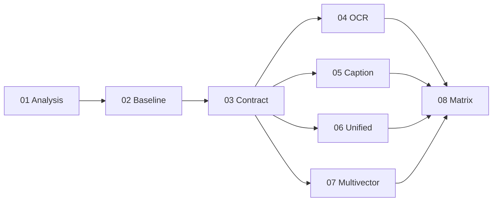

# Sprint 07: multimodal-rag

> **Версия roadmap:** v0.1+ (расширение RAG после sprint-06 graphrag)
> **Roadmap:** [../../roadmap.md](../../roadmap.md)
> **Статус:** 📋 Planned
> **Открыт:** 2026-07-05
> **Закрыт:** — (заполняется по завершении)

---

## Цель спринта

Добавить мультимодальную ногу к RAG ассистента llmstart.ru (Qdrant остаётся vector store): проиндексировать визуально-плотную B2B-презентацию (66 слайдов, русский, тёмная тема, текст вшит в картинку), сравнить **пять семейств индексации** (baseline naive text, OCR×2, caption×2 VLM, unified image-embed, multivector Jina v4) и зафиксировать **по сегментам вопросов**, какой метод даёт прирост и **какой ценой** (index size, build time, ~$).

**Контекст:** ассистент на RAG с Qdrant (dense+sparse hybrid после sprint-05/06). Корпус — B2B-презентация в `materials/data/` (66 PNG). Гипотеза: разные слайды «живут» в разных точках спектра (текст / пиксели / расположение); усреднённая метрика скроет, где какой метод выигрывает.

**Ограничения спринта:**

- **Qdrant остаётся** единственным vector store; downstream (поиск, eval, judge) **общий** для всех конфигов.
- Параметризован **ТОЛЬКО этап индексации** — контракт `Indexer: build_index(corpus) → cost`; реестр `INDEXER_REGISTRY` + `make_indexer(cfg)`.
- **Без GPU / self-host** тяжёлых VLM; метод D — **Jina v4 multivector** (`return_multivector=true`, Qdrant `MultiVectorConfig MAX_SIM`), **не ColPali**.
- Качество мерить **строго по сегментам** (S1_text / S2_chart / S3_layout / S4_multi / S5_unanswerable), **не средним** по датасету.
- Ingestion-метрики (**CER**, **TEDS**) — **отдельная группа** (диагностика качества извлечения), не подменяют retrieval-метрики.
- Для каждой конфигурации фиксировать **`build_time_s`**, **`index_size_mb`**, **`est_cost_usd`** (оценка ~$).
- Артефакты OCR и caption **сохранять в файлы** для ручного разбора.
- Метод A: сравнить **два OCR-движка** (Tesseract vs современный без GPU).
- Метод B: сравнить **минимум две VLM** (малая бесплатная vs фронтирная/средняя через OpenRouter).
- **Антихайп:** D (multivector) не брать по умолчанию — сначала B/C; на русском визуальном контенте явно проверить гипотезу MIRACL-Vision (C vs B).
- Не затрагивать Postgres persistence, production-deploy, agent routing (v0.2+).

---

## Задачи

| # | Задача | Статус | Plan | Summary |
|---|--------|--------|------|---------|
| 01 | Анализ корпуса и таксономия вопросов | ✅ Done | [plan](tasks/01-corpus-analysis-taxonomy/plan.md) | [analysis](analysis.md) |
| 02 | Датасеты, метрики, baseline-замер | ✅ Done | [plan](tasks/02-datasets-baseline/plan.md) | [summary](tasks/02-datasets-baseline/summary.md) |
| 03 | RAG-пайплайн: контракт + динамическая конфигурация | ✅ Done | [plan](tasks/03-rag-pipeline-contract/plan.md) | [summary](tasks/03-rag-pipeline-contract/summary.md) |
| 04 | Метод A·OCR — два движка + CER | ✅ Done | [plan](tasks/04-method-a-ocr/plan.md) | [summary](tasks/04-method-a-ocr/summary.md) |
| 05 | Метод B·caption — несколько VLM + сравнение | ✅ Done | [plan](tasks/05-method-b-caption/plan.md) | [summary](tasks/05-method-b-caption/summary.md) |
| 06 | Метод C·unified — image-embed + MIRACL-Vision | 📋 | [plan](tasks/06-method-c-unified/plan.md) | — |
| 07 | Метод D·multivector — Jina v4 + ось цены | 📋 | [plan](tasks/07-method-d-multivector/plan.md) | — |
| 08 | Прогон матрицы, сводный отчёт, вердикт | 📋 | [plan](tasks/08-matrix-report-verdict/plan.md) | — |

---

## Scope

### В scope

| Область | Что делаем |
|---------|------------|
| **Анализ корпуса** | `analysis.md`: карта смысла по 66 слайдам, спектр text/pixels/layout, таксономия 5 сегментов, черновик датасета, риски |
| **Eval** | Сегментный датасет по S1–S5, `metric_map.md` (3 группы метрик), baseline naive text → e5 → Qdrant |
| **Indexer contract** | `INDEXER_REGISTRY`, `make_indexer(cfg)`, cost-объект; 5 eval-config в `evals/configs/` |
| **Метод A** | `A_ocr_tesseract` + `A_ocr_modern` → e5 → Qdrant; CER ~10 слайдов; артефакты в `evals/artifacts/ocr/` |
| **Метод B** | Caption через VLM (`vlm_model`); ≥2 модели; артефакты в `evals/artifacts/captions/{model}/` |
| **Метод C** | Unified image-embed `nvidia/llama-nemotron-embed-vl-1b-v2:free` через OpenRouter |
| **Метод D** | Jina `jina-embeddings-v4`, multivector, `D_MAX_SIDE` через env; TEDS на табличных слайдах (стр. 10/11) |
| **Итог** | Матрица «конфигурация × сегмент», decision log, вердикт, обновление roadmap |

### Вне scope

- Смена vector store (Neo4j graph, другая БД)
- ColPali / self-host GPU VLM
- Интеграция лучшего метода в production agent routing (только eval-вывод и рекомендация)
- Postgres persistence, guardrails, production-deploy (v0.2)
- Полный e2e agent eval с generation (фокус — retrieval + ingestion diagnostics по сегментам)

---

## Порядок выполнения



1. Анализ корпуса → 2. Датасеты и baseline → 3. Контракт indexer → 4–7. Методы A/B/C/D (после контракта, порядок A→B→C→D) → 8. Матрица и вердикт

Задачи **01–03 строго последовательны:** без таксономии и baseline нельзя измерить эффект; без контракта нельзя сравнивать методы на равных. Задачи **04–07** зависят от 03, выполняются по цепочке A→B→C→D (антихайп: не начинать с D). Задача **08** — после всех прогонов.

---

## Зависимости

- **Sprint-01..06** закрыты: backend, Qdrant hybrid RAG, eval-контур (`evals/`, Langfuse)
- `.env`: `OPENROUTER_API_KEY`, `EMBEDDING_MODEL` (e5), `QDRANT_*`, `CAPTION_MODEL`, `D_MAX_SIDE`
- Корпус: `materials/data/*.png` (66 слайдов); naive text: `corpus/text_naive/`
- Eval: [`.methodology/eval/eval-methodology.md`](../../../.methodology/eval/eval-methodology.md), [`Docs/eval/dataset-map.md`](../../eval/dataset-map.md), [`Docs/eval/metrics-map.md`](../../eval/metrics-map.md)
- Baseline для сравнения: текущий text RAG + новый `multimodal-baseline.yaml` (задача 02)

---

## Риски

| Риск | Митигация |
|------|-----------|
| Усреднение скрывает сегментные эффекты | Обязательные отчёты per S1–S5; запрет «одной цифры» в вердикте |
| OCR на тёмной теме / русском даёт высокий CER | Два движка A; CER на выборке; артефакты для ручного разбора |
| VLM caption галлюцинирует числа (метод B) | Сохранять captions в файлы; отдельно смотреть S2_chart; не «молча» править эталоны |
| Unified embed (C) проседает на русском (MIRACL-Vision) | Явное сравнение C vs B по сегментам; гипотеза в decision log |
| Multivector (D) раздувает `index_size_mb` без прироста retrieval | `index_size_mb` в cost; D только после B/C; антипаттерн «ColPali ради ColPali» |
| CER «на глаз» вместо формулы | Стандартизировать CER (нормализация, Levenshtein); ~10 слайдов с эталонным текстом |
| Стоимость OpenRouter непредсказуема | Считать `api_calls` + `est_cost_usd` per config; фиксировать в отчёте |

---

## Артефакты (ожидаемые)

```
materials/
├── data/                               # 66 PNG слайдов (вход корпуса)
├── dataset/                            # готовый датасет (если есть) или синтез из analysis
└── corpus/text_naive/                  # наивный текст для baseline

Docs/sprints/sprint-07-multimodal-rag/
├── README.md                           # этот документ
├── analysis.md                         # задача 01
└── tasks/01..08/plan.md, summary.md

Docs/eval/
├── dataset-map.md                      # + секции multimodal/S1..S5
└── metrics-map.md                      # + 3 группы метрик multimodal-rag

evals/
├── configs/
│   ├── multimodal-baseline.yaml        # naive text → e5
│   ├── multimodal-a-ocr-tesseract.yaml
│   ├── multimodal-a-ocr-modern.yaml
│   ├── multimodal-b-caption-{model}.yaml
│   ├── multimodal-c-unified.yaml
│   └── multimodal-d-jina-multivector.yaml
├── datasets/multimodal/                # JSON/YAML по сегментам S1..S5
├── artifacts/
│   ├── ocr/                            # распознанный текст per slide per engine
│   └── captions/{model_name}/          # подписи VLM per slide
└── reports/
    ├── multimodal-baseline.md
    ├── multimodal-matrix.md            # сводная таблица конфиг × сегмент
    ├── multimodal-decision-log.md
    └── multimodal-final.md             # вердикт

backend/app/rag/indexers/               # INDEXER_REGISTRY, make_indexer, per-method indexers
Makefile / make.ps1                     # eval-multimodal-*, index-multimodal-*
```

---

## Задача 01: Анализ корпуса и таксономия вопросов ✅ Done

> **Артефакты:** [`Docs/sprints/sprint-07-multimodal-rag/analysis.md`](analysis.md)

### Цель

Прогнать агента-аналитика по 66 PNG из `materials/data/` и зафиксировать `analysis.md`: карта смысла по слайдам, подтверждение гипотезы о разном «спектре» слайдов (текст / пиксели / расположение), таксономия 5 сегментов вопросов, черновик датасета, ожидания и риски.

> 💡 **Скиллы:** [`.cursor/skills/dataset-builder/SKILL.md`](../../../.cursor/skills/dataset-builder/SKILL.md) (стадия анализа), [`dataset-reviewer`](../../../.cursor/skills/dataset-reviewer/SKILL.md) (самопроверка таксономии).

### Состав работ

- [x] Инвентаризация 66 слайдов: номер, краткий смысл, тип контента (текст / график / таблица / layout / смешанный)
- [x] Карта смысла: какие слайды «текстовые», какие требуют визуала/расположения, какие — табличные/числовые
- [x] Подтвердить гипотезу: одна метрика в среднем скроет различия; обосновать per-slide спектр
- [x] Таксономия **5 сегментов**: **S1_text** / **S2_chart** / **S3_layout** / **S4_multi** / **S5_unanswerable** — определения + примеры вопросов + привязка к слайдам
- [x] Черновик датасета: кандидаты вопросов по сегментам с `expected_slide_ids` / `expected_answer` / `required_slides[]` (для S4)
- [x] Ожидания по методам (где baseline должен болеть; где ждём прирост B/C/D) и риски (тёмная тема, OCR, галлюцинации чисел)
- [x] Самопроверка по критериям DoD

### Критерии готовности (DoD)

**Агент проверяет:**

| # | Критерий | Способ проверки |
|---|----------|-----------------|
| 1 | `analysis.md` существует, покрывает все 66 слайдов | `rg -c "slide\|слайд" analysis.md`; checklist в plan |
| 2 | Определены все 5 сегментов S1–S5 с примерами | Grep по `S1_text\|S2_chart\|S3_layout\|S4_multi\|S5_unanswerable` |
| 3 | ≥ 3 вопроса-кандидата на сегмент (кроме S5 — ≥ 2) | Подсчёт в analysis.md |
| 4 | Гипотеза «спектр слайдов» явно сформулирована | Ревью раздела «Гипотеза» |

**Пользователь проверяет:**

- Прочитать `analysis.md`: карта смысла соответствует реальным слайдам презентации
- Подтвердить таксономию S1–S5 и примеры вопросов
- Согласовать черновик датасета перед задачей 02 (⛔ СТОП)

### Артефакты

| Путь | Содержание |
|------|------------|
| [`Docs/sprints/sprint-07-multimodal-rag/analysis.md`](analysis.md) | Карта смысла (66 слайдов), таксономия S1–S5, черновик датасета (40 вопросов), ожидания и риски |

**Вход корпуса (не создан в задаче 01):** `data/multimodal-rag/slide-{01..66}.png`, `data/multimodal-rag/notes.md`

### Документы

- 📋 [План задачи](tasks/01-corpus-analysis-taxonomy/plan.md)
- 📝 [Summary](tasks/01-corpus-analysis-taxonomy/summary.md) — после апрува DoD

---

## Задача 02: Датасеты, метрики, baseline-замер ✅ Done

### Цель

Собрать сегментный eval-датасет по 5 сегментам, описать три группы метрик в `metric_map.md`, прогнать **baseline** (наивный текст `corpus/text_naive/` → e5 → Qdrant) по сегментам и зафиксировать «боль» для сравнения с методами A–D.

> 💡 **Скиллы:** [`dataset-builder`](../../../.cursor/skills/dataset-builder/SKILL.md), [`.methodology/eval/eval-methodology.md`](../../../.methodology/eval/eval-methodology.md), [`langfuse`](../../../.cursor/skills/langfuse/SKILL.md).

### Состав работ

- [x] Датасет по S1–S5: из [`data/multimodal-rag/dataset/v001_2026-06-18.yaml`](../../../data/multimodal-rag/dataset/v001_2026-06-18.yaml), эталоны/gold_pages сверены по слайдам
- [x] Описать **три группы метрик** (обновить [`Docs/eval/metrics-map.md`](../../eval/metrics-map.md)):
  - **Retrieval по сегментам:** Recall@k, nDCG@5, MRR; S4 — set-recall; S5 — `unanswerable_refusal_rate` (не nDCG)
  - **Ingestion-quality:** CER (метод A), TEDS (табличные слайды 10/11)
  - **Стоимость индексации:** `build_time_s`, `index_size_mb`, `est_cost_usd` per конфигурация
- [x] Обновить [`Docs/eval/dataset-map.md`](../../eval/dataset-map.md) — секции `multimodal/S1..S5`
- [x] Baseline: `data/multimodal-rag/corpus/text_naive/` → e5 → Qdrant `multimodal_baseline`; [`evals/configs/multimodal-baseline.yaml`](../../../evals/configs/multimodal-baseline.yaml)
- [x] Прогон baseline **по сегментам**; отчёт с явной «болью»
- [x] Команды воспроизведения: `make index-multimodal-baseline` / `make eval-multimodal-baseline` (+ зеркало в `make.ps1`, Qdrant через WSL)
- [x] Самопроверка по критериям DoD

### Критерии готовности (DoD)

**Агент проверяет:**

| # | Критерий | Способ проверки | Результат |
|---|----------|-----------------|-----------|
| 1 | Датасеты валидны по формату eval | `make eval-validate CONFIG=evals/configs/multimodal-baseline.yaml` | ✅ dry-run 42 items |
| 2 | `multimodal-baseline.yaml` валидируется | `make eval-validate CONFIG=...` | ✅ |
| 3 | Experiment run завершён без ошибок | Report в `evals/reports/multimodal-baseline--*.txt` | ✅ 5 segment runs |
| 4 | В отчёте разбивка по S1–S5 (не одно среднее) | Таблица per segment | ✅ [`multimodal-baseline.md`](../../../evals/reports/multimodal-baseline.md) |
| 5 | `metrics-map.md` содержит 3 группы метрик multimodal | Ревью секции multimodal-rag | ✅ |

**Пользователь проверяет:**

- Выборочно 5–8 items: эталоны и привязка к слайдам корректны
- Baseline-цифры правдоподобны
- Утвердить датасет и метрики как эталон для задач 04–08 (⛔ СТОП)

### Артефакты

**Датасеты (42 items, 5 сегментов):**

| Путь | Содержание |
|------|------------|
| [`evals/datasets/multimodal/s1-text/v001_2026-07-05.yaml`](../../../evals/datasets/multimodal/s1-text/v001_2026-07-05.yaml) | S1_text — 9 items |
| [`evals/datasets/multimodal/s2-chart/v001_2026-07-05.yaml`](../../../evals/datasets/multimodal/s2-chart/v001_2026-07-05.yaml) | S2_chart — 11 items |
| [`evals/datasets/multimodal/s3-layout/v001_2026-07-05.yaml`](../../../evals/datasets/multimodal/s3-layout/v001_2026-07-05.yaml) | S3_layout — 10 items |
| [`evals/datasets/multimodal/s4-multi/v001_2026-07-05.yaml`](../../../evals/datasets/multimodal/s4-multi/v001_2026-07-05.yaml) | S4_multi — 6 items |
| [`evals/datasets/multimodal/s5-unanswerable/v001_2026-07-05.yaml`](../../../evals/datasets/multimodal/s5-unanswerable/v001_2026-07-05.yaml) | S5_unanswerable — 6 items |

**Корпус и конфиг baseline:**

| Путь | Содержание |
|------|------------|
| [`data/multimodal-rag/corpus/text_naive/`](../../../data/multimodal-rag/corpus/text_naive/) | 66× `slide-{NN}.txt` — naive titles (без OCR/VLM) |
| [`evals/configs/multimodal-baseline.yaml`](../../../evals/configs/multimodal-baseline.yaml) | Eval-config: naive text → e5 → Qdrant |

**Отчёты baseline (2026-07-05):**

| Путь | Содержание |
|------|------------|
| [`evals/reports/multimodal-baseline.md`](../../../evals/reports/multimodal-baseline.md) | Сводка per segment + «боль» |
| [`evals/reports/multimodal-baseline--multimodal-s1-text--*.txt`](../../../evals/reports/) | Run S1 |
| [`evals/reports/multimodal-baseline--multimodal-s2-chart--*.txt`](../../../evals/reports/) | Run S2 |
| [`evals/reports/multimodal-baseline--multimodal-s3-layout--*.txt`](../../../evals/reports/) | Run S3 |
| [`evals/reports/multimodal-baseline--multimodal-s4-multi--*.txt`](../../../evals/reports/) | Run S4 |
| [`evals/reports/multimodal-baseline--multimodal-s5-unanswerable--*.txt`](../../../evals/reports/) | Run S5 |

**Eval-контур (скрипты, метрики, тесты):**

| Путь | Содержание |
|------|------------|
| [`evals/scripts/build_multimodal_manifest.py`](../../../evals/scripts/build_multimodal_manifest.py) | YAML manifests из `v001_2026-06-18.yaml` |
| [`evals/scripts/build_multimodal_corpus.py`](../../../evals/scripts/build_multimodal_corpus.py) | Генерация `text_naive/` |
| [`evals/scripts/index_multimodal_baseline.py`](../../../evals/scripts/index_multimodal_baseline.py) | Индексация в Qdrant + IndexCost |
| [`evals/scripts/run_multimodal_baseline_local.py`](../../../evals/scripts/run_multimodal_baseline_local.py) | Retrieval eval per segment |
| [`evals/scripts/build_multimodal_baseline_report.py`](../../../evals/scripts/build_multimodal_baseline_report.py) | Сборка `multimodal-baseline.md` |
| [`evals/scripts/multimodal_metrics.py`](../../../evals/scripts/multimodal_metrics.py) | Recall@k, nDCG, MRR, set-recall, refusal |
| [`evals/scripts/models.py`](../../../evals/scripts/models.py) | group `multimodal`, `gold_pages`, `multimodal_segment` |
| [`evals/scripts/dataset_registry.py`](../../../evals/scripts/dataset_registry.py) | slug'и `multimodal/*` |
| [`evals/scripts/evaluators.py`](../../../evals/scripts/evaluators.py) | evaluator profiles per segment |
| [`evals/tests/test_multimodal_integrity.py`](../../../evals/tests/test_multimodal_integrity.py) | Integrity manifests |
| [`evals/tests/test_multimodal_metrics.py`](../../../evals/tests/test_multimodal_metrics.py) | Unit-тесты метрик |

**Документация и make-цели:**

| Путь | Содержание |
|------|------------|
| [`Docs/eval/metrics-map.md`](../../eval/metrics-map.md) | 3 группы метрик multimodal-rag |
| [`Docs/eval/dataset-map.md`](../../eval/dataset-map.md) | Секции `multimodal/s1-text` … `s5-unanswerable` |
| [`Makefile`](../../../Makefile) | `index-multimodal-baseline`, `eval-multimodal-baseline` |
| [`make.ps1`](../../../make.ps1) | зеркало + `Resolve-QdrantUrlForWindows` |

### Документы

- 📋 [План задачи](tasks/02-datasets-baseline/plan.md)
- 📝 [Summary](tasks/02-datasets-baseline/summary.md)

---

## Задача 03: RAG-пайплайн: контракт + динамическая конфигурация ✅ Done

### Цель

Ввести контракт `Indexer` и реестр конфигураций так, чтобы **только этап индексации** менялся между методами, а Qdrant-поиск и eval оставались общими.

> 💡 **Скиллы:** [`python-design-patterns`](../../../.agents/skills/python-design-patterns/SKILL.md), [`modern-python`](../../../.agents/skills/modern-python/SKILL.md).

### Состав работ

- [x] Контракт `Indexer`: `build_index(corpus) → IndexCost` с полями `{collection, index_size_mb, build_time_s, api_calls, est_cost_usd, is_multivector}`
- [x] `INDEXER_REGISTRY` + фабрика `make_indexer(method)` — выбор реализации по eval-config
- [x] Общий downstream: один retriever path в Qdrant, один eval runner; смена метода = смена collection + indexer
- [x] 7 eval-config в `evals/configs/`: baseline + заготовки A/B/C/D
- [x] Env-параметры: `CAPTION_MODEL`, `D_MAX_SIDE` — в `indexer.options` заготовок (реализация в 04–07)
- [x] CLI / make targets: `index-multimodal`, `eval-multimodal` (зеркало в `make.ps1`)
- [x] Smoke-тест: baseline indexer через контракт → collection `multimodal_baseline`
- [x] Самопроверка по критериям DoD

### Критерии готовности (DoD)

**Агент проверяет:**

| # | Критерий | Способ проверки | Результат |
|---|----------|-----------------|-----------|
| 1 | `IndexCost` возвращается из `build_index` со всеми полями | `pytest backend/tests/test_indexer_contract.py` | ✅ 7/7 |
| 2 | `make_indexer(method)` переключает реализацию без правок eval | Unit-тест baseline vs stub | ✅ |
| 3 | Eval-config baseline через новый контракт | `make eval-multimodal-baseline` (parity task 02) | ✅ |
| 4 | `make index-multimodal CONFIG=...` работает (WSL + `make.ps1`) | Smoke run | ✅ |
| 5 | Config задаёт **method + corpus_dir** | `pytest evals/tests/test_multimodal_config.py` | ✅ 4/4 |

**Пользователь проверяет:**

- [x] Контракт понятен: что параметризуется, что общее
- [x] Имена config_id / collection / registry keys согласованы для задач 04–07

### Артефакты

**Indexer contract (backend):**

| Путь | Содержание |
|------|------------|
| [`backend/app/rag/indexers/cost.py`](../../../backend/app/rag/indexers/cost.py) | `IndexCost` dataclass |
| [`backend/app/rag/indexers/protocol.py`](../../../backend/app/rag/indexers/protocol.py) | `Indexer` protocol |
| [`backend/app/rag/indexers/baseline.py`](../../../backend/app/rag/indexers/baseline.py) | `BaselineTextIndexer` (txt / PDF text layer, OCR off) |
| [`backend/app/rag/indexers/stub.py`](../../../backend/app/rag/indexers/stub.py) | Stubs A/B/C/D → `NotImplementedError` |
| [`backend/app/rag/indexers/registry.py`](../../../backend/app/rag/indexers/registry.py) | `INDEXER_REGISTRY`, `make_indexer(method)` |
| [`backend/app/rag/indexers/__init__.py`](../../../backend/app/rag/indexers/__init__.py) | Public exports |
| [`backend/tests/test_indexer_contract.py`](../../../backend/tests/test_indexer_contract.py) | Unit-тесты контракта (7 tests) |

**Eval-configs (method + corpus_dir + collection):**

| Путь | method | collection |
|------|--------|------------|
| [`evals/configs/multimodal-baseline.yaml`](../../../evals/configs/multimodal-baseline.yaml) | `baseline` | `multimodal_baseline` |
| [`evals/configs/multimodal-a-ocr-tesseract.yaml`](../../../evals/configs/multimodal-a-ocr-tesseract.yaml) | `A_ocr_tesseract` | `multimodal_a_tesseract` |
| [`evals/configs/multimodal-a-ocr-modern.yaml`](../../../evals/configs/multimodal-a-ocr-modern.yaml) | `A_ocr_modern` | `multimodal_a_modern` |
| [`evals/configs/multimodal-b-caption-nemotron.yaml`](../../../evals/configs/multimodal-b-caption-nemotron.yaml) | `B_caption` | `multimodal_b_nemotron` |
| [`evals/configs/multimodal-b-caption-gemini.yaml`](../../../evals/configs/multimodal-b-caption-gemini.yaml) | `B_caption` | `multimodal_b_gemini` |
| [`evals/configs/multimodal-c-unified.yaml`](../../../evals/configs/multimodal-c-unified.yaml) | `C_unified` | `multimodal_c_unified` |
| [`evals/configs/multimodal-d-jina-multivector.yaml`](../../../evals/configs/multimodal-d-jina-multivector.yaml) | `D_jina_multivector` | `multimodal_d_jina` |

**CLI и config loader:**

| Путь | Содержание |
|------|------------|
| [`evals/scripts/multimodal_config.py`](../../../evals/scripts/multimodal_config.py) | `MultimodalEvalConfig` (indexer + vector_db) |
| [`evals/scripts/index_multimodal.py`](../../../evals/scripts/index_multimodal.py) | Config-driven index CLI |
| [`evals/scripts/run_multimodal_eval.py`](../../../evals/scripts/run_multimodal_eval.py) | Config-driven segment eval |
| [`evals/scripts/build_multimodal_report.py`](../../../evals/scripts/build_multimodal_report.py) | Segment markdown report |
| [`evals/scripts/index_multimodal_baseline.py`](../../../evals/scripts/index_multimodal_baseline.py) | Wrapper → `index_multimodal.py` |
| [`evals/scripts/run_multimodal_baseline_local.py`](../../../evals/scripts/run_multimodal_baseline_local.py) | Wrapper → `run_multimodal_eval.py` |
| [`evals/scripts/build_multimodal_baseline_report.py`](../../../evals/scripts/build_multimodal_baseline_report.py) | Wrapper → `build_multimodal_report.py` |
| [`evals/tests/test_multimodal_config.py`](../../../evals/tests/test_multimodal_config.py) | Config parse + registry switch tests |

**Make-цели:**

| Путь | Содержание |
|------|------------|
| [`Makefile`](../../../Makefile) | `index-multimodal`, `eval-multimodal`, aliases `*-baseline` |
| [`make.ps1`](../../../make.ps1) | зеркало + `Get-MultimodalConfigPath`, WSL Qdrant URL |

**Документы задачи:**

| Путь | Содержание |
|------|------------|
| [`Docs/sprints/sprint-07-multimodal-rag/tasks/03-rag-pipeline-contract/plan.md`](tasks/03-rag-pipeline-contract/plan.md) | План |
| [`Docs/sprints/sprint-07-multimodal-rag/tasks/03-rag-pipeline-contract/summary.md`](tasks/03-rag-pipeline-contract/summary.md) | Summary |

### Документы

- 📋 [План задачи](tasks/03-rag-pipeline-contract/plan.md)
- 📝 [Summary](tasks/03-rag-pipeline-contract/summary.md)

---

## Задача 04: Метод A·OCR — два движка + CER ✅ Done

### Цель

Реализовать под контракт **два OCR-движка**, сравнить на русском визуальном контенте: Tesseract (классика) vs EasyOCR (CPU); оба → e5 → Qdrant; CER на выборке ~10 слайдов.

### Состав работ

- [x] `A_ocr_tesseract`: Tesseract `lang=rus+eng`, Docker/WSL, бесплатно
- [x] `A_ocr_modern`: **EasyOCR (CPU)** — без GPU, `ru`+`en`
- [x] Оба indexers → отдельные Qdrant-коллекции → общий e5 embed
- [x] Сохранять распознанный текст в `evals/artifacts/ocr/{engine}/slide-NN.txt` (gitignored)
- [x] CER на ~10 репрезентативных слайдах — gold YAML + `run_ocr_cer.py`
- [x] Eval retrieval **по сегментам** + `build_time_s` — `eval-multimodal-a-ocr`
- [x] Comparison report builder — `multimodal-a-ocr-comparison.md`
- [x] Самопроверка по критериям DoD

### Критерии готовности (DoD)

**Агент проверяет:**

| # | Критерий | Способ проверки | Результат |
|---|----------|-----------------|-----------|
| 1 | Оба indexer зарегистрированы в `INDEXER_REGISTRY` | `pytest backend/tests/test_ocr_indexer.py` | ✅ |
| 2 | OCR batch + Docker-образ | `make ocr-multimodal-*` | ✅ |
| 3 | CER формулой на ~10 слайдах | `run_ocr_cer.py --markdown` | ✅ |
| 4 | Сегментный eval + comparison | `build_multimodal_ocr_comparison.py` + make target | ✅ контур |
| 5 | `build_time_s` в IndexCost | `{config_id}-index-cost.json` | ✅ |

**Пользователь проверяет:**

- [ ] Выборочно 3–5 OCR-файлов: качество на тёмной теме / русском
- [ ] CER-слайды 9–10–11 в gold YAML (REVIEW)
- [ ] Согласовать «победителя» A для матрицы (⛔ СТОП перед задачей 08)

### Артефакты

**OCR-модуль (backend):**

| Путь | Содержание |
|------|------------|
| [`backend/app/rag/ocr/protocol.py`](../../../backend/app/rag/ocr/protocol.py) | `OcrEngine` protocol |
| [`backend/app/rag/ocr/normalize.py`](../../../backend/app/rag/ocr/normalize.py) | Нормализация для CER |
| [`backend/app/rag/ocr/cer.py`](../../../backend/app/rag/ocr/cer.py) | CER (`rapidfuzz` Levenshtein) |
| [`backend/app/rag/ocr/preprocess.py`](../../../backend/app/rag/ocr/preprocess.py) | Preprocess `dark_theme` |
| [`backend/app/rag/ocr/tesseract_engine.py`](../../../backend/app/rag/ocr/tesseract_engine.py) | Tesseract `rus+eng` |
| [`backend/app/rag/ocr/easyocr_engine.py`](../../../backend/app/rag/ocr/easyocr_engine.py) | EasyOCR CPU |
| [`backend/app/rag/ocr/registry.py`](../../../backend/app/rag/ocr/registry.py) | Фабрика OCR-движков |
| [`backend/app/rag/ocr/batch.py`](../../../backend/app/rag/ocr/batch.py) | Batch OCR 66 PNG → txt |
| [`backend/app/rag/ocr/__init__.py`](../../../backend/app/rag/ocr/__init__.py) | Package (lazy imports) |

**Indexers A (backend):**

| Путь | Содержание |
|------|------------|
| [`backend/app/rag/indexers/a_ocr_base.py`](../../../backend/app/rag/indexers/a_ocr_base.py) | База: artifacts → e5 → Qdrant |
| [`backend/app/rag/indexers/a_ocr_tesseract.py`](../../../backend/app/rag/indexers/a_ocr_tesseract.py) | `A_ocr_tesseract` |
| [`backend/app/rag/indexers/a_ocr_modern.py`](../../../backend/app/rag/indexers/a_ocr_modern.py) | `A_ocr_modern` |
| [`backend/app/rag/indexers/slide_embed.py`](../../../backend/app/rag/indexers/slide_embed.py) | Общий upsert slide-текстов |
| [`backend/app/rag/indexers/registry.py`](../../../backend/app/rag/indexers/registry.py) | Registry: stub → real A indexers |

**Docker OCR (WSL):**

| Путь | Содержание |
|------|------------|
| [`docker/ocr/Dockerfile`](../../../docker/ocr/Dockerfile) | python:3.11 + tesseract + CPU torch + EasyOCR |
| [`docker/ocr/compose.ocr.yml`](../../../docker/ocr/compose.ocr.yml) | `docker compose run ocr` |
| [`docker/ocr/entrypoint.sh`](../../../docker/ocr/entrypoint.sh) | Entrypoint → `run_multimodal_ocr.py` |
| [`docker/ocr/requirements-ocr.txt`](../../../docker/ocr/requirements-ocr.txt) | OCR deps (+ `rapidfuzz`) |

**Eval-скрипты и gold:**

| Путь | Содержание |
|------|------------|
| [`evals/scripts/run_multimodal_ocr.py`](../../../evals/scripts/run_multimodal_ocr.py) | CLI batch OCR |
| [`evals/scripts/run_ocr_cer.py`](../../../evals/scripts/run_ocr_cer.py) | CER vs gold YAML |
| [`evals/scripts/build_multimodal_ocr_comparison.py`](../../../evals/scripts/build_multimodal_ocr_comparison.py) | Сравнение движков + segments |
| [`evals/datasets/multimodal/ocr-gold/v001_2026-07-05.yaml`](../../../evals/datasets/multimodal/ocr-gold/v001_2026-07-05.yaml) | Gold ~10 слайдов (9/10/11 — REVIEW) |
| [`evals/configs/multimodal-a-ocr-tesseract.yaml`](../../../evals/configs/multimodal-a-ocr-tesseract.yaml) | Config Tesseract → `multimodal_a_tesseract` |
| [`evals/configs/multimodal-a-ocr-modern.yaml`](../../../evals/configs/multimodal-a-ocr-modern.yaml) | Config EasyOCR → `multimodal_a_modern` |
| [`evals/scripts/index_multimodal.py`](../../../evals/scripts/index_multimodal.py) | `{config_id}-index-cost.json` |

**Тесты:**

| Путь | Содержание |
|------|------------|
| [`backend/tests/test_ocr_cer.py`](../../../backend/tests/test_ocr_cer.py) | CER + normalize (4 tests) |
| [`backend/tests/test_ocr_indexer.py`](../../../backend/tests/test_ocr_indexer.py) | A indexers + artifacts guard |
| [`backend/tests/test_indexer_contract.py`](../../../backend/tests/test_indexer_contract.py) | Registry keys A_ocr_* |
| [`evals/tests/test_multimodal_config.py`](../../../evals/tests/test_multimodal_config.py) | Config → `A_ocr_*` |

**Make / infra:**

| Путь | Содержание |
|------|------------|
| [`Makefile`](../../../Makefile) | `ocr-multimodal-*`, `eval-multimodal-a-ocr` |
| [`make.ps1`](../../../make.ps1) | зеркало + `Invoke-EvalMultimodalAOcr` |
| [`.gitignore`](../../../.gitignore) | `evals/artifacts/ocr/` |
| [`README.md`](../../../README.md) | WSL troubleshooting + prerequisites OCR eval |

**Локально после прогона (не в git):**

| Путь | Содержание |
|------|------------|
| `evals/artifacts/ocr/tesseract/slide-*.txt` | 66× OCR Tesseract |
| `evals/artifacts/ocr/modern/slide-*.txt` | 66× OCR EasyOCR |
| `evals/reports/multimodal-a-ocr-tesseract.md` | Segment report Tesseract |
| `evals/reports/multimodal-a-ocr-modern.md` | Segment report EasyOCR |
| `evals/reports/multimodal-a-ocr-comparison.md` | Авто-сводка CER + retrieval |
| `evals/reports/multimodal-a-ocr-final.md` | Итоговый отчёт задачи 04 |
| `evals/reports/multimodal-a-ocr-*-index-cost.json` | IndexCost snapshots |

### Документы

- 📋 [План задачи](tasks/04-method-a-ocr/plan.md)
- 📝 [Summary](tasks/04-method-a-ocr/summary.md)

---

## Задача 05: Метод B·caption — несколько VLM + сравнение ✅ Done

### Цель

Реализовать caption-indexer с параметром `vlm_model`; прогнать **минимум две VLM**, сравнить retrieval по сегментам и стоимость; сохранить подписи для разбора галлюцинаций на числах.

### Состав работ

- [x] Indexer B: image → VLM caption → text → e5 → Qdrant; параметр `vlm_model` в конфиге/env `CAPTION_MODEL`
- [x] Модель 1 (малая бесплатная): `nvidia/nemotron-nano-12b-v2-vl:free` — OpenRouter
- [x] Модель 2 (мощнее): `google/gemini-2.5-flash` — preflight OpenRouter ✅
- [x] Сохранять подписи в `evals/artifacts/captions/{model_slug}/slide-{NN}.txt` (gitignored)
- [x] Eval **по сегментам** + `build_time_s` + `est_cost_usd` для каждой модели
- [x] Вывод: Gemini оправдан на **S2_chart** / **S3_layout** (см. comparison)
- [x] Самопроверка по критериям DoD

### Критерии готовности (DoD)

**Агент проверяет:**

| # | Критерий | Способ проверки | Результат |
|---|----------|-----------------|-----------|
| 1 | ≥ 2 VLM через один `B_caption` с разным `vlm_model` | 2 yaml + 2 collections | ✅ |
| 2 | Captions 66×2 | `evals/artifacts/captions/` | ✅ |
| 3 | Сегментные отчёты per model | `multimodal-b-caption-*.md` | ✅ |
| 4 | `est_cost_usd`, `api_calls`, `build_time_s` | `{config_id}-index-cost.json` | ✅ |
| 5 | Сравнительная таблица + verdict | `multimodal-b-caption-comparison.md` | ✅ |
| 6 | Preflight моделей | `make check-vlm-models` | ✅ |
| 7 | Тесты | `pytest backend/tests/test_caption_*.py` | ✅ 14 tests |

**Пользователь проверяет:**

- [ ] Выборочно captions на S2 (слайды 9–11, 44): галлюцинации чисел
- [ ] Прирост Gemini оправдан ~$0.10 vs free Nemotron
- [ ] Эталоны датасета не правились (⛔ СТОП перед задачей 06)

### Артефакты

**Caption-модуль (backend):**

| Путь | Содержание |
|------|------------|
| [`backend/app/rag/caption/protocol.py`](../../../backend/app/rag/caption/protocol.py) | `VlmCaptioner` protocol + usage |
| [`backend/app/rag/caption/prompts.py`](../../../backend/app/rag/caption/prompts.py) | Дефолтный промпт caption (RU) |
| [`backend/app/rag/caption/image.py`](../../../backend/app/rag/caption/image.py) | Resize PNG `max_side=1536`, base64 |
| [`backend/app/rag/caption/openrouter_vlm.py`](../../../backend/app/rag/caption/openrouter_vlm.py) | OpenRouter vision client |
| [`backend/app/rag/caption/pricing.py`](../../../backend/app/rag/caption/pricing.py) | Оценка `est_cost_usd` по pricing API |
| [`backend/app/rag/caption/batch.py`](../../../backend/app/rag/caption/batch.py) | Batch caption 66 PNG → txt |
| [`backend/app/rag/caption/__init__.py`](../../../backend/app/rag/caption/__init__.py) | Public exports |

**Indexer B (backend):**

| Путь | Содержание |
|------|------------|
| [`backend/app/rag/indexers/b_caption.py`](../../../backend/app/rag/indexers/b_caption.py) | `B_caption` → artifacts → e5 → Qdrant |
| [`backend/app/rag/indexers/registry.py`](../../../backend/app/rag/indexers/registry.py) | Registry: stub → `CaptionIndexer` |

**Eval-скрипты и configs:**

| Путь | Содержание |
|------|------------|
| [`evals/scripts/run_multimodal_caption.py`](../../../evals/scripts/run_multimodal_caption.py) | CLI batch VLM caption |
| [`evals/scripts/check_vlm_models.py`](../../../evals/scripts/check_vlm_models.py) | Preflight catalog + `--probe` |
| [`evals/scripts/audit_caption_numbers.py`](../../../evals/scripts/audit_caption_numbers.py) | Numeric sanity S2 slides 9/10/11/44 |
| [`evals/scripts/build_multimodal_caption_comparison.py`](../../../evals/scripts/build_multimodal_caption_comparison.py) | Сравнение Nemotron vs Gemini |
| [`evals/configs/multimodal-b-caption-nemotron.yaml`](../../../evals/configs/multimodal-b-caption-nemotron.yaml) | Nemotron → `multimodal_b_nemotron` |
| [`evals/configs/multimodal-b-caption-gemini.yaml`](../../../evals/configs/multimodal-b-caption-gemini.yaml) | Gemini 2.5 Flash → `multimodal_b_gemini` |

**Тесты:**

| Путь | Содержание |
|------|------------|
| [`backend/tests/test_caption_helpers.py`](../../../backend/tests/test_caption_helpers.py) | Resize + pricing (4 tests) |
| [`backend/tests/test_caption_indexer.py`](../../../backend/tests/test_caption_indexer.py) | Indexer B + artifacts guard |
| [`backend/tests/test_indexer_contract.py`](../../../backend/tests/test_indexer_contract.py) | Registry `B_caption` |

**Make / infra:**

| Путь | Содержание |
|------|------------|
| [`Makefile`](../../../Makefile) | `check-vlm-models`, `caption-multimodal-*`, `eval-multimodal-b-caption` |
| [`make.ps1`](../../../make.ps1) | зеркало + `Invoke-EvalMultimodalBCaption` |
| [`.gitignore`](../../../.gitignore) | `evals/artifacts/captions/` |
| [`.env.example`](../../../.env.example) | `CAPTION_MODEL`, `CAPTION_MAX_SIDE` |

**Отчёты eval (2026-07-05):**

| Путь | Содержание |
|------|------------|
| [`evals/reports/multimodal-b-caption-nemotron.md`](../../../evals/reports/multimodal-b-caption-nemotron.md) | Segment report Nemotron |
| [`evals/reports/multimodal-b-caption-gemini.md`](../../../evals/reports/multimodal-b-caption-gemini.md) | Segment report Gemini |
| [`evals/reports/multimodal-b-caption-comparison.md`](../../../evals/reports/multimodal-b-caption-comparison.md) | Cost + speed + segments + verdict |
| [`evals/reports/multimodal-b-caption-nemotron-index-cost.json`](../../../evals/reports/multimodal-b-caption-nemotron-index-cost.json) | IndexCost Nemotron |
| [`evals/reports/multimodal-b-caption-gemini-index-cost.json`](../../../evals/reports/multimodal-b-caption-gemini-index-cost.json) | IndexCost Gemini |
| [`evals/reports/nemotron-nano-12b-v2-vl-caption-meta.json`](../../../evals/reports/nemotron-nano-12b-v2-vl-caption-meta.json) | VLM batch meta Nemotron |
| [`evals/reports/gemini-2.5-flash-caption-meta.json`](../../../evals/reports/gemini-2.5-flash-caption-meta.json) | VLM batch meta Gemini |
| [`evals/reports/multimodal-b-caption-*--multimodal-s*.txt`](../../../evals/reports/) | Run logs S1–S5 × 2 configs |

**Локально после прогона (не в git):**

| Путь | Содержание |
|------|------------|
| `evals/artifacts/captions/nemotron-nano-12b-v2-vl/slide-*.txt` | 66× captions Nemotron |
| `evals/artifacts/captions/gemini-2.5-flash/slide-*.txt` | 66× captions Gemini |

**Краткий вердикт:** Gemini **+0.484 nDCG@5 S2**, **+0.689 S3** vs Nemotron; ~**$0.10** index cost; caption ~**2.9 s/slide** (Gemini) vs ~**32 s/slide** (Nemotron free).

### Документы

- 📋 [План задачи](tasks/05-method-b-caption/plan.md)
- 📝 [Summary](tasks/05-method-b-caption/summary.md)

---

## Задача 06: Метод C·unified — image-embed + проверка MIRACL-Vision 📋

### Цель

Один вектор на страницу через unified image-embedder `nvidia/llama-nemotron-embed-vl-1b-v2:free` (OpenRouter); eval по сегментам; сравнить с B и проверить гипотезу MIRACL-Vision (просадка визуального эмбеддера на русском).

### Состав работ

- [ ] Indexer C: image → unified VL embed → Qdrant (один вектор на слайд, без промежуточного caption)
- [ ] Модель: `nvidia/llama-nemotron-embed-vl-1b-v2:free` через OpenRouter
- [ ] Eval **по сегментам**; сравнение C vs лучший B по S1–S5
- [ ] Явно зафиксировать гипотезу MIRACL-Vision: визуальный embed на non-English / русском контенте
- [ ] `build_time_s`, `est_cost_usd`, `index_size_mb` в отчёте
- [ ] Самопроверка по критериям DoD

### Критерии готовности (DoD)

**Агент проверяет:**

| # | Критерий | Способ проверки |
|---|----------|-----------------|
| 1 | Indexer C зарегистрирован, collection в Qdrant | Smoke index + search |
| 2 | Сегментный eval-отчёт C | `multimodal-c-unified.md` |
| 3 | Таблица C vs B (per segment, не среднее) | Comparison section в report |
| 4 | Вывод по гипотезе MIRACL-Vision сформулирован | Decision note в report |

**Пользователь проверяет:**

- C vs B на S3_layout и S2_chart: ожидания из analysis.md сбылись или нет
- Согласовать интерпретацию MIRACL-Vision для русского корпуса (⛔ СТОП)

### Артефакты

- [`backend/app/rag/indexers/c_unified_embed.py`](../../../backend/app/rag/indexers/)
- [`evals/configs/multimodal-c-unified.yaml`](../../../evals/configs/multimodal-c-unified.yaml)
- [`evals/reports/multimodal-c-unified.md`](../../../evals/reports/multimodal-c-unified.md)

### Документы

- 📋 [План задачи](tasks/06-method-c-unified/plan.md)
- 📝 [Summary](tasks/06-method-c-unified/summary.md)

---

## Задача 07: Метод D·multivector — Jina v4 + ось цены 📋

### Цель

Multivector-индексация через Jina `jina-embeddings-v4` (`return_multivector=true`, Qdrant `MultiVectorConfig MAX_SIM`); показать цену хранения в `index_size_mb`; TEDS на табличных слайдах (стр. 10/11); eval по сегментам **после** B/C (антихайп).

### Состав работ

- [ ] Indexer D: image → Jina v4 multivector → Qdrant multivector collection
- [ ] `D_MAX_SIDE` через env (ресайз перед embed)
- [ ] `index_size_mb` в IndexCost — явная ось цены multivector vs dense
- [ ] TEDS для S2-табличных слайдов (стр. 10/11 презентации) — ingestion-quality группа
- [ ] Eval retrieval **по сегментам** + `build_time_s` + `est_cost_usd`
- [ ] Сравнить D vs лучшие B/C: оправдан ли multivector прирост на S3/S4
- [ ] Самопроверка по критериям DoD

### Критерии готовности (DoD)

**Агент проверяет:**

| # | Критерий | Способ проверки |
|---|----------|-----------------|
| 1 | Qdrant collection с `MultiVectorConfig` и `MAX_SIM` | Schema check / integration test |
| 2 | `is_multivector=true` в IndexCost; `index_size_mb` задокументирован | Report vs baseline dense |
| 3 | TEDS на слайдах 10/11 посчитан | TEDS table в report |
| 4 | Сегментный eval D | `multimodal-d-jina-multivector.md` |
| 5 | D vs B/C comparison (per segment + cost columns) | Matrix precursor в report |

**Пользователь проверяет:**

- `index_size_mb` multivector vs dense — приемлемо ли для стенда
- Прирост D на S3_layout / S4_multi оправдан размером индекса и временем сборки
- Не выбран ли D «по умолчанию» без сравнения с B/C (⛔ СТОП)

### Артефакты

- [`backend/app/rag/indexers/d_jina_multivector.py`](../../../backend/app/rag/indexers/)
- [`evals/configs/multimodal-d-jina-multivector.yaml`](../../../evals/configs/multimodal-d-jina-multivector.yaml)
- [`evals/reports/multimodal-d-jina-multivector.md`](../../../evals/reports/multimodal-d-jina-multivector.md)

### Документы

- 📋 [План задачи](tasks/07-method-d-multivector/plan.md)
- 📝 [Summary](tasks/07-method-d-multivector/summary.md)

---

## Задача 08: Прогон матрицы, сводный отчёт, вердикт 📋

### Цель

Собрать сводную матрицу «конфигурация × сегмент», decision log с ценой прироста, вердикт по точке спектра для этого корпуса (с числами), антипаттерны; обновить roadmap.

> 💡 **Скиллы:** [`dataset-reviewer`](../../../.cursor/skills/dataset-reviewer/SKILL.md) (ревью процесса eval), [`langfuse`](../../../.cursor/skills/langfuse/SKILL.md).

### Состав работ

- [ ] Сводная таблица: строки = конфигурации (baseline, A_tesseract, A_modern, B_vlm1, B_vlm2, C, D); столбцы = S1–S5 + cost
  - Метрики: **nDCG@5** / **set-Recall@5** (S4) / **доля корректных отказов** (S5)
  - Cost: **index_size_mb**, **build_time_s**, **~$/прогон** (`est_cost_usd`)
- [ ] Decision log: что дало прирост на каком сегменте и какой ценой; что **не помогло**
- [ ] Вердикт: рекомендуемая точка спектра для B2B-презентации с числами
- [ ] Антипаттерны: ColPali ради ColPali; среднее по больнице; CER на глаз; молчаливая правка чисел у B
- [ ] Обновить [`Docs/roadmap.md`](../../roadmap.md) — sprint-07 в таблице v0.1+, ссылка на final report
- [ ] Самопроверка по критериям DoD спринта (таблица ниже)

### Критерии готовности (DoD)

**Агент проверяет:**

| # | Критерий | Способ проверки |
|---|----------|-----------------|
| 1 | `multimodal-matrix.md` содержит все конфиги × все сегменты | Checklist 7+ configs × 5 segments |
| 2 | `multimodal-decision-log.md` — прирост/цена/неудачи | Ревью структуры |
| 3 | `multimodal-final.md` — вердикт с числами | North-star paragraph + table |
| 4 | Roadmap обновлён | Diff `roadmap.md` |
| 5 | Все eval-config воспроизводимы одной командой | `make eval-multimodal-matrix` (или документированный скрипт) |

**Пользователь проверяет:**

- Вердикт согласуется с глазами по OCR/caption артефактам
- Рекомендация практична для стенда (не «лучший на бумаге, но $$$ и 10× index»)
- Утвердить закрытие спринта (⛔ СТОП)

### Артефакты

- [`evals/reports/multimodal-matrix.md`](../../../evals/reports/multimodal-matrix.md) — конфиг × сегмент + cost
- [`evals/reports/multimodal-decision-log.md`](../../../evals/reports/multimodal-decision-log.md)
- [`evals/reports/multimodal-final.md`](../../../evals/reports/multimodal-final.md) — вердикт
- [`Docs/roadmap.md`](../../roadmap.md) — обновление статуса sprint-07

### Документы

- 📋 [План задачи](tasks/08-matrix-report-verdict/plan.md)
- 📝 [Summary](tasks/08-matrix-report-verdict/summary.md)

---

## DoD спринта

Sprint считается завершённым, когда:

| # | Критерий | Способ проверки |
|---|----------|-----------------|
| 1 | `analysis.md`: 66 слайдов, таксономия S1–S5, гипотеза спектра подтверждена | Ревью + апрув задачи 01 |
| 2 | Сегментный датасет и 3 группы метрик задокументированы | `dataset-map.md`, `metrics-map.md`; валидация `make eval-validate` |
| 3 | Baseline (naive text → e5) прогнан **по сегментам**; «боль» зафиксирована | `multimodal-baseline.md` |
| 4 | Контракт `Indexer` + `INDEXER_REGISTRY`; параметризована **только** индексация | Code review + повтор baseline через контракт |
| 5 | Метод A: 2 OCR-движка, CER ~10 слайдов, артефакты в `evals/artifacts/ocr/` | Reports + файлы на диске |
| 6 | Метод B: ≥2 VLM, captions в `evals/artifacts/captions/`, cost per model | Reports + сравнение B_vlm1 vs B_vlm2 |
| 7 | Метод C: unified embed; сравнение с B; вывод по MIRACL-Vision на русском | `multimodal-c-unified.md` |
| 8 | Метод D: Jina multivector; `index_size_mb` vs dense; TEDS стр. 10/11 | `multimodal-d-jina-multivector.md` |
| 9 | Сводная матрица «конфиг × сегмент» с cost-колонками; **не усреднять** | `multimodal-matrix.md` |
| 10 | Decision log + вердикт с числами и антипаттернами | `multimodal-final.md`, `multimodal-decision-log.md` |
| 11 | Для каждой конфигурации: `build_time_s`, `index_size_mb`, `est_cost_usd` | Столбцы в matrix report |
| 12 | Roadmap обновлён: sprint-07 📋→✅, ссылка на final report | `Docs/roadmap.md` |

---

## Итог (заполняется после закрытия)

[Что реализовано. Отклонения от цели. Рекомендуемый метод индексации для корпуса. Что взято в следующий sprint.]
