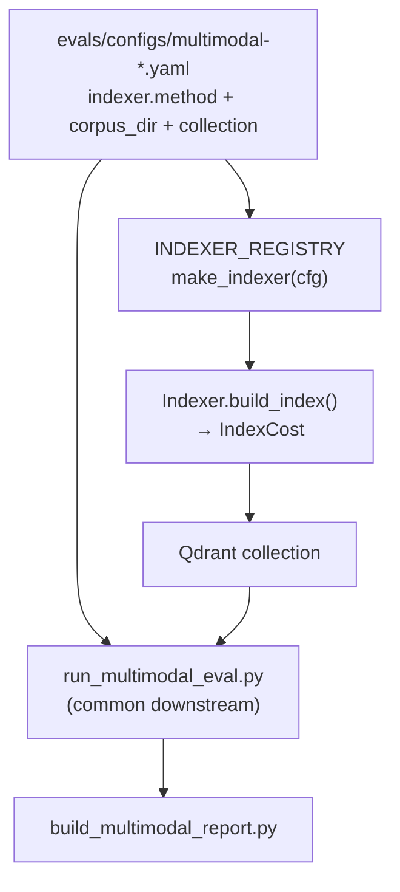

# Task 03: RAG-пайплайн — контракт Indexer + динамическая конфигурация

> **Sprint:** [../../README.md](../../README.md#задача-03-rag-пайплайн-контракт--динамическая-конфигурация-)
> **Тип:** feat  
> **Ветка:** `feat/multimodal-03-indexer-contract`  
> **Spec:** без spec; опирается на [analysis.md](../../analysis.md), baseline [multimodal-baseline.md](../../../../../evals/reports/multimodal-baseline.md)  
> **Статус планирования:** ⛔ ждём «ок» перед реализацией

---

## Цель

Ввести **единый контракт индексации** (`Indexer` + `INDEXER_REGISTRY` + `make_indexer(cfg)`), где **метод и папка с документами задаются eval-config**, а downstream (e5 embed → Qdrant search → segment eval) **один для всех методов** baseline / A / B / C / D.

---

## Ключевое решение (от пользователя)

| Что параметризуется | Что общее |
|---------------------|-----------|
| `indexer.method` — `baseline` \| `A_ocr_tesseract` \| `A_ocr_modern` \| `B_caption` \| `C_unified` \| `D_jina_multivector` | Qdrant client, e5 query/passage prefixes, retrieval top_k=5 |
| `indexer.corpus_dir` — путь к папке с документами/текстами для индексации | Segment eval runner, метрики S1–S5, dataset manifests |
| `vector_db.collection` — имя коллекции Qdrant per config | Payload schema: `slide_number`, `source_path`, `text` |
| Env overrides: `CAPTION_MODEL`, `D_MAX_SIDE`, … | Report builder, make targets |

**Baseline** = наивная экстракция текста из PDF (**text layer only**, OCR/VLM **выключены**) — тот же принцип, что `backend/app/rag/pdf_text.py` с `pdf_ocr_enabled=false`. Для визуально-плотного PNG-дека text layer пуст → в индекс попадают только метаданные/заголовки (см. гипотезу ниже).

---

## Контекст: что есть после задачи 02

| Слой | Файл | Проблема |
|------|------|----------|
| Corpus build | `evals/scripts/build_multimodal_corpus.py` | Генерирует `text_naive/` из **заголовков notes.md**, не из PDF text layer |
| Index | `evals/scripts/index_multimodal_baseline.py` | Логика baseline **зашита** в evals-скрипт; `IndexCost` без `is_multivector` |
| Eval | `evals/scripts/run_multimodal_baseline_local.py` | `collection` **хардкод** `multimodal_baseline`, не читает из config |
| Config | `evals/configs/multimodal-baseline.yaml` | Есть `vector_db.collection`, **нет** секции `indexer` |
| Backend RAG | `backend/app/rag/indexer.py` | Production indexer для `materials/data/` — **другой** контур, не multimodal eval |

**Целевая директория:** `backend/app/rag/indexers/` (новый пакет), eval-скрипты — thin CLI поверх реестра.

---

## Гипотеза baseline на chart-слайдах (зафиксировать числами)

На визуально-плотном деке naive extraction **не видит значения в барах/кривых** — только заголовки слайдов. Baseline-прогон 2026-07-05 это подтверждает.

**Содержимое corpus для chart-слайдов (факт):**

| Слайд | Файл `text_naive/` | Есть в corpus | Нет в corpus (нужно для S2) |
|-------|-------------------|---------------|----------------------------|
| 10 | `title: Цифры мира — Zapier` | заголовок | `49%` Support, `47%` Sales, бары отделов; частично `72%`, `84%` — только в пикселях |
| 9 | `title: Код не главное…` | заголовок | точки кривой `2024≈10%`, `2026≈40%`, **`2028=100%`** |
| 11 | `title: Цифры РФ — СберАналитика` | заголовок | **`70%` Документооборот**, `45%` ускорение, `−30–40%` ФОТ — в барах/карточках |

**Репрезентативные провалы retrieval (S2_chart, Recall@5=0, nDCG@5=0):**

| Item | Вопрос | Gold | Corpus gap | Baseline top-5 (не gold) |
|------|--------|------|------------|--------------------------|
| **s2-01** | Какой отдел чаще всего внедряет ИИ-агентов и сколько %? → **49%** | 10 | нет «Поддержка клиентов», нет «49%» | [59, 61, 52, 63, 62] |
| **s2-07** | В каком году кривая автономности достигает **100%**? → **2028** | 9 | нет «2028», нет точек кривой | [5, 47, 11, 17, 24] |
| **s2-08** | Какой % кода написан AI в Google Q4 2025? → **~50%** | 9 | нет «50%» | [33, 42, 24, 65, 5] |

**Сегмент S2_chart в целом:** Recall@5=**0.455** (5/11 items с recall=0 на chart-values). Эти три item — **north-star провалы** для сравнения с методами A–D в задачах 04–08.

> S3_layout Recall@5=1.0 **не опровергает** гипотезу: title-only corpus совпадает с заголовками слайдов; стрелки/pipeline без OCR не восстановимы (см. summary задачи 02).

---

## Архитектура

### Диаграмма потока



### IndexCost

```python
@dataclass(frozen=True)
class IndexCost:
    collection: str
    build_time_s: float
    index_size_mb: float
    api_calls: int
    est_cost_usd: float
    chunks: int
    is_multivector: bool = False
```

Перенести из `evals/scripts/index_multimodal_baseline.py` → `backend/app/rag/indexers/cost.py`. Поле `is_multivector` — для метода D (задача 07).

### Protocol Indexer

```python
class Indexer(Protocol):
    method: str  # registry key

    def build_index(
        self,
        *,
        corpus_dir: Path,
        collection: str,
        force: bool = False,
    ) -> IndexCost: ...
```

- **Вход:** `corpus_dir` из config — папка с `.txt` (готовый текст) или `.pdf` (baseline извлекает text layer).
- **Выход:** upsert в Qdrant + `IndexCost`.
- Embed-путь для baseline/A/B: e5 dense, `passage:` prefix (как сейчас).
- Методы C/D переопределяют embedder в своих задачах (04–07); в задаче 03 — **stub** + registry slot.

### Registry

```python
INDEXER_REGISTRY: dict[str, type[Indexer]] = {
    "baseline": BaselineTextIndexer,
    "A_ocr_tesseract": StubIndexer,      # NotImplemented → задача 04
    "A_ocr_modern": StubIndexer,
    "B_caption": StubIndexer,            # задача 05
    "C_unified": StubIndexer,            # задача 06
    "D_jina_multivector": StubIndexer,   # задача 07
}

def make_indexer(cfg: MultimodalIndexerConfig) -> Indexer: ...
```

`StubIndexer.build_index` → `NotImplementedError` с сообщением «implement in task NN».

### BaselineTextIndexer

1. Если `corpus_dir` содержит `slide-*.txt` — читать как сейчас (backward compat с task 02).
2. Если `corpus_dir` содержит `slide-*.pdf` — для каждого: `extract_pdf_text(path, settings)` при **`pdf_ocr_enabled=false`** (или dedicated helper `extract_pdf_text_layer_only`).
3. e5 batch embed → Qdrant upsert (логика из текущего `build_index`).
4. Payload contract **не менять** — совместимость с eval metrics.

`build_multimodal_corpus.py` остаётся отдельным шагом «материализовать naive corpus из notes»; make-target baseline: `build corpus → index`.

### Eval-config schema (новая секция)

```yaml
# evals/configs/multimodal-baseline.yaml (расширение)
indexer:
  method: baseline
  corpus_dir: data/multimodal-rag/corpus/text_naive

vector_db:
  collection: multimodal_baseline
  embedding_model: intfloat/multilingual-e5-large
  # ...
```

Заготовки (method + corpus_dir + collection, без реализации):

| config_id | method | corpus_dir (placeholder) | collection |
|-----------|--------|--------------------------|------------|
| `multimodal-baseline` | `baseline` | `data/multimodal-rag/corpus/text_naive` | `multimodal_baseline` |
| `multimodal-a-ocr-tesseract` | `A_ocr_tesseract` | `evals/artifacts/ocr/tesseract` | `multimodal_a_tesseract` |
| `multimodal-a-ocr-modern` | `A_ocr_modern` | `evals/artifacts/ocr/modern` | `multimodal_a_modern` |
| `multimodal-b-caption-nemotron` | `B_caption` | `evals/artifacts/captions/nemotron-nano-12b-v2-vl` | `multimodal_b_nemotron` |
| `multimodal-b-caption-gemini` | `B_caption` | `evals/artifacts/captions/gemini-2.5-flash-lite` | `multimodal_b_gemini` |
| `multimodal-c-unified` | `C_unified` | `data/multimodal-rag` (images) | `multimodal_c_unified` |
| `multimodal-d-jina-multivector` | `D_jina_multivector` | `data/multimodal-rag` (images) | `multimodal_d_jina` |

Для B: `vlm_model` / env `CAPTION_MODEL` — в секции `indexer.options` (задача 05).  
Для D: `D_MAX_SIDE` — env, прокидывается в `indexer.options.max_side`.

### Downstream (общий eval runner)

Рефакторинг `run_multimodal_baseline_local.py` → **`run_multimodal_eval.py`**:

- `--config evals/configs/multimodal-*.yaml`
- `collection` из `vector_db.collection` (не хардкод)
- `config_id` для имён report-файлов
- Логика retrieval/metrics **без изменений**

Аналогично **`index_multimodal.py`** (замена `index_multimodal_baseline.py`):

- `--config …` или `CONFIG=` через make
- `make_indexer(cfg.indexer)` → `build_index(corpus_dir=…, collection=…)`

**Backward compat:** `make index-multimodal-baseline` / `eval-multimodal-baseline` — алиасы на `CONFIG=multimodal-baseline.yaml`.

---

## Состав работ

- [ ] Пакет `backend/app/rag/indexers/`: `cost.py`, `protocol.py`, `registry.py`, `baseline.py`, `stub.py`, `__init__.py`
- [ ] `MultimodalIndexerConfig` — парсинг секций `indexer` + `vector_db` из YAML (расширить `RunConfig` или отдельная модель в `evals/scripts/multimodal_config.py`)
- [ ] `BaselineTextIndexer` — перенос логики из `index_multimodal_baseline.py`; PDF text-layer path (OCR off)
- [ ] `INDEXER_REGISTRY` + `make_indexer(cfg)`; stubs для A/B/C/D
- [ ] CLI `evals/scripts/index_multimodal.py`, `evals/scripts/run_multimodal_eval.py` — config-driven
- [ ] Deprecate thin wrappers: старые baseline-скрипты вызывают новые (или re-export)
- [ ] 5+ eval-config yaml: baseline + заготовки A/B/C/D (см. таблицу)
- [ ] Make: `index-multimodal CONFIG=…`, `eval-multimodal CONFIG=…` (+ `make.ps1`, сохранить baseline aliases)
- [ ] `backend/tests/test_indexer_contract.py`: IndexCost fields; registry switch; baseline smoke (mock embed/Qdrant или integration marker)
- [ ] Smoke: baseline через контракт → та же collection `multimodal_baseline`, metrics parity с task 02 (± округление)
- [ ] Самопроверка по DoD

---

## Критерии готовности (DoD)

**Агент проверяет:**

| # | Критерий | Способ проверки |
|---|----------|-----------------|
| 1 | `IndexCost` со всеми полями incl. `is_multivector` | `pytest backend/tests/test_indexer_contract.py -k index_cost` |
| 2 | `make_indexer(cfg)` переключает реализацию | Unit-тест: baseline vs stub → разный class / NotImplemented |
| 3 | Baseline eval через новый контракт ≈ task 02 | `make eval-multimodal CONFIG=evals/configs/multimodal-baseline.yaml` → S2 recall 0.455 |
| 4 | `make index-multimodal CONFIG=…` работает (Makefile + make.ps1) | Smoke index baseline |
| 5 | Config задаёт **method + corpus_dir** | Grep yaml + test parse |
| 6 | Lint + тесты | `make test-backend` (indexer tests) |

**Пользователь проверяет:**

- Контракт понятен: что в config, что общее downstream
- Имена config_id / collection / registry keys согласованы для задач 04–07
- Три chart-провала (s2-01, s2-07, s2-08) зафиксированы как baseline «боль»
- ⛔ **СТОП** — апрув перед задачей 04

---

## Артефакты

| Путь | Назначение |
|------|------------|
| `backend/app/rag/indexers/*.py` | Protocol, IndexCost, registry, baseline, stubs |
| `backend/tests/test_indexer_contract.py` | Contract + registry tests |
| `evals/scripts/multimodal_config.py` | YAML loader: indexer + vector_db |
| `evals/scripts/index_multimodal.py` | Config-driven index CLI |
| `evals/scripts/run_multimodal_eval.py` | Config-driven eval CLI (из baseline runner) |
| `evals/configs/multimodal-*.yaml` | baseline + 6 заготовок A/B/C/D |
| `Makefile`, `make.ps1` | `index-multimodal`, `eval-multimodal` |

---

## Scope

**Трогаем:** файлы из таблицы «Артефакты»; рефакторинг baseline-скриптов task 02 (без изменения метрик/датасетов).

**НЕ трогаем:**

- Реализацию OCR / caption / unified / multivector (задачи 04–07)
- Датасеты S1–S5, эталоны, `multimodal-baseline.md` цифры (только parity-check)
- Production `RagIndexer` (`backend/app/rag/indexer.py`) — отдельный контур
- Postgres, agent routing, Neo4j

---

## Риски и допущения

| Риск | Митигация |
|------|-----------|
| PNG-дек без PDF text layer — baseline ≈ titles only | Явно в config: `corpus_dir=text_naive`; PDF path — опционально для других корпусов |
| Дублирование IndexCost / embed logic | Baseline indexer reuses `embed_documents`, `resolve_qdrant_url` |
| RunConfig pydantic игнорирует `vector_db` | Отдельная `MultimodalEvalConfig` для multimodal yaml |
| Regression baseline metrics | DoD #3: повтор прогона, сравнение S1–S5 с `multimodal-baseline.md` |

---

## Открытые вопросы

- [ ] **B configs:** финальные имена VLM-моделей (nemotron vs gemini slug) — уточнить при задаче 05; в 03 — placeholders
- [ ] **Integration test:** mock Qdrant vs `@pytest.mark.integration` с docker — выбрать при реализации (prefer mock для CI)

---

## Порядок реализации (после «ок»)

1. `IndexCost` + Protocol + registry skeleton  
2. `BaselineTextIndexer` (перенос + PDF text-layer helper)  
3. `multimodal_config.py` + расширение yaml  
4. `index_multimodal.py` / `run_multimodal_eval.py`  
5. Make targets + stub configs  
6. Tests + smoke baseline parity  
7. Self-check DoD → показать пользователю → ⛔ ждать «ок» → `summary.md`
