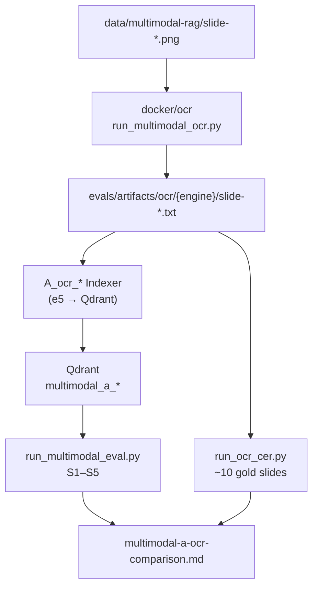

# Task 04: Метод A·OCR — два движка + CER

> **Sprint:** [../../README.md](../../README.md#задача-04-метод-aocr--два-движка--cer-)
> **Тип:** feat  
> **Ветка:** `feat/multimodal-04-ocr-engines`  
> **Spec:** без spec; опирается на [analysis.md](../../analysis.md), контракт [task 03](../03-rag-pipeline-contract/summary.md), baseline [multimodal-baseline.md](../../../../../evals/reports/multimodal-baseline.md)  
> **Статус планирования:** ✅ одобрено; реализация в процессе (EasyOCR spike — после освобождения диска / CPU Docker rebuild)

---

## Цель

Реализовать **два OCR-движка** под контракт `Indexer` (Tesseract vs современный CPU-OCR), сохранить артефакты для ручного разбора, посчитать **CER** на ~10 слайдах, прогнать **сегментный retrieval eval** + cost; зафиксировать, **какой движок лучше на русском визуальном контенте** и когда метод A оправдан vs baseline.

---

## Ключевые решения

| Решение | Выбор | Обоснование |
|---------|-------|-------------|
| Современный движок | **EasyOCR (CPU)** — после spike; fallback PaddleOCR | pip + Docker без GPU; явная поддержка `ru`+`en`; проще Paddle/docTR на Windows/WSL |
| Запуск OCR | **Docker-first** (`docker/ocr/`), локальный fallback | Избежать tesseract/easyocr deps на хосте; единый образ для CI и WSL |
| Имена артефактов | `slide-{NN}.txt` (как baseline) | Совместимость с `BaselineTextIndexer._SLIDE_FILE`; README `slide_{NN}` — опечатка |
| OCR vs index | **2 фазы**: OCR → artifacts; indexer читает `corpus_dir` | Embed/e5 на хосте (уже работает); тяжёлые модели только в контейнере |
| Preprocessing | invert + upscale для тёмных слайдов (общий модуль) | Риск из analysis/README: тёмная тема ломает Tesseract |
| CER | `rapidfuzz` Levenshtein / `len(ref)` после нормализации | Уже в `pyproject.toml`; **>100%** допустим при галлюцинации символов |
| Эталоны CER | YAML `evals/datasets/multimodal/ocr-gold/` — 10 слайдов | Ручная транскрипция ключевых фрагментов из PNG (не notes.md) |

---

## Контекст: что есть после задачи 03

| Слой | Состояние |
|------|-----------|
| `INDEXER_REGISTRY` | `A_ocr_tesseract` / `A_ocr_modern` → `StubIndexer` (NotImplemented) |
| Eval-config | `multimodal-a-ocr-*.yaml` — `corpus_dir: evals/artifacts/ocr/{tesseract\|modern}` |
| Downstream | `index_multimodal.py`, `run_multimodal_eval.py`, `build_multimodal_report.py` — готовы |
| Tesseract (PDF) | `backend/app/rag/pdf_text.py` — `_ocr_page_tesseract` через PyMuPDF; **переиспользовать идеи**, не coupling |
| PNG корпус | `data/multimodal-rag/slide-{01..66}.png` |
| Baseline «боль» | S2 Recall@5=0.455; north-star: s2-01 (49%), s2-07 (2028), s2-08 (~50%) |

**Ожидание метода A:** прирост на **S2_chart** (числа в барах/кривых) и частично **S1_text**; S3_layout — слабее (стрелки/pipeline); cost ≈ $0 OCR + 1 embed batch.

---

## Архитектура

### Поток данных



### Контракт OCR-движка (новый, отдельно от Indexer)

```python
class OcrEngine(Protocol):
    name: str  # "tesseract" | "modern"

    def recognize(self, image_path: Path) -> str: ...
```

- Реализации: `TesseractEngine`, `EasyOcrEngine` (registry `OCR_ENGINE_REGISTRY`).
- Общий `preprocess_image(path, profile="dark_theme")` → PIL Image / bytes.
- Нормализация текста для CER: lowercase, NFKC, collapse whitespace, strip zero-width.

### Indexer A (общая база + два класса)

`OcrTextIndexer` (base):

1. Проверить `corpus_dir`: 66× `slide-*.txt`; если нет / `--force` / `options.force_ocr` → вызвать OCR batch (локально или через subprocess `docker compose run ocr …`).
2. Читать тексты из `corpus_dir` — **та же логика embed/Qdrant**, что `BaselineTextIndexer` (DRY: вынести `_upsert_slides_to_qdrant` или наследование композицией).
3. `IndexCost`: `api_calls=1` (embed batch), `est_cost_usd≈0.002`, `build_time_s` **включает OCR + embed**.

| Класс | `method` | collection (из yaml) |
|-------|----------|----------------------|
| `TesseractOcrIndexer` | `A_ocr_tesseract` | `multimodal_a_tesseract` |
| `ModernOcrIndexer` | `A_ocr_modern` | `multimodal_a_modern` |

### Eval-config (расширение)

```yaml
indexer:
  method: A_ocr_tesseract
  corpus_dir: evals/artifacts/ocr/tesseract
  options:
    slide_dir: data/multimodal-rag
    languages: rus+eng          # tesseract
    modern_langs: ["ru", "en"]  # easyocr
    preprocess: dark_theme
    ocr_via_docker: true        # default true on Windows; false in Linux CI if deps native
```

Аналогично для `A_ocr_modern` → `evals/artifacts/ocr/modern`.

---

## Spike: выбор modern-движка (шаг 0, блокирующий)

Перед финализацией кода — прогон в Docker на **3 слайдах** (2 текст, 10 chart, 11 table):

| Кандидат | Критерий pass |
|----------|---------------|
| EasyOCR CPU | `pip install` в образе; `reader.readtext(..., gpu=False)`; русский текст читаем |
| PaddleOCR | fallback если EasyOCR падает на deps/ARM |
| docTR | только если оба выше fail |

**Фиксация в summary:** какой движок выбран и почему. В plan — дефолт **EasyOCR**.

---

## Docker OCR

```
docker/ocr/
├── Dockerfile          # python:3.11-slim + tesseract-ocr-rus/eng + easyocr deps
├── compose.ocr.yml     # mount repo → /work, env SLIDE_DIR, ENGINE, OUT_DIR
└── entrypoint.sh       # uv run python evals/scripts/run_multimodal_ocr.py ...
```

- Volume: `../:/work` — артефакты пишутся в `evals/artifacts/ocr/`.
- Образ **не** включает backend FastAPI — только OCR-скрипт + минимальные deps.
- Make: `ocr-multimodal-tesseract`, `ocr-multimodal-modern` (WSL docker + `make.ps1` зеркало).

---

## CER: эталоны и формула

### Выборка ~10 слайдов (репрезентативная)

| # | Слайд | Тип | Зачем |
|---|-------|-----|-------|
| 1 | 2 | text | Чистый русский текст, профиль |
| 2 | 9 | chart | Кривая 2024/2026/2028, % |
| 3 | 10 | chart | Бары отделов 49/47/35/31/30% |
| 4 | 11 | chart/table | СберАналитика, 70% документооборот |
| 5 | 15 | layout | Лестница 5 ступеней |
| 6 | 18 | text | Кейс, длинные подписи |
| 7 | 32 | layout | Матрица 2×2, квадрант |
| 8 | 38 | layout | 5 слоёв платформы |
| 9 | 44 | chart | 24/52/24 + профессии |
| 10 | 61 | layout | Pipeline банковский агент |

Файл: `evals/datasets/multimodal/ocr-gold/v001_2026-07-05.yaml` — поля `slide_number`, `reference_text`, `content_type`, `notes`.

**Эталон:** ручная транскрипция **видимого текста с PNG** (агент + ревью пользователя на 2–3 слайдах). Не копировать `notes.md` целиком — там нет точных чисел с осей.

### Формула

```python
def cer(reference: str, hypothesis: str) -> float:
    ref = normalize_for_cer(reference)
    hyp = normalize_for_cer(hypothesis)
    if not ref:
        return float("inf") if hyp else 0.0
    return levenshtein(ref, hyp) / len(ref)  # может быть > 1.0
```

Отчёт: таблица slide × engine × CER + mean/median по 10; отдельно **не усреднять** retrieval.

---

## Eval retrieval + cost

Для **каждого** движка:

```bash
make ocr-multimodal-tesseract          # docker OCR → artifacts
make index-multimodal CONFIG=evals/configs/multimodal-a-ocr-tesseract.yaml
make eval-multimodal CONFIG=evals/configs/multimodal-a-ocr-tesseract.yaml
# → multimodal-a-ocr-tesseract.md (per segment S1–S5)

make ocr-multimodal-modern
make index-multimodal CONFIG=evals/configs/multimodal-a-ocr-modern.yaml
make eval-multimodal CONFIG=evals/configs/multimodal-a-ocr-modern.yaml
```

Сводка: `evals/scripts/build_multimodal_ocr_comparison.py` → `evals/reports/multimodal-a-ocr-comparison.md`:

- Таблица **config × segment** (Recall@5, nDCG@5, MRR; S4 set-recall; S5 refusal)
- **Cost:** `build_time_s`, `index_size_mb`, `est_cost_usd` (оба движка)
- **CER table** (10 slides × 2 engines)
- **Вердикт:** лучший движок на русском; vs baseline (delta S2); когда A оправдан

North-star items для qualitative check: **s2-01, s2-07, s2-08** — попали ли 49%, 2028, 50% в OCR-текст slide 10/9.

---

## Состав работ

- [ ] **Spike:** EasyOCR vs fallback в `docker/ocr/` на 3 слайдах; зафиксировать modern-движок
- [ ] `backend/app/rag/ocr/` — protocol, normalize, preprocess, tesseract, easyocr (+ registry)
- [ ] `docker/ocr/` — Dockerfile, compose, entrypoint
- [ ] `evals/scripts/run_multimodal_ocr.py` — batch OCR 66 PNG → `evals/artifacts/ocr/{engine}/`
- [ ] `backend/app/rag/indexers/a_ocr_base.py`, `a_ocr_tesseract.py`, `a_ocr_modern.py`
- [ ] Обновить `INDEXER_REGISTRY` (убрать stubs для A)
- [ ] `evals/datasets/multimodal/ocr-gold/v001_2026-07-05.yaml` — 10 эталонов
- [ ] `evals/scripts/run_ocr_cer.py` + `evals/scripts/build_multimodal_ocr_comparison.py`
- [ ] Расширить `multimodal-a-ocr-*.yaml` (`indexer.options`)
- [ ] Make / make.ps1: `ocr-multimodal-*`, aliases `index-multimodal-a-ocr-*`, `eval-multimodal-a-ocr`
- [ ] Тесты: CER normalize/formula; mock OCR engine; registry; smoke 1-slide indexer (mock embed/Qdrant)
- [ ] Прогон полного контура обоих движков + comparison report
- [ ] Самопроверка по DoD

---

## Критерии готовности (DoD)

**Агент проверяет:**

| # | Критерий | Способ проверки |
|---|----------|-----------------|
| 1 | Оба indexer в `INDEXER_REGISTRY`, не stub | `pytest backend/tests/test_indexer_contract.py -k ocr` |
| 2 | Артефакты OCR: 66×2 файла | `(Get-ChildItem evals/artifacts/ocr/tesseract).Count -eq 66` и modern |
| 3 | CER формула + 10 слайдов × 2 движка | `uv run python evals/scripts/run_ocr_cer.py` → table в stdout/report |
| 4 | Сегментные отчёты обоих движков | `evals/reports/multimodal-a-ocr-tesseract.md`, `...-modern.md` |
| 5 | `build_time_s` / cost в comparison | `multimodal-a-ocr-comparison.md` |
| 6 | Lint + тесты | `make test-backend`; `pytest evals/tests/test_ocr_cer.py` (новый) |

**Пользователь проверяет:**

- 3–5 OCR-файлов на тёмной теме / русском — качество правдоподобно
- CER-слайды репрезентативны (текст + chart + layout)
- Вердикт «победитель A» согласован или оба остаются в матрице task 08
- ⛔ **СТОП** — апрув перед задачей 05

---

## Артефакты

| Путь | Назначение |
|------|------------|
| `backend/app/rag/ocr/*.py` | OCR contract + engines + preprocess |
| `backend/app/rag/indexers/a_ocr_*.py` | Indexers A_tesseract / A_modern |
| `backend/tests/test_ocr_*.py` | Unit-тесты OCR/CER/indexer |
| `docker/ocr/*` | Docker-first OCR runner |
| `evals/scripts/run_multimodal_ocr.py` | Batch OCR CLI |
| `evals/scripts/run_ocr_cer.py` | CER calculator |
| `evals/scripts/build_multimodal_ocr_comparison.py` | Сводный отчёт A |
| `evals/datasets/multimodal/ocr-gold/v001_2026-07-05.yaml` | Gold text ~10 slides |
| `evals/artifacts/ocr/tesseract/slide-*.txt` | Артефакты Tesseract |
| `evals/artifacts/ocr/modern/slide-*.txt` | Артефакты modern |
| `evals/reports/multimodal-a-ocr-*.md` | Per-engine + comparison |
| `evals/configs/multimodal-a-ocr-*.yaml` | options.slide_dir, docker flag |
| `Makefile`, `make.ps1` | ocr / index / eval targets |
| `.gitignore` | при необходимости — не коммитить easyocr model cache |

**Skills (при реализации):** `python-design-patterns`, `python-testing-patterns`, `modern-python`.

---

## Scope

**Трогаем:** файлы из таблицы «Арteфакты»; `registry.py`; stub entries для A; минимальное DRY в `baseline.py` только если вынос upsert без изменения поведения baseline.

**НЕ трогаем:**

- Методы B/C/D (stubs 05–07)
- Датасеты S1–S5 eval items / gold_pages (только новый ocr-gold)
- Production `RagIndexer`, agent routing
- `metrics-map.md` (CER уже описан в task 02)
- Neo4j, Postgres, frontend

---

## Риски и митигация

| Риск | Митигация |
|------|-----------|
| Tesseract на тёмном фоне — пустой/мусорный текст | preprocess invert; DPI 150–200; артефакты для глаз |
| EasyOCR медленный на 66 слайдах | Docker один раз; кэш артефактов; `build_time_s` честный |
| CER gold неточный | YAML + ревью 2–3 слайдов пользователем; notes в gold yaml |
| Windows без tesseract на хосте | `ocr_via_docker: true` default; документировать в comparison |
| Hallucinated chars → CER > 100% | Документировать в report; не clamp |
| OCR улучшает S2, но ломает S3 noise | Segment table покажет trade-off; не усреднять |

---

## Открытые вопросы

- [x] **Modern engine:** EasyOCR (CPU), Docker-first
- [x] **Gold text:** агент черновик → пользователь правит 2–3 слайда (9, 10, 11 помечены REVIEW)
- [x] **Артефакты:** не в git; gold YAML + scripts + reports

---

## Порядок реализации (после «ок»)

1. Spike Docker + выбор modern engine  
2. OCR module + `run_multimodal_ocr.py` + docker/  
3. Gold YAML (черновик эталонов)  
4. `a_ocr_*` indexers + registry  
5. `run_ocr_cer.py` + unit tests  
6. Make targets → полный OCR 66×2 → index → eval  
7. `build_multimodal_ocr_comparison.md` + вердикт  
8. Self-check DoD → показать пользователю → ⛔ ждать «ок» → `summary.md`
