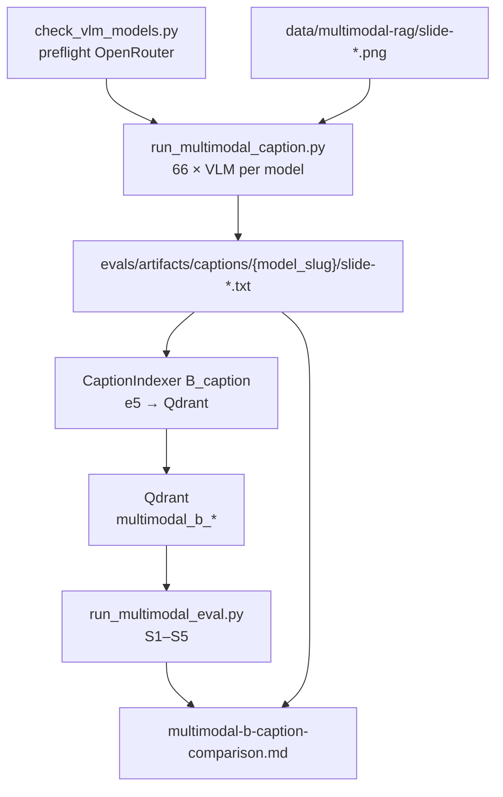

# Task 05: Метод B·caption — несколько VLM + сравнение

> **Sprint:** [../../README.md](../../README.md#задача-05-метод-bcaption--несколько-vlm--сравнение-)
> **Тип:** feat  
> **Ветка:** `feat/multimodal-05-caption-vlm`  
> **Spec:** без spec; опирается на [analysis.md](../../analysis.md), контракт [task 03](../03-rag-pipeline-contract/summary.md), OCR [task 04](../04-method-a-ocr/plan.md), baseline [multimodal-baseline.md](../../../../../evals/reports/multimodal-baseline.md)  
> **Статус планирования:** ✅ одобрено; реализация завершена (ожидает DoD-апрува)

---

## Цель

Реализовать **caption-indexer** с параметром `vlm_model`, прогнать **две VLM** через OpenRouter (малая бесплатная vs более мощная), сохранить подписи в артефакты **по папкам модели**, проиндексировать в **разные Qdrant-коллекции**, выполнить **сегментный eval + cost/time** и ответить: **оправдывает ли мощная модель прирост качества** (особенно S2_chart / S3_layout) и **как влияет на скорость**.

---

## Ключевые решения

| Решение | Выбор | Обоснование |
|---------|-------|-------------|
| Модель 1 (малая, дефолт) | `nvidia/nemotron-nano-12b-v2-vl:free` | Бесплатно на OpenRouter; уже в `multimodal-b-caption-nemotron.yaml` |
| Модель 2 (мощнее) | **`google/gemini-2.5-flash-lite`** (primary) | Доступна на OpenRouter (preflight ✅); дешевле `gemini-2.5-flash`; достаточный «апгрейд» vs free 12B |
| Fallback модели 2 | `google/gemini-2.5-flash` | Если flash-lite недоступна/429 или нет delta на spike — следующий кандидат (preflight ✅) |
| Провайдер | **OpenRouter** `/chat/completions` + vision | Уже есть паттерн в `pdf_text.py`; единый ключ `OPENROUTER_API_KEY` |
| Имена артефактов | `slide-{NN}.txt` (как OCR/baseline) | Совместимость с `load_slide_texts()`; README `slide_{NN}` — опечатка |
| Папки артефактов | `evals/artifacts/captions/{model_slug}/` | `nemotron-nano-12b-v2-vl`, `gemini-2.5-flash-lite` — из yaml `corpus_dir` |
| Caption vs index | **2 фазы**: VLM batch → artifacts; indexer читает `corpus_dir` → e5 → Qdrant | Аналог task 04; артефакты для разбора галлюцинаций без переиндексации |
| Промпт VLM | Структурированное описание слайда **на русском**; явно: числа, %, подписи осей, layout | Снижает «сглаживание»; риск галлюцинаций — фиксируем в артефактах, не правим gold |
| Параметр модели | `indexer.options.vlm_model` + env override `CAPTION_MODEL` | Контракт task 03; один `B_caption` indexer, разные yaml |
| Коллекции | `multimodal_b_nemotron`, `multimodal_b_gemini` | Уже в eval-config; изолированное сравнение |
| Cost | `api_calls = 66 VLM + 1 embed`; `est_cost_usd` из usage OpenRouter + embed ~$0.002 | Nemotron free → ~$0 VLM; Gemini — по токенам × pricing API |

### Preflight OpenRouter (2026-07-05)

Публичный `GET https://openrouter.ai/api/v1/models`:

| model id | status | prompt $/token | completion $/token |
|----------|--------|----------------|---------------------|
| `nvidia/nemotron-nano-12b-v2-vl:free` | ✅ listed | 0 | 0 |
| `google/gemini-2.5-flash-lite` | ✅ listed | 1e-7 | 4e-7 |
| `google/gemini-2.5-flash` | ✅ listed (fallback) | 3e-7 | 2.5e-6 |

Перед полным прогоном — **`check_vlm_models.py`**: HEAD/mini chat на 1 слайде с ключом пользователя (не только catalog).

---

## Контекст: что есть после задачи 04

| Слой | Состояние |
|------|-----------|
| `INDEXER_REGISTRY` | `B_caption` → `StubIndexer` |
| Eval-config | `multimodal-b-caption-nemotron.yaml`, `multimodal-b-caption-gemini.yaml` — `vlm_model` в options |
| Downstream | `index_multimodal.py`, `run_multimodal_eval.py`, `build_multimodal_report.py` — готовы |
| Shared embed | `slide_embed.py` — `load_slide_texts`, `upsert_slide_texts_to_qdrant` |
| OCR pattern | `a_ocr_base.py` — ensure artifacts → embed; `run_multimodal_ocr.py` — batch CLI |
| Vision API | `pdf_text.py` — OpenRouter multimodal payload (JPEG base64) — **переиспользовать идеи** |
| Baseline «боль» | S2 Recall@5=0.455; north-star: s2-01 (49%), s2-07 (2028), s2-08 (~50%) |
| Analysis риск B | Галлюцинации **~40%, 49%, 3–7×, −37%**; слайды **9, 10, 11, 44** — приоритет ручного разбора |

**Ожидание метода B:** прирост на **S2_chart** (числа в барах/кривых) и **S3_layout** (схемы); S1 может быть ≈ baseline; S5 — не улучшать (риск «ответил»). Trade-off: **стоимость 66× VLM** vs OCR $0.

---

## Архитектура

### Поток данных



### Контракт caption (новый модуль)

```python
class VlmCaptioner(Protocol):
    model_id: str

    def caption_slide(self, image_path: Path, *, prompt: str | None = None) -> str: ...
```

- Реализация: `OpenRouterVlmCaptioner` — httpx POST `/chat/completions`, image as `data:image/png;base64,...`.
- Registry: `CAPTION_MODEL_REGISTRY` или фабрика по `model_id` (один класс, model в конструкторе).
- Batch: `run_caption_batch(slide_dir, out_dir, model_id, slides?, force?)` — параллелизм **ограниченный** (default concurrency=2–4, rate-limit OpenRouter).

### Промпт caption (дефолт)

```
Опиши содержимое слайда презентации на русском языке для поиска по базе знаний.
Включи: заголовок, все видимые числа и проценты дословно, подписи осей/баров/легенд,
структуру схемы (стрелки, порядок блоков, что где расположено).
Не добавляй факты, которых нет на слайде. Только текст описания, без markdown-обёртки.
```

Temperature **0**; timeout из `Settings.llm_timeout_sec`.

### Indexer B

`CaptionIndexer` (один класс, `method = "B_caption"`):

1. `corpus_dir` из yaml; `vlm_model` из `options` или `CAPTION_MODEL` env.
2. Если 66× `slide-*.txt` отсутствуют / `force_caption` → `FileNotFoundError` с hint `make caption-multimodal-*` (как OCR).
3. `load_slide_texts(corpus_dir, source_prefix=f"caption/{model_slug}")` → `upsert_slide_texts_to_qdrant`.
4. `IndexCost`:
   - `build_time_s` = caption batch (если в indexer) **или** только embed — caption time в sidecar JSON batch-скрипта; **полный wall time** = caption + embed (честно в `{config_id}-index-cost.json`).
   - `api_calls` = 66 + 1.
   - `est_cost_usd` = sum(VLM usage) + 0.002 embed; nemotron → VLM cost 0.

### Eval-config (без смены collection/id)

```yaml
# multimodal-b-caption-nemotron.yaml
indexer:
  method: B_caption
  corpus_dir: evals/artifacts/captions/nemotron-nano-12b-v2-vl
  options:
    vlm_model: nvidia/nemotron-nano-12b-v2-vl:free
    slide_dir: data/multimodal-rag
    caption_concurrency: 3

# multimodal-b-caption-gemini.yaml
indexer:
  method: B_caption
  corpus_dir: evals/artifacts/captions/gemini-2.5-flash-lite
  options:
    vlm_model: google/gemini-2.5-flash-lite
```

`model_slug` = последний сегмент `corpus_dir` (не парсить `/` в model id).

---

## Разбор галлюцинаций на числах

Артефакты — основной инструмент; автоматическая sanity-check **опционально** (не блокирует DoD):

| Слайд | Критичные числа (из analysis) | Eval items |
|-------|------------------------------|------------|
| 9 | 2024≈10%, 2026≈40%, 2028=100% | s2-05, s2-06 |
| 10 | 49%, 47%, 72%, 84% | s2-01, s2-02 |
| 11 | 70%, 55%, −37% | s2-03, s2-04 |
| 44 | 24%, 52%, 24% | s2-07, s2-08 |

Скрипт `evals/scripts/audit_caption_numbers.py` (lightweight):

- Читает captions обеих моделей для слайдов 9, 10, 11, 44.
- Проверяет **наличие подстрок** gold-чисел из `analysis.md` / ocr-gold (не CER).
- Markdown-таблица в `multimodal-b-caption-comparison.md` § «Numeric sanity (S2 slides)».

**Правило:** эталоны датасета **не менять** под лучший caption.

---

## Eval retrieval + cost + скорость

Для **каждой** модели:

```bash
make check-vlm-models                    # preflight catalog + 1-slide probe
make caption-multimodal-nemotron         # 66 captions → artifacts
make index-multimodal CONFIG=evals/configs/multimodal-b-caption-nemotron.yaml
make eval-multimodal CONFIG=evals/configs/multimodal-b-caption-nemotron.yaml
# → evals/reports/multimodal-b-caption-nemotron.md

make caption-multimodal-gemini
make index-multimodal CONFIG=evals/configs/multimodal-b-caption-gemini.yaml
make eval-multimodal CONFIG=evals/configs/multimodal-b-caption-gemini.yaml
# → evals/reports/multimodal-b-caption-gemini.md
```

Сводка:

```bash
make eval-multimodal-b-caption           # alias: обе модели + comparison report
```

`evals/scripts/build_multimodal_caption_comparison.py` → `evals/reports/multimodal-b-caption-comparison.md`:

| Секция | Содержание |
|--------|------------|
| Index cost | `build_time_s`, `index_size_mb`, `est_cost_usd`, `api_calls` × 2 модели |
| Caption speed | sec/slide, total caption wall time (из batch metadata JSON) |
| Segment table | **config × S1–S5** — Recall@5, nDCG@5, MRR; S4 set-recall; S5 refusal |
| vs baseline | delta по S2/S3 (не среднее по датасету) |
| vs best OCR (task 04) | optional row — если OCR reports есть |
| Numeric sanity | slides 9,10,11,44 — substring hits |
| **Вердикт** | Оправдан ли Gemini vs Nemotron: **Δ nDCG@5 на S2/S3** vs **× cost и × build_time** |

North-star qualitative: попали ли **49%, 2028, 50%** в caption slide 10/9/44.

---

## Состав работ

- [ ] **Preflight:** `evals/scripts/check_vlm_models.py` — catalog + optional 1-slide probe (`--probe`)
- [ ] `backend/app/rag/caption/` — protocol, `openrouter_vlm.py`, `batch.py`, `prompts.py`
- [ ] `evals/scripts/run_multimodal_caption.py` — batch CLI (mirror `run_multimodal_ocr.py`)
- [ ] `backend/app/rag/indexers/b_caption.py` — `CaptionIndexer`; обновить `INDEXER_REGISTRY`
- [ ] Sidecar `{model_slug}-caption-meta.json` — wall time, tokens, est_cost per batch
- [ ] `evals/scripts/audit_caption_numbers.py` — optional numeric sanity (4 slides × 2 models)
- [ ] `evals/scripts/build_multimodal_caption_comparison.py` — comparison report
- [ ] Make / make.ps1: `check-vlm-models`, `caption-multimodal-nemotron`, `caption-multimodal-gemini`, `eval-multimodal-b-caption`
- [ ] `.gitignore`: `evals/artifacts/captions/`; `.env.example`: `CAPTION_MODEL` comment
- [ ] Тесты: mock VLM response; registry; caption batch 1 slide; indexer smoke (mock embed/Qdrant)
- [ ] Полный прогон обеих моделей + comparison report
- [ ] Самопроверка по DoD

---

## Критерии готовности (DoD)

**Агент проверяет:**

| # | Критерий | Способ проверки |
|---|----------|-----------------|
| 1 | ≥ 2 VLM через один `B_caption` с разным `vlm_model` | 2 yaml + 2 collections в Qdrant |
| 2 | Captions 66×2 в `evals/artifacts/captions/{model_slug}/` | `(Get-ChildItem .../nemotron...).Count -eq 66` и gemini |
| 3 | Сегментные отчёты per model | `multimodal-b-caption-nemotron.md`, `...-gemini.md` |
| 4 | `est_cost_usd`, `api_calls`, `build_time_s` в IndexCost / comparison | `{config_id}-index-cost.json` + comparison § cost |
| 5 | Сравнительная таблица + вердикт cost/quality/speed | `multimodal-b-caption-comparison.md` |
| 6 | Preflight моделей перед прогоном | `make check-vlm-models` exit 0 |
| 7 | Lint + тесты | `pytest backend/tests/test_caption_*.py`; registry contract |

**Пользователь проверяет:**

- Выборочно captions на **S2** (слайды 9–11, 44): системные галлюцинации чисел
- Прирост Gemini оправдан ценой и временем — или нет (вердикт в comparison)
- Эталоны датасета **не правились** под caption
- ⛔ **СТОП** — апрув перед задачей 06

---

## Артефакты

| Путь | Назначение |
|------|------------|
| `backend/app/rag/caption/*.py` | VLM caption contract + OpenRouter client + batch |
| `backend/app/rag/indexers/b_caption.py` | Indexer B_caption |
| `backend/tests/test_caption_*.py` | Unit-тесты caption/indexer |
| `evals/scripts/run_multimodal_caption.py` | Batch caption CLI |
| `evals/scripts/check_vlm_models.py` | Preflight OpenRouter models |
| `evals/scripts/audit_caption_numbers.py` | Numeric sanity S2 slides |
| `evals/scripts/build_multimodal_caption_comparison.py` | Сводный отчёт B |
| `evals/artifacts/captions/nemotron-nano-12b-v2-vl/slide-*.txt` | Captions модель 1 (gitignored) |
| `evals/artifacts/captions/gemini-2.5-flash-lite/slide-*.txt` | Captions модель 2 (gitignored) |
| `evals/reports/multimodal-b-caption-*.md` | Per-model + comparison |
| `evals/reports/multimodal-b-caption-*-index-cost.json` | IndexCost snapshots |
| `evals/configs/multimodal-b-caption-*.yaml` | options (минимальные правки если нужно) |
| `Makefile`, `make.ps1` | caption / eval targets |
| `.gitignore`, `.env.example` | captions artifacts; CAPTION_MODEL |

**Skills (при реализации):** `python-design-patterns`, `python-testing-patterns`, `modern-python`.

---

## Scope

**Трогаем:** файлы из таблицы «Артефакты»; `registry.py` (B_caption → real); stub entry B.

**НЕ трогаем:**

- Методы C/D (stubs 06–07)
- Датасеты S1–S5 eval items / `gold_pages`
- Production `RagIndexer`, agent routing
- Neo4j, Postgres, frontend
- `metrics-map.md` (ingestion для B — ручной разбор артефактов, не новая метрика)

---

## Риски и митигация

| Риск | Митигация |
|------|-----------|
| VLM галлюцинирует числа (analysis) | Артефакты + audit slides 9/10/11/44; промпт «числа дословно»; не править gold |
| Nemotron free — rate limit / очередь | concurrency=2–3; retry с backoff; caption-meta логирует failures |
| Gemini 429 / недоступна | preflight probe; fallback `google/gemini-2.5-flash` — зафиксировать в summary |
| Долгий build (66× VLM) | Кэш артефактов; skip если 66 files exist; `build_time_s` честный |
| Caption улучшает S2, шумит S5 | Segment table; S5 refusal rate — не усреднять |
| Большие PNG → token overflow | Resize max side 1536 перед base64 (env `CAPTION_MAX_SIDE`, default 1536) |
| Стоимость недооценена | Парсить `usage` из OpenRouter response; fallback estimate по pricing API |

---

## Открытые вопросы

- [x] **Модель 1:** `nvidia/nemotron-nano-12b-v2-vl:free` (дефолт)
- [x] **Модель 2:** `google/gemini-2.5-flash-lite` (primary); fallback `google/gemini-2.5-flash`
- [x] **Preflight:** catalog API ✅; probe с ключом — в `check_vlm_models.py`
- [x] **Имена файлов:** `slide-{NN}.txt` (не `slide_{NN}`)
- [ ] **Resize PNG:** 1536px default — изменить если probe покажет обрезку мелкого текста

---

## Порядок реализации (после «ок»)

1. `check_vlm_models.py` + probe 1 slide обеих моделей  
2. Модуль `caption/` + `run_multimodal_caption.py`  
3. Spike: 3 слайда (2 text, 10 chart, 32 layout) — качество + latency  
4. `b_caption.py` + registry  
5. Make targets → полный caption 66×2 → index → eval  
6. `audit_caption_numbers.py` + `build_multimodal_caption_comparison.py`  
7. Self-check DoD → показать пользователю → ⛔ ждать «ок» → `summary.md`
