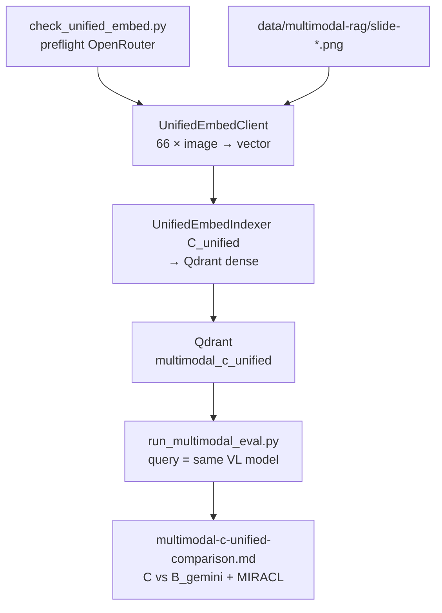

# Task 06: Метод C·unified — image-embed + проверка MIRACL-Vision

> **Sprint:** [../../README.md](../../README.md#задача-06-метод-cunified--image-embed--проверка-miracl-vision-)
> **Тип:** feat  
> **Ветка:** `feat/multimodal-06-unified-embed`  
> **Spec:** без spec; опирается на [analysis.md](../../analysis.md), контракт [task 03](../03-rag-pipeline-contract/summary.md), caption [task 05](../05-method-b-caption/plan.md), baseline [multimodal-baseline.md](../../../../../evals/reports/multimodal-baseline.md)  
> **Статус планирования:** 📋 ожидает «ок»

---

## Цель

Реализовать **unified image-embed indexer**: один dense-вектор на слайд (PNG → VL-embed → Qdrant), запросы тем же эмбеддером (text-only); прогнать **сегментный eval** и **численно проверить гипотезу MIRACL-Vision** — что unified visual embed на **русском** визуально-плотном корпусе может **проиграть caption+VLM (метод B)**.

---

## Ключевые решения

| Решение | Выбор | Обоснование |
|---------|-------|-------------|
| Модель | `nvidia/llama-nemotron-embed-vl-1b-v2:free` | Уже в `multimodal-c-unified.yaml`; free на OpenRouter |
| Провайдер index + query | **OpenRouter** `POST /api/v1/embeddings` | Единый `OPENROUTER_API_KEY`; документирован multimodal input |
| Вектор на документ | **1 dense vector / slide** (image-only input) | Контракт C: без caption, без e5 |
| Вектор на запрос | **1 dense vector** (text-only input, **та же модель**) | Cross-modal retrieval image↔text |
| Коллекция | `multimodal_c_unified` | Из eval-config |
| Resize PNG | `C_MAX_SIDE` env, default **1536** (как caption) | Переиспользовать `resize_for_vlm()` из `caption/image.py` |
| Downstream eval | Расширить `run_multimodal_eval.py`: embed query через **config.vector_db.embedding_model**, не e5 | Сейчас hardcoded `_e5_query` — блокер для C/D |
| Сравнение | C vs **лучший B** = `multimodal-b-caption-gemini` (Gemini 2.5 Flash) | Вердикт task 05: +0.484 nDCG S2, +0.689 S3 vs Nemotron |
| MIRACL-Vision | Явная секция в report: per-segment Δ(C − B), акцент **S1_text / S2_chart / S3_layout** | Гипотеза из analysis: кириллица, мелкий текст, layout без OCR |
| Cost | `api_calls = 66 image + 1`; `est_cost_usd` ≈ $0 (free tier) + embed batch overhead | `is_multivector=false` |

### OpenRouter Embeddings API (C)

**Index (document = image):**

```json
{
  "model": "nvidia/llama-nemotron-embed-vl-1b-v2:free",
  "input": [{
    "content": [
      {"type": "image_url", "image_url": {"url": "data:image/png;base64,..."}}
    ]
  }],
  "encoding_format": "float"
}
```

**Query (text-only, та же модель):**

```json
{
  "model": "nvidia/llama-nemotron-embed-vl-1b-v2:free",
  "input": [{"content": [{"type": "text", "text": "<question>"}]}],
  "encoding_format": "float"
}
```

Preflight: `check_vlm_models.py` расширить probe embeddings (1 slide + 1 text query) или отдельный `check_unified_embed.py`.

---

## Контекст: что есть после задачи 05

| Слой | Состояние |
|------|-----------|
| `INDEXER_REGISTRY` | `C_unified` → `StubIndexer` |
| Eval-config | `multimodal-c-unified.yaml` — `embed_model`, collection готовы |
| Downstream | `index_multimodal.py`, `build_multimodal_report.py` — готовы |
| Eval runner | `run_multimodal_eval.py` — **только e5**; нужен refactor |
| Caption pattern | `caption/image.py` — resize + base64 data URL |
| B (Gemini) baseline | S2 nDCG@5=**0.944**, S3=**0.689**, S1=0.667, S4=0.752 |
| Analysis гипотеза C | Просадка на **СЭД, ФОТ, УНФ, Грунтик**, layout **15/61**, мелкий «СберАналитика» |

**Ожидание метода C:** возможный прирост на **S3_layout** (визуальная схема без текста) vs baseline; **риск проигрыша B** на **S1_text / S2_chart** из-за MIRACL-Vision / слабой кириллицы в visual embed.

---

## Архитектура

### Поток данных



### Модуль `backend/app/rag/embed/unified_vl.py`

```python
class UnifiedVlEmbedder(Protocol):
    model_id: str

    def embed_image(self, image_path: Path, *, max_side: int) -> list[float]: ...
    def embed_query(self, text: str) -> list[float]: ...
```

- Реализация: `OpenRouterUnifiedEmbedder` — httpx POST `/embeddings`, reuse `image_to_data_url()`.
- Batch: `embed_slides_batch(slide_dir, *, model_id, max_side, concurrency=2)` — rate-limit friendly.
- Dimension: из первого response (`len(embedding)`), создать Qdrant `VectorParams(size=dim, COSINE)`.

### Indexer C

`UnifiedEmbedIndexer` (`method = "C_unified"`):

1. `corpus_dir` = `data/multimodal-rag` (PNG, не txt).
2. Для каждого `slide-{NN}.png`: resize → OpenRouter image embed → `PointStruct`.
3. Payload: `{slide_number, source_path, text: "# slide-NN\n[unified-image-embed]"}` — для совместимости eval span parsing.
4. `IndexCost`:
   - `build_time_s` — wall time 66 embeds + Qdrant upsert
   - `api_calls = 66` (query embeds at eval time, не в index cost)
   - `index_size_mb` — через `collection_size_mb()` (dense, 1 vec × 66)
   - `is_multivector = false`

### Eval runner (общий refactor для C и D)

Вынести `retrieve_pages()` → strategy по `config.indexer.method`:

| method | Query embedding |
|--------|-----------------|
| baseline, A_*, B_caption | e5 `query: {text}` |
| C_unified | OpenRouter VL `embed_query(text)` |
| D_jina_multivector | Jina API text multivector (task 07) |

Параметры embed-модели брать из `config.vector_db.embedding_model`.

---

## Гипотеза MIRACL-Vision (что фиксируем числами)

> Visual/document embedders, обученные преимущественно на English-heavy corpora, **недостаточно хорошо** матчат русскоязычные визуальные слайды с text-query — эффект, описанный в MIRACL-Vision и отражённый в [analysis.md](../../analysis.md).

**Проверка (не одно среднее):**

| Сегмент | Ожидание C vs B_gemini | Eval items-якоря |
|---------|------------------------|------------------|
| S1_text | C ≤ B (кириллица, аббревиатуры) | mm-001..008 |
| S2_chart | C ≤ B (числа в барах без OCR) | s2-01 (49%), s2-07 (2028), s2-08 (~50%) |
| S3_layout | C ≈ или > B? (layout-only) | mm-024 (оператор 61), mm-025 (Грунтик) |
| S4_multi | C vs B — set-recall | mm-028 (5 ступеней) |
| S5 | C не должен «улучшать» refusal | unanswerable items |

**Decision note в report** (шаблон):

- Если `Δ nDCG@5(C − B) < 0` на **≥3 из {S1, S2, S3}** → гипотеза **подтверждена** для этого корпуса.
- Если C выигрывает S3, но проигрывает S2 → «layout OK, numbers/chart — нет».
- Явно: MIRACL-Vision на **русском B2B deck**, не универсальный вывод.

---

## Eval + comparison report

```bash
make check-unified-embed                    # preflight
make index-multimodal CONFIG=evals/configs/multimodal-c-unified.yaml
make eval-multimodal CONFIG=evals/configs/multimodal-c-unified.yaml
# → evals/reports/multimodal-c-unified.md

make eval-multimodal-c-unified              # alias: index + eval + comparison
```

`evals/scripts/build_multimodal_c_unified_comparison.py` → `evals/reports/multimodal-c-unified-comparison.md`:

| Секция | Содержание |
|--------|------------|
| Index cost | `build_time_s`, `index_size_mb`, `est_cost_usd`, `api_calls` |
| Segment table | C per S1–S5: Recall@5, nDCG@5, MRR; S4 set-recall; S5 refusal |
| **C vs B_gemini** | Δ per segment (не average) |
| vs baseline | optional row |
| **MIRACL-Vision verdict** | decision note по гипотезе |
| North-star | s2-01, s2-07, s2-08 item-level hits |

---

## Состав работ

- [ ] `backend/app/rag/embed/unified_vl.py` — OpenRouter VL embed client (image + text query)
- [ ] `backend/app/rag/embed/__init__.py` — exports
- [ ] `backend/app/rag/indexers/c_unified_embed.py` — `UnifiedEmbedIndexer`
- [ ] `backend/app/rag/indexers/slide_image_embed.py` — shared Qdrant upsert для image vectors (аналог `slide_embed.py`)
- [ ] Refactor `evals/scripts/run_multimodal_eval.py` — embed strategy по method / `embedding_model`
- [ ] `evals/scripts/check_unified_embed.py` — preflight 1 slide + 1 query
- [ ] `evals/scripts/build_multimodal_c_unified_comparison.py` — C vs B_gemini + MIRACL section
- [ ] Обновить `registry.py`: `C_unified` → real indexer
- [ ] Make / make.ps1: `check-unified-embed`, `eval-multimodal-c-unified`
- [ ] `.env.example`: `C_MAX_SIDE=1536` (comment)
- [ ] Тесты: mock OpenRouter embed response; registry; indexer smoke; eval strategy switch
- [ ] Полный прогон index + eval S1–S5 + comparison report
- [ ] Самопроверка по DoD

---

## Критерии готовности (DoD)

**Агент проверяет:**

| # | Критерий | Способ проверки |
|---|----------|-----------------|
| 1 | `C_unified` зарегистрирован, 66 points в Qdrant | `make index-multimodal CONFIG=...` + count=66 |
| 2 | Query embed = index model (не e5) | Unit test eval strategy; smoke search |
| 3 | Сегментный eval-отчёт | `evals/reports/multimodal-c-unified.md` |
| 4 | Таблица **C vs B_gemini** per segment | `multimodal-c-unified-comparison.md` § C vs B |
| 5 | Decision note MIRACL-Vision | § MIRACL в comparison report |
| 6 | `IndexCost` полный | `{config_id}-index-cost.json` |
| 7 | Lint + тесты | `pytest backend/tests/test_unified_*.py` |

**Пользователь проверяет:**

- C vs B на **S3_layout** и **S2_chart**: ожидания из analysis сбылись или нет
- Интерпретация MIRACL-Vision для русского корпуса согласована
- ⛔ **СТОП** — апрув перед задачей 07

---

## Артефакты

| Путь | Назначение |
|------|------------|
| `backend/app/rag/embed/unified_vl.py` | OpenRouter unified VL embed client |
| `backend/app/rag/indexers/c_unified_embed.py` | Indexer C_unified |
| `backend/app/rag/indexers/slide_image_embed.py` | PNG → vectors → Qdrant |
| `backend/tests/test_unified_embed*.py` | Unit-тесты |
| `evals/scripts/check_unified_embed.py` | Preflight |
| `evals/scripts/build_multimodal_c_unified_comparison.py` | C vs B + MIRACL |
| `evals/configs/multimodal-c-unified.yaml` | options: `embed_model`, `max_side` |
| `evals/reports/multimodal-c-unified.md` | Segment report |
| `evals/reports/multimodal-c-unified-comparison.md` | Comparison + MIRACL verdict |
| `evals/reports/multimodal-c-unified-index-cost.json` | IndexCost snapshot |
| `Makefile`, `make.ps1` | targets |
| `.env.example` | `C_MAX_SIDE` |

**Skills (при реализации):** `python-design-patterns`, `python-testing-patterns`, `modern-python`.

---

## Scope

**Трогаем:** файлы из таблицы «Арtefacts»; `registry.py`; `run_multimodal_eval.py` (embed strategy — минимальный refactor, shared с task 07).

**НЕ трогаем:**

- Метод D (кроме shared eval refactor)
- Датасеты S1–S5 / gold_pages
- Production agent routing
- `metrics-map.md` (C не добавляет ingestion-метрику)

---

## Риски и митигация

| Риск | Митигация |
|------|-----------|
| OpenRouter free tier rate limit / queue | concurrency=2; retry backoff; кэш vectors optional JSON sidecar |
| Размерность vector неизвестна до 1-го call | lazy dim detection при create_collection |
| Eval runner regression для baseline/A/B | Unit tests: e5 path unchanged for `B_caption` |
| C «выигрывает» S3 случайно на 66 slides | Per-segment + item-level north-star, не average |
| Большие PNG → timeout | `C_MAX_SIDE=1536`; timeout из `embedding_timeout_sec` |

---

## Открытые вопросы

- [x] **Модель:** `nvidia/llama-nemotron-embed-vl-1b-v2:free`
- [x] **1 vector / slide, query same embedder**
- [x] **Сравнение с B:** Gemini 2.5 Flash (лучший B)
- [ ] **C_MAX_SIDE:** 1536 default — изменить если preflight покажет обрезку мелкого текста

---

## Порядок реализации (после «ок»)

1. Preflight `check_unified_embed.py` (1 slide + 1 query)  
2. `embed/unified_vl.py` + unit tests  
3. Refactor eval embed strategy (e5 vs VL)  
4. `c_unified_embed.py` + `slide_image_embed.py`  
5. Spike: 3 слайда (S1 text, 10 chart, 32 layout) — latency + dim  
6. Full index 66 → eval S1–S5 → comparison report  
7. Self-check DoD → показать пользователю → ⛔ ждать «ок» → `summary.md`
