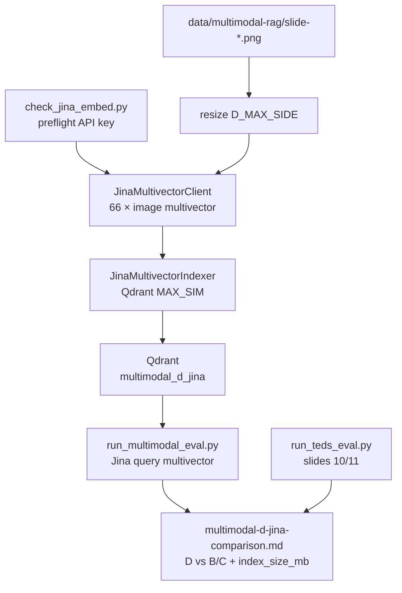

# Task 07: Метод D·multivector — Jina v4 + ось цены

> **Sprint:** [../../README.md](../../README.md#задача-07-метод-dmultivector--jina-v4--ось-цены-)
> **Тип:** feat  
> **Ветка:** `feat/multimodal-07-jina-multivector`  
> **Spec:** без spec; опирается на [analysis.md](../../analysis.md), контракт [task 03](../03-rag-pipeline-contract/summary.md), caption [task 05](../05-method-b-caption/plan.md), unified [task 06](../06-method-c-unified/plan.md)  
> **Статус планирования:** 📋 ожидает «ок»

---

## Цель

Реализовать **multivector indexer** через Jina `jina-embeddings-v4` (`return_multivector=true`, Qdrant `MultiVectorConfig MAX_SIM`); показать **реальную цену хранения** в `index_size_mb`; посчитать **TEDS** на табличных слайдах **10/11**; прогнать сегментный eval и сравнить D vs лучшие B/C — **антихайп**: multivector оправдан только если прирост на S3/S4 перекрывает размер индекса и стоимость API.

---

## Ключевые решения

| Решение | Выбор | Обоснование |
|---------|-------|-------------|
| Модель | **`jina-embeddings-v4`** | Sprint constraint; не ColPali |
| API | `POST https://api.jina.ai/v1/embeddings` | Официальный Jina API |
| Ключ | `JINA_API_KEY` в `.env` | Получить на https://jina.ai → API Keys |
| Multivector | `"return_multivector": true` | Late interaction / ColBERT-style |
| Vector dim (per token) | **128** (multivector head) | Spec jina-embeddings-v4 |
| Qdrant comparator | `MultiVectorComparator.MAX_SIM` | Sprint README + Jina×Qdrant tutorial |
| HNSW | **`m=0`** (disabled) | MaxSim несовместим с HNSW graph |
| Distance | `COSINE` (или `DOT` per Qdrant docs — зафиксировать в spike) | MaxSim aggregation |
| Resize | **`D_MAX_SIDE`** env, default **768** (yaml) | Баланс tokens/API cost vs мелкий текст |
| Index | 66 PNG → Jina image multivector → 1 point / slide, vector = `list[list[float]]` | 1 page = N patch vectors |
| Query | Jina text embed, **same model**, `return_multivector=true`, task=`retrieval` | Symmetric late interaction |
| `is_multivector` | **`true`** в IndexCost | Контракт task 03 |
| `index_size_mb` | **Честный расчёт**: `Σ(num_patches × dim × 4)` по всем points + payload overhead | Показать разницу vs dense ~0.4 MB (B/C) |
| TEDS | Gold HTML slides 10/11 vs predicted HTML из OCR modern | Ingestion-quality Group 2; не подменяет retrieval |
| Сравнение | D vs **B_gemini** + **C_unified** per segment + cost columns | Antihype после B/C |

### Jina API (D)

**Index (image document):**

```json
{
  "model": "jina-embeddings-v4",
  "task": "retrieval.passage",
  "input": [{"image": "data:image/png;base64,..."}],
  "return_multivector": true
}
```

**Query (text):**

```json
{
  "model": "jina-embeddings-v4",
  "task": "retrieval.query",
  "input": ["<question>"],
  "return_multivector": true
}
```

Response: `data[0].embeddings` — массив векторов (multivector) или nested structure — парсить по фактическому API (spike на 1 slide).

### Qdrant collection schema

```python
client.create_collection(
    collection_name="multimodal_d_jina",
    vectors_config=VectorParams(
        size=128,
        distance=Distance.COSINE,
        multivector_config=MultiVectorConfig(
            comparator=MultiVectorComparator.MAX_SIM,
        ),
        hnsw_config=HnswConfigDiff(m=0),
    ),
)
```

Query:

```python
client.query_points(
    collection_name="multimodal_d_jina",
    query=query_multivector,  # list[list[float]]
    limit=top_k,
    with_payload=True,
)
```

---

## Контекст: что есть после задачи 06

| Слой | Состояние |
|------|-----------|
| `INDEXER_REGISTRY` | `D_jina_multivector` → `StubIndexer` |
| Eval-config | `multimodal-d-jina-multivector.yaml` — `max_side: 768`, collection готовы |
| Eval runner | После task 06 — strategy для non-e5 embedders |
| B_gemini (reference) | nDCG S2=0.944, S3=0.689; index_size_mb≈**0.387** |
| C_unified (reference) | из task 06 report |
| Analysis риск D | Slides **10/11**: 70% vs 55%; EN/RU mixed labels; тёмный фон |

**Ожидание:** D может выиграть на **S3_layout / S4_multi** (fine-grained patches); **index_size_mb** в разы больше dense; TEDS на 10/11 — диагностика table confusion.

---

## Архитектура

### Поток данных



### Модуль `backend/app/rag/embed/jina_multivector.py`

```python
class JinaMultivectorEmbedder(Protocol):
    model_id: str = "jina-embeddings-v4"

    def embed_image(self, image_path: Path, *, max_side: int) -> list[list[float]]: ...
    def embed_query(self, text: str) -> list[list[float]]: ...
```

- httpx POST `https://api.jina.ai/v1/embeddings`, header `Authorization: Bearer {JINA_API_KEY}`.
- Reuse `resize_for_vlm()` + `image_to_data_url()`.
- Pricing: парсить usage / tokens → `est_cost_usd` (Jina pricing page или фиксированная оценка per image).

### Indexer D

`JinaMultivectorIndexer` (`method = "D_jina_multivector"`):

1. `max_side` из `options.max_side` или env **`D_MAX_SIDE`** (override).
2. 66 PNG → Jina image multivector → upsert.
3. `multivector_collection_size_mb()` — **новая функция**:

```python
def multivector_collection_size_mb(client, collection: str) -> float:
    # iterate points (sample or full count) → sum(len(vectors) * dim * 4)
```

Не использовать naive `count * single_dim * 4` из `slide_embed.collection_size_mb`.

4. `IndexCost`:
   - `api_calls = 66`
   - `is_multivector = true`
   - `index_size_mb` — из multivector formula
   - `build_time_s`, `est_cost_usd`

### Eval query path

В `run_multimodal_eval.py` (shared с task 06):

- `D_jina_multivector` → `JinaMultivectorEmbedder.embed_query(question)` → `query_points` with multivector.

---

## TEDS (ingestion-quality, slides 10/11)

**Цель:** диагностика табличной зоны корпуса для метода D — насколько структура таблиц «читаема» без явного OCR в pipeline D.

| Компонент | Описание |
|-----------|----------|
| Gold | `evals/datasets/multimodal/teds-gold/v001.yaml` — HTML `<table>` для slides 10, 11 (ручная разметка из ocr-gold + структура баров/строк) |
| Predicted | HTML из **OCR modern** artifacts (`evals/artifacts/ocr/modern/slide-10.txt`, `slide-11.txt`) → heuristic parser → `<table>` |
| Metric | TEDS ∈ [0,1] — `1 - normalized_tree_edit_distance` (реализация через `apted` или lightweight custom) |
| Report | Таблица TEDS slide 10 / slide 11 в `multimodal-d-jina-multivector.md` |

**Не путать:** TEDS ≠ retrieval nDCG на s2-01..04; retrieval — Group 1, уже в segment eval.

---

## Eval + comparison (ось цены)

```bash
make check-jina-embed                         # preflight JINA_API_KEY + 1 slide
make index-multimodal CONFIG=evals/configs/multimodal-d-jina-multivector.yaml
make eval-multimodal CONFIG=evals/configs/multimodal-d-jina-multivector.yaml
make run-teds-eval                            # slides 10/11
make eval-multimodal-d-jina                   # alias: full pipeline + comparison
```

`evals/scripts/build_multimodal_d_comparison.py` → `evals/reports/multimodal-d-jina-comparison.md`:

| Секция | Содержание |
|--------|------------|
| **Index cost (ось цены)** | `index_size_mb` D vs B/C/baseline — **главная колонка** |
| Build time | `build_time_s` D vs dense |
| API cost | `est_cost_usd`, `api_calls` |
| Multivector stats | avg patches/slide, total vectors, `is_multivector=true` |
| TEDS | slides 10, 11 |
| Segment table | D per S1–S5 |
| **D vs B_gemini / C** | Δ nDCG@5, Recall@5 per segment |
| **Verdict** | Multivector оправдан? прирост S3/S4 vs **× index_size_mb** |

Пример cost table (заполнить после прогона):

| Config | index_size_mb | build_time_s | est_cost_usd | is_multivector |
|--------|---------------|--------------|--------------|----------------|
| B_gemini | 0.387 | 193.5 | 0.10 | false |
| C_unified | ~0.4 | TBD | ~0 | false |
| **D_jina** | **TBD (>> dense)** | TBD | TBD | **true** |

---

## Состав работ

- [ ] `backend/app/config.py` — `jina_api_key: str | None`, `d_max_side: int = 768`
- [ ] `backend/app/rag/embed/jina_multivector.py` — Jina API client
- [ ] `backend/app/rag/indexers/d_jina_multivector.py` — indexer
- [ ] `backend/app/rag/indexers/multivector_qdrant.py` — create collection + upsert + **size_mb**
- [ ] Extend `run_multimodal_eval.py` — Jina multivector query path (если не сделано в 06)
- [ ] `evals/scripts/check_jina_embed.py` — preflight API key + 1 slide multivector
- [ ] `evals/datasets/multimodal/teds-gold/v001.yaml` — gold HTML tables 10/11
- [ ] `backend/app/rag/ingestion/teds.py` — TEDS computation
- [ ] `evals/scripts/run_teds_eval.py` — OCR modern → HTML → TEDS
- [ ] `evals/scripts/build_multimodal_d_comparison.py` — D vs B/C + cost axis
- [ ] Обновить `registry.py`: `D_jina_multivector` → real indexer
- [ ] Make / make.ps1: `check-jina-embed`, `run-teds-eval`, `eval-multimodal-d-jina`
- [ ] `.env.example`: `JINA_API_KEY=`, `D_MAX_SIDE=768`
- [ ] Тесты: mock Jina response; multivector size_mb; Qdrant MAX_SIM integration smoke
- [ ] Полный прогон index + eval + TEDS + comparison
- [ ] Самопроверка по DoD

---

## Критерии готовности (DoD)

**Агент проверяет:**

| # | Kритерий | Способ проверки |
|---|----------|-----------------|
| 1 | Qdrant collection с `MultiVectorConfig MAX_SIM`, `m=0` | Integration test / schema inspect |
| 2 | `is_multivector=true`; **`index_size_mb` >> dense** (documented) | `{config_id}-index-cost.json` + comparison § cost |
| 3 | TEDS slides 10/11 | `run_teds_eval.py` → table in report |
| 4 | Сегментный eval D | `multimodal-d-jina-multivector.md` |
| 5 | D vs B/C comparison + cost columns | `multimodal-d-jina-comparison.md` |
| 6 | Query = Jina multivector (не e5) | Unit test eval strategy |
| 7 | Lint + тесты | `pytest backend/tests/test_jina_*.py` |

**Пользователь проверяет:**

- `index_size_mb` multivector vs dense — приемлемо для стенда
- Прирост D на S3/S4 оправдан размером индекса и временем сборки — или нет
- D **не выбран по умолчанию** без сравнения с B/C (verdict в report)
- ⛔ **СТОП** — апрув перед задачей 08

---

## Артефакты

| Путь | Назначение |
|------|------------|
| `backend/app/rag/embed/jina_multivector.py` | Jina v4 multivector client |
| `backend/app/rag/indexers/d_jina_multivector.py` | Indexer D |
| `backend/app/rag/indexers/multivector_qdrant.py` | Qdrant multivector helpers + size_mb |
| `backend/app/rag/ingestion/teds.py` | TEDS metric |
| `backend/tests/test_jina_multivector*.py` | Unit + integration tests |
| `evals/scripts/check_jina_embed.py` | Preflight |
| `evals/scripts/run_teds_eval.py` | TEDS slides 10/11 |
| `evals/scripts/build_multimodal_d_comparison.py` | D vs B/C + cost |
| `evals/datasets/multimodal/teds-gold/v001.yaml` | Gold HTML tables |
| `evals/configs/multimodal-d-jina-multivector.yaml` | `max_side`, embedding_model |
| `evals/reports/multimodal-d-jina-multivector.md` | Segment report |
| `evals/reports/multimodal-d-jina-comparison.md` | Cost axis + comparison |
| `evals/reports/multimodal-d-jina-multivector-index-cost.json` | IndexCost snapshot |
| `Makefile`, `make.ps1` | targets |
| `.env.example` | `JINA_API_KEY`, `D_MAX_SIDE` |

**Skills (при реализации):** `python-design-patterns`, `python-testing-patterns`, `modern-python`; Qdrant multivector — см. [Qdrant multivector tutorial](https://qdrant.tech/documentation/tutorials-search-engineering/using-multivector-representations/).

---

## Scope

**Трогаем:** файлы из таблицы «Артефакты»; `registry.py`; `config.py`; shared eval runner (если 06 не завершён — координировать).

**НЕ трогаем:**

- ColPali / self-host GPU
- Production agent routing
- Датасеты eval items / gold_pages
- Neo4j, Postgres, frontend

---

## Риски и митигация

| Риск | Митигация |
|------|-----------|
| `JINA_API_KEY` отсутствует | Fail fast в config; `check-jina-embed` до index |
| Multivector раздувает RAM/disk | Честный `index_size_mb`; `D_MAX_SIDE=768`; optional `on_disk=True` в Qdrant |
| Jina API format drift | Spike 1 slide; зафиксировать parser в tests |
| TEDS без table parser | Heuristic HTML из OCR modern; gold YAML вручную |
| D «выигрывает» на average | Per-segment + cost table; antihype verdict |
| Slow index (66 × multivector API) | concurrency=2; log sec/slide |
| HNSW misconfig | Explicit `m=0`; integration test |

---

## Открытые вопросы

- [x] **Модель:** `jina-embeddings-v4`
- [x] **API:** `https://api.jina.ai/v1/embeddings`
- [x] **Key:** `JINA_API_KEY`
- [x] **D_MAX_SIDE** via env (default 768)
- [x] **Qdrant MAX_SIM**, не ColPali
- [ ] **Jina task names:** `retrieval.passage` / `retrieval.query` — подтвердить в spike (vs `retrieval`)
- [ ] **Distance DOT vs COSINE** для multivector — spike 1 query

---

## Порядок реализации (после «ок»)

1. `.env.example` + config `JINA_API_KEY`, `D_MAX_SIDE`  
2. `check_jina_embed.py` — preflight  
3. `jina_multivector.py` + spike 1 slide (parse response, dim, patch count)  
4. `multivector_qdrant.py` — collection + upsert + **size_mb**  
5. `d_jina_multivector.py` + registry  
6. Eval query path (Jina multivector)  
7. Full index 66 → eval S1–S5  
8. TEDS gold YAML + `run_teds_eval.py`  
9. `build_multimodal_d_comparison.py` — cost axis + D vs B/C  
10. Self-check DoD → показать пользователю → ⛔ ждать «ок» → `summary.md`

**Зависимость:** task 06 должна быть **завершена** (или shared eval refactor merged) — antihype: не начинать D до цифр B/C.
