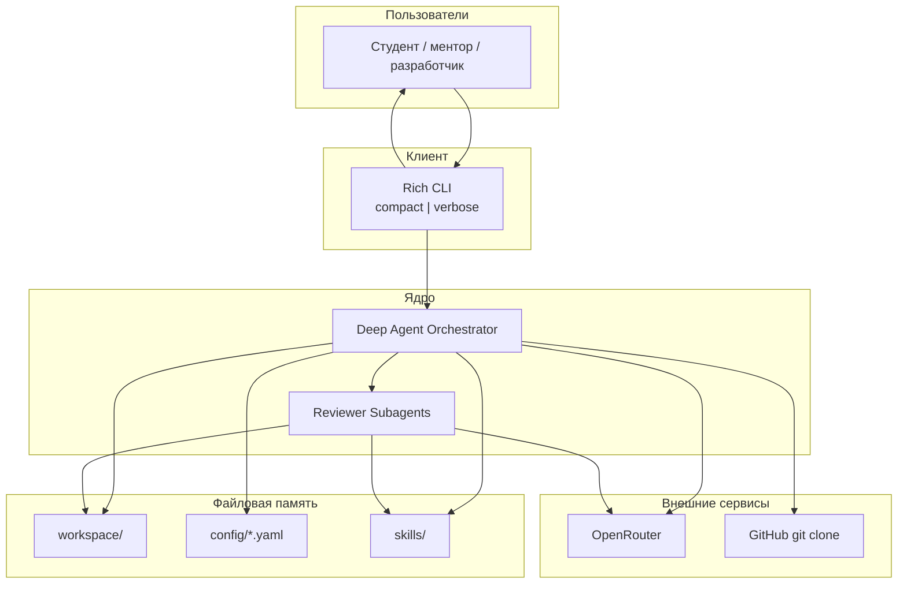
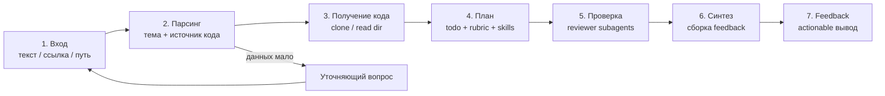
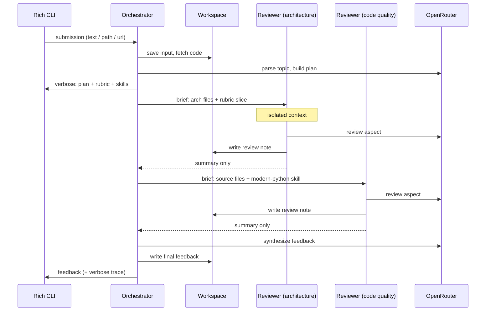
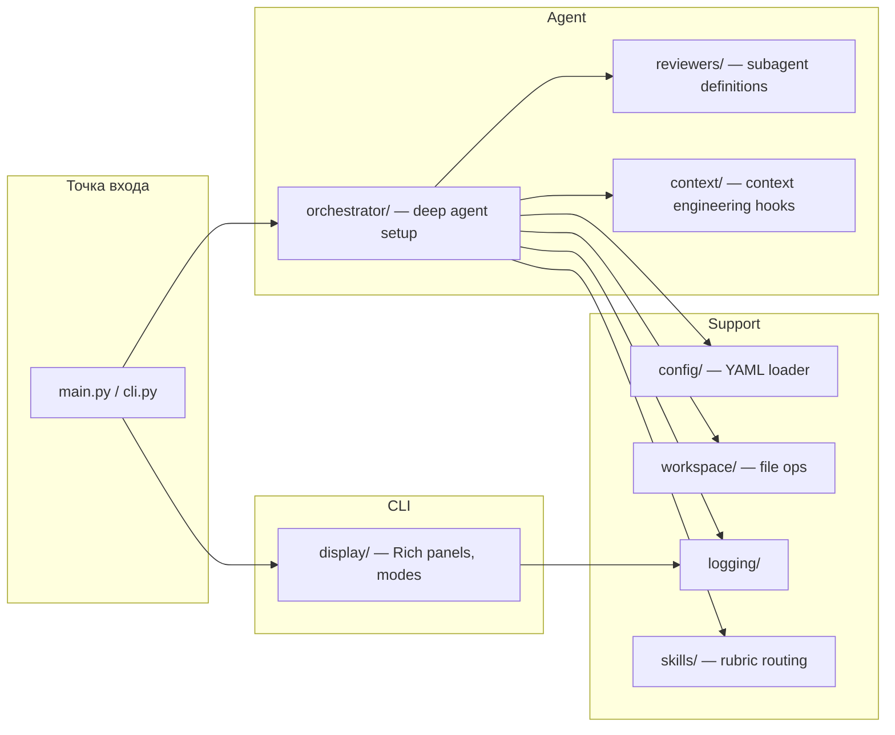

# Архитектура системы AI Homework Mentor

> Продуктовое видение и роли — в [vision.md](vision.md). БД и REST API в v1 нет.

---

## Контекст системы

Пользователь (студент, ментор или разработчик) на **Windows** запускает консольную утility через **PowerShell** (`make.ps1` — единая точка входа для dev-команд). CLI передаёт запрос оркестратору — deep agent на DeepAgents (LangChain `deepagents` + LangGraph). Агент работает с файловой системой как рабочей памятью, обращается к LLM через OpenRouter, при необходимости клонирует публичный GitHub-репозиторий. Проверка декомпозируется на аспекты и делегируется изолированным reviewer-субагентам. Итог — structured feedback в CLI.



---

## Почему DeepAgents

Обычный «chatbot с tools» не покрывает требования продукта:

| Требование | Решение DeepAgents |
|------------|-------------------|
| Многошаговая проверка до результата | Планирование (todo) как наблюдаемое состояние |
| Проверка по аспектам без переполнения контекста | Декомпозиция через изолированных reviewer-субагентов |
| Большие репозитории и промежуточные артефакты | Файловая система как рабочая память |
| Переиспользуемые процедуры проверки | Skills (свои rubric + публичные `fastapi-templates`, `modern-python`) |
| Контроль размера окна | Context engineering: суммаризация, вынос в файлы, компактизация |

Продукт одновременно решает прикладную задачу (проверка ДЗ) и демонстрирует эти механизмы в verbose-режиме CLI.

---

## Контейнеры и ответственность

| Компонент | Назначение | Технологии |
|-----------|-----------|-----------|
| **Rich CLI** | Ввод запроса, отображение хода проверки и итога; compact / verbose | Rich, Python 3.11, PowerShell |
| **Orchestrator Agent** | План, парсинг входа, получение кода, подбор rubric/skills, делегирование, синтез feedback, управление контекстом | DeepAgents, LangGraph |
| **Reviewer Subagents** | Проверка одного аспекта в изолированном контексте; возврат summary | DeepAgents subagent API |
| **Workspace** | Хранение входа, кода, rubric, review-нот, финальных артефактов | Локальная ФС |
| **Config Layer** | Промпты, параметры модели, лимиты, пороги суммаризации, режим вывода | YAML |
| **Skills Layer** | Rubric-skills проекта + публичные skills из `.agents/skills/` | Markdown skills |
| **Logger** | Structured лог хода работы агента | Python logging → stdout / файл |

---

## Основной поток проверки



### Шаги потока (смысловой уровень)

1. **Вход** — пользователь передаёт работу: свободный текст со ссылкой на GitHub **или** путь к локальной директории; тема задания явно или неявно.
2. **Парсинг** — агент извлекает источник кода и тему. Если данных недостаточно — один уточняющий вопрос, без домысливания.
3. **Получение кода** — `git clone` публичного репозитория (код не исполняется) или рекурсивное чтение локальной директории в workspace.
4. **План** — построение todo-листа проверки; подбор rubric под тему; маршрутизация skills (`fastapi-templates` для API-работ, `modern-python` для качества кода и т.д.).
5. **Проверка** — orchestrator делегирует аспекты reviewer-субагентам. Каждый получает узкий бриф (файлы, rubric-пункты, skill-инструкции) и возвращает summary; промежуточные ноты — в workspace.
6. **Синтез** — orchestrator собирает review-ноты в единый feedback: сильные стороны, обязательные исправления, следующий шаг, приоритизированный план.
7. **Вывод** — CLI показывает результат; в verbose — весь «под капотом» путь.

---

## Взаимодействие orchestrator и subagents



---

## Управление контекстом (Context Engineering)

Сквозная тема архитектуры — что держим в окне LLM, что выносим в файлы, когда компактизируем.

| Механизм | Что делает | Где видно |
|----------|-----------|----------|
| **Файловая память** | Код, rubric, review-ноты, логи — в workspace; в контексте — пути и саммари | verbose: список файлов workspace |
| **Изоляция subagents** | Reviewer работает в своём окне; родитель получает только summary | verbose: бриф → summary каждого subagent |
| **Суммаризация / компактизация** | При росте истории — сжатие или вынос в файл по порогам из конфига | verbose: размер контекста до/после, что сработало |
| **Skills as procedures** | Инструкции проверки — в skill-файлах, подгружаются по rubric, не дублируются в промпте | verbose: какие skills подключились |

Пороги и лимиты (размер окна, trigger суммаризации) — в YAML-конфиге, не hardcode.

---

## Rich CLI — режимы вывода

### Compact
- Текущий шаг проверки (кратко)
- Итоговый feedback

### Verbose (образовательный)
- **План** — todo-лист и обновление статусов
- **Workspace** — созданные/прочитанные файлы
- **Rubric & Skills** — подобранные критерии и подключённые skills
- **Subagents** — какие запущены, узкий бриф, возвращённый summary
- **Context** — размер окна / токены по шагам; срабатывание суммаризации и выноса в файлы
- **Config** — активная модель, режим, лимиты

---

## Внутренняя структура проекта



- **cli/** — Rich UI, парсинг аргументов, переключение compact/verbose
- **make.ps1** — единая точка входа команд на Windows (sync, run, lint, test)
- **orchestrator/** — сборка deep agent, системный промпт, tools (read workspace, delegate subagent)
- **reviewers/** — определения reviewer-субагентов по аспектам
- **context/** — хуки и метрики context engineering для verbose-вывода
- **config/** — загрузка YAML (промпты, модель, лимиты)
- **skills/** — rubric-skills проекта + интеграция с `.agents/skills/`

---

## Конфигурация и промпты

Все промпты и runtime-параметры — в YAML (`config/`), версионируются в git:

| Файл / группа | Содержание |
|---------------|-----------|
| `config/agent.yaml` | Модель OpenRouter, temperature, лимиты контекста, пороги суммаризации |
| `config/prompts/*.yaml` | Системные и task-промпты orchestrator и reviewers |
| `config/output.yaml` | Режим вывода по умолчанию, параметры verbose |
| `config/rubric/*.yaml` | Критерии проверки по темам |

Секреты (`OPENROUTER_API_KEY`) — только через `.env`, не в YAML.

---

## Rubric и Skills

**Rubric** описывает *что* проверяем (критерии по теме). **Skills** описывают *как* проверяем (процедуры, best practices).

```
Тема задания → Rubric (config/rubric/) → Skills routing
                                              ├── project skills (skills/)
                                              └── ecosystem skills (.agents/skills/)
                                                    ├── fastapi-templates (если есть API)
                                                    ├── modern-python (качество Python)
                                                    └── deep-agents-* (проверка агентного кода)
```

Маршрутизация — по `@.cursor/rules/methodology/40-skills-router.mdc`.

---

## Логирование

- Structured лог в stdout (dev) и опционально в `logs/` (файл)
- Логируем: старт сессии, шаги плана, делегирование subagents, context events, ошибки
- Не логируем: API-ключи, полные тексты переписок с PD

---

## Входные форматы

| Формат | Обработка |
|--------|----------|
| Текст + GitHub URL | Извлечение URL → `git clone` в workspace |
| Путь к локальной директории | Копирование/ссылка на файлы в workspace (без исполнения) |
| Только текст без источника | Уточняющий вопрос |

---

## Деплой — локально (Windows / PowerShell)

Целевая среда разработки — **Windows**. Все команды запуска — через **`make.ps1`** (PowerShell), по аналогии с корневым репозиторием. Прямые вызовы `uv run` — только внутри скриптов, не в документации.

```powershell
cd ai-homework-mentor
Copy-Item .env.example .env   # OPENROUTER_API_KEY, модель
.\make.ps1 sync
.\make.ps1 run -- -Path .\student-hw -Topic "FastAPI bot"
```

Dogfooding:

```powershell
.\make.ps1 run -- -Path . -Topic "DeepAgents homework checker" -Verbose
```

Ожидаемые цели `make.ps1` (минимальный набор):

| Цель | Назначение |
|------|-----------|
| `sync` | `uv sync` — установка зависимостей |
| `run` | запуск CLI с аргументами |
| `lint` | ruff check |
| `format` | ruff format |
| `test` | pytest |

Пути к локальным директориям — в формате Windows (`C:\projects\student-hw` или `.\relative\path`).

---

## Связанные документы

- [idea.md](idea.md) — проблема и ценность
- [vision.md](vision.md) — сценарии, компоненты, критерии успеха v1, границы
- [../roadmap.md](../roadmap.md) — спринты S0–S7 до v1 (+ S8/S9 опционально)
