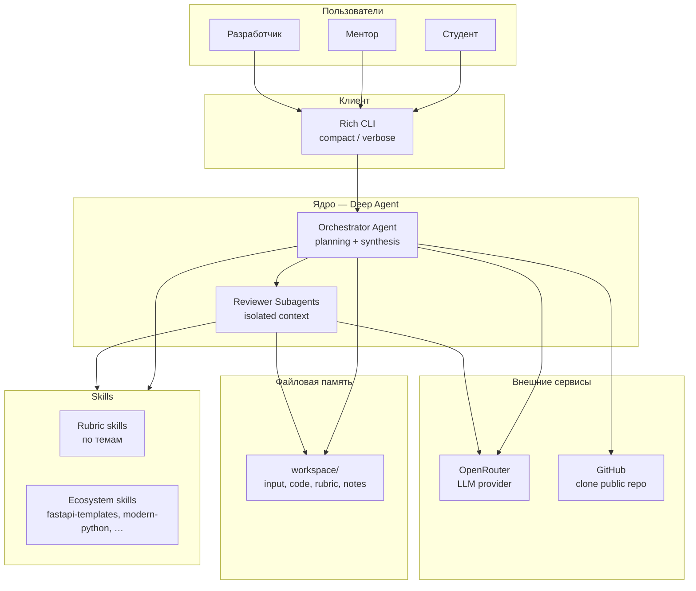

# Техническое видение проекта AI Homework Mentor

---

## 1. Система в целом

AI Homework Mentor — консольная утилита (Rich CLI) с deep agent на базе DeepAgents (LangChain `deepagents` поверх LangGraph). Ядро — оркестратор проверки домашних заданий: он планирует работу, управляет контекстом, делегирует reviewer-субагентам и синтезирует итоговый feedback. Отдельного API-сервиса, веб-UI и базы данных нет — всё в одном процессе CLI.

Образовательная цель встроена в продукт: расширенный режим вывода наглядно показывает механизмы DeepAgents в действии — план, workspace, изоляцию субагентов, подключение skills, рост и компактизацию контекста.

---

## 2. Роли

| Роль | Описание |
|------|----------|
| **Студент** | Передаёт работу (ссылка или путь), получает structured feedback и план исправлений |
| **Ментор / преподаватель** | Запускает проверку от имени студента или использует вывод как основу для финального review |
| **Разработчик / ученик DeepAgents** | Изучает агентные паттерны через расширенный режим CLI — видит «под капотом» каждый шаг |

---

## 3. Пользовательские сценарии

### Студент
- **С-1: Сдача работы по ссылке** — вводит текст со ссылкой на публичный GitHub-репозиторий и темой задания; получает feedback
- **С-2: Сдача локальной работы** — указывает путь к директории с кодом; агент читает файлы и проверяет по rubric
- **С-3: Уточнение при неполном входе** — если тема или источник кода неясны, агент задаёт один уточняющий вопрос, не домысливает

### Ментор
- **М-1: Быстрая проверка** — запускает CLI в компактном режиме, получает итог и приоритизированный список замечаний
- **М-2: Разбор по аспектам** — в расширенном режиме видит, какие reviewer-субагенты проверяли архитектуру, API, качество кода и т.д.

### Разработчик (образовательный режим)
- **Р-1: Наблюдение за планом** — видит todo-лист проверки и обновление статусов по шагам
- **Р-2: Наблюдение за контекстом** — видит рост окна, срабатывание суммаризации, вынос артефактов в файлы workspace
- **Р-3: Наблюдение за изоляцией** — видит запуск субагентов с узким брифом и возврат только summary в родительский контекст

### Dogfooding (критерий зрелости v1)
- **D-1: Самопроверка** — направить ассистента на директорию `ai-homework-mentor/` и получить feedback по самому продукту по той же механике

---

## 4. Архитектура (high-level)

> Диаграммы потоков и ответственность компонентов — в [`architecture.md`](architecture.md).



---

## 5. Компоненты системы

### Rich CLI
- Точка входа пользователя: приём запроса, отображение хода проверки и итога
- Два режима вывода: **compact** (ход + итог) и **verbose** (образовательный — план, workspace, субагенты, контекст, skills, токены)
- **Статус:** MVP

### Orchestrator Agent (Deep Agent)
- Строит и ведит план проверки (todo)
- Парсит вход, определяет тему, подбирает rubric и skills
- Клонирует репозиторий или читает локальную директорию
- Делегирует проверку reviewer-субагентам, синтезирует финальный feedback
- Управляет контекстом: что держит в окне, что выносит в файлы, когда суммаризирует
- **Не делает:** исполнение кода студента, автотесты, балльную оценку
- **Статус:** MVP

### Reviewer Subagents
- Изолированные субагенты по аспектам проверки (архитектура, API, качество кода и т.д.)
- Получают узкий бриф, возвращают только summary — родительский контекст остаётся чистым
- **Статус:** MVP

### Workspace (файловая система)
- Рабочая память агента: вход, код, rubric, review-ноты, промежуточные и финальные артефакты
- В окне контекста — ссылки и саммари, не полные дампы
- **Статус:** MVP

### Skills Layer
- Свои rubric-skills под темы заданий + публичные навыки экосистемы (`fastapi-templates`, `modern-python`, …)
- Маршрутизация — по правилам skills router проекта
- **Статус:** MVP (базовый набор); расширение — в roadmap

### Config & Prompts (YAML)
- Промпты, параметры модели, режим вывода, лимиты контекста, пороги суммаризации — в YAML, не в коде
- **Статус:** MVP

---

## 6. Структура проекта

```
ai-homework-mentor/
├── make.ps1              # точка входа команд (Windows / PowerShell)
├── concept/              # концепт-документы (idea, vision, architecture)
├── roadmap.md            # дорожная карта спринтов S0–S9
├── sprints/              # детальные README спринтов (по мере развёртки)
├── src/                  # исходный код CLI и агента (будет в спринтах)
├── config/               # YAML: промпты, параметры, rubric
├── skills/               # собственные rubric-skills проекта
├── workspace/            # рабочая директория агента (gitignore)
└── logs/                 # логи хода работы (gitignore)
```

---

## 7. Доменные сущности

| Сущность | Смысл |
|----------|-------|
| **Submission** | Вход пользователя: текст, ссылка на репо или путь к директории, тема задания |
| **Assignment Topic** | Тема/тип домашнего задания, определяет rubric и набор skills |
| **Rubric** | Критерии проверки: что проверяем по данной теме |
| **Review Plan** | Todo-лист шагов проверки с текущими статусами |
| **Review Aspect** | Отдельный аспект проверки, делегируемый reviewer-субагенту |
| **Review Note** | Промежуточный артефакт проверки (файл в workspace) |
| **Feedback** | Итоговый structured вывод: сильные стороны, обязательные исправления, следующий шаг, приоритизированный план |

> Персистентное хранилище между запусками в v1 нет — сущности живут в workspace текущей сессии.

---

## 8. Внешние связи

| Интеграция | Назначение |
|------------|-----------|
| **OpenRouter** | Единая точка доступа к LLM; модель и ключ — через конфигурацию/окружение |
| **GitHub (git clone)** | Получение кода из публичного репозитория; код не исполняется |
| **Локальная ФС** | Чтение директории с кодом студента; workspace агента |

> MCP, RAG по справочникам, БД — за пределами v1, обозначены в roadmap.

---

## 9. Принципы разработки

- **KISS** — одна консольная утility, без лишних сервисов и слоёв
- **YAGNI** — v1 закрывает E2E-сценарий проверки; без MCP, веб-UI, БД, баллов
- **DRY** — rubric и процедуры проверки — в skills, промпты — в YAML
- **Observability by design** — расширенный режим CLI показывает механизмы агента, а не скрывает их
- **Fail fast** — неполный вход → уточняющий вопрос, не выдумывание; отсутствие конфига → ошибка на старте
- **Dogfooding** — финальная проверка зрелости v1: продукт проверяет сам себя

---

## 10. Технологии

| Область | Решение |
|---------|---------|
| Agent framework | DeepAgents (LangChain `deepagents` + LangGraph) |
| LLM provider | OpenRouter |
| CLI / UI | Rich (Python) |
| Конфигурация и промпты | YAML |
| Язык | Python 3.11 |
| Платформа | Windows, PowerShell, `make.ps1` |
| Package manager | uv |

---

## 11. Критерии успеха v1

- [ ] Сквозной E2E: вход → код → план → проверка субагентами → feedback
- [ ] Оба входа работают: GitHub-ссылка и локальный путь
- [ ] Rubric подбирается по теме; skills подключаются где уместно
- [ ] Компактный и расширенный режимы CLI показывают ожидаемую информацию
- [ ] В verbose видны: план, workspace, субагенты, рост/компактизация контекста, skills
- [ ] Dogfooding: успешная проверка директории `ai-homework-mentor/`

---

## 12. Границы v1 (явно не входит)

- Исполнение и автотесты кода студента
- MCP и RAG по справочным материалам
- База данных и персистентное хранилище между запусками
- Веб-UI и авторизация
- Балльная система оценок
- Мультимодальные задания (изображения, PDF и т.д.)
- Checkpoint/resume, dynamic context, долговременная память ( — последующие слои roadmap)

---

## 13. Архитектурные и прочие принятые решения

| № | Решение | Статус |
|---|---------|--------|
| ADR-0001 | DeepAgents как ядро — осознанный выбор для демонстрации deep-agent механик | Принято |
| ADR-0002 | Rich CLI вместо веб-UI — простота + образовательная прозрачность | Принято |
| ADR-0003 | OpenRouter как единый LLM-провайдер | Принято |
| ADR-0004 | Промпты и параметры в YAML, не в коде | Принято |
| ADR-0005 | Отдельная папка `ai-homework-mentor/` — изоляция от существующего агента в репозитории | Принято |
