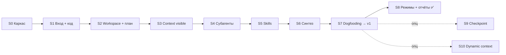

# Roadmap — AI Homework Mentor

> **Vision:** [./concept/vision.md](./concept/vision.md)
> **Архитектура:** [./concept/architecture.md](./concept/architecture.md)
> **Последнее обновление:** 2026-07-25 (S0–S7 ✅ → **v1**; **S8** режимы/отчёты ✅; опц. S9 checkpoint / S10 dynamic)

---

## Цель продукта

Внутренний deep-agent ассистент для проверки домашних заданий студентов: сквозной E2E от входа до actionable feedback — с наглядной демонстрацией механизмов DeepAgents через Rich CLI на Windows (PowerShell, `make.ps1`).

---

## Легенда

- 📋 Planned — запланирован
- 🚧 In Progress — в работе
- ✅ Done — завершён
- ⏸ Paused — на паузе
- 🗄 Archived — отменён

---

## Принцип последовательности

Спринты идут **от простого к сложному** не по сложности кода, а по цепочке вынужденных решений: каждый следующий слой — ответ на боль предыдущего. Каждый спринт оставляет **рабочий продукт**, который можно показать через Rich CLI.

**Жёсткие зависимости:** нельзя субагентов раньше файловой системы; нельзя синтез раньше субагентов; нельзя resume раньше многошагового процесса.

Детальные README спринтов — в [`sprints/`](./sprints/) (появляются по мере развёртки плана).



### Образовательная драматургия S3 → S4

| Спринт | Что видно в verbose | Урок |
|--------|---------------------|------|
| **S3** | Один агент на большом репо: контекст раздувается, срабатывают суммаризация/компактизация, растут токены | «Одному агенту тесно» |
| **S4** | Те же аспекты уходят в изолированные reviewer-окна; контекст родителя остаётся чистым | Изоляция закрывает боль S3 |

Контраст «до/после» — отдельная ценность плана, не сжимать S3 и S4 в один спринт.

---

## Основной маршрут до v1

### S0 — Каркас, Rich CLI, конфиг, логирование ✅

> Детали: [`sprints/sprint-00-skeleton/README.md`](./sprints/sprint-00-skeleton/README.md)

**Механизм:** каркас + клиент + конфигурация.

**Боль (ещё нет решения):** нет критериев, нет плана, нет разбора кода.

**Цель:** новый проект в отдельной папке; ядро-болванка на DeepAgents (простой агент-цикл) на OpenRouter; минимальный Rich CLI (текст или путь); промпты в YAML; логирование. Ассистент пока просто отвечает на сообщение без процесса проверки.

**Ключевые результаты:**
- [x] Каркас проекта + запуск через `make.ps1`
- [x] DeepAgents + OpenRouter, простой ответ на сообщение
- [x] Rich CLI (compact / заготовка verbose)
- [x] Промпты в YAML-конфиге
- [x] Логирование хода работы
- [x] Зафиксирован список того, что плохо (нет плана, rubric, кода)

---

### S1 — Парсинг входа + получение кода ✅

> Детали: [`sprints/sprint-01-input-and-code/README.md`](./sprints/sprint-01-input-and-code/README.md)

**Механизм:** вход агента как контекст; «уточнять, а не выдумывать».

**Боль предыдущего:** агент отвечает «в воздух», не знает, *что* проверять и *откуда* брать код.

**Цель:** разобрать вход → ссылка/путь + тема; при нехватке — один уточняющий вопрос. Получить код: сначала локальная директория, затем shallow-клон публичного GitHub (код не исполняется).

**Ключевые результаты:**
- [x] Из входа извлекаются источник кода и тема
- [x] Чтение локальной директории
- [x] `git clone` публичного репо (shallow)
- [x] CLI принимает и текст, и путь
- [x] При неполном входе — уточняющий вопрос, без домыслов

---

### S2 — Workspace + rubric + план (todo). Минимальный E2E одним агентом ✅

> Детали: [`sprints/sprint-02-workspace-rubric-plan/README.md`](./sprints/sprint-02-workspace-rubric-plan/README.md)

**Механизм:** планирование (todo как наблюдаемый процесс) + файловая система (offload).

**Боль предыдущего:** код получен, но нет критериев, плана и артефактов проверки.

**Цель:** виртуальная/рабочая FS; rubric в файле; агент строит todo и проходит проверку **одним агентом**, синтезируя простой feedback. Rich CLI показывает дерево workspace и статусы todo.

**Ключевые результаты:**
- [x] Workspace с предсказуемой структурой (input, code, rubric, notes, output)
- [x] Rubric в файле (базовые атрибуты проверки)
- [x] Todo-план строится, обновляется и отображается в CLI
- [x] На маленьком примере — первый сквозной feedback

---

### S3 — Управление контекстом видимо (без субагентов, большое репо) ✅

> Детали: [`sprints/sprint-03-context-visible/README.md`](./sprints/sprint-03-context-visible/README.md)

**Механизм:** context engineering (суммаризация, компактизация, offload) — и его **видимость**.

**Боль, которую намеренно показываем:** одному агенту тесно; контекст пухнет; проверка долгая и мутная.

**Цель:** прогнать проверку из S2 на **реальном большом** репозитории всё ещё одним агентом. Verbose показывает рост контекста, токены, момент сжатия, что вынесено в файлы.

**Ключевые результаты:**
- [x] Прогон на большом репозитории одним агентом
- [x] Суммаризация / компактизация / вынос в файлы подключены
- [x] Verbose: размер контекста по шагам, токены, события CE
- [x] Зафиксирована «боль» для контраста с S4

---

### S4 — Субагенты: декомпозиция и изоляция («бабах») ✅

> Детали: [`sprints/sprint-04-subagents/README.md`](./sprints/sprint-04-subagents/README.md)

**Механизм:** декомпозиция + изоляция контекста + узкий handoff.

**Боль закрыта (контраст с S3):** «одному агенту тесно» → каждый аспект в своём окне; родитель получает только summary.

**Цель:** разнести проверку на изолированных reviewer-субагентов (узкий бриф, ссылки на файлы, наверх — саммари). Verbose показывает запуск субагентов и чистый контекст родителя.

**Ключевые результаты:**
- [x] Минимум 2 reviewer-субагента по аспектам
- [x] По review-файлу (ноте) на субагента в workspace
- [x] Verbose: бриф → summary; контраст размера контекста родителя vs S3
- [x] Субагенты не дублируют выводы друг друга

---

### S5 — Навыки (skills): свои rubric + публичные навыки ✅

> Детали: [`sprints/sprint-05-skills/README.md`](./sprints/sprint-05-skills/README.md)

**Механизм:** skills (свои + публичные с [skills.sh](https://www.skills.sh/)).

**Боль предыдущего:** критерии и процедуры проверки размазаны по промптам, плохо переиспользуются.

**Цель:** оформить критерии как навыки; свои rubric-skills под темы; подключить уместные публичные skills (например `fastapi-templates`, `modern-python`). Актуализировать правила использования скиллов в роутерах проекта. Skills — только из доверенного источника; SKILL.md читается до применения; в субагенте без секретов; код студента не исполняется.

**Ключевые результаты:**
- [x] Rubric оформлены как навыки проекта
- [x] Нужные публичные skills установлены и применяются уместно
- [x] Verbose: какие skills/rubric активированы
- [x] Актуализированы `ai-homework-mentor/.cursor/rules/40-skills-router.mdc` и `.cursor/rules/methodology/40-skills-router.mdc`

---

### S6 — Синтез feedback из артефактов ✅

> Детали: [`sprints/sprint-06-synthesis/README.md`](./sprints/sprint-06-synthesis/README.md)

**Механизм:** сборка результата из проверяемых артефактов; обязательное vs опциональное; ссылки на критерии.

**Боль предыдущего:** есть разрозненные review-ноты, нет единого actionable итога.

**Цель:** reflection (покрытие аспектов, противоречия) + сборка `final_feedback` и `fix_plan`; сверка заявленного студентом с найденным. Rich CLI красиво печатает итог.

**Ключевые результаты:**
- [x] Два финальных артефакта: `final_feedback`, `fix_plan`
- [x] Каждое замечание сослано на критерий rubric
- [x] Вывод краткий и actionable (compact + verbose)

---

### S7 — Dogfooding (E2E на самом себе) → v1 ✅

> Детали: [`sprints/sprint-07-dogfooding/README.md`](./sprints/sprint-07-dogfooding/README.md)

**Механизм:** полный E2E + самопроверка.

**Боль предыдущего:** механика собрана по частям; нет доказательства, что сквозной сценарий держится на реальном коде продукта.

**Цель:** направить продукт на его же директорию и прогнать полную проверку без MCP. Зафиксировать, что нашёл о себе. Закрыть критерии успеха v1 из [vision.md](./concept/vision.md).

**Ключевые результаты:**
- [x] Dogfooding: проверка `ai-homework-mentor/` → feedback + fix_plan по себе
- [x] Сквозной сценарий работает целиком (оба входа, план, субагенты, skills, синтез)
- [x] Критерии успеха v1 выполнены
- [x] Quickstart для Windows / PowerShell задокументирован

---

## После v1

### S8 — Режимы проверки + отчёты сравнения ✅

> Детали: [`sprints/sprint-08-review-modes/README.md`](./sprints/sprint-08-review-modes/README.md)  
> **Закрыт:** 2026-07-25

**Механизм:** флаг режима review (`single` / `subagents`) + структурированные run/compare/review-отчёты.

**Цель:** одна и та же проверка запускается одним агентом или с субагентами; в `docs/` — русскоязычные отчёты с параметрами, пошаговым ростом контекста (токены), суммарными токенами, временем; compare даёт таблицу плюсов/минусов; review-report — итог с рекомендациями. Сравнительный отчёт — **только** в `docs/`.

**Ключевые результаты:**
- [x] CLI `-Mode single|subagents` (default: `subagents`)
- [x] Run-отчёт на русском в `docs/run-report-*.md` (в т.ч. токены окон reviewers)
- [x] `compare-modes` → `docs/compare-modes-*.md` (таблица + плюсы/минусы)
- [x] `docs/review-report-*.md` + RU итог/notes/plan
- [x] Quickstart, comparison-variants, README (параметры запуска)
- [x] Follow-up: partial-отчёты при `ReviewError`; skills catalog + `activate_review_skill` ([inventory S8](./docs/skills-inventory-s8.md))

---

## Опционально (после S8 / если останется время)

Жёсткой зависимости основного маршрута от этих спринтов нет. Следующие опциональные слои: **S9** checkpoint, **S10** dynamic context.

### S9 — Checkpoint / Resume 📋

> Детали: [`sprints/sprint-09-checkpoint-resume/README.md`](./sprints/sprint-09-checkpoint-resume/README.md)

**Механизм:** checkpoint/resume; checkpoint = минимальное состояние процесса, не весь диалог.

**Цель:** прерванную проверку можно продолжить; готовые шаги не повторяются. Сначала наглядная модель состояния, затем checkpointer LangGraph.

---

### S10 — Dynamic context (стоимость/скорость через OpenRouter) 📋

> Детали: [`sprints/sprint-10-dynamic-context/README.md`](./sprints/sprint-10-dynamic-context/README.md)

**Механизм:** dynamic context — выбор модели (и опц. набора tools) под шаг.

**Цель:** дешёвая модель на reviewer-проверки, сильная на синтез; разница в стоимости/скорости видна в verbose.

---

## Следующий слой (не в v1)

| Слой | Механизм / возможность | Статус |
|------|-------------------------|--------|
| Долговременная память о студенте | Накопление знаний между запусками | 📋 |
| Human-in-the-loop гейт | Подтверждение критичных шагов человеком | 📋 |
| MCP + RAG | Справочные материалы курса | 📋 |
| Исполнение кода / автотесты | Запуск тестов студента в sandbox | 📋 |
| Балльная оценка | Числовой score по rubric | 📋 |
| Веб-UI | Браузерный интерфейс | 📋 |
| БД / персистентность | История проверок между сессиями | 📋 |
| Мультимодальность | PDF, изображения в заданиях | 📋 |

---

## Сводный DoD продукта (v1)

| # | Критерий | Способ проверки |
|---|----------|-----------------|
| 1 | Сквозной E2E: вход → код → план → проверка → feedback | Запуск CLI на тестовом входе; есть `final_feedback` и `fix_plan` |
| 2 | Оба входа: GitHub-ссылка и локальный путь | Два прогона (S1+S7) |
| 3 | При неполном входе — уточняющий вопрос | Вход без темы/источника |
| 4 | Todo-план наблюдаем в CLI | Compact: текущий шаг; verbose: статусы |
| 5 | Workspace хранит артефакты; в LLM — ссылки/саммари | Verbose: дерево файлов + CE events |
| 6 | Контраст S3/S4: без субагентов контекст пухнет, с ними — родитель чище | Сравнение verbose-прогонов |
| 7 | Reviewer-субагенты пишут ноты; наверх — summary | Файлы в `notes/` + verbose handoff |
| 8 | Skills (свои + публичные) применяются уместно | Verbose: список skills; роутеры актуализированы |
| 9 | Замечания сосланы на критерии rubric | Разбор `final_feedback` |
| 10 | Dogfooding на `ai-homework-mentor/` | Прогон S7 |
| 11 | OpenRouter + YAML-промпты + логирование | Конфиг + лог-файл/stdout |
| 12 | Код студента не исполняется | Инспекция tools / политики |

---

## Карта зависимостей

```text
S0 (каркас)
 └─ S1 (нужен клиент, чтобы принять источник кода)
     └─ S2 (нужен код + место писать rubric/todo/notes)
         └─ S3 (нужен полный single-agent проход, чтобы показать раздувание контекста)
             └─ S4 (ответ на боль S3 — изоляция)
                 └─ S5 (субагентам нужны переиспользуемые процедуры/rubric-skills)
                     └─ S6 (нужны review-ноты субагентов для синтеза)
                         └─ S7 (склейка всего в dogfooding → v1)
S8 (режимы + отчёты) ✅ — слой после S7
S9, S10 — опционально после S7/S8; друг от друга не зависят
```

Почему не иначе: GitHub рано (S1) — оба входа нужны до E2E; CE **до** субагентов (S3→S4) — иначе теряется образовательный контраст; skills после субагентов (S5) — навык применяют в изолированном окне; синтез после нот (S6); режимы/compare (S8) после v1 — воспроизводимый контраст single vs subagents.

---

## История изменений

| Дата | Изменение |
|------|-----------|
| 2026-07-24 | Создан roadmap: 8 слоёв до v1 + последующие |
| 2026-07-24 | Перестроен под план спринтов S0–S7 (+ S8/S9 опц.): CE до субагентов, GitHub в S1, драматургия S3→S4 |
| 2026-07-24 | S0 закрыт: каркас, Rich CLI, YAML, логи, OpenRouter live-check |
| 2026-07-24 | S1 закрыт: parse Submission, local/GitHub staging, clarification в CLI |
| 2026-07-24 | S2 закрыт: workspace-сессия, rubric YAML, todo plan, single-agent review + SimpleFeedback |
| 2026-07-24 | S3 закрыт: context metrics, CE YAML, verbose CE panel, large_hw + pain-s3.md |
| 2026-07-24 | S3 подтверждён пользователем: live large_hw + verbose, DoD закрыт |
| 2026-07-24 | S4 закрыт: reviewer subagents, handoff contract, verbose subagents panel, contrast-s3-s4.md |
| 2026-07-24 | S5 закрыт: rubric-skills, skills router, modern-python + fastapi-templates, verbose Rubric & Skills, оба 40-skills-router |
| 2026-07-24 | S6 opened: Task 01 output schemas (FinalFeedback/FixPlan, fail criterion_id) |
| 2026-07-24 | S6 закрыт: reflection + synthesis pipeline, final_feedback/fix_plan, claims_check, Rich CLI compact/verbose |
| 2026-07-24 | S7 opened: Task 01 v1 checklist + gap analysis |
| 2026-07-24 | S7 закрыт → **v1**: dogfood, E2E regression, quickstart-windows, checklist 12/12 |
| 2026-07-24 | Пост-v1: новый **S8** (режимы + RU-отчёты/compare в docs); бывшие S8/S9 → **S9** checkpoint / **S10** dynamic context |
| 2026-07-25 | **S8 закрыт:** `-Mode`, run/compare/review-отчёты (RU) в `docs/`, токены окон reviewers, RU notes/итог |
| 2026-07-25 | S8 follow-up: partial-отчёты при ReviewError; skills catalog + `activate_review_skill` (inventory S8) |
