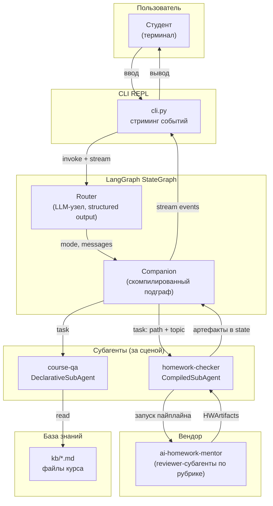
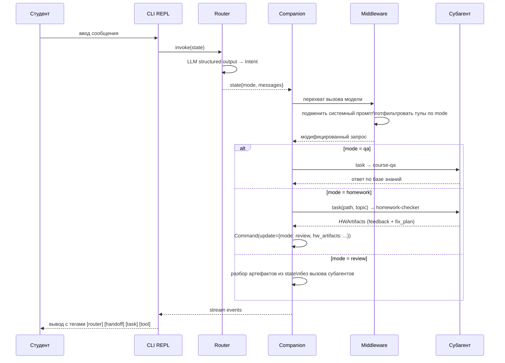
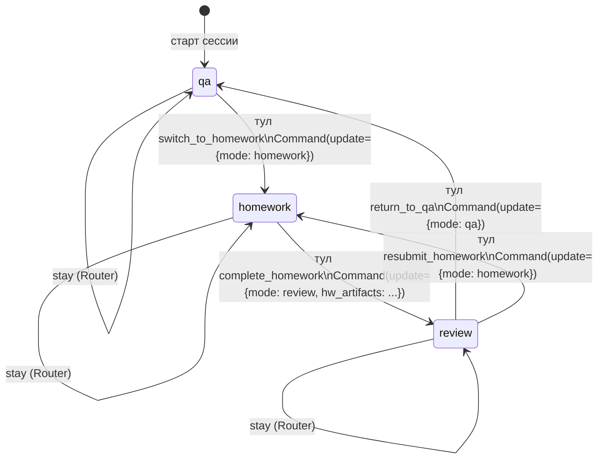
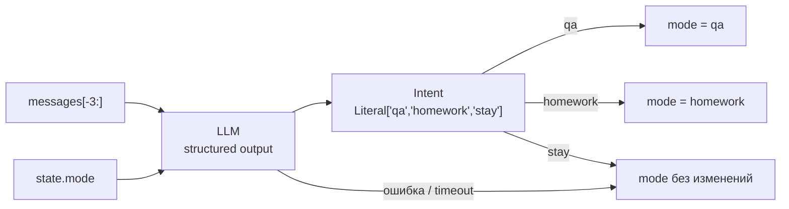
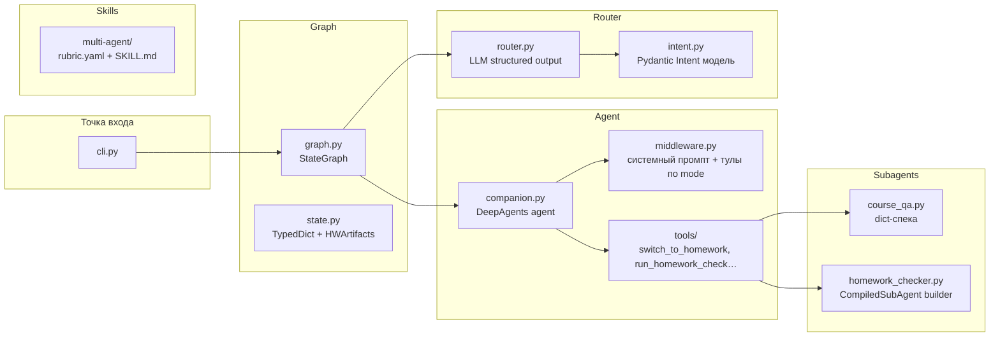

# Архитектура — Course Companion

> Продуктовое видение и принципы — [vision.md](vision.md).
> Суть продукта — [idea.md](idea.md).

---

## Контекст системы

Студент работает в терминале. Весь пользовательский интерфейс — REPL-чат с потоковым выводом событий. Бизнес-логика живёт в LangGraph StateGraph: детерминированный Router классифицирует интент, Companion ведёт диалог, субагенты выполняют специализированную работу за сценой.



---

## Контейнеры и ответственность

| Компонент | Назначение | Технологии |
|-----------|-----------|-----------|
| **cli.py** | REPL-цикл, стриминг событий графа, форматирование вывода | Python 3.11, asyncio |
| **StateGraph** | Внешний граф: Router → Companion → END; shared state; checkpointer | LangGraph |
| **Router** | LLM-узел: классифицирует интент, возвращает `mode`; sticky-логика | LangChain, Pydantic v2 |
| **Companion** | Скомпилированный DeepAgents-агент; конечный автомат qa/homework/review | DeepAgents, LangGraph |
| **course-qa** | Декларативный субагент (dict-спека); читает md-файлы базы знаний | DeepAgents |
| **homework-checker** | CompiledSubAgent-адаптер; собирается в runtime с рубрикой и workspace | DeepAgents, LangGraph |
| **ai-homework-mentor** | Вендоренный пайплайн: выбор рубрики → reviewer-субагенты → structured feedback | ai-homework-mentor (editable) |
| **kb/** | Markdown-файлы с данными курса (программа, расписание, FAQ, домашки) | Filesystem |
| **skills/** | Рубрики как YAML + SKILL.md; `multi-agent` — новая рубрика для dogfooding | YAML, Markdown |

---

## Поток одного хода диалога



---

## State — схема типизированного графа

```python
class CourseCompanionState(TypedDict):
    messages: Annotated[list[BaseMessage], add_messages]  # полная история диалога
    mode: Literal["qa", "homework", "review"]              # текущий режим Companion
    hw_artifacts: HWArtifacts | None                       # результат последней проверки
    last_intent: Literal["qa", "homework", "stay"] | None  # последнее решение Router
```

```python
class HWArtifacts(BaseModel):
    topic: str                  # тема домашнего задания
    rubric_name: str            # название применённой рубрики
    feedback: list[AspectFeedback]  # фидбек по аспектам рубрики
    fix_plan: list[FixItem]     # пошаговый план исправлений
    score: float | None         # итоговая оценка (если рубрика поддерживает)
```

---

## Companion — конечный автомат (три режима)

Companion — единый DeepAgents-агент. Middleware перехватывает каждый вызов модели и подменяет контекст по текущему `mode`.



**Правила режимов:**

| Режим | Системный промпт | Доступные тулы | История диалога |
|-------|-----------------|----------------|-----------------|
| `qa` | Ассистент по курсу | `ask_course_qa`, `switch_to_homework` | Полная |
| `homework` | Приёмщик ДЗ | `run_homework_check`, `complete_homework` | Полная |
| `review` | Наставник по фидбеку | `explain_feedback`, `show_fix_plan`, `return_to_qa`, `resubmit_homework` | Полная |

> История диалога **едина** во всех режимах — это принципиальное отличие Companion от субагентов.

---

## Router — детерминированный классификатор



- Видит только **хвост** диалога (последние 3 сообщения) + текущий `mode`.
- `review` **не входит** в Literal — это состояние флоу, не интент пользователя.
- Fail-safe: любая ошибка классификации → `stay` (текущий режим сохраняется).

---

## Субагенты — два подхода

### course-qa — DeclarativeSubAgent

Описывается как Python-словарь (dict-спека). DeepAgents компилирует агента самостоятельно.

```python
course_qa_spec = {
    "name": "course-qa",
    "system_prompt": "Ты — справочник курса Deep Agents. Отвечай только по содержимому базы знаний.",
    "tools": [read_kb_file, list_kb_files],
    "model": "gpt-4o-mini",
}
```

- Инструменты: `read_kb_file(filename)`, `list_kb_files()` — прямое чтение `kb/*.md`.
- **Не видит** историю диалога Companion — изоляция шума базы знаний.
- Без векторного поиска: файлов мало, прямое чтение прозрачнее и дешевле.

### homework-checker — CompiledSubAgent

Описывается как скомпилированный граф-адаптер. Собирается заново на каждый вызов — рубрика и workspace известны только в runtime.

```python
def build_homework_checker(path: str, topic: str) -> CompiledGraph:
    rubric = resolve_rubric(topic)          # выбор рубрики по теме
    mentor = AiHomeworkMentor(rubric=rubric, workspace=path)
    return mentor.compile()                 # граф ai-homework-mentor как подграф
```

- Оборачивает **весь пайплайн** `ai-homework-mentor` включая его внутренние reviewer-субагенты.
- Возвращает `HWArtifacts` в state родителя.
- **Не говорит** с пользователем напрямую.

---

## Паттерн Skills — рубрика multi-agent

Рубрика описывает аспекты проверки мультиагентного кода. Хранится в `src/skills/multi-agent/`.

**Структура рубрики:**

```
src/skills/multi-agent/
├── rubric.yaml     # аспекты, критерии, веса
└── SKILL.md        # системный промпт для reviewer-субагентов
```

**Аспекты рубрики `multi-agent` (rubric.yaml):**

```yaml
name: multi-agent
version: "1.0"
description: Рубрика проверки мультиагентных систем на курсе Deep Agents

aspects:
  - id: subagents
    name: Субагенты
    weight: 0.20
    criteria:
      - Агенты изолированы: каждый решает одну задачу
      - Использованы минимум два подхода (declarative + compiled)
      - Субагенты не взаимодействуют с пользователем напрямую

  - id: handoffs
    name: Handoffs (передача управления)
    weight: 0.20
    criteria:
      - Реализован механизм переключения режимов без создания нового агента
      - История диалога сохраняется при переключении
      - Переход задаётся явным Command, не неявной логикой

  - id: router
    name: Router (классификатор интента)
    weight: 0.20
    criteria:
      - Router отделён от основной логики агента
      - Structured output используется для классификации
      - Реализована sticky-логика (stay) и fail-safe

  - id: skills
    name: Skills (подключаемая экспертиза)
    weight: 0.20
    criteria:
      - Рубрика описана декларативно (YAML + SKILL.md)
      - Рубрика подключается без изменения кода агента
      - Присутствует рубрика для dogfooding-проверки

  - id: custom_workflow
    name: Custom Workflow
    weight: 0.20
    criteria:
      - Используется явный StateGraph (не магия фреймворка)
      - State типизирован (TypedDict или Pydantic)
      - Checkpointer подключён для многоходового диалога

scoring:
  pass_threshold: 0.70   # минимальный балл для зачёта
  output_format: structured  # HWArtifacts с feedback + fix_plan
```

---

## CLI и стриминг событий

REPL-цикл подписывается на поток событий LangGraph и форматирует их в реальном времени:

| Событие | Вывод в терминале | Пример |
|---------|------------------|--------|
| Router decision | `[router] → homework` | Решение классификатора |
| Handoff | `[mode] qa → homework` | Переключение режима |
| Subagent task | `[task] → homework-checker` | Делегирование |
| Tool call | `[tool] read_kb_file: schedule.md` | Вызов инструмента |
| LLM token | потоковый вывод | Ответ Companion |
| HWArtifacts | `[check] ✓ завершено: 3 аспекта` | Итог проверки |

---

## Внутренняя структура `src/`



---

## Деплой — локально

```bash
# Linux / macOS / WSL
make dev

# Windows (PowerShell)
.\make.ps1 dev
```

Docker-compose запускается через WSL на Windows. Для разработки без Docker достаточно `uv run python -m course_companion.cli`.

---

## Деплой — production

v1 — CLI-инструмент, production-деплой не предполагается. При необходимости — Docker-образ с `CMD ["python", "-m", "course_companion.cli"]`.

---

## Связанные документы

- [vision.md](vision.md) — пять паттернов, принципы, стек
- [idea.md](idea.md) — проблема и сценарии
- [roadmap.md](../roadmap.md) — слои реализации
- [../docs/decisions/](../docs/decisions/) — ADR 001–005
