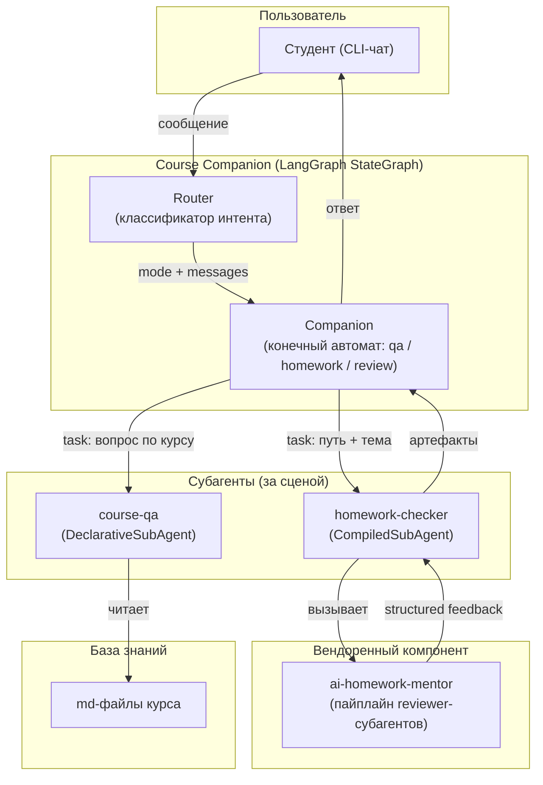

# Техническое видение — Course Companion

> Продуктовая суть — [idea.md](idea.md).
> Архитектурные детали и диаграммы — [architecture.md](architecture.md).

---

## 1. Система в целом

Course Companion — мультиагентный CLI-ассистент, построенный на DeepAgents + LangGraph. Ядро системы — один агент (Companion), который ведёт диалог со студентом в трёх режимах: ответы на вопросы по курсу, приём домашнего задания, разбор фидбека. Всё сложное (поиск по базе знаний, запуск проверки ДЗ) делегируется субагентам за сценой — студент видит единственного собеседника.

**Образовательная цель системы:** Course Companion — это живая демонстрация всех пяти мультиагентных паттернов LangChain в одном связном продукте. Каждый паттерн присутствует осознанно, а не для галочки.

---

## 2. Роли

| Роль | Описание |
|------|----------|
| **Студент** | Задаёт вопросы по курсу и сдаёт домашние задания через CLI-чат |
| **Companion (агент)** | Единственный собеседник студента; конечный автомат из трёх режимов |
| **Router** | Детерминированный классификатор интента; определяет режим перед каждым ходом |
| **course-qa (субагент)** | Отвечает на вопросы по курсу; изолирован от истории диалога |
| **homework-checker (субагент)** | Оборачивает полный пайплайн `ai-homework-mentor`; собирается в runtime |
| **ai-homework-mentor** | Вендоренный компонент; запускает reviewer-субагентов по рубрике |

---

## 3. Пользовательские сценарии

### Студент

- **С-1: Вопрос по курсу** — студент спрашивает о расписании, программе или формате; Companion отвечает через `course-qa`, не смешивая базу знаний с историей диалога.
- **С-2: Сдача ДЗ** — студент указывает путь к коду и тему; Companion делегирует `homework-checker`, наблюдает прогресс в реальном времени (стриминг), получает структурированный фидбек.
- **С-3: Разбор фидбека** — студент задаёт уточняющие вопросы по замечаниям и fix_plan; Companion работает в режиме review с артефактами проверки, не перезапуская её.
- **С-4: Возврат к QA** — после разбора студент продолжает задавать вопросы по курсу; режим переключается прозрачно.
- **С-5: Dogfooding** — студент (или преподаватель) сдаёт `course-companion/` по рубрике `multi-agent`; система проверяет сама себя и возвращает структурированный отчёт.

---

## 4. Архитектура (high-level)

> Детальные диаграммы потока, state-схема и структура Companion — в [architecture.md](architecture.md).



---

## 5. Пять паттернов LangChain — реализации

| Паттерн | Реализация в системе |
|---------|---------------------|
| **Subagents** | `course-qa` (DeclarativeSubAgent — dict-спека) и `homework-checker` (CompiledSubAgent — граф-адаптер); осознанный контраст двух подходов |
| **Handoffs** | Companion как «single agent + middleware»: middleware подменяет системный промпт и фильтрует тулы по `state["mode"]`; переход — тул с `Command(update={"mode": ...})` |
| **Router** | Детерминированный LLM-узел в графе; structured output (Pydantic, `Literal["qa","homework","stay"]`); sticky-логика; fail-safe → stay |
| **Skills** | Рубрики `ai-homework-mentor` как подключаемая экспертиза; новая рубрика `multi-agent` добавляется для dogfooding и демонстрации паттерна |
| **Custom Workflow** | Внешний `LangGraph StateGraph`: `router` (узел) → `companion` (скомпилированный подграф) → `END`; общий типизированный state; checkpointer для многоходового диалога |

---

## 6. Структура проекта

```
course-companion/
├── concept/                   # документация продукта
│   ├── idea.md
│   ├── vision.md
│   └── architecture.md
├── roadmap.md
├── docs/
│   ├── decisions/             # ADR
│   └── sprints/
├── src/
│   ├── agent/                 # Companion, Router, middleware, state
│   ├── subagents/             # course-qa, homework-checker
│   ├── skills/                # рубрика multi-agent (YAML + SKILL.md)
│   └── kb/                    # md-файлы базы знаний курса
├── tests/
├── pyproject.toml
├── Makefile
└── make.ps1                   # дублирует Makefile для Windows / PowerShell
```

Вендоренный компонент подключается как editable path-dependency:

```
# pyproject.toml
[tool.uv.sources]
ai-homework-mentor = { path = "../ai-homework-mentor", editable = true }
```

---

## 7. Доменные сущности

| Сущность | Смысл |
|----------|-------|
| **Session** | Один сеанс диалога; хранится в памяти процесса (in-memory checkpointer) |
| **State** | Типизированный граф-стейт: `messages`, `mode`, `hw_artifacts` |
| **Mode** | Текущий режим Companion: `qa` / `homework` / `review` |
| **Intent** | Результат Router: `qa` / `homework` / `stay` |
| **HWArtifacts** | Структурированный результат проверки: feedback + fix_plan от `ai-homework-mentor` |
| **Rubric** | YAML-файл + SKILL.md рубрики; определяет аспекты и критерии проверки ДЗ |

---

## 8. Внешние связи

| Интеграция | Назначение |
|------------|-----------|
| **ai-homework-mentor** | Запуск пайплайна проверки ДЗ; вендорится как editable path-dependency |
| **LLM API (OpenAI-совместимый)** | LLM для Companion, Router, субагентов и reviewer'ов ментора |
| **md-файлы базы знаний** | Источник данных для `course-qa`; читаются напрямую (без векторного поиска) |

---

## 9. Принципы разработки

- **Один собеседник** — пользователь никогда не видит субагентов и не взаимодействует с ними напрямую.
- **Паттерн как цель, граф как инструмент** — каждый из пяти паттернов присутствует осознанно; LangGraph — конструктор, а не самоцель.
- **Вендоринг без изменений** — `ai-homework-mentor` используется как есть; новый код только там, где он нужен.
- **Прозрачность за сценой** — стриминг событий показывает router-решения, переключения режимов и вызовы субагентов в реальном времени.
- **Dogfooding как критерий зрелости** — система считается готовой, когда может проверить сама себя по рубрике `multi-agent`.
- **KISS, YAGNI, Fail fast** — см. [10-conventions.mdc](../../.cursor/rules/methodology/10-conventions.mdc).

---

## 10. Технологии

| Область | Решение |
|---------|---------|
| Python | 3.11 |
| Package manager | `uv` |
| Мультиагентный фреймворк | DeepAgents + LangGraph |
| LLM-оркестрация | LangChain |
| Structured output | Pydantic v2 |
| Lint + format | ruff |
| Тесты | pytest + pytest-asyncio |
| CLI-интерфейс | REPL-чат в терминале (стриминг событий) |
| Контейнеризация | Docker + docker-compose (через WSL на Windows) |
| Сборка задач | Makefile + `make.ps1` (PowerShell-дубль) |

---

## 11. Архитектурные решения

| № | Решение | Статус |
|---|---------|--------|
| [ADR-001](../docs/decisions/001-single-agent-middleware.md) | Companion реализован как «single agent + middleware», а не три отдельных агента — сохраняет единую историю диалога | Принято |
| [ADR-002](../docs/decisions/002-declarative-vs-compiled-subagent.md) | `course-qa` — декларативный субагент (dict-спека), `homework-checker` — CompiledSubAgent; контраст осознанный — демонстрация обоих подходов | Принято |
| [ADR-003](../docs/decisions/003-direct-file-read-no-vector.md) | База знаний читается напрямую из md-файлов, без векторного поиска — файлов мало, прозрачность важнее производительности | Принято |
| [ADR-004](../docs/decisions/004-vendor-ai-homework-mentor.md) | `ai-homework-mentor` вендорится как editable path-dependency; его код не изменяется | Принято |
| [ADR-005](../docs/decisions/005-review-mode-not-intent.md) | Режим `review` — не интент пользователя в Router; войти в него можно только через тул после завершённой проверки | Принято |
