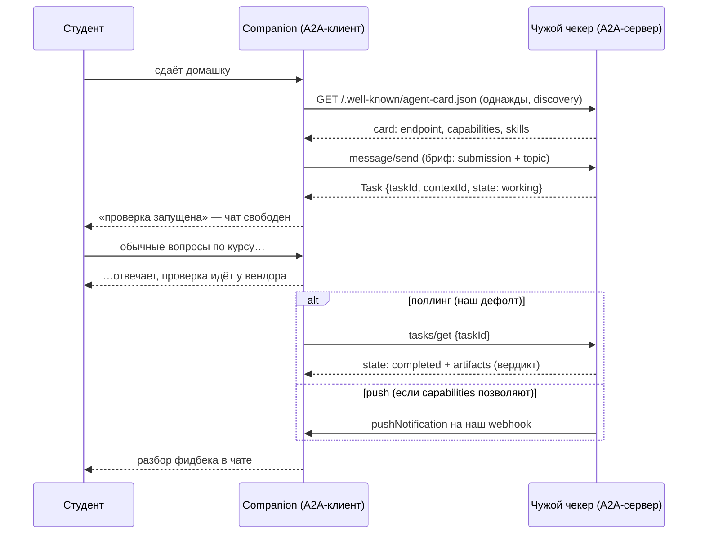

# Дизайн: companion как A2A-клиент чужого чекера

> Проектный раздел без кода. Мы уже видели, что наш чекер автоматически виден
> снаружи по A2A (agent card + `message/send` — полный лог витрины в
> `../examples/walkthrough/a2a-showcase.txt`). Здесь разворачиваем ситуацию
> на 180°: теперь **чужим становится чекер**, а companion — A2A-клиентом.

## 1. Сюжет: вторая сторона шва больше не наша

Представь два равноправных сценария, которые в жизни случаются постоянно:

- команда проверки выросла, переписала чекер на другой фреймворк — из их
  стека исчез сам «граф LangGraph», остался только сетевой сервис;
- или проще: компания купила SaaS-проверку домашек у внешнего вендора.

В обоих случаях companion не должен заметить подмены — но наш текущий шов
это обещание **не выдержит**. `AsyncSubAgent(url=…)` разговаривает со второй
стороной на штатном Agent Protocol (`/threads`, `/runs` — те же пять
endpoint'ов, что мы видели в ступени 3), и это протокол *нашей платформы*:
требовать его от чужого вендора — всё равно что требовать от поставщика
перейти на нашу внутреннюю шину. Для межвендорного шва существует
нейтральный стандарт — **A2A (Agent2Agent)**. Спроектируем переезд.

## 2. Что вторая сторона обязана нам показать

A2A начинается с **discovery**: у любого A2A-агента есть визитка —
agent card по well-known-адресу `/.well-known/agent-card.json`. Из неё
клиент узнаёт всё, что нужно для подключения:

- endpoint для JSON-RPC-вызовов (`url`);
- capabilities: умеет ли сервер `streaming`, умеет ли `pushNotifications`;
- skills — что агент вообще делает (для нас: «проверка домашних заданий»);
- input/output modes — какие типы контента он принимает и отдаёт.

Это первый выигрыш стандарта: интеграция начинается не с созвона двух команд,
а с GET-запроса. Companion при старте (или при первом обращении) читает
карточку, валидирует «это всё ещё сервис проверки» и запоминает endpoint.

## 3. Жизненный цикл проверки в терминах A2A

В A2A единица работы — **task**. Клиент шлёт `message/send` с текстом задания;
сервер отвечает объектом задачи с двумя идентификаторами:

- `taskId` — конкретная задача (наша проверка);
- `contextId` — «разговор», в рамках которого можно слать следующие сообщения.

Задача живёт по конечному автомату состояний: `submitted → working →
completed / failed / canceled` (+ `input-required`, если агенту нужно что-то
уточнить). Готовый результат приезжает в `artifacts` — у чекера это текстовый
вердикт.

Как это ложится на наш сценарий «сдал и разговариваем дальше»:

Обрати внимание на развилку в конце: у A2A **push-уведомления входят в сам
протокол** (`pushNotificationConfig` при создании задачи). Наш нынешний шов
такого не умеет — «результат пришёл сам» мы собирали руками из клиентского
поллинга. Если вендорский чекер поддерживает push, кульминация сценария
становится штатной функцией протокола. Это редкий случай, когда при переезде
на межвендорный стандарт мы что-то не теряем, а приобретаем.

## 4. Куда девается steering

В нашем шве «дошли инструкцию бегущей проверке» — это `update_async_task`:
платформа прерывает текущий ран и перезапускает его на том же треде с полной
историей плюс новая инструкция. Семантика жёсткая, но предсказуемая — и она
**принадлежит платформе**, а не протоколу.

В A2A такой операции нет. Есть два честных пути:

1. **Сообщение в ту же задачу.** Пока задача не терминальна, клиент может
   слать follow-up `message/send` с тем же `taskId`/`contextId`. Что сервер
   с этим сделает — учтёт на лету, перезапустит, поставит в очередь — его
   личное дело; протокол гарантирует только доставку. Значит, «инструкция
   будет учтена» превращается из свойства шва в **пункт контракта с
   вендором**, который надо проговорить и протестировать.
2. **Cancel + новая задача.** Если вендор follow-up'ы не поддерживает:
   `tasks/cancel`, затем новый `message/send` с брифом, дополненным
   инструкцией. Это то же «перезапуск с учётом инструкции», только руками
   клиента — companion должен сам склеить старый бриф с новой инструкцией.

Проектное решение: закладываем путь 2 как базовый (работает с любым
вендором), путь 1 включаем флагом после проверки конкретного поставщика.

## 5. Честная таблица: что теряем, что строим

Штатный шов (`AsyncSubAgent` поверх Agent Protocol) давал много «бесплатного».
Переезд на A2A каждую из этих строк превращает в нашу работу — или в
осознанную потерю:

| Было бесплатно на штатном шве | Что с этим при A2A |
|---|---|
| 5 готовых джоб-тулов (start/check/update/cancel/list) | пишем свой набор тулов-обёрток вокруг A2A-клиента с той же сигнатурой для LLM |
| Реестр задач в стейте агента (`async_tasks`), переживающий суммаризацию | ведём сами: та же идея, но канал наполняем из ответов `message/send`/`tasks/get` |
| Steering как interrupt-перезапуск на том же треде | контракт с вендором (follow-up) или cancel+resend руками (§4) |
| Статусы платформы (`pending/running/interrupted`…) и их семантика | маппим конечный автомат A2A (`submitted/working/completed/failed/canceled`) на карточки UI |
| Один SDK на обе стороны, ASGI-вариант co-deployed «бесплатно» | co-deployed исчезает по определению — вторая сторона всегда сеть |
| Сквозная наблюдаемость: task_id = thread_id, оба рана видны нам | внутрь вендора не заглянуть; наблюдаем только состояния задач + свои логи |
| Доверенная среда (оба сервиса наши) | auth/rate limits/SLA — впервые настоящие: карточка объявляет схемы аутентификации, ключи выдаёт вендор |
| Результат — как договоримся сами с собой | результат — artifacts; формат вердикта фиксируем контрактом (текст? структура?) |

И встречная колонка — что **приобретаем**: независимость от фреймворка второй
стороны (вендор хоть на чём), discovery по карточке вместо интеграционных
созвонов, стандартный lifecycle задач, штатные push-уведомления, и главное —
**заменяемость поставщика**: следующий переезд чекера companion уже не заметит.

## 6. Ограничения, о которых надо знать заранее

Если чужая сторона — тоже Agent Server (как наша витрина), у его нативного
A2A-endpoint'а есть жёсткие рамки, и они хорошо иллюстрируют «молодость»
экосистемы:

- **TextPart-only.** Нативный endpoint принимает и отдаёт только текстовые
  части сообщений — ни DataParts со структурой, ни файлов, ни расширений.
  Наш бриф двумя строками (`submission:` / `topic:`) через это проходит,
  но структурированный вердикт пришлось бы паковать в текст.
- **Agent card не кастомизируется** — имя/описание генерируются из ассистента,
  скиллы формальные (открытый запрос langgraph#7398). Для «настоящего»
  вендорского API карточку пишут руками.
- Мелочь, о которую спотыкаешься первой: endpoint адресуется **UUID
  ассистента**, не именем графа (UUID детерминированный, отдаёт
  `/assistants/search`).

## 7. Пуанта: протокол выбирается по шву

Сведём тему. У нас теперь два спроектированных варианта одного и того же шва
companion↔checker:

- **обе стороны наши** → штатный протокол платформы: пять endpoint'ов,
  готовые тулы, interrupt-steering, co-deployed одним конфигом. Дёшево и
  глубоко интегрировано — ровно потому, что это *внутренний* шов;
- **вторая сторона чужая** → межвендорный стандарт A2A: discovery, task
  lifecycle, push — и целая колонка «строим сами» из таблицы выше.

Ошибкой было бы и то, и другое возводить в абсолют: тащить A2A между двумя
своими сервисами — платить межвендорную цену без межвендорной границы;
тащить внутренний протокол к вендору — требовать от чужих жить в нашем стеке.
Протокол — функция границы, а не моды.
