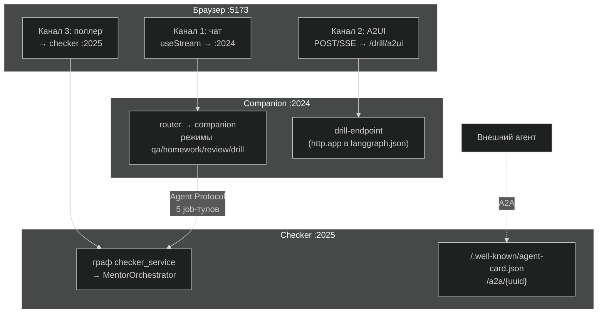
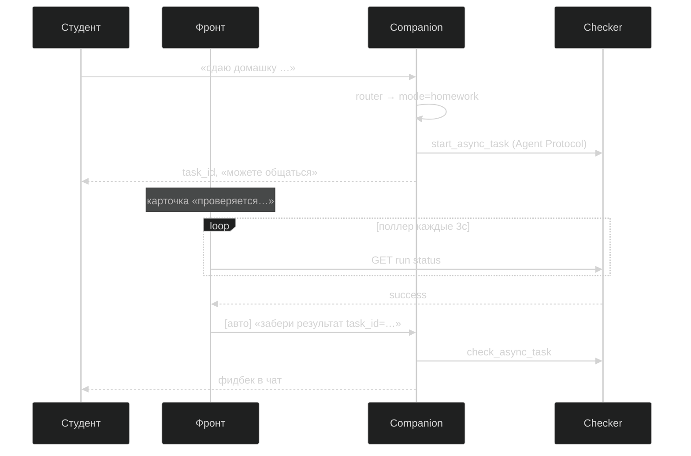
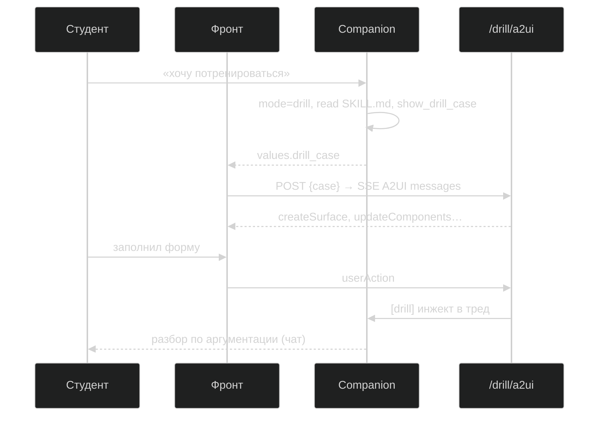

# Архитектурный walkthrough · Практика Темы 12

Документ для **автора**: пройти сверху вниз и понять, как устроена система, какие протоколы на каких швах, где живёт код и почему так.  
Материал участника: [`PRACTICE-GUIDE.md`](./PRACTICE-GUIDE.md) (цельный разбор) · [`README.md`](./README.md) (пошаговые ступени).  
Дизайн реализации (author-only) — [`_design.md`](./_design.md).

---

## Как пользоваться

1. Прочитай **§1–3** — ментальная модель и карта.
2. Открой **§4–6** — протоколы, каналы, стейт.
3. Пройди **§7** по слоям, открывая указанные файлы в IDE.
4. Прогони **§8** на живой системе (`make compose-up` или `make dev`).
5. Сверься с **§9–10** — грабли и чеклист понимания.

Ожидаемое время: 40–60 минут с кодом и одним сквозным прогоном.

---

## 1. Одна фраза

**Course Companion** — тот же мультиагентный монолит из Темы 11, но развёрнутый как **два сервиса** (companion + checker) с **веб-мордой**; на швах — **Agent Protocol** (свой стек), **A2A** (витрина для чужих), **A2UI** (динамические формы в drill).

Главный учебный вывод: **протокол — функция границы**, а не моды. Обе стороны наши → Agent Protocol. Вторая сторона чужая → A2A. UI без своего фронта → A2UI.

---

## 2. Целевая картина



**Сервисов два.** Не всё стало микросервисом: `course-qa` — локальный dict-субагент внутри companion; drill — не сервис, а четвёртое «лицо» handoffs-машины.

---

## 3. Карта кода (что открыть в IDE)

| Путь | Роль |
|------|------|
| `course-companion/companion/graph.py` | Внешний граф: `router → companion`; каналы `async_tasks`, `drill_case` наружу |
| `course-companion/companion/agent.py` | Сборка deep-agent: развилка `async_checker` (CLI sync / server async) |
| `course-companion/companion/modes.py` | Handoffs: 4 режима, промпты, блоклист тулов, `show_drill_case` |
| `course-companion/companion/checker.py` | Sync `CompiledSubAgent` (CLI) + `AsyncSubAgent` (сервер) |
| `course-companion/checker_service/service.py` | Граф чекера для Agent Server — **копия**, не импорт из companion |
| `course-companion/companion/server.py` | `graph = build_graph(server=True)` — точка входа сервера |
| `course-companion/companion/webapp.py` | FastAPI: `/drill/a2ui` на том же :2024 |
| `course-companion/companion/drill/` | Генератор форм (отдельный LLM), парсер A2UI, доставка ответа в тред |
| `course-companion/frontend/src/App.tsx` | 3 канала: чат, поллер, монтирование DrillPanel |
| `course-companion/langgraph.json` | Co-deployed: оба графа + `http.app` |
| `course-companion/langgraph.companion.json` | Распил: только companion |
| `course-companion/langgraph.checker.json` | Распил: только checker |
| `course-companion/docker-compose.yml` | 3 контейнера, один Python-образ × 2 сервиса |
| `course-companion/docs/a2a-integration-design.md` | Проектный раздел: companion как A2A-клиент **чужого** чекера |
| `course-companion/data/skills/scaling-case-drill/` | Скилл тренажёра (progressive disclosure) |
| `vendor/ai-homework-mentor/` | Замороженный пайплайн ментора — **не трогаем** |

---

## 4. Три конфигурации запуска

Один код — разные **конфиг + env**. Это ключ к ступени 3.

| Конфигурация | Конфиг | Порты | `CHECKER_URL` | Когда смотреть |
|--------------|--------|-------|---------------|----------------|
| **CLI** (нулевая точка Т11) | — | — | — | `uv run companion` |
| **Co-deployed** (ступени 1–2) | `langgraph.json` | :2024 + :5173 | нет (ASGI in-process) | `make dev` |
| **Распил** (ступень 3) | `.companion.json` + `.checker.json` | :2024, :2025, :5173 | `http://localhost:2025` | `make checker` + `make companion` + `make frontend` |
| **Compose** (финал) | то же | те же, hostnames | `http://checker:2025` | `make compose-up` |

### Что меняется между co-deployed и распилом

```python
# companion/checker.py — AsyncSubAgent
AsyncSubAgent(
    name="homework-checker-async",
    graph_id="checker",
    url=os.environ.get("CHECKER_URL"),  # None → ASGI; URL → HTTP
)
```

Код companion, джоб-тулы, промпты — **байт-в-байт те же**. Меняются только:
- какой `langgraph.json` поднят;
- есть ли `CHECKER_URL`;
- куда смотрит прокси поллера во фронте (`CHECKER_PROXY_TARGET`).

---

## 5. Протоколы на швах

| Шов | Протокол | Где в коде / конфиге |
|-----|----------|----------------------|
| браузер ↔ companion | Agent Server API (SSE) | `frontend` → `/api/langgraph` → Vite proxy → :2024 |
| companion ↔ checker (свой) | Agent Protocol | `AsyncSubAgent` + 5 тулов: start/check/update/cancel/list |
| внешний агент ↔ checker | A2A v1.0 | Нативно на Agent Server: `/.well-known/agent-card.json`, `/a2a/{uuid}` |
| агент ↔ форма (drill) | A2UI v0.9 | `POST /drill/a2ui` + SSE; клиент `@a2ui/react/v0_9` |
| companion → drill-endpoint | HTTP loopback | `CompanionDelivery` через `langgraph_sdk` → enqueue в тред |

**Не путать:** Agent Protocol ≠ A2A. Url-субагент deepagents говорит на **Agent Protocol**, не на A2A — даже когда оба графа на одном сервере.

---

## 6. Три HTTP-канала браузера

Один React-приложение, три разных `fetch`:

| # | Куда | Зачем | Когда |
|---|------|-------|-------|
| 1 | companion :2024 | Сообщения, стрим, `values` (mode, async_tasks, drill_case) | всегда |
| 2 | :2024 `/drill/a2ui` | Сгенерировать форму, принять `userAction` | `drill_case` в стейте |
| 3 | checker :2025 | Поллинг `threads/{id}/runs/{id}` | пока есть незавершённая задача в `async_tasks` |

Чат — **позвоночник**. Каналы 2 и 3 открываются по сигналу из `values` канала 1 — паттерн «UI как проекция стейта агента».

---

## 7. Проход по слоям (снизу вверх)

### 7.1. Ментор (заморожен)

`vendor/ai-homework-mentor/` — чужой проект. Пайплайн: оркестратор → ревьюеры → синтез.  
Масштабирование **не переписывает** его — только обвязку.

### 7.2. Checker как сервис

`checker_service/service.py`:
- State: `{ messages }` — контракт Agent Protocol и A2A.
- Первое human-сообщение = бриф (`submission:` / `topic:`).
- Следующие human = steering (`update_async_task`).
- Ответ = одно `AIMessage` с вердиктом.

**Почему копия, а не import из `companion/checker.py`:** граница сервисов = граница деплоя; чекер «другой команды» не должен зависеть от пакета companion.

### 7.3. Companion как deep-agent

`companion/agent.py` → `create_deep_agent` с:
- **Субагенты:** `homework-checker` (sync или async) + `course-qa` (dict).
- **Middleware:** summarization + `CompanionModesMiddleware` (handoffs).
- **Skills:** `data/skills/` копируются в сессионный workspace.

Развилка сборки:

```python
build_companion(async_checker=False)  # CLI: sync CompiledSubAgent
build_companion(async_checker=True)   # Server: AsyncSubAgent + 5 job-тулов
```

### 7.4. Внешний граф

`companion/graph.py`:

```
START → router → companion → END
```

- `router` — LLM-классификатор интента → пишет `mode`.
- `companion` — скомпилированный подграф deepagents.
- Каналы `async_tasks`, `drill_case` объявлены **и** во внешнем стейте — тогда Agent Server отдаёт их клиенту в `values`.

### 7.5. Handoffs (4 режима)

`companion/modes.py` — одна модель, четыре «лица»:

| mode | Роль | Ключевые тулы |
|------|------|----------------|
| `qa` | консультант | `task` → course-qa |
| `homework` | приёмщик | `start/update/cancel_async_task` + check/list |
| `review` | разборщик | артефакты ревью, `back_to_qa` |
| `drill` | тренажёр | `show_drill_case`, check/list (фидбек из любого режима) |

**Решение по джоб-тулам:** start/update/cancel — только `homework`; check/list — **все четыре** (кульминация walkthrough: фидбек посреди drill).

### 7.6. Фронт

`frontend/src/App.tsx`:
- `useStream` — чат, `values`, `stream.subagents`.
- `useSubmissionQueue` + `multitaskStrategy: "enqueue"` — писать во время рана.
- Поллер §1.1 `_design.md`: по `success` на чекере → авто-сообщение `[авто] проверка … завершена` → companion вызывает `check_async_task`.
- `DrillPanel`: видит `drill_case` → POST на `/drill/a2ui`.

### 7.7. Drill-модуль

`companion/drill/`:
- **Companion** решает *что* спросить (`show_drill_case` → JSON кейса в стейт).
- **DrillFormGenerator** — отдельный LLM (~11K токенов system: схемы A2UI + каталог + пример).
- **CompanionDelivery** — инжект `userAction` в тред companion (тот же enqueue-паттерн, что поллер).

Смонтировано в `langgraph.json` → `"http": { "app": "./companion/webapp.py:app" }` — канал 2 на том же :2024.

---

## 8. Ключевые потоки (пройти руками)

### 8.1. Сдача домашки (фон)



**Честность:** «само» драйвит **поллер на клиенте**. Прод-альтернатива — webhook (бонус ступени 1: `examples/run_background_webhook.py`).

### 8.2. Drill + A2UI



### 8.3. A2A-витрина (0 строк кода)

При поднятом checker на :2025:

```bash
curl -X POST http://localhost:2025/assistants/search -d '{}'
# → assistant_id для graph_id=checker

curl 'http://localhost:2025/.well-known/agent-card.json?assistant_id=<uuid>'
# → url, capabilities, skills

curl -X POST 'http://localhost:2025/a2a/<uuid>' \
  -H 'Content-Type: application/json' \
  -d '{"jsonrpc":"2.0","method":"message/send",...}'
```

Companion на :2024 виден так же — свойство **Agent Server**, не наша доработка.

---

## 9. Грабли (знать до прогона)

| Симптом | Причина | Лечение |
|---------|---------|---------|
| Чат «висит» после сдачи | `--n-jobs-per-worker` дефолт = **1** | `--n-jobs-per-worker 10` (в `make dev` уже есть) |
| Сервер перезапускается на проверке | hot reload видит записи в workspace | `--no-reload` везде |
| Async в CLI не работает | ASGI-транспорт только под Agent Server | CLI = sync checker (намеренно) |
| Steering удваивает время | interrupt → новый run с полной историей | такова семантика шва |
| cancel у companion ≠ статус у checker | `cancelled` vs `interrupted` | маппинг в UI |
| Кириллица в JSON тула | `json.dumps` без `ensure_ascii` | модели ок, глазам больно |
| Vite не открывается | слушает `::1` | браузер на `localhost`, не `127.0.0.1` |
| A2UI не ставится | peer deps | `npm i --legacy-peer-deps` |
| Импорт A2UI | дефолтный экспорт = v0_8 | только `/v0_9` пути |

---

## 10. Маршрут чтения файлов (45 мин)

| Шаг | Файл | Вопрос, на который ответишь |
|-----|------|----------------------------|
| 1 | `graph.py` | Где router, откуда клиент видит `async_tasks`? |
| 2 | `agent.py` | Чем CLI отличается от сервера? |
| 3 | `checker.py` | Sync vs AsyncSubAgent, откуда `url`? |
| 4 | `checker_service/service.py` | Почему не import из companion? |
| 5 | `modes.py` | Какие тулы в каком режиме? |
| 6 | `server.py` + `langgraph.json` | Как граф попадает на :2024? |
| 7 | `webapp.py` + `companion/drill/` | Где канал 2? |
| 8 | `App.tsx` (поллер, DrillPanel) | Где каналы 1 и 3? |
| 9 | `docker-compose.yml` | Что общее у контейнеров? |
| 10 | `docs/a2a-integration-design.md` | Когда нужен A2A вместо Agent Protocol? |

---

## 11. Сквозной прогон (чеклист понимания)

Запусти `make compose-up`, открой http://localhost:5173, пройди сценарий из README §9. После каждого шага — галочка:

- [ ] **До async:** понимаю, почему сдача блокировала чат (кадр `00-before-chat-blocked.png`).
- [ ] **Сдача:** `start_async_task` → карточка «проверяется…», поле ввода живое.
- [ ] **Параллель:** вопрос о курсе отвечает `course-qa`, чекер на :2025.
- [ ] **Поллер:** фидбек пришёл **без** ручного «как там проверка?» — видел `[авто]` в network/чате.
- [ ] **Drill:** форма из A2UI, не захардкожена во фронте.
- [ ] **Фидбек в drill:** `check_async_task` сработал в режиме drill (раскладка тулов).
- [ ] **A2A:** `curl` agent card с хоста на :2025.
- [ ] **Распил:** могу объяснить, что изменилось только `CHECKER_URL` + конфиги.
- [ ] **Честность:** могу объяснить, почему A2A **не нужен** между нашими двумя сервисами (вердикт темы).

Полный лог: `course-companion/examples/walkthrough/session-log.txt`.

---

## 12. Связь с лекцией (слайды v3)

| Тезис слайдов | Где в практике |
|---------------|----------------|
| Три границы (процесс / сеть / организация) | CLI → co-deployed → распил → compose |
| Тикет vs функция | `AsyncSubAgent` + job lifecycle |
| Agent Protocol ≠ A2A | url-субагент vs `/a2a` endpoint |
| «Результат пришёл сам» — кто драйвит | `App.tsx` поллер |
| A2UI: модель выбирает, не рисует | `DrillFormGenerator` + каталог v0_9 |
| Course Companion: A2A не нужен | co-deployed/ASGI + durable-делегация |
| Opacity / контекст | design doc: A2A только для **чужого** чекера |

---

## 13. Быстрые команды

```bash
cd doc/materials/scaling/practice/course-companion
cp .env.example .env   # OPENROUTER_API_KEY
uv sync
cd frontend && npm install --legacy-peer-deps && cd ..

make help            # все цели
make dev             # co-deployed (ступени 1–2)
make checker && make companion && make frontend   # распил
make compose-up      # финал
make stop            # погасить порты
make cli             # нулевая точка Т11
make test            # 46 тестов без LLM
```

---

## 14. Что сознательно за бортом

Не баги — отсечения (полный список в README §10 и `_design.md` §8):

- Langfuse / полный observability
- `langgraph up` + Postgres/Redis (прод-лицензия Elastic 2.0)
- Auth на швах (dev, noop)
- Кастомный agent card
- A2UI внутри A2A DataParts (только абзац в теории)
- Перепись пайплайна ментора

---

*Обновлено: 2026-07-15 · синхронизировано с реализацией SC2 (фазы 0–4 завершены).*
