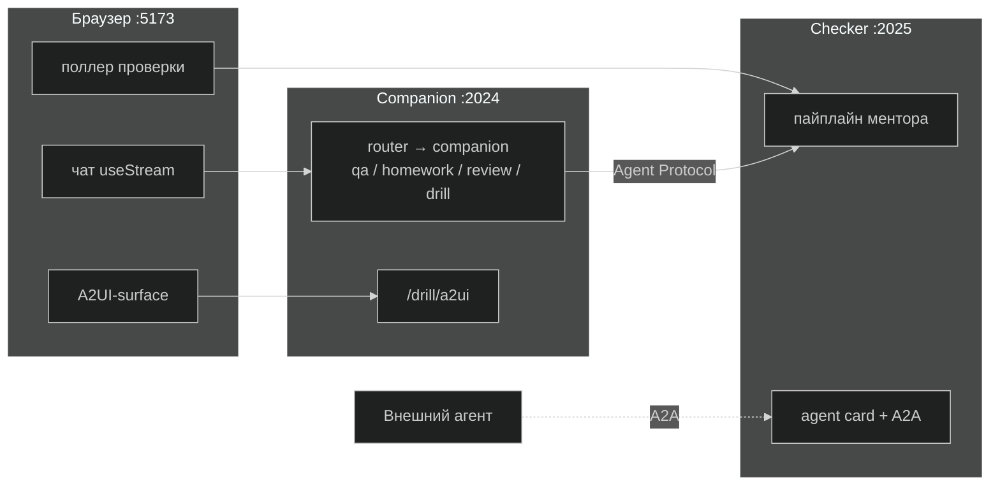
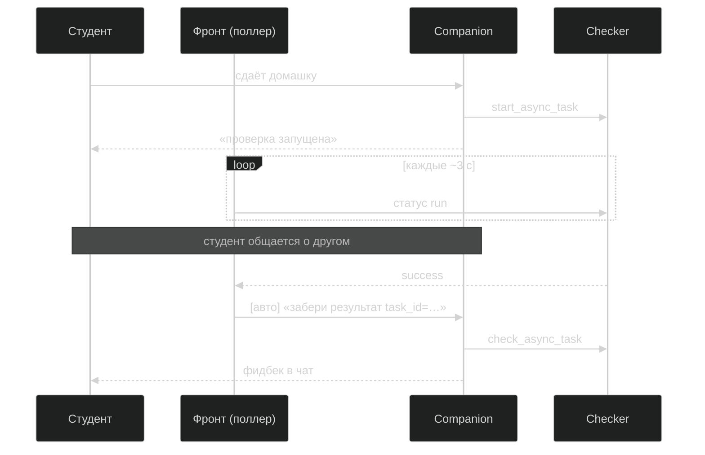
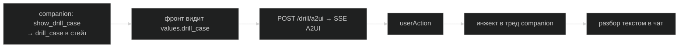
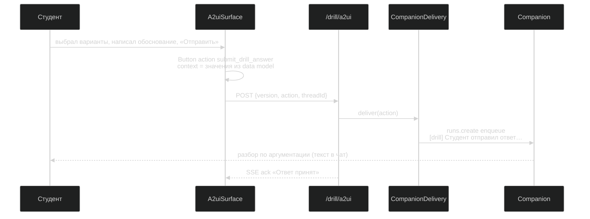
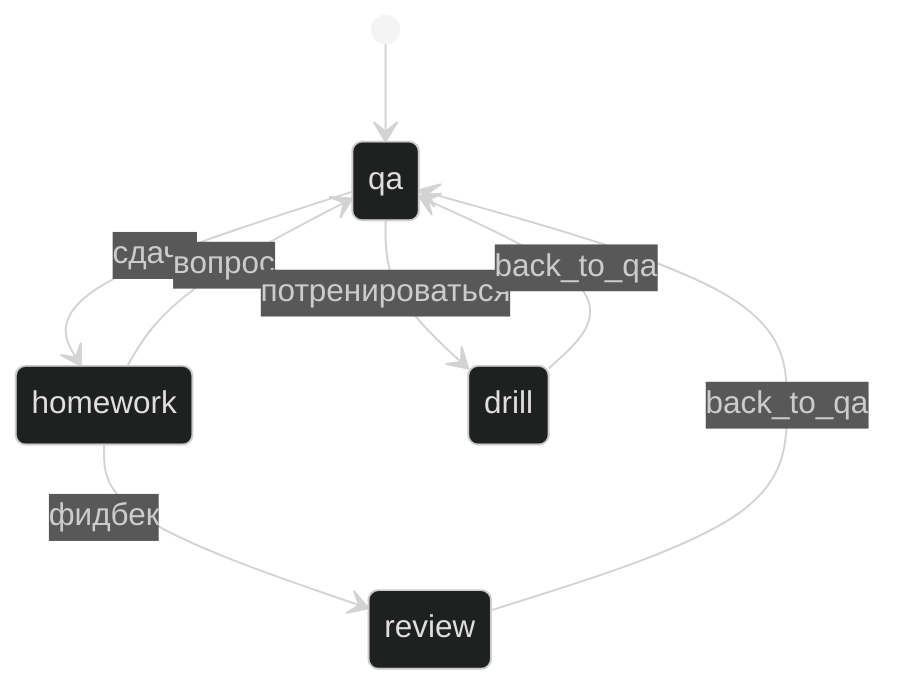

# Практика Темы 12 · Course Companion: от монолита к распределённой системе

Цельный разбор практики: **что** мы делаем функционально, **зачем**, и **как** это устроено в коде — с ключевыми диаграммами и фрагментами реализации.

Код и запуск — в [`course-companion/`](./course-companion/). Команды и пошаговые ступени — в [`README.md`](./README.md).

---

## Откуда стартуем

В Теме 11 мы собрали **Course Companion** — мультиагентного ассистента студента. Всё работало **внутри одного процесса**: router направляет запросы, companion переключает режимы (изучение / практика / экзамен), субагенты эксперт и коуч дополняют друг друга, ментор ведёт стратегию и рост.


**Сегодня** — выйти за границу процесса: тот же смысл, но как распределённая система с веб-интерфейсом, фоновыми задачами и стандартными протоколами на швах.

---

## Суть: четыре боли → четыре решения

Мы не придумываем поводы для масштабирования. Каждый шаг — ответ на задокументированную боль Темы 11:

| Боль (Т11) | Что делаем здесь | Тезис темы |
|---|---|---|
| Проверка домашки **блокирует чат** 53–293 с | checker уходит в фон: сдал → общаешься → результат приходит сам | Асинхронная коммуникация |
| Ментор — **чужой проект**, но живёт в нашем процессе | checker — отдельный сервис со своим жизненным циклом | Распределённые системы |
| Вход только через наш CLI | A2A agent card + endpoint — чекер виден снаружи | A2A |
| Интерфейс — плоский текст в терминале | веб-чат + drill с динамическими A2UI-формами | A2UI |

**Главный архитектурный вывод:** протокол — **функция границы**, а не моды.

- Обе стороны наши → **Agent Protocol** (глубоко, дёшево).
- Вторая сторона чужая → **A2A** (межвендорный стандарт, своя цена).
- UI без захардкоженного фронта → **A2UI** (агент описывает, клиент рендерит).

Пайплайн ментора (`vendor/ai-homework-mentor/`) **не переписываем** — меняем только обвязку. Масштабирование редко даёт право трогать чужой код.

---

## Целевая картина

Два сервиса, один браузер, четыре протокола на четырёх швах:



| Шов | Протокол | Реализация |
|---|---|---|
| браузер ↔ companion | Agent Server API (SSE) | `useStream` → Vite proxy → :2024 |
| companion ↔ checker | Agent Protocol | `AsyncSubAgent` + 5 job-тулов |
| внешний агент ↔ checker | A2A v1.0 | нативный endpoint сервера (0 строк кода) |
| агент ↔ форма drill | A2UI v0.9 | `POST /drill/a2ui` + SSE, `@a2ui/react/v0_9` |

**Не всё стало сервисом:** `course-qa` — локальный dict-субагент внутри companion; drill — не сервис, а четвёртое «лицо» handoffs-машины режимов.

---

## Часть I · Функционально: четыре ступени

### Ступень 1 · Агент становится сервисом

**Было:** companion в CLI-процессе — терминал, InMemorySaver, умер процесс — умерла сессия.

**Стало:** тот же граф под Agent Server, веб-чат в браузере. Threads, runs, SSE — даёт платформа.

**Но:** сдача домашки **всё ещё блокирует чат** — переезд в сервис сам по себе асинхронности не даёт:


---

### Ступень 2 · Проверка становится фоновой

**Было:** синхронный `task` — от минуты до пяти чат мёртв.

**Стало:** `AsyncSubAgent` + пять job-тулов (`start` / `check` / `update` / `cancel` / `list`). Сдал → карточка «проверяется…» → продолжаешь разговор → фидбек **приходит сам**.


**Кульминация:** «результат пришёл сам» — но честно: **кто-то должен драйвить**. AsyncSubAgent — поллинг; результат попадёт в диалог только когда модель вызовет `check_async_task`, а модель вызывается только внутри рана. Драйвер — **поллер на клиенте** (~50 строк во фронте). Прод-альтернатива — webhook (бонус ступени 1).



**Раскладка job-тулов по режимам** — осознанное решение:

| Тул | Режимы | Зачем |
|---|---|---|
| `start` / `update` / `cancel` | только `homework` | управление жизнью проверки |
| `check` / `list` | **все четыре** | фидбек забирается из любого места — в т.ч. посреди drill |

---

### Ступень 3 · Распил: чекер на своём сервере

**Было:** ментор «другой команды» в нашем процессе — общий деплой, общие падения.

**Стало:** checker на :2025, companion на :2024. **Код companion не меняется** — только конфиг + env `CHECKER_URL`.

**Бонус:** checker **уже виден снаружи** по A2A — agent card и `/a2a/{uuid}` нативно на Agent Server. Companion на :2024 виден так же — свойство сервера, не наша доработка.

**Мягкий отказ:** урони checker — тул вернёт текстовую ошибку, companion жив, course-qa отвечает штатно. Распределённость = новые режимы отказа.

**Дизайн-раздел** (без кода): что если чекер станет **чужим** (другой фреймворк / SaaS)? Тогда companion — A2A-клиент, а не Agent Protocol. Полный разбор — [`course-companion/docs/a2a-integration-design.md`](./course-companion/docs/a2a-integration-design.md).

---

### Ступень 4 · Drill + A2UI

**Было:** тренажёр «выбери a/b/в» простынёй текста.

**Стало:** кейс приезжает **интерактивной формой**, которой фронт заранее не знает. Router → `mode=drill`, companion генерирует кейс по скиллу `scaling-case-drill`, фронт рендерит A2UI-surface.


**Три HTTP-канала** в одном React-приложении — просто разные `fetch`:

| # | Куда | Зачем | Когда |
|---|---|---|---|
| 1 | companion :2024 | чат, стрим, `values` | всегда |
| 2 | `/drill/a2ui` | форма, `userAction` | `drill_case` в стейте |
| 3 | checker :2025 | поллинг проверки | пока висит `async_tasks` |

Чат — **позвоночник**. Каналы 2 и 3 открываются по сигналу из `values` канала 1 — паттерн **«UI как проекция стейта агента»**.



**Два решения:**

1. **Форма — отдельный LLM-вызов**, не companion. Companion решает *что* спросить (кейс). Генератор в drill-endpoint решает *как* отрисовать (~11K токенов схем A2UI — не тащим в каждый ход диалога).
2. **Фронт не получает RPC «покажи форму»** — тул пишет в стейт, фронт подписан на `values`. Тот же принцип, что с `async_tasks` и карточками задач.

#### Как рендерится UI: не готовые формы

Во фронте **нет** React-компонента «форма кейса» с захардкоженными полями. Есть универсальный **A2UI-surface** — он умеет рисовать *любой* UI, описанный протоколом A2UI v0.9.

**Два слоя данных:**

| Слой | Кто создаёт | Что это |
|---|---|---|
| **Кейс** (`DrillCase`) | companion (LLM + скилл) | JSON: `title`, `scenario`, `axes[]` (вопрос + варианты), `free_question` |
| **Описание формы** (A2UI-сообщения) | drill-endpoint (отдельный LLM) | JSON-поток: `createSurface`, `updateComponents`, `updateDataModel` |

Companion кладёт кейс тулом `show_drill_case` → фронт POST-ит `{case: …}` на `/drill/a2ui` → **второй** LLM генерирует A2UI-сообщения по шаблону и схемам каталога → `MessageProcessor` + `A2uiSurface` превращают их в React.

**Компоненты — из каталога `basicCatalog`**, не наши:

| Компонент | Роль в форме |
|---|---|
| `Card` + `Column` | обёртка, вертикальная раскладка |
| `Text` (variant `h3`) | заголовок кейса |
| `Text` | текст сценария |
| `ChoicePicker` (mutuallyExclusive) | одна ось = один вопрос с вариантами |
| `TextField` (longText) | свободное обоснование |
| `Button` (primary) | «Отправить» |

Фронт **не знает** заранее, сколько осей в кейсе — LLM собирает по одному `ChoicePicker` на каждую ось из `case.axes`.

**Что в промпте отвечает за «что рисовать»** (`companion/drill/generator.py`):

1. **`ROLE_DESCRIPTION`** — роль: «отрисуй кейс как форму».
2. **`UI_RULES`** — жёсткая раскладка: Card → Column → title → scenario → ChoicePicker на ось → TextField → Button «Отправить»; событие кнопки `submit_drill_answer`; биндинги в data model по путям `/<axis_id>` и `/rationale`.
3. **JSON-схемы каталога** — `A2uiSchemaManager.generate_system_prompt(include_schema=True)` (~11K токенов).
4. **Шаблон-пример** `examples/0.9.1/drill_form.json` — few-shot: *структура* A2UI-сообщений, не готовая форма для показа.
5. **User-промпт** — конкретный `DrillCase` JSON + `surfaceId` + список путей осей.

```python
# companion/drill/generator.py — правила раскладки (фрагмент)
UI_RULES = """
- Build exactly ONE surface, following the drill form template from the examples.
- The form MUST contain: title (Text h3), scenario (Text),
  one ChoicePicker per axis, one longText TextField for rationale,
  a primary Button labelled "Отправить".
- The Button action event MUST be named "submit_drill_answer" ...
"""
```

Генератор стримит токены → `A2uiStreamParser` валидирует → SSE в браузер → форма **проявляется инкрементально**. Невалидная попытка — retry (до 3 раз).

**Как уходит ответ от формы:**



1. Кнопка в A2UI привязана к событию `submit_drill_answer`; в `context` попадают значения полей (`/<axis_id>` → список выбранных, `/rationale` → текст).
2. `DrillPanel` ловит `userAction` через `MessageProcessor` → `POST /drill/a2ui` с `threadId` из чата.
3. `CompanionDelivery` упаковывает `action.context` в служебное сообщение `[drill] Студент отправил ответ…` и ставит **фоновый run** в тред companion (`multitask_strategy: enqueue`).
4. Companion (тот же drill-режим, промпт из `modes.py`) разбирает ответ **по аргументации** — текстом в обычный чат. Разбор **не** приходит через A2UI; форма показывает только ack «Ответ принят».

Подробности модуля — [`course-companion/companion/drill/README.md`](./course-companion/companion/drill/README.md).

---

## Часть II · Как это сделано: код и конфигурации

### Карта кода

| Путь | Роль |
|---|---|
| `companion/graph.py` | Внешний граф `router → companion`; каналы `async_tasks`, `drill_case` наружу |
| `companion/agent.py` | Сборка deep-agent; `async_checker=True/False` (CLI vs сервер) |
| `companion/modes.py` | 4 режима, промпты, блоклист тулов |
| `companion/checker.py` | Sync `CompiledSubAgent` (CLI) + `AsyncSubAgent` (сервер) |
| `companion/server.py` | Точка входа Agent Server |
| `companion/webapp.py` | FastAPI: `/drill/a2ui` на том же :2024 |
| `companion/drill/` | Генератор форм, парсер A2UI, доставка ответа |
| `checker_service/service.py` | Граф чекера — **копия**, не import из companion |
| `frontend/src/App.tsx` | 3 канала: чат, поллер, DrillPanel |
| `langgraph.json` | Co-deployed: оба графа |
| `langgraph.companion.json` / `.checker.json` | Распил |
| `docker-compose.yml` | 3 контейнера, один Python-образ × 2 сервиса |

### Переезд в сервис — весь «переезд» в двух местах

```python
# companion/server.py
from companion.graph import build_graph

graph = build_graph(server=True)
```

плюс `langgraph.json`. Логика агента та же; серверный транспорт потребовал двух мелких адаптаций: async-хук middleware и тег `nostream` у router'а (служебная классификация не течёт в стрим).

### Co-deployed ↔ распил — один код, разный env

```python
# companion/checker.py — AsyncSubAgent
AsyncSubAgent(
    name="homework-checker-async",
    graph_id="checker",
    url=os.environ.get("CHECKER_URL"),  # None → in-process; URL → HTTP
)
```

| Конфигурация | Конфиг | Порты | `CHECKER_URL` |
|---|---|---|---|
| CLI (Т11) | — | — | — |
| Co-deployed | `langgraph.json` | :2024 + :5173 | нет |
| Распил | `.companion.json` + `.checker.json` | :2024, :2025, :5173 | `http://localhost:2025` |
| Compose | то же | hostnames сети | `http://checker:2025` |

### Стейт, который видит фронт

Каналы `async_tasks` и `drill_case` объявлены **и** во внешнем графе — тогда Agent Server отдаёт их клиенту в `values`:

```python
# companion/graph.py (фрагмент)
class CompanionGraphState(TypedDict):
    messages: Annotated[list[AnyMessage], add_messages]
    mode: NotRequired[str]
    async_tasks: Annotated[NotRequired[dict[str, Any]], _merge_async_tasks]
    drill_case: NotRequired[dict[str, Any]]
```

На этом стоят поллер «фидбек пришёл сам» и монтирование A2UI-surface.

### Handoffs: четыре «лица»



### Checker как отдельный сервис

`checker_service/service.py` — тонкий StateGraph-адаптер: `{ messages }` → `MentorOrchestrator.run` → вердикт. **Копия**, не import: граница сервисов = граница деплоя, чекер не зависит от пакета companion.

### A2A-витрина — 0 строк кода

```bash
curl -X POST http://localhost:2025/assistants/search -d '{}'
curl 'http://localhost:2025/.well-known/agent-card.json?assistant_id=<uuid>'
```

`message/send` с брифом `submission:` / `topic:` запускает полноценную проверку.

---

## Сквозной сценарий «одна сессия»

Живой прогон на `docker compose up` (полный лог — `course-companion/examples/walkthrough/session-log.txt`):

1. **Сдача** → `start_async_task`, карточка «проверяется…», чат жив.
2. **Параллель** → вопрос о курсе, course-qa отвечает, чекер на :2025.
3. **Drill** → «хочу потренироваться» → A2UI-форма с осями выбора протоколов.
4. **Кульминация** → фидбек проверки **сам** посреди drill (`check` доступен во всех режимах):


5. **Ответ на кейс** → `userAction` → разбор по аргументации в чате.
6. **Снаружи** → `curl` agent card чекера — стандартный A2A-агент.

В Т11 те же ~2.5 минуты были бы мёртвым полем ввода. Здесь чат занят **секунды**.

---

## Запуск

```bash
cd course-companion
cp .env.example .env          # OPENROUTER_API_KEY
uv sync
cd frontend && npm install --legacy-peer-deps && cd ..

make dev                        # co-deployed (ступени 1–2)
make checker && make companion && make frontend   # распил
make compose-up                 # финал: docker compose
make cli                        # нулевая точка Т11 (синхронный чекер)
make test                       # 46 тестов без LLM
```

Порты: companion **:2024** · checker **:2025** · frontend **:5173**.

---

## Грабли (знать до прогона)

| Симптом | Причина | Лечение |
|---|---|---|
| Чат «висит» после сдачи | `--n-jobs-per-worker` дефолт = **1** | `--n-jobs-per-worker 10` (в `make dev` уже есть) |
| Сервер перезапускается на проверке | hot reload видит workspace | `--no-reload` |
| Async в CLI не работает | ASGI только под Agent Server | CLI = sync checker (намеренно) |
| Steering удваивает время | interrupt → новый run | семантика шва |
| cancel ≠ статус checker | `cancelled` vs `interrupted` | маппинг в UI |
| Vite не открывается | слушает `::1` | браузер на `localhost` |
| A2UI не ставится | peer deps | `npm i --legacy-peer-deps` |
| Импорт A2UI | дефолтный экспорт = v0_8 | только `/v0_9` |

---

## Честные оговорки

**Dev-стенд, не прод.** `langgraph dev` в контейнерах: state в памяти, in-memory очередь, без auth. Прод-путь — `langgraph up` + Postgres/Redis + лицензия Elastic 2.0.

**«Код не менялся» — с оговорками.** Логика агента та же; транспорт потребовал адаптаций; CLI и сервер собираются с разным чекером (sync/async).

**Осознанно за рамками:** Langfuse/LangSmith, auth, брокеры, service registry, AG-UI, cron, перепись пайплайна ментора.

---

## Связь с лекцией

| Тезис слайдов | Где в практике |
|---|---|
| Три границы (процесс / сеть / организация) | CLI → co-deployed → распил → compose |
| Durable-делегация vs синхронный вызов | `AsyncSubAgent` + job lifecycle |
| Agent Protocol ≠ A2A | url-субагент vs `/a2a` endpoint |
| «Результат пришёл сам» — кто драйвит | поллер в `App.tsx` |
| A2UI: модель выбирает, не рисует | `DrillFormGenerator` |
| Протокол — функция границы | co-deployed vs A2A для чужого чекера |

---

*Синтез [`README.md`](./README.md), [`ARCHITECTURE-WALKTHROUGH.md`](./ARCHITECTURE-WALKTHROUGH.md) и реализации SC2. Обновлено: 2026-07-15.*
