# Практика Темы 12 · Course Companion: масштабирование агентной системы

**Цельный разбор «суть → как сделано»** (диаграммы, код, сквозной сценарий) — [`PRACTICE-GUIDE.md`](./PRACTICE-GUIDE.md).

Это практика к теме «Масштабирование агентных систем» — и прямое продолжение практики Темы 11. Там мы собрали **Course Companion**: мультиагентного ассистента студента (router → companion с режимами, субагенты course-qa и homework-checker поверх вендоренного ментора). Он работал — но как *локальный CLI-процесс*: один вход через терминал, один процесс на всё, синхронная проверка домашки, намертво блокирующая диалог.

В этой практике тот же Course Companion становится **распределённой системой**: два сервиса, веб-интерфейс, фоновые задачи и стандартные протоколы на швах. Весь код лежит рядом в `course-companion/`, его можно запустить (от CLI до `docker compose up`), потыкать и поломать.

**Архитектурный разбор по слоям** (протоколы, стейт, три HTTP-канала, маршрут по файлам) — [`ARCHITECTURE-WALKTHROUGH.md`](./ARCHITECTURE-WALKTHROUGH.md).

Главная честность сюжета: мы не выдумываем поводы для распределённости. Каждый тезис темы — это задокументированная боль Т11, которую ты, скорее всего, прочувствовал сам:

| Боль Т11 (зафиксирована в живых логах практики Т11) | Решение здесь | Тезис темы |
|---|---|---|
| Проверка синхронная: 53–293 сек диалог заблокирован (живые логи) | checker → async-субагент: сдал → чатишься → результат приходит сам | Асинхронная коммуникация |
| Ментор — чужой проект, но живёт в нашем процессе и релизится с нами | checker → отдельный сервис со своим жизненным циклом | Распределённые системы |
| Вход только наш CLI; чужой агент/система сдать не могут | нативный A2A-endpoint + agent card (витрина) + дизайн интеграции | A2A |
| Интерфейс — терминал, плоский текст | веб-чат + drill-режим с динамическими A2UI-формами | A2UI |

Материал устроен как **четыре ступени** — по одной на боль. Ступени независимы: каждая завершённая оставляет работающую систему, и у каждой есть своя конфигурация запуска. В конце — [walkthrough «одна сессия»](#9-walkthrough-одна-сессия), где всё случается в одном диалоге.

---

## 1. Целевая архитектура

Вот куда мы едем (и куда доехали):

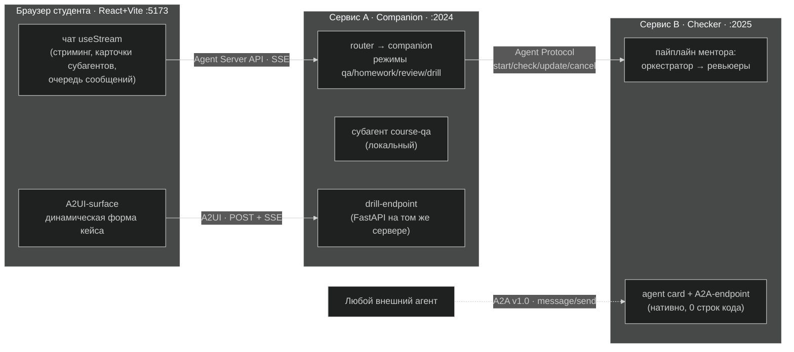

Сервисов ровно **два**. Companion — «лицо» системы: внешний граф router → companion из Т11, только теперь развёрнутый как сервис. Checker — проверка домашек: тот самый вендоренный пайплайн ментора, вынесенный в отдельную деплой-единицу «другой команды». Всё остальное сознательно *не* стало сервисами: course-qa остаётся локальным dict-субагентом (не всё обязано быть микросервисом), drill — не сервис и не субагент, а четвёртое «лицо» той же handoffs-машины режимов из Т11.

Учебный пуант архитектуры — **какой протокол на каком шве**:

| Шов | Протокол | Реализация |
|---|---|---|
| браузер ↔ companion | Agent Server API (SSE) | `useStream` из `@langchain/react` |
| companion ↔ checker (co-deployed) | Agent Protocol (in-process) | `AsyncSubAgent` |
| companion ↔ checker (распил) | Agent Protocol (HTTP) | `AsyncSubAgent(url=…)` |
| внешний агент ↔ checker | A2A v1.0 | нативный endpoint сервера — витрина + [дизайн-раздел](#53-дизайн-раздел-companion-как-a2a-клиент-чужого-чекера) |
| агент ↔ динамический UI (drill) | A2UI v0.9 | `a2ui-agent-sdk` + свой SSE-endpoint + `@a2ui/react` |

К этой таблице мы будем возвращаться на каждой ступени: она — ответ на вопрос «почему здесь этот протокол, а не тот».

---

## 2. Карта кода

База — Course Companion из Т11 (его файлы разобраны в README той практики). Здесь — только то, что добавилось или изменилось:

| Файл | Роль | Ступень |
|---|---|---|
| `companion/server.py` | точка экспорта графа для Agent Server (сервер = граф без локального чекпоинтера) | 1 |
| `companion/webapp.py` | кастомные HTTP-роуты companion-сервера: drill-endpoint через `http.app` | 4 |
| `companion/modes.py` | + четвёртое «лицо» drill, + промпт фонового приёмщика, + раскладка джоб-тулов по режимам | 2, 4 |
| `companion/drill/` | A2UI-модуль: генератор форм, транспорт, доставка ответа (свой README внутри) | 4 |
| `checker_service/service.py` | граф чекера: тонкий StateGraph-адаптер поверх пайплайна ментора | 2 |
| `frontend/` | веб-чат: `useStream`, карточки субагентов, очередь, поллер, A2UI-surface | 1–4 |
| `langgraph.json` | co-deployed конфиг: оба графа на одном сервере | 2 |
| `langgraph.companion.json` / `langgraph.checker.json` | распил: у каждой деплой-единицы свой конфиг | 3 |
| `docker-compose.yml` + `Dockerfile` + `frontend/Dockerfile` | упаковка: три контейнера | финал |
| `data/skills/scaling-case-drill/` | скилл тренажёра: SKILL.md + справки `references/` (progressive disclosure) | 4 |
| `docs/a2a-integration-design.md` | проектный раздел: companion как A2A-клиент чужого чекера | 3 |
| `examples/` | webhook-демо + `walkthrough/` — лог и кадры сквозного живого прогона | — |

`vendor/ai-homework-mentor/` по-прежнему заморожен: **пайплайн ментора не менялся ни на строчку** — вся эволюция происходит в обвязке. Это важная часть сюжета: масштабирование редко даёт тебе право переписать чужой код.

Подготовка окружения (один раз):

```bash
cd course-companion
cp .env.example .env        # впиши свой ключ OpenRouter
uv sync                     # python-зависимости (+ Agent Server CLI)
cd frontend && npm install --legacy-peer-deps && cd ..   # про флаг — ступень 4
```

Все конфигурации запуска ниже обёрнуты в make-цели (`make help` в `course-companion/` — полный список; серверные цели поднимают процессы фоном с логами в `.logs/`, `make stop` гасит всё портовое). Сырые команды в тексте ступеней при этом остаются намеренно: по ним видно флаги и env на швах, которые make прячет, — а понимать их здесь и есть часть материала.

---

## 3. Ступень 1 — агент становится сервисом

**Боль.** В Т11 companion жил внутри CLI-процесса: интерфейс — терминал, память диалога — InMemorySaver, умер процесс — умерла сессия. Никакого способа подключиться вторым клиентом, никакого HTTP.

**Решение.** Развернуть *тот же граф* под Agent Server (`langgraph dev`) и поговорить с ним из браузера.

Весь «переезд в сервис» — это `companion/server.py`:

```python
from companion.graph import build_graph

graph = build_graph(server=True)
```

плюс конфиг `langgraph.json`, объявляющий граф серверу. Всё. Threads, runs, персистентность диалогов, SSE-стриминг — это теперь даёт платформа: `thread_id` становится сессией чата, и к нему можно переподключаться.

Честная формулировка того, что произошло: **логика агента не менялась — но серверный транспорт потребовал двух мелких адаптаций.** Первая: middleware режимов получил async-вариант хука (`awrap_model_call`) — платформа вызывает граф асинхронно, CLI синхронно, нужны оба. Вторая: модель router'а получила тег `nostream`, чтобы служебная классификация не текла в веб-стрим посреди ответа. Обе адаптации — про *транспорт*, не про поведение; но «код вообще не менялся» было бы неправдой, и полезно знать, обо что именно спотыкаешься.

Третья грабля жёстче: companion пишет рабочие файлы прямо в папку проекта (`.companion-workspace/`, workspace'ы ментора), а hot reload dev-сервера следит за этой же папкой — на длинной проверке сервер перезапускал сам себя посреди рана. Поэтому во всех командах ниже `--no-reload`.

Веб-чат (`frontend/`) — свой мини-клиент на хуке `useStream` из `@langchain/react`: сообщения, стриминг токенов, `threadId`, чипы tool-вызовов. CORS решён Vite-прокси: браузер ходит только на origin фронта, Vite перекидывает на :2024.

Запуск этой конфигурации:

```bash
uv run langgraph dev --no-reload                 # Agent Server :2024
cd frontend && npm run dev                       # веб-чат :5173 (браузером на localhost)
```

То же одной командой — `make dev`: поднимет оба процесса фоном, погасить — `make stop`. Внутри make-цели уже зашит и флаг `--n-jobs-per-worker 10`, смысл которого раскроется в разделе 4.1.

### 3.1 Бонус ступени: background run + webhook

Раз агент теперь сервис, у него появился штатный фоновый режим запуска. Важно сразу расставить, про что это: не про чекер и не про какого-то специального агента — это **платформенная возможность Agent Server**, фоном можно запустить ран *любого* графа, задеплоенного на сервере. Демо-скрипт ниже показывает механику в вакууме: он задаёт обычный вопрос о курсе нашему же companion (не чекеру — никакая проверка здесь не запускается). Суть в двух ходах: `runs.create(...)` возвращается **мгновенно**, не дожидаясь ответа, а когда ран завершится — **сервер сам** стучится POST'ом в указанный тобой endpoint:

```bash
uv run uvicorn examples.webhook_receiver:app --port 8080   # приёмник ~10 строк
uv run python examples/run_background_webhook.py           # background run + webhook=
```

(При поднятом сервере то же целиком — `make webhook-demo`: поднимет приёмник, прогонит скрипт, покажет лог приёмника и погасит его.)

В живом прогоне создание рана вернулось со `status=pending` мгновенно, а через ~10 секунд приёмник получил `run … → success` — без единого опроса. Пока это просто фокус с вопросом-ответом, но механизм запомни: **в проде именно webhook заменил бы наш клиентский поллер** доставки фидбека — мы вернёмся к нему на ступени 2, когда будем собирать «результат пришёл сам» ([раздел 4.3](#43-результат-пришёл-сам--кто-это-драйвит-на-самом-деле)). Сноска про локалку: loopback-webhook'и по умолчанию заблокированы (SSRF-защита), поэтому в `langgraph.json` для этого демо включён опт-ин `webhooks.url.{disable_loopback,require_https}` — в проде так делать не надо.

**Что увидишь** — и вот тут пуант ступени: чат в браузере работает, стриминг красивый… а сдача домашки **всё ещё блокирует диалог**. Проверка — синхронный вызов субагента внутри одного рана; пока он идёт, тред занят:

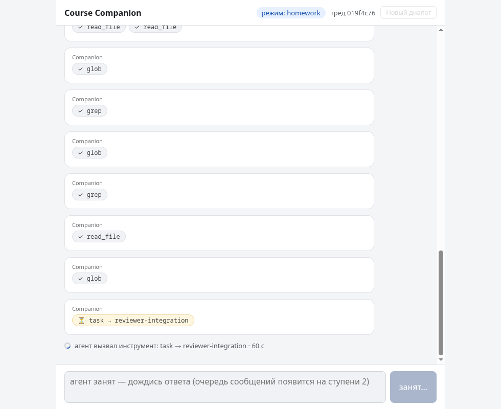

Полторы минуты мёртвого поля ввода. Переезд в сервис сам по себе асинхронности не даёт — ей посвящена следующая ступень.

---

## 4. Ступень 2 — проверка становится фоновой

**Боль.** Та самая, главная: пока чекер работает (от минуты до пяти), студент не может ни спросить «как дела», ни поговорить о другом, ни отменить проверку.

**Решение.** Синхронный `task`-вызов чекера заменяется **async-субагентом**: `AsyncSubAgent` — это субагент, который живёт на Agent Protocol-сервере и управляется *джоб-паттерном*.

Сначала чекеру нужен собственный граф — `checker_service/service.py`, тонкий StateGraph-адаптер поверх пайплайна ментора (~110 строк: разобрать бриф из `messages`, прогнать `MentorOrchestrator.run`, вернуть вердикт одним сообщением). Обрати внимание на структуру: это сознательная **копия-адаптация** аналогичного адаптера из companion, а не импорт через границу сервисов — чекер не должен зависеть от пакета companion. Общее у сервисов — только протокол; граница сервисов = граница деплоя, даже пока оба пакета живут в одном репозитории.

Дальше у companion появляется (упрощённо; в коде `url` подставляется из env `CHECKER_URL`, а без него субагент остаётся co-deployed):

```python
AsyncSubAgent(name="homework-checker-async", graph_id="checker")
```

и вместе с ним — **пять джоб-тулов**: `start_async_task` / `check_async_task` / `update_async_task` / `cancel_async_task` / `list_async_tasks`. Метаданные задач живут в отдельном канале стейта `async_tasks` (и переживают суммаризацию истории). На этой ступени оба графа развёрнуты на одном сервере (co-deployed, общий `langgraph.json`) — субагент ходит к чекеру in-process, но уже по Agent Protocol.

Новые тулы надо разложить по «лицам» handoffs-машины режимов — и здесь стоит притормозить и сравнить с Т11. Там у машины было одно место встречи с чекером: «лицо» `homework` с единственным **синхронным** `task` — один вызов, внутри которого целиком жила вся проверка, от старта до вердикта. Теперь этот один вызов рассыпался на пять тулов с разными ролями, и по каждому надо решить, каким «лицам» он виден. Раскладка не механическая, в ней есть решение:

| Тул | В каких режимах доступен | Почему |
|---|---|---|
| `start_async_task` / `update_async_task` / `cancel_async_task` | только `homework` | управление жизнью проверки — запустить, дослать инструкцию, отменить — дело «лица»-приёмщика; и где бы ни шёл разговор, router по интенту («хочу сдать», «отмени проверку») всё равно приведёт студента сюда |
| `check_async_task` / `list_async_tasks` | все четыре «лица» | фидбек и статус готовой проверки должны забираться из **любого** места диалога, не выдёргивая студента в приёмную — на этом стоит кульминация walkthrough: «фидбек посреди дрилла» |

Сама машина — те же состояния и переходы, что в Т11; изменилось то, что у каждого «лица» теперь свой набор джоб-тулов (на диаграмме они подписаны; drill появится на ступени 4):

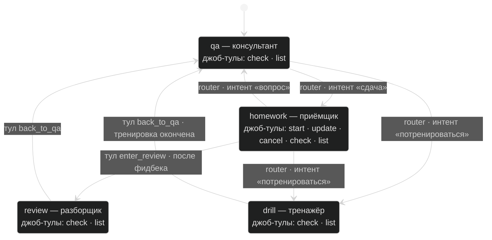

(На диаграмме подписаны только джоб-тулы: остальной тулсет «лиц» — делегирование course-qa, артефакты разбора, `show_drill_case` — остался как был; полная матрица видимости — блоклист `_BLOCKED_BY_MODE` в `companion/modes.py`.)

### 4.1 Сценарная грабля: `--n-jobs-per-worker`

Запусти co-deployed конфигурацию «как обычно»:

```bash
uv run langgraph dev --no-reload
```

— и асинхронность **не работает**: сдал домашку (запуск задачи и правда мгновенный, ~8 с), спросил «что в теме 12?» — и ответ пришёл через 111.6 секунды. Вопрос простоял в очереди за раном чекера. В логе сервера подсказка: `Starting 1 background workers` — фактический дефолт dev-сервера **один воркер-слот**, и активный ран чекера съедает его целиком. «Асинхронная» проверка снова превратилась в блокировку — просто теперь она блокирует не тред, а очередь исполнения.

Лечится флагом:

```bash
uv run langgraph dev --no-reload --n-jobs-per-worker 10
```

Тот же сценарий: сдача 5.4 с, вопрос — 10.6 с, чекер продолжает молотить в фоне. Мораль темы в миниатюре: каждый активный run ест слот воркера, и про ёмкость исполнителя приходится думать *всегда*, когда появляются фоновые задачи. (Эта рабочая конфигурация и зашита в `make dev`; но грабля выше — ровно причина, по которой флаг там оказался.)

### 4.2 UI асинхронности: карточки, очередь, rejoin

Веб-чат на этой ступени учится показывать фоновую жизнь: **карточки субагентов** (шапка с живым статусом задачи «проверяется… / готово»), **очередь сообщений** (`useSubmissionQueue` + `multitaskStrategy: "enqueue"` — можно писать, пока ран идёт: сообщение честно встанет в очередь), и **rejoin** — перезагрузи страницу посреди проверки: `threadId` хранится в sessionStorage, история восстановится, карточка «проверяется…» на месте, поллер продолжит работу.

### 4.3 «Результат пришёл сам» — кто это драйвит на самом деле

Кульминация сценария — фидбек проверки *сам* появляется в чате. Тут важно не дать себя обмануть: **«само» всегда кто-то драйвит.** Async-субагент — это чистый поллинг: результат попадёт в диалог только когда модель вызовет `check_async_task`, а модель вызывается только внутри рана, а ран запускается только сообщением. Сам companion не «проснётся».

В нашей реализации драйвер — **поллер на клиенте**:

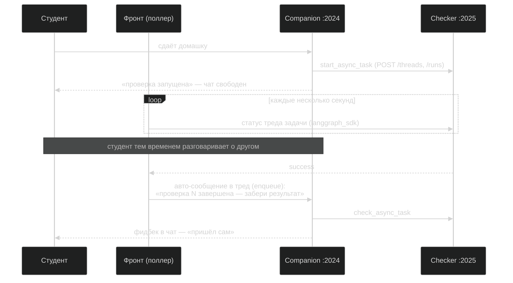

Фронт видит задачи в `values.async_tasks` (канал стейта совпадает по имени с каналом внутри companion-подграфа — поэтому сервер отдаёт его клиентам «бесплатно»), поллит статус треда чекера напрямую и по `success` **авто-отправляет служебное сообщение** в тред companion. (На диаграмме чекер уже на :2025 — так будет после распила на ступени 3; в co-deployed конфигурации этой ступени поллер ходит на тот же :2024, у фронта это просто env-переменная прокси.) Дальше всё штатно: companion вызывает `check_async_task` и отдаёт разбор. Для студента — магия; для тебя — ~50 строк поллинга во фронте.

Прод-альтернатива — тот самый **webhook из [бонуса ступени 1](#31-бонус-ступени-background-run--webhook)**: сервер чекера сам стучится POST'ом о завершении, и никто ничего не поллит — мы обещали вернуться к этому механизму, вот его место в системе. Мы выбрали клиентский поллинг осознанно: не нужен публичный endpoint, вся логика видна в одном месте, а компромисс («доставка живёт, пока открыта вкладка») для учебного стенда честен.

### 4.4 Steering и cancel: у шва есть семантика

Пока проверка бежит, ей можно **дослать инструкцию**: «оценивай строже, обрати внимание на тесты» → `update_async_task`. Важно понимать механику: это *не* «дописать на лету». Платформа прерывает текущий ран (он становится `interrupted`) и запускает новый на том же треде — с полной историей плюс инструкция. Проверка честно начинается заново, время удваивается — companion об этом предупреждает, потому что так написано в его промпте, а в промпте так написано, потому что такова семантика шва.

С отменой сюрприз тоньше: `cancel_async_task` → у companion задача `cancelled`, но на сервере чекера тот же ран — **`interrupted`**. Статусы на шве *расходятся*: у каждой стороны своя точка зрения («я отменил» vs «меня перебили»), и UI приходится явно маппить это в понятное человеку «перебита (отмена или новая инструкция)». Первый звоночек распределённости: единой истины больше нет.

И сноска про то, что ты увидишь в сыром выводе `check_async_task`: кириллица в JSON-результатах уезжает `\uXXXX`-эскейпами (сериализация без `ensure_ascii`). Моделям это не мешает, глазам — больно; знай, что это не поломка кодировки.

**Что увидишь** (эти же кадры — в walkthrough): карточка фоновой задачи при свободном чате и ответ course-qa, пока чекер работает — [кадр 1](course-companion/examples/walkthrough/01-task-started-chat-free.png), [кадр 2](course-companion/examples/walkthrough/02-qa-while-checking.png).

---

## 5. Ступень 3 — распил: чекер уезжает на свой сервер

**Боль.** Ментор — чужой проект «другой команды», но живёт в нашем процессе: наш деплой — их деплой, их падение — наше падение, независимых релизов нет.

**Решение.** Вынести чекер в отдельную деплой-единицу. И вот момент, ради которого строилась вся ступень 2: **код не меняется вообще.** Меняются конфиги и env:

```bash
# сервер чекера — свой конфиг, свой порт, свой жизненный цикл
uv run langgraph dev --config langgraph.checker.json --port 2025 \
    --no-reload --n-jobs-per-worker 10

# сервер companion — знает адрес чекера через env
CHECKER_URL=http://localhost:2025 uv run langgraph dev \
    --config langgraph.companion.json --no-reload --n-jobs-per-worker 10

# фронт — поллеру нужен адрес чекера
cd frontend && CHECKER_PROXY_TARGET=http://127.0.0.1:2025 npm run dev
```

Те же три процесса по одному — `make checker`, `make companion`, `make frontend` (фоном, с теми же флагами и env на швах плюс `--no-browser` для фонового запуска; `make stop` гасит все три).

`AsyncSubAgent` получает `url=` — и тот же джоб-паттерн едет по HTTP: те же пять endpoint'ов Agent Protocol (`/threads`, `/runs`, …), которые в co-deployed варианте вызывались in-process. Co-deployed ↔ распил — это буквально **один код, разные конфиг + env**. Ради этого свойства и выбирался протокольный шов.

### 5.1 Мягкий отказ

Распределённость приносит новые режимы отказа — и их стоит увидеть руками. Останови сервер чекера и сдай домашку: тул вернёт **текстовую ошибку подключения**, ран companion не упадёт, фантомной задачи в `async_tasks` не появится, а следующий вопрос о курсе ответится штатно за секунды. Супервизор жив, деградировала только функция проверки. Это дефолтное поведение джоб-тулов (ошибка — это результат, а не исключение), но проверить его руками — обязательная часть ступени: в распределённой системе «вторая сторона недоступна» — не исключительная ситуация, а вторник.

### 5.2 A2A-витрина: ноль строк кода

Теперь у «команды чекера» свой сервис. Внезапный бонус: он **уже** виден снаружи по межвендорному стандарту A2A — Agent Server отдаёт это нативно:

```bash
# UUID ассистента (endpoint адресуется UUID'ом, не именем графа):
curl -X POST http://localhost:2025/assistants/search -d '{}'
#   → assistant_id=2c6dc5f4-… (graph_id=checker)
# Если до этого поднимал co-deployed, в списке будет и «фантомный» companion —
# метаданные ассистентов персистятся в .langgraph_api/ между запусками.
# Бери того, у кого graph_id=checker (или удали .langgraph_api/ и перезапусти).

curl 'http://localhost:2025/.well-known/agent-card.json?assistant_id=2c6dc5f4-…'
```

```json
{
  "name": "checker",
  "url": "http://…:2025/a2a/2c6dc5f4-…",
  "supportedInterfaces": [{ "protocolBinding": "jsonrpc", "protocolVersion": "1.0" }],
  "capabilities": { "streaming": true, "pushNotifications": false },
  "skills": [{ "name": "checker Capabilities", "…": "…" }]
}
```

`message/send` с брифом двумя строками (`submission:` / `topic:`) на `/a2a/<uuid>` запускает полноценную проверку, и вердикт возвращается TextPart-артефактом с `state: completed`. Любой внешний агент любого вендора может сдать домашку нашему чекеру, не зная ничего про наш стек, — интеграция начинается с GET-запроса к agent card, а не с созвона команд.

Две сноски. Первая: companion на :2024 виден по A2A точно так же — это свойство сервера, а не фича, которую мы «прикрутили чекеру». Вторая — про границы нативного endpoint'а: только TextPart (ни структурных DataParts, ни файлов), agent card не кастомизируется (имя и skills генерируются из ассистента). Для витрины хватает; для настоящего вендорского API карточку пишут руками.

### 5.3 Дизайн-раздел: companion как A2A-клиент чужого чекера

Витрина показала «нас видно снаружи». Осталась вторая половина темы, и она решается проектированием, а не кодом: **что если чужим станет чекер?** Команда проверки переписала его на другой фреймворк — или компания вообще купила SaaS-проверку у вендора. Наш шов на Agent Protocol этого не переживёт: требовать от чужого вендора протокол нашей платформы — всё равно что требовать перейти на нашу внутреннюю шину.

Хорошая новость: с какой стороны ни смотри, любая A2A-интеграция устроена одинаково — верхнеуровнево это один и тот же ритуал:

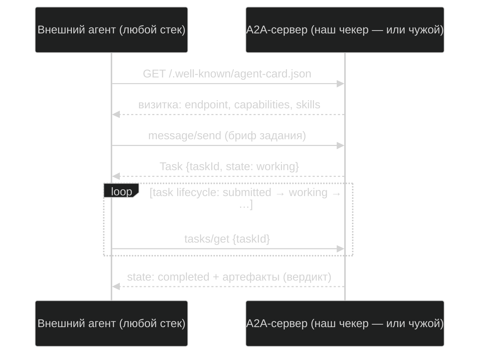

Словами. Всё начинается с **визитки**: агент-клиент забирает agent card по well-known-адресу — endpoint, capabilities, skills — и этого достаточно, чтобы подключиться, не зная ничего про начинку второй стороны: LangGraph там, другой фреймворк или SaaS вендора — снаружи неотличимо. Дальше `message/send` создаёт **задачу**, задача живёт по стандартному конечному автомату (`submitted → working → completed/failed/canceled`), результат приезжает артефактами — забирается поллингом `tasks/get`, а если сервер умеет push-уведомления, «результат пришёл сам» оказывается штатной функцией протокола.

Заметь при этом: наш собственный шов companion↔checker **остаётся на штатном Agent Protocol** — обе стороны наши, и межвендорный стандарт здесь не дал бы ничего, кроме цены. A2A выходит на сцену, когда вторая сторона чужая: тогда companion становится A2A-клиентом, и весь контракт с той стороной сводится к карточке и task lifecycle. Цена переезда — всё, что штатный шов давал бесплатно (пять готовых джоб-тулов, реестр задач в стейте, interrupt-steering), становится нашей работой; взамен — заменяемость поставщика: следующий переезд чекера companion уже не заметит.

Полный разбор интеграции — **[`course-companion/docs/a2a-integration-design.md`](course-companion/docs/a2a-integration-design.md)** (углубление к этому разделу): discovery по карточке, судьба steering'а, которого в A2A нет как операции, и построчная таблица «что теряем / что строим».

Пуанта раздела — и всей ступени: **протокол — функция границы, а не моды.** Обе стороны наши → штатный протокол платформы, дёшево и глубоко. Вторая сторона чужая → межвендорный стандарт, и цена его — таблица «строим сами». Тащить A2A между двумя своими сервисами — платить межвендорную цену без межвендорной границы; тащить внутренний протокол к вендору — требовать от чужих жить в нашем стеке.

---

## 6. Ступень 4 — тренажёр: drill-режим + A2UI

**Боль.** Интерфейс Т11 — плоский текст в терминале. Для диалога это нормально, но тренажёр с кейсами («выбери протокол на каждый шов и обоснуй») в виде простыни текста с вариантами «а/б/в» — тоскливо и провоцирует небрежные ответы.

**Решение.** Кейс приезжает студенту **интерактивной формой, которой фронт заранее не знает**: состав осей, варианты, подписи — всё рождается в рантайме. Это протокол **A2UI**: агент декларативно описывает UI сообщениями (`createSurface`, `updateComponents`, `updateDataModel`, …), клиент рендерит их из каталога компонентов, ответ пользователя возвращается одним `userAction`.

Сначала — сам режим. Drill — четвёртое «лицо» той же handoffs-машины (см. диаграмму режимов выше): router распознаёт интент «потренироваться», middleware подменяет промпт и тулсет. Кейсы companion генерирует по скиллу `scaling-case-drill` (`data/skills/scaling-case-drill/`) — тренажёр по масштабированию агентных систем: студент сам решает, нужно ли выходить из одного процесса, какие швы открыть и каким классом решения (фоновая джоба, поллинг/вебхук/стриминг, агент как сервис, внутренний контракт или A2A, MCP-обёртка, информативный или генеративный UI) закрыть каждый. Скилл построен на **progressive disclosure**: `SKILL.md` даёт рубрику и пул осей, а три справки `references/` (карта швов, фреймворк выбора, рубрика разбора) companion дочитывает `read_file`'ом уже в drill-режиме — штатная skills-механика deepagents, тот же живой паттерн Skills из Т11: знание подключается файлами, а не кодом.

Дальше — механика доставки формы. У страницы в браузере теперь **три HTTP-канала**, и это просто разные fetch'и одного React-приложения:

| Канал | Куда | Зачем | Когда открыт |
|---|---|---|---|
| 1. Чат | companion :2024 (Agent Server API, под капотом `useStream`) | сообщения, стриминг, стейт | всегда |
| 2. Формы (A2UI) | drill-endpoint (POST + SSE, физически тот же :2024) | получить описание формы, отправить `userAction` | только в drill |
| 3. Поллинг проверки | checker :2025 | «фидбек пришёл сам» (ступень 2) | пока висит фоновая задача |

Чат — «позвоночник» сессии; A2UI-канал короткоживущий и открывается **по сигналу из стейта**:

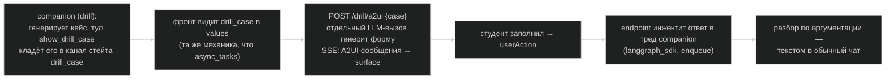

Здесь два решения, на которых стоит задержаться.

**Форма — отдельный LLM-вызов, не companion.** Companion решает, *что* спросить (кейс: сценарий, оси, варианты — компактный JSON). А *как* это отрисовать, решает генератор внутри drill-endpoint'а: system-промпт из JSON-схем протокола, каталога компонентов и шаблонного примера формы весит ~11K токенов — тащить его в промпт диалогового агента ради одного режима значило бы раздуть каждый ход и сломать текстовый стрим. Стрим-парсер SDK валидирует сообщения на лету (форма «проявляется» в интерфейсе инкрементально), невалидная попытка откатывается и повторяется.

**«UI как проекция стейта агента» — вживую.** Заметь: фронт не получает команду «покажи форму» по какому-то особому каналу. Тул `show_drill_case` просто **пишет кейс в стейт**, фронт наблюдает values через штатную подписку чата и реагирует. Тот же принцип, что с `async_tasks` и карточками задач: интерфейс — производная состояния агента, а не набор RPC-вызовов.

Ответ студента проходит полный круг: `userAction` → POST на endpoint → инжект служебным сообщением в тред companion (тем же submission-queue-паттерном, что авто-сообщение поллера) → companion разбирает ответ **по аргументации** в обычном чате: зачёт — качество суждения, а не «правильная буква».

### 6.1 Грабли версий A2UI

Экосистема A2UI молодая, версии ломают контракт — пины жёсткие, и вот обязательный список грабель (без него не заведётся):

- `npm install --legacy-peer-deps` — иначе peer-конфликт пакетов A2UI валит установку;
- импорты клиента строго `@a2ui/react/v0_9` и `@a2ui/web_core/v0_9` — **дефолтный экспорт пакетов — сломанный v0_8**;
- `catalogId` — только литеральный v0_9-URL каталога (хелпер SDK вернёт идентификатор, которого клиент не знает);
- версия в сообщениях — всегда `"v0.9"` (клиентские схемы не знают `"v0.9.1"`);
- стрим-парсер лечит только фрагментацию JSON: синтаксическую ошибку он кидает исключением, а невалидные-но-целые сообщения молча дропает — поэтому в генераторе retry плюс собственная проверка комплектности формы.

Подробности модуля — `course-companion/companion/drill/README.md` (там же мини-стенд, на котором модуль можно гонять отдельно от companion).

**Что увидишь:** живая форма кейса с осями выбора — [кадр 3](course-companion/examples/walkthrough/03-drill-form.png); полный флоу — в walkthrough ниже.

---

## 7. Финал — docker compose: распределённая система одной командой

Все конфигурации выше — процессы на портах. Финальный аккорд — упаковка: **`docker compose up` поднимает всю систему** — и это буквально демонстрация тезиса «распределённая система»: три контейнера, у каждого свой жизненный цикл, общая сеть, адреса на швах — по именам сервисов.

```bash
cd course-companion
docker compose up --build     # companion :2024 · checker :2025 · frontend :5173
# браузером на http://localhost:5173
docker compose down
```

(`make compose-up` / `make compose-down` — то же самое, только detached: терминал остаётся свободен.)

Как это устроено (`docker-compose.yml`, `Dockerfile`, `frontend/Dockerfile`):

- **Один Python-образ — два сервиса.** Companion и checker собираются из одного образа (общая кодовая база, включая vendor-проект ментора); сервис определяется *командой запуска*: свой `--config`, свой порт. Это продолжение решения ступени 2: граница сервисов — граница деплоя, а не папки-репозитория.
- **Адреса на швах — hostnames compose-сети:** `CHECKER_URL=http://checker:2025` для companion, прокси-цели фронта — `http://companion:2024` и `http://checker:2025`. Тот же распил, что на ступени 3, — только «localhost» перестал быть общим для всех адресом. Обрати внимание на `--host 0.0.0.0` в командах: по умолчанию `langgraph dev` (и Vite) слушают localhost и снаружи контейнера невидимы — классическая первая грабля контейнеризации.
- **`.env` не запекается в образ** — монтируется при старте (`volumes`). Секреты в образах не живут.
- **Общий том под артефакты проверок.** Режим `review` читает заметки ревьюеров с диска, а пишет их чекер. В портовом запуске это работало «бесплатно» — процессы делили файловую систему. В контейнерах бесплатность кончилась: понадобился общий volume. Маленькая честная иллюстрация того, что распределение процессов вскрывает неявные связи через диск — в настоящем распиле по машинам этот шов пришлось бы проектировать явно (общее хранилище или API).

Живой прогон подтверждён: весь сквозной сценарий (следующий раздел) прокликан в браузере именно на compose-конфигурации, agent card чекера курлится с хоста.

**Теперь главная честная пометка.** Внутри контейнеров крутится `langgraph dev` — **dev-сервер**: state в памяти (`docker compose down` — и все треды пропали), in-memory очередь, ни горизонтального масштабирования, ни устойчивости к рестартам. Для учебного стенда — то, что надо; **это не прод-паттерн**. Прод-путь платформы выглядит иначе: `langgraph up` собирает образ с полноценным сервером на Postgres (персистентность) и Redis (очередь), — и требует лицензионный ключ: серверные пакеты (`langgraph-api` и рантайм) распространяются под Elastic License 2.0, «dev бесплатно, прод лицензируется». Открытые альтернативы Agent Protocol-сервера существуют (сообщество собирает их на FastAPI+Postgres), но это уже другая история — здесь мы честно останавливаемся на dev-сервере и знаем цену этого выбора. И по той же линии честности: LangSmith-ключ мы **не задаём вообще** — dev-сервер прекрасно работает без него, а без ключа наружу не уходит ни байта телеметрии.

Портовый запуск (ступени выше) — равноправный запасной путь: те же три процесса без Docker.

---

## 8. CLI — нулевая точка

CLI из Т11 никуда не делся и не требует ни Node, ни Docker:

```bash
uv run companion                   # интерактивный чат в терминале
uv run python -m companion.smoke   # one-shot: «сдал → получил фидбек»
uv run pytest -q                   # 46 тестов без LLM
```

(`make cli` и `make test` — те же команды; `make lint` — ruff по нашему коду плюс проверка типов фронта.)

CLI собирает companion **с синхронным чекером Т11** (без AsyncSubAgent): co-deployed-транспорт async-субагентов живёт только под сервером, а «нулевая точка» обязана работать голым процессом. Это осознанная развилка сборки — `build_companion(async_checker=…)` — и заодно живое напоминание, как выглядела жизнь до ступени 2: сдал домашку в CLI — жди.

---

## 9. Walkthrough «одна сессия»

Всё вместе, один диалог, живой прогон на compose-конфигурации (тайминги — фактические; полный лог — `course-companion/examples/walkthrough/session-log.txt`).

**12:31:35 — сдача.** «Хочу сдать домашку по теме "мультиагентные паттерны", код в …» — путём сдачи может быть любая папка с кодом; чтобы просто пощупать флоу, ткни чекер в сам проект: «Проверь домашку: код в `vendor/ai-homework-mentor`, тема "мультиагентные паттерны"». Router → `homework`, companion вызывает `start_async_task`, задача улетает на сервер чекера. Через ~15 секунд в чате — полный task_id и «можете продолжать общение»; в шапке — карточка «homework-checker-async · проверяется…»; поле ввода живое:

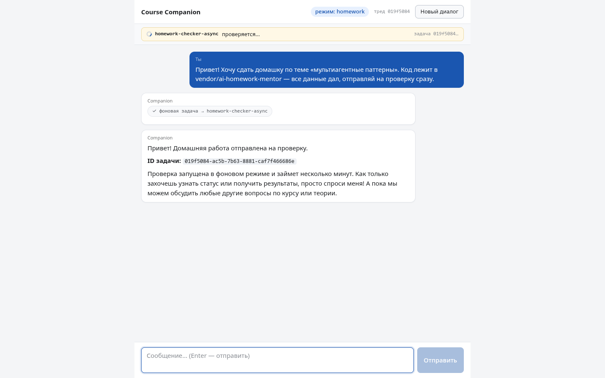

**12:32:12 — разговор при работающем чекере.** «Пока проверка идёт — что будет в теме 12?» Companion делегирует course-qa, тот читает базу знаний и отвечает за ~35 секунд — а проверка молотит на соседнем сервере. В Т11 в этот момент чат был бы мёртв (сравни с кадром «до» из ступени 1):

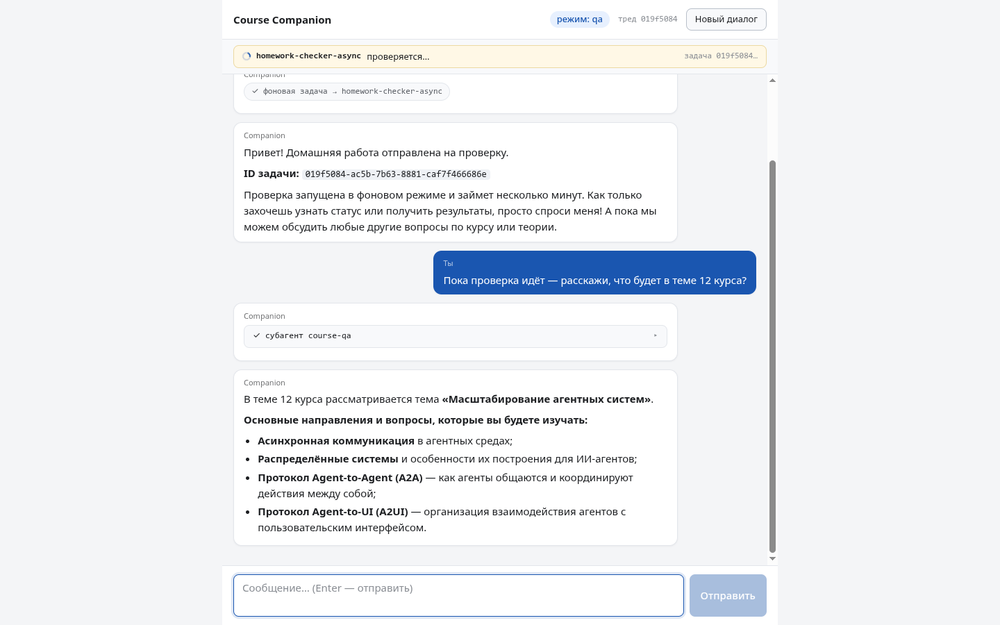

**12:33:00 — тренажёр.** «Пока проверка крутится — хочу потренироваться, дай кейс». Router → `drill`, companion читает `SKILL.md` тренажёра `scaling-case-drill` и его справки `references/` (несколько чипов `read_file` в чате — progressive disclosure вживую), генерирует продукт-кейс и вызывает `show_drill_case`. Фронт замечает кейс в стейте, открывает A2UI-канал — и форма *проявляется* в чате: сценарий, три оси выбора, поле обоснования. От сообщения до готовой формы ~40 секунд — две LLM-генерации (кейс + интерфейс):

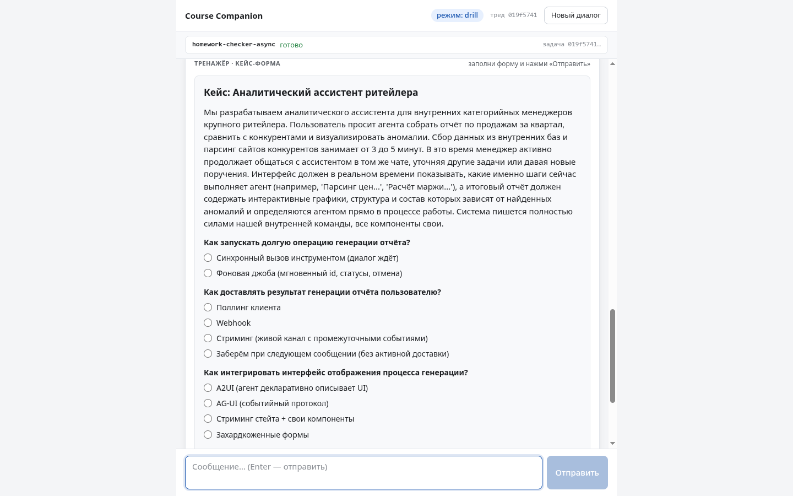

Присмотрись к вариантам на осях: это та самая таблица «какой протокол на каком шве», только теперь **ты** на месте архитектора.

**12:33:46 — кульминация.** Чекер досчитал (проверка шла 126 секунд — тайминги LLM плавают, у тебя может выйти и три-четыре минуты; если форма дрилла уже заполнена, а фидбек ещё не пришёл — не спеши отправлять ответ, дай проверке доехать: момент того стоит). Поллер фронта видит `success`, авто-отправляет служебное сообщение — и companion **посреди дрилла** забирает результат (`check_async_task` доступен в drill-режиме — вот зачем была та раскладка тулов) и отдаёт полный фидбек проверки в чат. Форма с кейсом жива, режим не сбился, companion сам предлагает вернуться к кейсу:

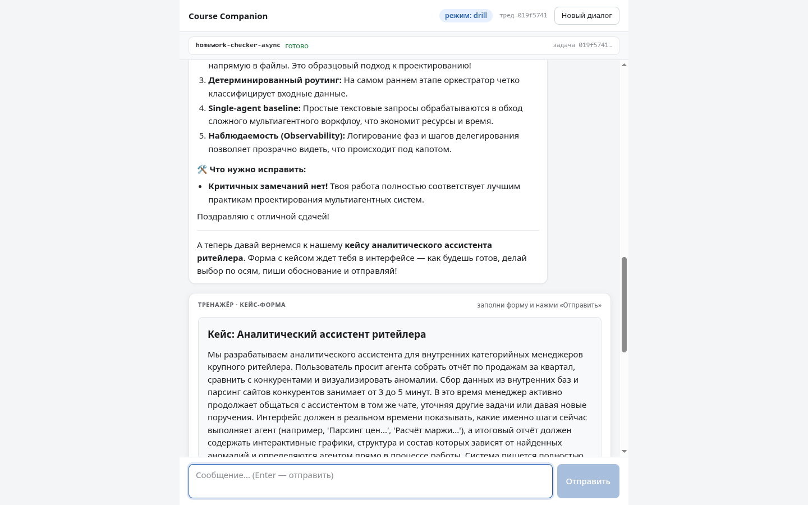

Это момент, невозможный в Т11 по построению: *два разных дела одного диалога завершились независимо, и система корректно сшила их в одну нить разговора.*

**12:35 — ответ на кейс.** Заполняем форму (фоновая джоба на запуск долгой операции, стриминг на доставку прогресса, стриминг стейта со своими компонентами на интерфейс — и обоснование с «чем платим»):

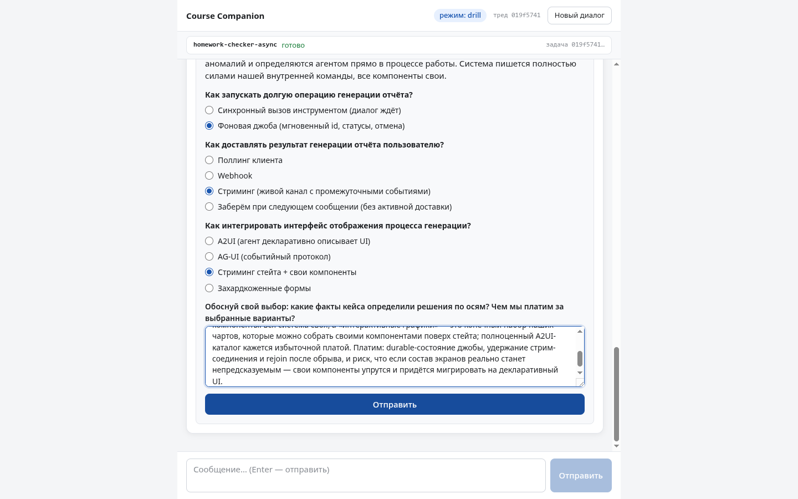

**12:36:24 — отправка → разбор.** `userAction` уезжает на drill-endpoint, тот инжектит ответ в тред, и через ~40 секунд в чате — разбор по аргументации по рубрике скилла: гейт (а надо ли вообще выходить из процесса), по каждой оси — согласуется ли выбор с фактами кейса, отбракованы ли соседи (например: вебхук отпадает, потому что у браузерного клиента нет серверного приёмника — привет, ступень 2), названа ли цена, — итог «Зачёт!». Панель формы закрывается:

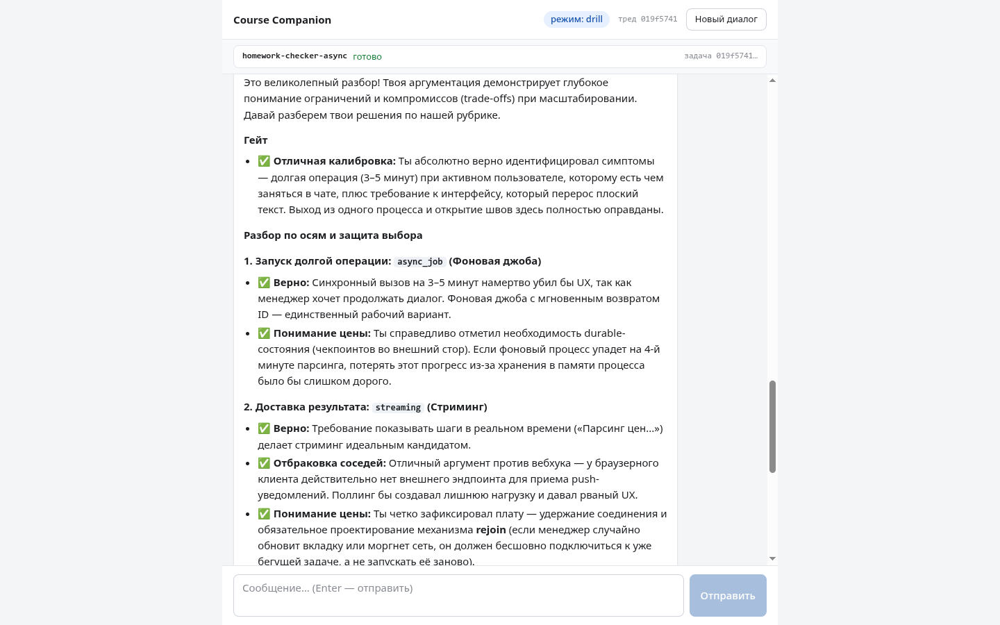

**12:38 — выход.** «Спасибо, закончим тренировку. Какая тема перед масштабированием?» Router → `qa`, course-qa отвечает («Тема 11 — Мультиагентные паттерны» — символично). Диалог продолжается как ни в чём не бывало:

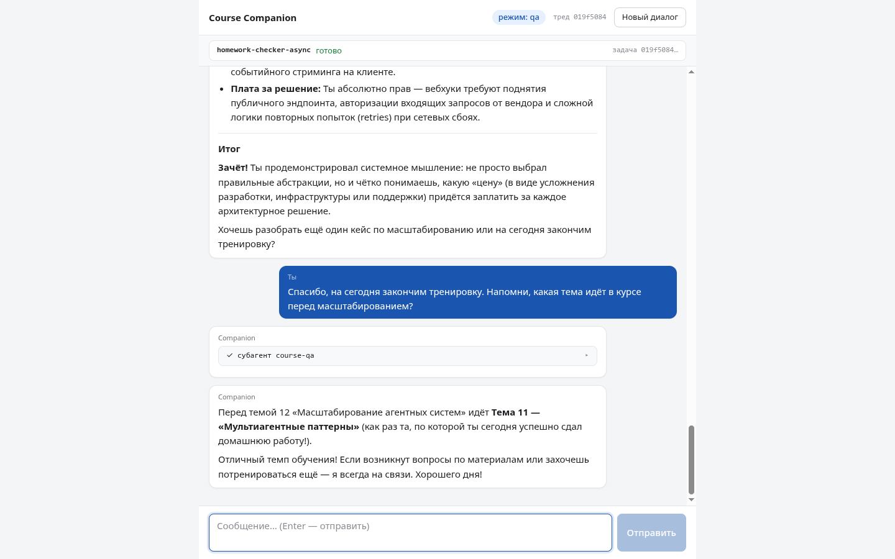

**Финальный кадр — снаружи.** Пока сессия шла в браузере, с хоста:

```bash
curl 'http://localhost:2025/.well-known/agent-card.json?assistant_id=<uuid из /assistants/search>'
# → {"name": "checker", "capabilities": {"streaming": true, …}, …}
```

Наш чекер — стандартно видимый A2A-агент, и любой внешний клиент может начать интеграцию с этого GET'а.

Итог по числам: от сдачи до самопришедшего фидбека ~2.5 минуты, из которых чат был занят *секунды*; параллельно студент успел спросить про курс и начать тренировку. В Т11 те же 2.5 минуты были бы мёртвым полем ввода.

---

## 10. Честные оговорки и отсечения

Чтобы картинка не выглядела глаже, чем она есть.

**Это dev-стенд, а не прод.** Проговорено в разделе 7, повторим списком: state в памяти (рестарт = потеря тредов), dev-сервер под Elastic 2.0-пакетами с платным прод-путём, auth отсутствует (все endpoint'ы локалки открыты), доставка «результат пришёл сам» живёт, пока открыта вкладка.

**«Код не менялся» — с оговорками.** Логика агента действительно не менялась, но серверный транспорт потребовал двух адаптаций (async-хук middleware, `nostream` у router'а), а сборка CLI и сервера различается чекером (sync/async). Мы показываем это честно, потому что «просто задеплоил и всё работает» — так не бывает.

**Статусы на швах расходятся** (cancel → `interrupted` на другой стороне), кириллица в результатах джоб-тулов — `\uXXXX`, steering перезапускает проверку с нуля. Всё это — не баги, а семантика конкретных швов, которую надо знать.

**Осознанно за рамками** (каждый пункт — отдельная большая тема, и её отсутствие здесь — решение, а не забывчивость): наблюдаемость (Langfuse/LangSmith-трейсинг); прод-деплой (`langgraph up`, Postgres/Redis, лицензии — описали, не делаем); auth и security распределённых агентов; брокеры сообщений (роль очереди играет task queue сервера); полноценный service registry (discovery у нас = agent card + конфиг); событийные UI-протоколы вживую (AG-UI и родня — только в теории темы); cron-задачи сервера; другие каналы доставки (Telegram и т.п.); и сам пайплайн ментора — он как был чужим замороженным проектом, так и остался.

**Мелочи локалки:** Vite dev-сервер слушает `::1` — браузером ходи на `localhost`, не на `127.0.0.1`; `langgraph dev` без `--no-reload` перезапускает сам себя на длинных проверках; дефолт `--n-jobs-per-worker` превращает async в sync (ступень 2).
