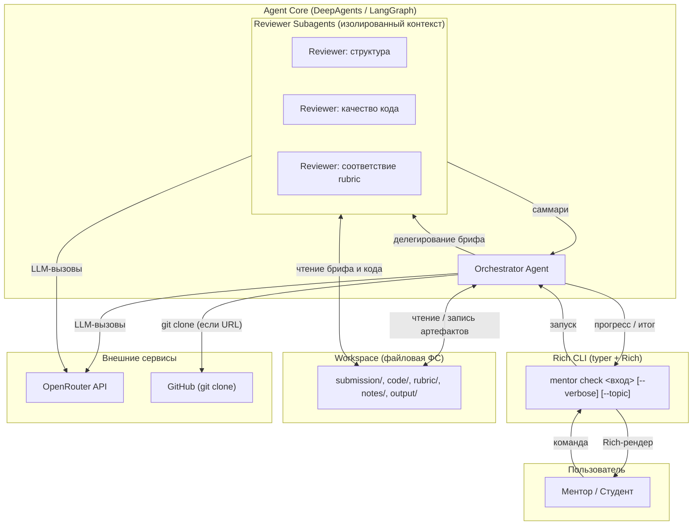
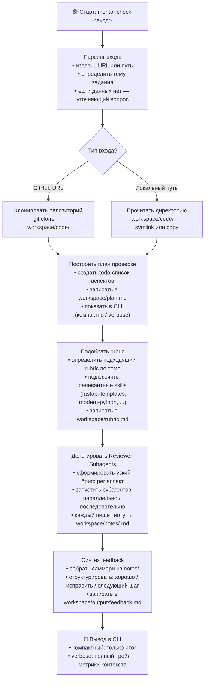
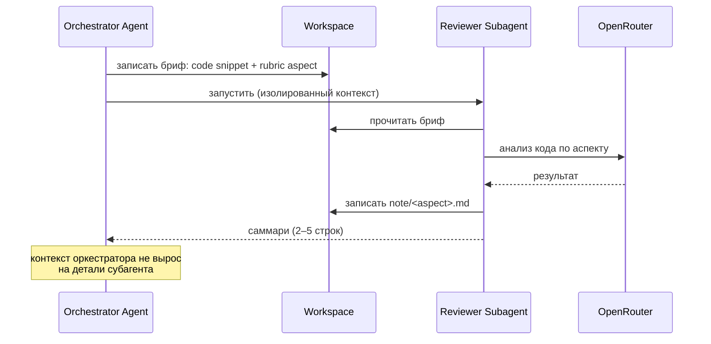
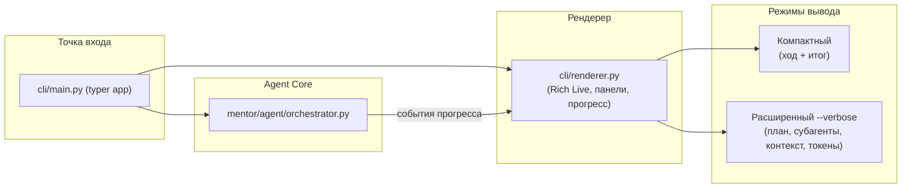

# Архитектура — AI Homework Mentor

> Продуктовое видение и роли — в [vision.md](vision.md).

---

## Контекст системы

Пользователь запускает `mentor check <вход>` в терминале. Всё взаимодействие —
через Rich CLI. Бизнес-логика сосредоточена в одном процессе: Orchestrator Agent
координирует весь поток, Reviewer Subagents работают в изолированных контекстах.
Внешних сервисов два: OpenRouter (LLM) и GitHub (git clone для репозиториев).



---

## Компоненты и ответственность

| Компонент | Назначение | Технологии |
|-----------|-----------|-----------|
| **mentor CLI** | Точка входа: парсинг команд, Rich-рендер прогресса и результата, два режима вывода | `typer`, `rich` |
| **Orchestrator Agent** | Парсинг входа, получение кода, построение плана, подбор rubric + skills, делегирование субагентам, синтез feedback | `deepagents`, `langgraph` |
| **Reviewer Subagents** | Проверка одного аспекта в изолированном контексте; принимают узкий бриф, возвращают саммари | `deepagents` |
| **Workspace** | Файловая рабочая память: хранит все артефакты текущей проверки | `pathlib`, файловая ФС |
| **Rubric + Skills** | YAML-описания критериев проверки; навыки из `.agents/skills/` | YAML, `.agents/skills/` |
| **Config** | YAML-файлы с промптами, параметрами модели, лимитами контекста | YAML |

---

## Поток «вход → feedback»



---

## Изоляция контекста через субагентов

Ключевой архитектурный принцип: каждый Reviewer Subagent работает в **отдельном контексте**.
Оркестратор передаёт только узкий бриф (тема аспекта + релевантный код + rubric-критерий),
субагент возвращает только саммари (несколько строк). Это:

1. **Предотвращает взрывной рост окна** оркестратора — весь «шум» проверки остаётся в субагенте
2. **Повышает качество** — субагент фокусируется на одном аспекте, без отвлечения
3. **Делает видимым** механизм изоляции в расширенном режиме вывода



---

## Файловая система как рабочая память

В контекстном окне агента — **только ссылки и саммари**. Детали живут в файлах.

```
workspace/
├── submission.md        # исходный вход пользователя
├── plan.md              # todo-план проверки, обновляется по шагам
├── rubric.md            # выбранный rubric + подключённые skills
├── code/                # код студента (клонированный или прочитанный)
├── notes/
│   ├── structure.md     # нота от Reviewer: структура
│   ├── code-quality.md  # нота от Reviewer: качество кода
│   └── rubric-check.md  # нота от Reviewer: соответствие rubric
└── output/
    └── feedback.md      # итоговый feedback
```

Такая организация позволяет:
- **Checkpoint / resume** (будущий слой): прервать и продолжить с любого шага
- **Инспектировать ход работы** вручную в любой момент
- **Демонстрировать** в `--verbose` именно файловые операции, а не абстрактные события

---

## Управление контекстом (context engineering)

Сквозная тема продукта — что держим в окне, что выносим в файлы. Механизмы:

| Механизм | Когда срабатывает | Что происходит |
|----------|------------------|---------------|
| **Вынос в файлы** | Код студента, rubric, ноты субагентов | Записывается в `workspace/`, в окне — только путь |
| **Узкий бриф** | Перед запуском субагента | Оркестратор передаёт только нужный кусок, не весь контекст |
| **Суммаризация истории** | При приближении к лимиту окна | Старые витки диалога заменяются саммари |
| **Компактизация** | При переполнении workspace-ссылок | Множественные ноты сворачиваются в агрегированное саммари |

В расширенном режиме (`--verbose`) каждое событие context engineering рендерится отдельной
панелью: имя механизма, размер до / после, сколько токенов сэкономлено.

---

## Rich CLI — внутренняя структура



### Компактный режим
Показывает только: шаги выполнения (spinner), итоговый feedback (таблица).

### Расширенный режим (`--verbose`)
Дополнительно показывает:
- Текущий `plan.md` и обновления статусов todo
- Какие файлы созданы / прочитаны в `workspace/`
- Какой rubric подобран, какие skills подключились
- Для каждого субагента: бриф (сокращённо) → статус → саммари ответа
- Размер контекстного окна по шагам (таблица токенов)
- Событие context engineering: имя, размер до/после, экономия

---

## Конфигурация и промпты

Все промпты и параметры — в YAML-конфигах, не в коде.

```
ai-homework-mentor/
├── config/
│   ├── settings.yaml          # модель, режим, лимиты, пороги суммаризации
│   ├── prompts/
│   │   ├── orchestrator.yaml  # системный промпт оркестратора
│   │   └── reviewer.yaml      # системный промпт reviewer-субагента
│   └── rubrics/
│       ├── fastapi.yaml       # rubric для FastAPI-заданий
│       ├── python-cli.yaml    # rubric для CLI-заданий
│       └── docker.yaml        # rubric для Docker-заданий
└── .env                       # OPENROUTER_API_KEY, OPENROUTER_MODEL
```

---

## Структура проекта

```
ai-homework-mentor/
├── cli/
│   ├── main.py            # точка входа (typer)
│   └── renderer.py        # Rich-рендер, режимы вывода
├── mentor/
│   ├── agent/
│   │   ├── orchestrator.py    # Orchestrator Agent
│   │   └── tools/             # инструменты агента
│   │       ├── workspace.py   # работа с файловой ФС
│   │       ├── rubric.py      # подбор rubric и skills
│   │       └── parse.py       # парсинг входа, клонирование репо
│   └── config.py          # загрузка YAML-конфигов
├── config/                # промпты, параметры, rubric (YAML)
├── concept/               # проектная документация
├── sprints/               # спринты
├── roadmap.md
├── pyproject.toml
└── .env.example
```

---

## Деплой — локально

Утилита запускается локально. Никакого docker, никаких внешних сервисов кроме OpenRouter.

```bash
uv sync
cp .env.example .env  # заполнить OPENROUTER_API_KEY
mentor check ./submissions/student/
```

---

## Связанные документы

- [vision.md](vision.md) — сценарии и принципы
- [idea.md](idea.md) — суть продукта
- [../roadmap.md](../roadmap.md) — дорожная карта
