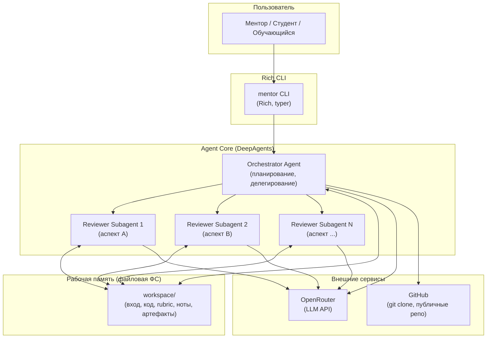

# Техническое видение — AI Homework Mentor

---

## 1. Система в целом

AI Homework Mentor — консольная агентная утилита, ядро которой построено на фреймворке
DeepAgents (LangChain `deepagents` поверх LangGraph). Агент ведёт многошаговый процесс
проверки: парсит вход, получает код, строит план, делегирует изолированным субагентам и
синтезирует итоговый feedback. Всё взаимодействие — через Rich CLI; никаких отдельных
сервисов, баз данных или веб-интерфейсов.

---

## 2. Роли

| Роль | Описание |
|------|----------|
| **Преподаватель / ментор** | Запускает утилиту, указывает репозиторий или путь к директории с кодом студента, получает feedback |
| **Студент (самопроверка)** | Запускает утилиту на своей директории до сдачи работы, получает список правок |
| **Обучающийся по DeepAgents** | Наблюдает за расширенным выводом — видит механизмы фреймворка в работе |

---

## 3. Пользовательские сценарии

### Преподаватель / ментор
- **С-1: Проверка по ссылке** — передаёт GitHub URL, агент клонирует репо, проверяет, возвращает feedback
- **С-2: Проверка по пути** — передаёт путь к локальной директории, агент читает код, возвращает feedback
- **С-3: Уточнение темы** — агент не смог автоматически определить тему → задаёт один уточняющий вопрос

### Студент (самопроверка)
- **С-4: Самопроверка** — запускает `mentor check .` в своей директории, получает приоритизированный список правок до сдачи

### Обучающийся по DeepAgents
- **С-5: Образовательный режим** — запускает с флагом `--verbose`, наблюдает план, субагентов, рост контекста, суммаризацию

---

## 4. Архитектура (high-level)

---

## 5. Компоненты системы

### mentor CLI
- Принимает команды пользователя (`check`, `--verbose`, `--topic`)
- Рендерит ход работы через Rich: прогресс, панели, цвет, таблицы
- Поддерживает два режима вывода: компактный и расширенный (образовательный)
- **Статус:** MVP

### Orchestrator Agent
- Парсит вход: извлекает URL или путь, определяет тему задания
- Получает код: клонирует репо (git) или читает локальную директорию
- Строит план проверки (todo) как наблюдаемое состояние
- Подбирает rubric под тему, подключает релевантные навыки (skills)
- Делегирует изолированным reviewer-субагентам по аспектам
- Синтезирует итоговый feedback из возвращённых саммари
- **Статус:** MVP

### Reviewer Subagents
- Получают узкий бриф (код + rubric-аспект) и возвращают только саммари
- Работают в изолированном контексте — не загрязняют окно оркестратора
- **Статус:** MVP

### Workspace (файловая ФС)
- Рабочая директория для текущей проверки: вход, код, rubric, review-ноты, финальный feedback
- В окне агента — только ссылки и саммари; детали — в файлах
- **Статус:** MVP

### Rubric + Skills
- Rubric описывает «что проверяем» под конкретную тему задания
- Навыки (skills) дают «чем проверяем»: публичные навыки `fastapi-templates`, `modern-python` и другие из `.agents/skills/`
- **Статус:** MVP

---

## 6. Образовательная цель и расширенный режим вывода

Продукт намеренно проектируется как **демонстрационный стенд** механизмов DeepAgents.
В расширенном режиме (`--verbose`) пользователь наблюдает:

- **Планирование** — текущий план (todo), как он строится и обновляется по шагам
- **Workspace** — какие файлы созданы, прочитаны, какие rubric и skills подключились
- **Субагенты** — какие запущены, что им передано (узкий бриф) и что вернули (саммари)
- **Контекст** — как растёт размер окна по шагам; какие механизмы context engineering срабатывают (суммаризация, вынос в файлы, компактизация); до/после по токенам
- **Параметры** — активная модель, режим, лимиты контекста

Цель — чтобы обучающийся буквально видел: вот план, вот контекст вынесен в файлы, вот окно
выросло и сработал суммаризатор, вот субагент отработал в изоляции и контекст родителя остался чистым.

---

## 7. Dogfooding как критерий зрелости

Продукт достигает зрелости, когда его можно навести на **его собственную директорию**
(`mentor check /path/to/ai-homework-mentor/`) и получить осмысленный feedback по тем же
механикам, по которым проверяются студенческие работы. Dogfooding — финальный E2E-тест
первой версии и постоянный индикатор здоровья продукта.

---

## 8. Доменные сущности

| Сущность | Смысл |
|----------|-------|
| **Submission** | Работа студента: ссылка на репо или путь к директории |
| **Rubric** | Набор критериев проверки под тему задания |
| **Skill** | Переиспользуемая процедура проверки (свой или публичный навык) |
| **ReviewNote** | Промежуточный артефакт от reviewer-субагента по одному аспекту |
| **Feedback** | Итоговый структурированный вывод: что хорошо, что исправить, следующий шаг |
| **Plan (todo)** | Наблюдаемое состояние процесса проверки, ведётся оркестратором |

---

## 9. Внешние связи

| Интеграция | Назначение |
|------------|-----------|
| **OpenRouter** | Единая точка доступа к LLM (OpenAI-совместимый API); модель — через конфиг |
| **GitHub (git clone)** | Получение кода из публичных репозиториев; код не исполняется |
| **`.agents/skills/`** | Локальные и публичные навыки для проверки кода |

---

## 10. Принципы разработки

- **KISS** — консольная утилита, не распиливаем на сервисы без причины
- **YAGNI** — v1 без БД, веб-UI, балльной системы, исполнения кода
- **Fail fast** — неизвестная тема → уточняющий вопрос, не домысливать
- **Образовательная прозрачность** — каждый механизм deep agent должен быть видим в `--verbose`
- **Dogfooding** — продукт проверяет сам себя; это и тест зрелости, и постоянный E2E

---

## 11. Технологии

| Область | Решение |
|---------|---------|
| Агентный фреймворк | DeepAgents (`deepagents`) поверх LangGraph / LangChain |
| LLM-провайдер | OpenRouter (OpenAI-совместимый API) |
| CLI / UI | Rich + typer (Python) |
| Python | 3.12+, `uv` как менеджер пакетов |
| Lint / Format | ruff |
| Тесты | pytest |
| Конфигурация | YAML-файлы (промпты, параметры, rubric) |
| Получение кода | `git clone` (репо) / `pathlib` (локальная директория) |
| Хранение артефактов | Файловая система (workspace-директория) |

---

## 12. Архитектурные решения

| № | Решение | Статус |
|---|---------|--------|
| ADR-0001 | DeepAgents (LangGraph) как агентный фреймворк вместо простого ReAct | Принято |
| ADR-0002 | Консольная утилита без API-сервера в v1 | Принято |
| ADR-0003 | Файловая ФС как рабочая память вместо in-memory состояния | Принято |
| ADR-0004 | Промпты и параметры в YAML-конфигах, не в коде | Принято |
| ADR-0005 | OpenRouter как единый LLM-провайдер | Принято |
